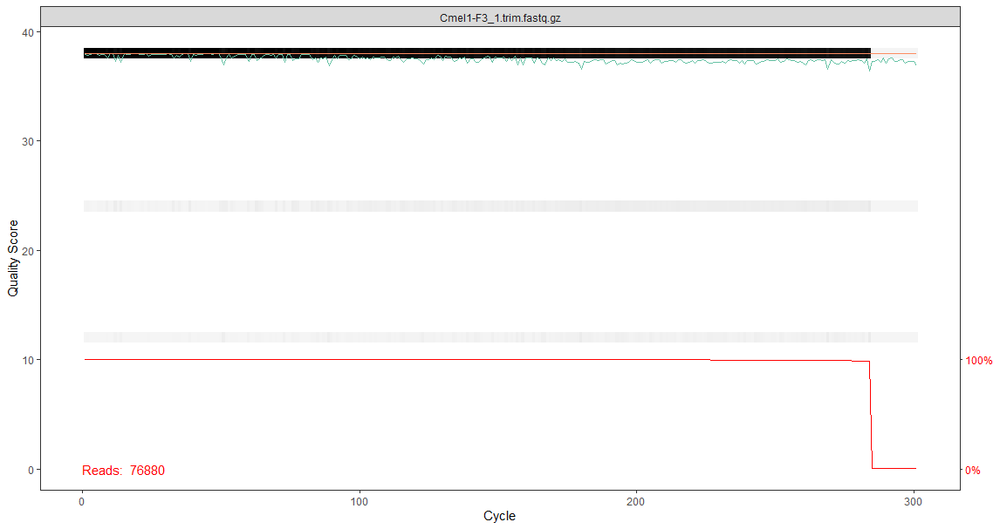
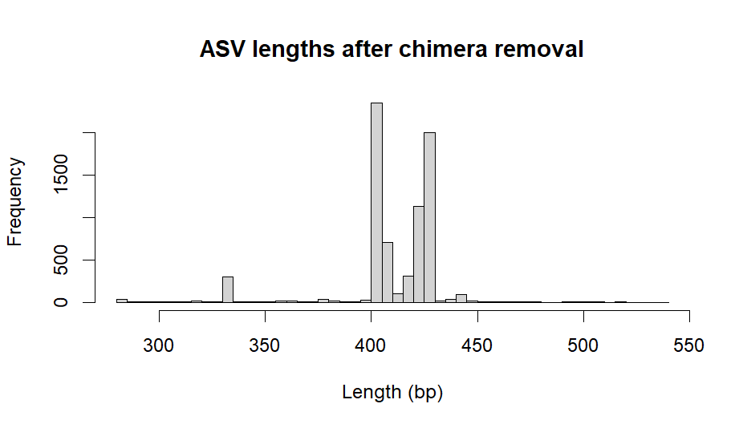
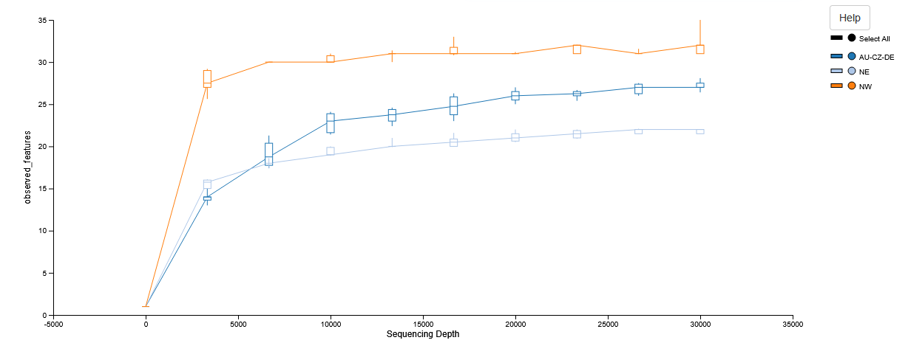
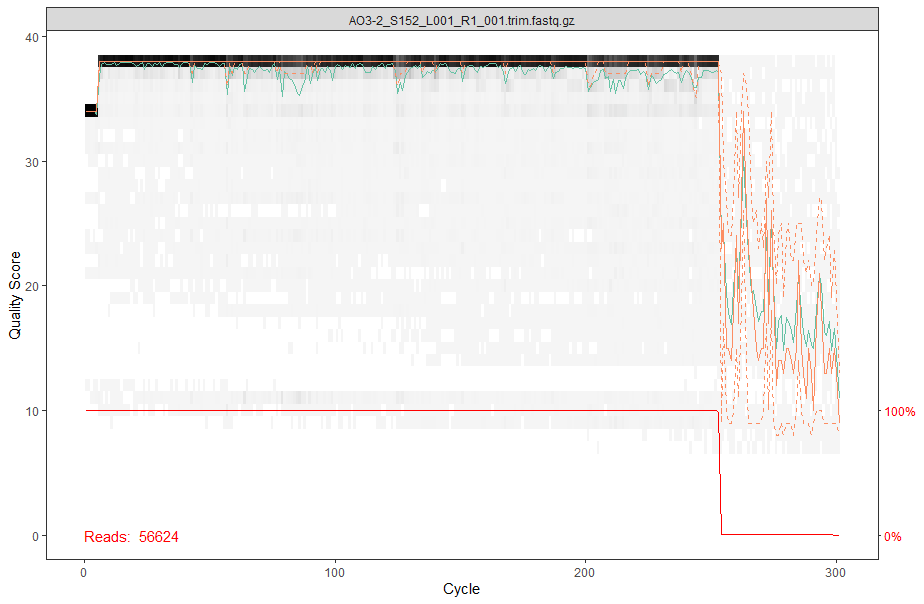
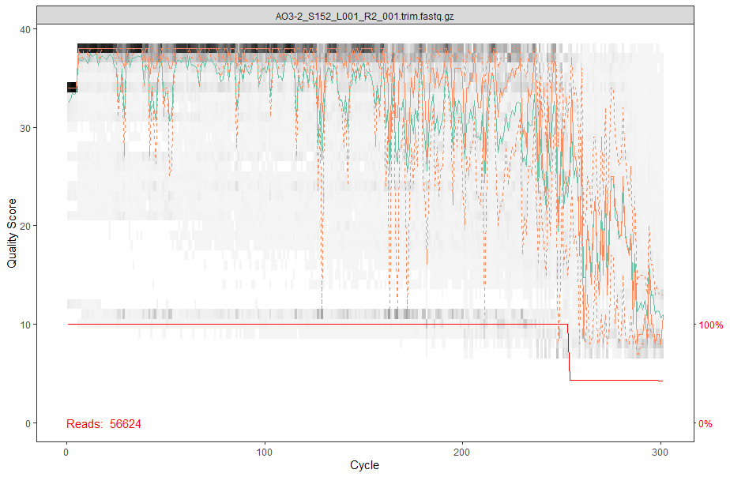
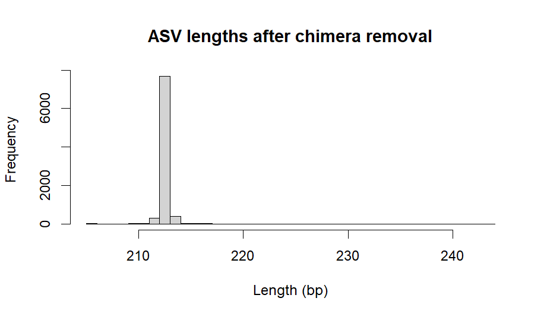

# Analysis of <i> Cacopsylla melanoneura </i> microbiome data

## Contents

1. [Collecting Data](#2)
2. [Quality Control and ASV Inference](#3)
  2.1 [FastQC](#4)
  2.2 [Cutadapt](#5)
  2.3 [Fastp](#6)
  2.4 [DADA2](#7)
  2.5 [Minimum-abundance / prevalence filtering](#8)
3. [Taxonomy Assignment](#9)
  3.1 [IDTAXA](#10)
  3.2 [QIIME](#11)
  3.3 [BLASTN](#12)
  3.4 [Curate](#14)
4. [Reanalyse Maja data](#13)

## Collecting data <a name="2"></a>
Raw sequencing reads were retreived from the archive folder \\share.unibz.it\AppliedMolecularEntomologyLab\cacopsylla_species\Cmelanoneura\amplicon_sequencing16S\macrogen2025 and uploaded to the HPC:
```bash
ls /data/users/theaven/C_melanoneura_microbiome/raw_data

for file in $(ls /data/users/theaven/C_melanoneura_microbiome/raw_data/*.fastq.gz); do
ID=$(basename $file | rev | cut -d '_' -f2- | rev)
mkdir $(dirname $file)/$ID
mv $file $(dirname $file)/$ID/.
done
```
Sample metadata is here: "\\share.unibz.it\AppliedMolecularEntomologyLab\cacopsylla_species\cacopsylla_sequencing_list.xlsx"

## Quality Control and ASV Inference <a name="3"></a>

### FastQC  <a name="4"></a>
The raw sequence reads were subjected to a quality control check using FastQC.
```bash
for ReadDir in /data/users/theaven/C_melanoneura_microbiome/raw_data/*; do
    ID=$(basename "$ReadDir")
    echo "$ID"
    zcat "$ReadDir"/*1.fastq.gz | wc -l | awk '{print $1/4}'
    zcat "$ReadDir"/*2.fastq.gz | wc -l | awk '{print $1/4}'
done

screen -S melanoneura
for ReadDir in $(ls -d /data/users/theaven/C_melanoneura_microbiome/raw_data/*); do
	Task=FastQC
	ID=$(echo "$ReadDir" | cut -d '/' -f7 | sed 's@/@_@g')
    Reads=("$ReadDir"/*.fastq.gz)
	OutDir="$ReadDir"/"$Task"
	ExpectedOutput="$OutDir"/$(basename "${Reads[0]}" | sed 's@.fastq.gz@@g')_fastqc.html

	Jobs=$(squeue -h -u theaven -n "$Task" | wc -l)
	while [ "$Jobs" -gt 9 ]; do
		sleep 5s
		printf "."
		Jobs=$(squeue -h -u theaven -n "$Task" | wc -l)
	done

	if [ ! -s "$ExpectedOutput" ]; then
		jobid=$(sbatch --job-name="$Task" --parsable ~/git_repos/Wrappers/unibz/run_fastqc.sh "$OutDir" "${Reads[@]}")
		printf "%s\t%s\t "$Task" \t%s\n" "$(date -Iseconds)" "$ID" "$jobid" >> /home/clusterusers/theaven/slurm_log.tsv
	else
		echo "For $ID found: $ExpectedOutput" 
	fi
done
```
### Cutadapt  <a name="5"></a>
Primers were removed from the reads where present using Cutadapt. Primers used by Macrogen for the 16S V3-V4 region are given at https://www.macrogen-europe.com/service/metagenome-sequencing

NOTE:The reads are a mix of paired and single end samples.
```bash
screen -r melanoneura
for ReadDir in $(ls -d /data/users/theaven/C_melanoneura_microbiome/raw_data/*); do
	Task=CutAdapt
	ID=$(echo "$ReadDir" | cut -d '/' -f7 | sed 's@/@_@g')
    Reads=("$ReadDir"/*.fastq.gz)
	OutDir="$(echo "$ReadDir" | sed 's@raw_data@qc_data@g')/"$Task""
	Forward_Primer=CCTACGGGNGGCWGCAG
	Reverse_Primer=GACTACHVGGGTATCTAATCC
	ExpectedOutput="$OutDir"/$(basename "${Reads[0]}" | sed 's@.fastq.gz@.trim.fastq.gz@g')

	Jobs=$(squeue -h -u theaven -n "$Task" | wc -l)
	while [ "$Jobs" -gt 9 ]; do
		sleep 5s
		printf "."
		Jobs=$(squeue -h -u theaven -n "$Task" | wc -l)
	done

	if [ ! -s "$ExpectedOutput" ]; then
		jobid=$(sbatch --job-name="$Task" --parsable ~/git_repos/Wrappers/unibz/run_cutadapt.sh "$OutDir" "$Forward_Primer" "$Reverse_Primer" "${Reads[@]}")
		printf "%s\t%s\t "$Task" \t%s\n" "$(date -Iseconds)" "$ID" "$jobid" >> /home/clusterusers/theaven/slurm_log.tsv
	else
		echo "For $ID found: $ExpectedOutput" 
	fi
done

for ReadDir in /data/users/theaven/C_melanoneura_microbiome/qc_data/*/CutAdapt; do
    ID=$(echo "$ReadDir" | cut -d '/' -f7 | sed 's@/@_@g')
    echo "$ID"
    zcat "$ReadDir"/*1.trim.fastq.gz | wc -l | awk '{print $1/4}'
    zcat "$ReadDir"/*2.trim.fastq.gz | wc -l | awk '{print $1/4}'
done
```
### Fastp  <a name="6"></a>

Reads were filtered with Fastp, reads/pairs shorter than 100bp or with >40% of bases below phred 20 were discarded.
```bash
screen -r melanoneura
for ReadDir in $(ls -d /data/users/theaven/C_melanoneura_microbiome/qc_data/*/CutAdapt); do
	Task=Fastp
	ID=$(echo "$ReadDir" | cut -d '/' -f7 | sed 's@/@_@g')
    Reads=("$ReadDir"/*.fastq.gz)
	OutDir="$(dirname "$ReadDir")/"$Task""
	ExpectedOutput="$OutDir"/$(basename "${Reads[0]}" | sed 's@.fastq.gz@.trimmed.fastq.gz@g')

	Jobs=$(squeue -h -u theaven -n "$Task" | wc -l)
	while [ "$Jobs" -gt 9 ]; do
		sleep 60s
		printf "."
		Jobs=$(squeue -h -u theaven -n "$Task" | wc -l)
	done

	if [ ! -s "$ExpectedOutput" ]; then
		jobid=$(sbatch --job-name="$Task" --parsable ~/git_repos/Wrappers/unibz/run_fastp.sh "$OutDir" "${Reads[@]}")
		printf "%s\t%s\t "$Task" \t%s\n" "$(date -Iseconds)" "$ID" "$jobid" >> /home/clusterusers/theaven/slurm_log.tsv
	else
		echo "For $ID found: $ExpectedOutput" 
	fi
done

for ReadDir in /data/users/theaven/C_melanoneura_microbiome/qc_data/*/Fastp; do
    ID=$(echo "$ReadDir" | cut -d '/' -f7 | sed 's@/@_@g')
    echo "$ID"
    zcat "$ReadDir"/*1.trim.trimmed.fastq.gz | wc -l | awk '{print $1/4}'
    zcat "$ReadDir"/*2.trim.trimmed.fastq.gz | wc -l | awk '{print $1/4}'
done

#Many reads are lost here, fastp quality filtering is optional and not standard for amplicon investigations, therefore will proceed with trimmed reads and use DADA2 for quality filtering.
```
### DADA2  <a name="7"></a>
The denoiser tool DADA2 was run to model and remove error patterns from the Illumina data: read ends where quality drops were trimmed, reads with high expected error (EE), or above a max EE threshold, or with any ambiguous bases (N) were discarded. DADA2’s removeBimeraDenovo function was also used to remove chimera from the ASV table. For paired reads DADA2 also merges forward and reverse reads in the overlapping region. When F and R disagree, the merge algorithm uses quality scores to pick the most likely base or discards the read. The output of DADA2 is an Alternative Sequence Variant (ASV) table as well as filtered denoised read fastq files.

DADA2 is an R package, the relavent files were downloaded:
```bash
for Dir in $(ls -d /data/users/theaven/C_melanoneura_microbiome/qc_data/*/CutAdapt); do
    if ls "$Dir"/*_1.trim.fastq.gz 1> /dev/null 2>&1 && ls "$Dir"/*_2.trim.fastq.gz 1> /dev/null 2>&1; then
        Out=/data/users/theaven/download_20260319/paired/$(echo "$Dir" | cut -d '/' -f7)
        mkdir -p "$Out"
        cp "$Dir"/*.fastq.gz "$Out"/.
    else
        Out=/data/users/theaven/download_20260319/single/$(echo "$Dir" | cut -d '/' -f7)
        mkdir -p "$Out"
        cp "$Dir"/*.fastq.gz "$Out"/.
    fi
done
```
"/data/users/theaven/download_20260319" was subseqeuntly downloaded to "C:\Users\THeaven\OneDrive - Scientific Network South Tyrol\R"

**Plot reads and select appropriate truncation lengths:**

DADA2 filter settings will truncate reads, a parameter is required below which length the read is discarded entirely. Plots of read quality help to determine a reasonable cuttoff, ie. before major dropoff in quality of many reads, or the median read quality is < Q25-30, or the lower percentile < Q20, mean and median should also be similar. However, shorter, more permissive lengths are prefered as other filter settings should act as a safety net to remove problem reads. However, for paired reads the truncated forward and reverse reads must still be long enough to overlap (at least 20bp) given the amplicon size or the reads cannot be merged.

```R
if (!require("BiocManager", quietly = TRUE))
    install.packages("BiocManager")
BiocManager::install(c("dada2","ShortRead", "Biostrings"))
install.packages("dplyr")

library(dada2)
library(ShortRead)
library(Biostrings)
library(dplyr)

setwd("C:/Users/THeaven/OneDrive - Scientific Network South Tyrol/R")
set.seed(1)

#Example reads plotted:
plotQualityProfile("download_20260319/paired/AO1_F7/AO1_F7_1.trim.fastq.gz") 
plotQualityProfile("download_20260319/paired/AO1_F7/AO1_F7_2.trim.fastq.gz") 

plotQualityProfile("download_20260319/paired/AT13-1_F3/AT13-1_F3_1.trim.fastq.gz") 
plotQualityProfile("download_20260319/paired/AT13-1_F3/AT13-1_F3_2.trim.fastq.gz") 

plotQualityProfile("download_20260319/paired/Cmel1-F3/Cmel1-F3_1.trim.fastq.gz") 
plotQualityProfile("download_20260319/paired/Cmel1-F3/Cmel1-F3_2.trim.fastq.gz") 

plotQualityProfile("download_20260319/paired/CZ_F7/CZ_F7_1.trim.fastq.gz") 
plotQualityProfile("download_20260319/paired/CZ_F7/CZ_F7_2.trim.fastq.gz") 

plotQualityProfile("download_20260319/paired/DE19_F14/DE19_F14_1.trim.fastq.gz") 
plotQualityProfile("download_20260319/paired/DE19_F14/DE19_F14_2.trim.fastq.gz") 

plotQualityProfile("download_20260319/paired/L2_F7/L2_F7_1.trim.fastq.gz") 
plotQualityProfile("download_20260319/paired/L2_F7/L2_F7_2.trim.fastq.gz") 

plotQualityProfile("download_20260319/paired/V1_M9/V1_M9_1.trim.fastq.gz") 
plotQualityProfile("download_20260319/paired/V1_M9/V1_M9_2.trim.fastq.gz") 
```
DADA2 quality profile plots summarise per-cycle base quality scores across reads. The solid orange line is median quality score at each base position, the solid turquoise line is mean quality score at each position, orange dashed lines show 10th and 90th percentiles. Q20 = ~1% error rate. Q30 = ~ 0.1% error rate.

Both mean (turquoise) and median (orange) are well above Q30 at all positions for every example plotted. The mean of reverse reads is slightly lower than forward reads, reverse reads are expected to be lower quality than forward reads. Reverse reads are also slightly shorter than forward reads. For sample Cmel1-F3 reverse reads the 10th percentile reads drop below Q30 at one position, however both meadian and mean read quality remain good.




**Collect inputs to run DADA2:**
```R
paired <- list.files(path = "download_20260319/paired", full.names = TRUE, recursive = TRUE)

paired_1 <- paired[grepl("\\_1\\.trim.fastq.gz$", paired)]
paired_2 <- paired[grepl("\\_2\\.trim.fastq.gz$", paired)]

get_samplename <- function(x) basename(dirname(x))

snF <- vapply(paired_1, get_samplename, character(1))
snR <- vapply(paired_2, get_samplename, character(1))
paired_samples <- intersect(snF, snR)
paired_lookup_table <- data.frame(
  sample = paired_samples,
  fnF = paired_1[match(paired_samples, snF)],
  fnR = paired_2[match(paired_samples, snR)],
  stringsAsFactors = FALSE
)
```
**Run DADA2:**
As the reads appear to have very good quality strict settings can be used, truncLen was set to approximate read length post trimming.
```R
#Parameters
truncLen <- c(280, 270)  #Truncate reads to this length, then remove entirely
truncQ <- 20     #Truncate at first base with quality <= truncQ (higher = more conservative | lower = more permissive)
maxEE <- c(1,2)  #Maximum expected errors (4 for the reverse reads as these are known/expected to be lower quality)
maxN <- 0        #Maximum allowed N bases
rm.phix <- TRUE  #Remove PhiX reads (bacteriophage used as control in Illumina sequencing runs)
pool <- FALSE    #Pool samples for error rate estimation (FALSE = error model is learned per sample, this is more conservative and faster/less memory | pseudo = max sensitivity)
threads <- TRUE  #Use multithreading
outdir <- "download_20260319/results/dada2_output2"
in_df <- paired_lookup_table

#Create output directory
dir.create(outdir, showWarnings = FALSE, recursive = TRUE)

#Filter and trim reads (paired)
filtFs <- file.path(outdir, paste0(in_df$sample, "_F_filt.fastq.gz"))
filtRs <- file.path(outdir, paste0(in_df$sample, "_R_filt.fastq.gz"))
out2 <- filterAndTrim(fwd = in_df$fnF, filt = filtFs, rev = in_df$fnR, filt.rev = filtRs, truncLen = truncLen, maxN = maxN, maxEE = maxEE, truncQ = truncQ, rm.phix = rm.phix, compress = TRUE, multithread = threads)

#Learn error rates, dereplicate, run DADA2 algorithm, and merge pairs
#Learn errors separately for F and R
errF <- learnErrors(filtFs, nbases = 5e10, multithread = threads)
errR <- learnErrors(filtRs, nbases = 5e10, multithread = threads)

#3661454720 total bases in 13076624 reads from 150 samples will be used for learning the error rates.
#3530688480 total bases in 13076624 reads from 150 samples will be used for learning the error rates.

#Derep separately
derepF <- derepFastq(filtFs, verbose = TRUE)
derepR <- derepFastq(filtRs, verbose = TRUE)
names(derepF) <- in_df$sample
names(derepR) <- in_df$sample
#Denoise separately
dadaF <- dada(derepF, err = errF, pool = pool, multithread = threads)
dadaR <- dada(derepR, err = errR, pool = pool, multithread = threads)
#Merge pairs
mergers <- mergePairs(dadaF, derepF, dadaR, derepR, verbose = TRUE)

#Make ASV table and remove chimeras
seqtab <- makeSequenceTable(mergers)
seqtab.nochim <- removeBimeraDenovo(seqtab, method = "consensus", multithread = threads, verbose = TRUE)
nonchim_reads <- rowSums(seqtab.nochim)
chim_reads    <- rowSums(seqtab) - nonchim_reads
chim_track <- cbind(nonchim = nonchim_reads, chimera = chim_reads, chimera_fraction = chim_reads / rowSums(seqtab))

#Plot merged read lengths after chimera removal:
asv_lengths <- nchar(colnames(seqtab.nochim))
summary(asv_lengths)
hist(asv_lengths, breaks=50, main="ASV lengths after chimera removal", xlab="Length (bp)")

# Save results
saveRDS(seqtab.nochim, file = file.path(outdir, "seqtab.nochim.rds"))
write.table(seqtab.nochim, file.path(outdir, "seqtab.nochim.tsv"), sep="\t", quote=FALSE, col.names=NA)

getN <- function(x) sum(getUniques(x))
track <- cbind(input    = out[, "reads.in"], filtered = out[, "reads.out"], denoisedF = sapply(dadaF, getN), denoisedR = sapply(dadaR, getN), merged = sapply(mergers, function(x) sum(x$abundance)))
rownames(track) <- in_df$sample
write.table(track, file.path(outdir, "read_tracking.tsv"), sep="\t", quote=FALSE, col.names=NA)

write.table(chim_track, file.path(outdir, "chimera_tracking.tsv"), sep="\t", quote=FALSE, col.names=NA)
```


#### QIIME - plot
Plot rarefaction curve with qiime

Prepare inputs DADA2(R) -> QIIME2(HPC):
```bash
module load apptainer/1.4.1-gcc-13.3.0-3coysxn

ASV_dir=/data/users/theaven/C_melanoneura_microbiome/asvs/ASVs

apptainer exec --bind /data:/data --bind /home/clusterusers/theaven:/home/clusterusers/theaven ~/git_repos/Containers/python3.sif python ~/git_repos/Scripts/unibz/make_qiime2_inputs.py \
  --counts "$ASV_dir"/ASV_asv.tsv \
  --map "$ASV_dir"/ASV_id_map.csv \
  --out-dir "$ASV_dir"/qiime_inputs \
  --out-prefix qiime_inputs

apptainer exec ~/git_repos/Containers/qiime2-amplicon-2025.7.sif qiime tools import \
  --type 'FeatureData[Sequence]' \
  --input-path "$ASV_dir"/ASVs.fasta \
  --output-path "$ASV_dir"/rep-seqs.qza

#Input metadata:
echo -e "#SampleID" > "$ASV_dir"/sample-metadata.tsv
head -n 1 "$ASV_dir"/qiime_inputs/qiime_inputsASV_table.tsv | cut -f2- | tr '\t' '\n' >> "$ASV_dir"/sample-metadata.tsv
#Download, input metadata, upload

apptainer exec ~/git_repos/Containers/qiime2-amplicon-2025.7.sif qiime tools export \
  --input-path "$ASV_dir"/rep-seqs.qza \
  --output-path "$ASV_dir"/rep-seqs-fasta
```
Plot

```bash
#Build tree
srun -p bioagri  -c 4 --mem 64G --pty bash
module load apptainer/1.4.1-gcc-13.3.0-3coysxn
ASV_dir=/data/users/theaven/C_melanoneura_microbiome/asvs/ASVs
mkdir -p "$ASV_dir"/tmp
TMPDIR="$ASV_dir"/tmp \
apptainer exec ~/git_repos/Containers/qiime2-amplicon-2025.7.sif \
qiime alignment mafft \
  --i-sequences "$ASV_dir"/rep-seqs.qza \
  --o-alignment "$ASV_dir"/aligned-rep-seqs.qza \
  --p-n-threads 4

apptainer exec ~/git_repos/Containers/qiime2-amplicon-2025.7.sif qiime alignment mask \
  --i-alignment "$ASV_dir"/aligned-rep-seqs.qza \
  --o-masked-alignment "$ASV_dir"/masked-aligned-rep-seqs.qza 

apptainer exec ~/git_repos/Containers/qiime2-amplicon-2025.7.sif qiime phylogeny fasttree \
  --i-alignment "$ASV_dir"/masked-aligned-rep-seqs.qza \
  --o-tree "$ASV_dir"/unrooted-tree.qza

apptainer exec ~/git_repos/Containers/qiime2-amplicon-2025.7.sif qiime phylogeny midpoint-root \
  --i-tree "$ASV_dir"/unrooted-tree.qza \
  --o-rooted-tree "$ASV_dir"/rooted-tree.qza

#Plot rarefaction curve
awk 'NR>1 {for(i=2;i<=NF;i++) if($i>max) max=$i} END{print max}' "$ASV_dir"/ASV_asv.tsv #178692
awk 'NR==1 {next} {sum=0; for(i=2;i<=NF;i++) sum+=$i; print $1, sum}' "$ASV_dir"/ASV_asv.tsv | sort -k2 -n | sort -k2 -n | sort -k2 -n | head -3 #AO1_F8 1834 \ Cmel1-M2 33843 \ Cmel58-I2 33888
awk 'NR==1 {next} {sum=0; for(i=2;i<=NF;i++) sum+=$i; print $1, sum}' "$ASV_dir"/ASV_asv.tsv | sort -k2 -n | sort -k2 -n | sort -k2 -n | tail -1 #198770
apptainer exec ~/git_repos/Containers/qiime2-amplicon-2025.7.sif qiime diversity alpha-rarefaction \
  --i-table "$ASV_dir"/qiime_inputs/table.qza \
  --i-phylogeny rooted-tree.qza \
  --p-max-depth 30000 \
  --m-metadata-file "$ASV_dir"/sample-metadata.tsv \
  --o-visualization "$ASV_dir"/alpha-rarefaction.qzv 
```


### Minimum-abundance / prevalence filtering  <a name="8"></a>

Remove ASV if is not at least 1% of reads in a sample or 0.1% of reads in multiple samples. (Sequencing errors and tag-jumps almost always show up in one sample only)
```R
ASV <- readRDS("download_20260319/results/dada2_output2/seqtab.nochim.rds")

prune_single_sample_low_abundance <- function(seqtab, min_rel = 0.01) {
  prevalence <- colSums(seqtab > 0) #count how many samples each ASV appears in
  sample_totals <- rowSums(seqtab) #find total reads per sample
  rel_abund <- sweep(seqtab, 1, sample_totals, "/") #ASV_reads / total_reads_in_sample
  rel_abund[is.na(rel_abund)] <- 0 #Set relative abundance to 0 where undefined
  max_rel <- apply(rel_abund, 2, max) #Finds the highest relative abundance ASV ever reaches (for single sample ASVs there is only 1 value)
  keep <- (max_rel >= 0.01) | (prevalence >= 2 & max_rel >= 0.001) #remove ASV if is not at least 1% of reads in a sample or 0.1% of reads in multiple samples
  seqtab[, keep, drop = FALSE]
}

ASV_pruned <- prune_single_sample_low_abundance(ASV, min_rel = 0.01)

ncol(ASV) #7350
ncol(ASV_pruned) #864
mean(rowSums(ASV_pruned > 0)) #31.8

dir.create("download_20260319/ASVs", showWarnings = FALSE, recursive = TRUE)

saveRDS(ASV_pruned, file = file.path("download_20260319/ASVs/ASV_asv.rds"))
write.table(ASV_pruned, file.path("download_20260319/ASVs/ASV_asv.tsv"), sep="\t", quote=FALSE, col.names=NA)

# seqtab_filt: samples x ASVs
asv_seqs <- colnames(ASV_pruned)
asv_headers <- paste0("ASV", seq_along(asv_seqs))
dna <- Biostrings::DNAStringSet(asv_seqs)
names(dna) <- asv_headers
Biostrings::writeXStringSet(dna, "download_20260319/ASVs/ASVs.fasta")
write.csv(data.frame(ASV=asv_headers, Sequence=asv_seqs), "download_20260319/ASVs/ASV_id_map.csv", row.names = FALSE)
```
## Taxonomy Assignment <a name="9"></a>

A ready-made IDTAXA training set is publically available for SILVA SSU and was downloaded from https://www2.decipher.codes/Downloads.html - Accessed 07/01/2026

### IDTAXA <a name="10"></a>

IDTAXA (DECIPHER package in R) - probabilistic sequence classification, model-based learning - usually more accurate and conservative than BLAST or naive Bayes. IDTAXA does not require trimming and handles full-length sequences correctly. IDTAXA is slower than QIIME2 NB, but usually much more accurate. If trained on full-length, IDTAXA often backs off to a safer rank rather than confidently guessing too deep.

NOTE: the 'species' data in SILVA can be questionable as users list host organism in this field or write things like 'metagenome'. We will need to be carefull when interpreting the Assignment results at the species level. Also, for some entries species is given but not all the higher level taxa, this can cause problems because IDTAXA likes unique species to have only one taxonomic path. Other entries like Incertae Sedis also had to be made unambiguous. I have therefore changed every column to give the full ':' seperated taxonomic path to that level in order to bypass this problem, this tranformation will presumably need to be reversed in the outputs of IDTAXA in order to make them readable. 

```R
if (!require("BiocManager", quietly = TRUE))
    install.packages("BiocManager")
BiocManager::install(c("DECIPHER","stringr", "Biostrings"))

library(DECIPHER)
library(Biostrings)
library(stringr)

setwd("C:/Users/THeaven/OneDrive - Scientific Network South Tyrol/R")

load("SILVA_SSU_r138_2_2024.RData")

SSU_trainingSet <- trainingSet

SSU_ASVs <- readDNAStringSet("download_20260319/ASVs/ASVs.fasta")

SSU_tax_idtaxa <- IdTaxa(
  SSU_ASVs,
  SSU_trainingSet,
  strand = "both",
  bootstraps = 100 , #default - maximum number of bootstrap replicates to perform for each sequence
  processors = NULL, #Use all available cores
  threshold = 60 ,  #% of bootstraps supporting assignment, raise to 70–80 for fewer false positives
  verbose = TRUE 
)

# Convert to table
target_ranks <- c("root","domain","phylum","class","order","family","genus","species")

extract_tax <- function(x) {
  out <- setNames(rep(NA_character_, length(target_ranks)), target_ranks)
  if (!is.null(x$rank) && length(x$rank)) {
    idx <- match(tolower(x$rank), target_ranks)
    keep <- !is.na(idx)
    out[idx[keep]] <- x$taxon[keep]
  }
  out
}

SSU_tax_tab <- t(vapply(SSU_tax_idtaxa, extract_tax,
                    FUN.VALUE = setNames(rep(NA_character_, length(target_ranks)), target_ranks)))
SSU_tax_tab <- as.data.frame(SSU_tax_tab, stringsAsFactors = FALSE)
rownames(SSU_tax_tab) <- names(SSU_ASVs)
write.table(SSU_tax_tab, file = "download_20260319/ASVs/SSU_tax_tab_corrected.tsv", sep = "\t", row.names = TRUE, quote = FALSE, na = "NA")

#convert to qiime format for plotting
tax_df <- data.frame(
  Feature.ID = names(SSU_tax_idtaxa),
  Taxon = sapply(SSU_tax_idtaxa, function(x) {
    # Skip the first rank (root)
    ranks <- c("k__", "p__", "c__", "o__", "f__", "g__", "s__")
    paste0(ranks, x$taxon[-1])[1:length(ranks)] |> paste(collapse = "; ")
  }),
  Confidence = sapply(SSU_tax_idtaxa, function(x) {
    min(x$confidence, na.rm = TRUE) / 100
  })
)

write.table(
  tax_df,
  "download_20260319/ASVs/idtaxa_taxonomy.tsv",
  sep = "\t",
  quote = FALSE,
  row.names = FALSE
)
```
Curate the taxonomy file: replace g_endosymbionts with g_unclassified_f, replace Incertae Sedis entries with x_unclassified_x, propogate x_unclassified_x entries down ranks. ->  idtaxa_taxonomy2.tsv

Upload and plot with qiime
```bash
apptainer exec ~/git_repos/Containers/qiime2-amplicon-2025.7.sif qiime tools import \
  --type 'FeatureData[Taxonomy]' \
  --input-path "$ASV_dir"/idtaxa_taxonomy.tsv \
  --output-path "$ASV_dir"/idtaxa_taxonomy.qza \
  --input-format HeaderlessTSVTaxonomyFormat

apptainer exec ~/git_repos/Containers/qiime2-amplicon-2025.7.sif qiime taxa barplot \
  --i-table "$ASV_dir"/qiime_inputs/table.qza \
  --i-taxonomy "$ASV_dir"/idtaxa_taxonomy.qza \
  --m-metadata-file "$ASV_dir"/sample-metadata.tsv \
  --o-visualization "$ASV_dir"/idtaxa-barplot.qzv

apptainer exec ~/git_repos/Containers/qiime2-amplicon-2025.7.sif qiime tools import \
  --type 'FeatureData[Taxonomy]' \
  --input-path "$ASV_dir"/idtaxa_taxonomy2.tsv \
  --output-path "$ASV_dir"/idtaxa_taxonomy2.qza \
  --input-format HeaderlessTSVTaxonomyFormat

apptainer exec ~/git_repos/Containers/qiime2-amplicon-2025.7.sif qiime taxa barplot \
  --i-table "$ASV_dir"/qiime_inputs/table.qza \
  --i-taxonomy "$ASV_dir"/idtaxa_taxonomy2.qza \
  --m-metadata-file "$ASV_dir"/sample-metadata.tsv \
  --o-visualization "$ASV_dir"/idtaxa-barplot2.qzv
```


### QIIME2 <a name="11"></a>

For high-throughput classification the most commonly used appraoch in the literature appears to be QIIME2 classifier + SILVA database. QIIME2 is a naive Bayes classifier that learns k-mer frequency patterns, it handles short, conserved sequences better than BLAST and is better for assigning ambiguous reads, handling subtle variations in conserved regions, and avoiding overconfident species matches. The output is probability-based taxonomic assignments. 

Pre-trained QIIME2 classifiers for SSU regions are available from SILVA. However, these are prepared on the full length region, V4 region, and V4-5 region, we have the V3-4 region. For high-level taxonomy (domain, phylum, maybe class) this should be fine to use. For genus- or species-level resolution accuracy will likely be low.

Prepare inputs DADA2(R) -> QIIME2(HPC):
```bash
module load apptainer/1.4.1-gcc-13.3.0-3coysxn

ASV_dir=/data/users/theaven/C_melanoneura_microbiome/asvs/ASVs

apptainer exec --bind /data:/data --bind /home/clusterusers/theaven:/home/clusterusers/theaven ~/git_repos/Containers/python3.sif python ~/git_repos/Scripts/unibz/make_qiime2_inputs.py \
  --counts "$ASV_dir"/ASV_asv.tsv \
  --map "$ASV_dir"/ASV_id_map.csv \
  --out-dir "$ASV_dir"/qiime_inputs \
  --out-prefix qiime_inputs

apptainer exec ~/git_repos/Containers/qiime2-amplicon-2025.7.sif qiime tools import \
  --type 'FeatureData[Sequence]' \
  --input-path "$ASV_dir"/ASVs.fasta \
  --output-path "$ASV_dir"/rep-seqs.qza
```
Visualise data with QIIME:
```bash
apptainer exec docker://quay.io/qiime2/amplicon:2025.7 qiime --version
apptainer pull ~/git_repos/Containers/qiime2-amplicon-2025.7.sif docker://quay.io/qiime2/amplicon:2025.7

#Visualise inputs:
apptainer exec ~/git_repos/Containers/qiime2-amplicon-2025.7.sif biom convert \
  -i "$ASV_dir"/qiime_inputs/qiime_inputsASV_table.tsv \
  -o "$ASV_dir"/qiime_inputs/ASV_table.biom \
  --table-type="OTU table" \
  --to-hdf5

apptainer exec ~/git_repos/Containers/qiime2-amplicon-2025.7.sif qiime tools import \
  --type 'FeatureTable[Frequency]' \
  --input-path "$ASV_dir"/qiime_inputs/ASV_table.biom \
  --output-path "$ASV_dir"/qiime_inputs/table.qza

apptainer exec ~/git_repos/Containers/qiime2-amplicon-2025.7.sif qiime feature-table summarize \
  --i-table "$ASV_dir"/qiime_inputs/table.qza \
  --o-visualization "$ASV_dir"/qiime_inputs/table.qzv

apptainer exec ~/git_repos/Containers/qiime2-amplicon-2025.7.sif qiime feature-table tabulate-seqs \
  --i-data "$ASV_dir"/rep-seqs.qza \
  --o-visualization "$ASV_dir"/rep-seqs.qzv
```
QIIME2 Naïve Bayes ideally needs a database trimmed to your exact primer region. For ASVs < ~500 bp (typical amplicons) region-specific training is usually worth it. It is therefore advised to train a classifier on SILVA trimmed to our primer region to hopefully get a per-ASV taxonomy up to genus/species (if present in the DB). As only successfully merged forward and reverse reads were retained all should represent the full amplicon region, therefore the full region between primer hits in the database will be kept.

A new classifier was trained for the 16S V3-4 ASVs generated from Forward_Primer (341F) (CCTACGGGNGGCWGCAG) and Reverse_Primer (785R) (GACTACHVGGGTATCTAATCC):

```bash
#Import SILVA SSU reference files into QIIME2
apptainer exec ~/git_repos/Containers/qiime2-amplicon-2025.7.sif qiime tools import \
  --type 'FeatureData[RNASequence]' \
  --input-path ~/db/SILVA/ssu_138.2/SILVA_138.2_SSURef_NR99_tax_silva.fasta \
  --output-path ~/db/SILVA/ssu_138.2/silva-138.2-ssu-nr99-seqs.qza

apptainer exec ~/git_repos/Containers/qiime2-amplicon-2025.7.sif qiime tools import \
  --type 'FeatureData[SILVATaxidMap]' \
  --input-path ~/db/SILVA/ssu_138.2/taxmap_slv_ssu_ref_nr_138.2.txt \
  --output-path ~/db/SILVA/ssu_138.2/taxmap-silva-138.2-ssu-nr99.qza

apptainer exec ~/git_repos/Containers/qiime2-amplicon-2025.7.sif qiime tools import \
  --type 'FeatureData[SILVATaxonomy]' \
  --input-path ~/db/SILVA/ssu_138.2/tax_slv_ssu_138.2.txt \
  --output-path ~/db/SILVA/ssu_138.2/taxranks-silva-138.2-ssu-nr99.qza

apptainer exec ~/git_repos/Containers/qiime2-amplicon-2025.7.sif qiime tools import \
  --type 'Phylogeny[Rooted]' \
  --input-path ~/db/SILVA/ssu_138.2/tax_slv_ssu_138.2.tre \
  --output-path ~/db/SILVA/ssu_138.2/taxtree-silva-138.2-nr99.qza

#Generate a fixed‑rank taxonomy with RESCRIPt
apptainer exec ~/git_repos/Containers/qiime2-amplicon-2025.7.sif qiime rescript parse-silva-taxonomy \
  --i-taxonomy-tree ~/db/SILVA/ssu_138.2/taxtree-silva-138.2-nr99.qza \
  --i-taxonomy-map ~/db/SILVA/ssu_138.2/taxmap-silva-138.2-ssu-nr99.qza \
  --i-taxonomy-ranks ~/db/SILVA/ssu_138.2/taxranks-silva-138.2-ssu-nr99.qza \
  --p-ranks domain kingdom phylum class order family genus \
  --p-include-species-labels \
  --p-no-rank-propagation \
  --o-taxonomy ~/db/SILVA/ssu_138.2/silva-138.2-ssu-nr99-taxonomy.qza

#Export
apptainer exec ~/git_repos/Containers/qiime2-amplicon-2025.7.sif qiime tools export \
  --input-path ~/db/SILVA/ssu_138.2/silva-138.2-ssu-nr99-taxonomy.qza \
  --output-path ~/db/SILVA/ssu_138.2/silva-138.2-ssu-nr99-taxonomy

apptainer exec ~/git_repos/Containers/qiime2-amplicon-2025.7.sif qiime tools export \
  --input-path ~/db/SILVA/ssu_138.2/silva-138.2-ssu-nr99-seqs.qza \
  --output-path ~/db/SILVA/ssu_138.2/silva-138.2-ssu-nr99-seqs

#Convert to DNA
apptainer exec ~/git_repos/Containers/qiime2-amplicon-2025.7.sif qiime rescript reverse-transcribe \
  --i-rna-sequences ~/db/SILVA/ssu_138.2/silva-138.2-ssu-nr99-seqs.qza \
  --o-dna-sequences ~/db/SILVA/ssu_138.2/silva-138.2-ssu-nr99-seqs-dna.qza

#Filter for amplicon region
apptainer exec ~/git_repos/Containers/qiime2-amplicon-2025.7.sif \
qiime feature-classifier extract-reads \
  --i-sequences ~/db/SILVA/ssu_138.2/silva-138.2-ssu-nr99-seqs-dna.qza \
  --p-f-primer CCTACGGGNGGCWGCAG \
  --p-r-primer GACTACHVGGGTATCTAATCC \
  --p-read-orientation both \
  --o-reads ~/db/SILVA/ssu_138.2/V3V4-341f-785r-amplicon.qza

apptainer exec ~/git_repos/Containers/qiime2-amplicon-2025.7.sif qiime feature-table tabulate-seqs \
  --i-data ~/db/SILVA/ssu_138.2/V3V4-341f-785r-amplicon.qza \
  --o-visualization ~/db/SILVA/ssu_138.2/V3V4-341f-785r-amplicon.qzv
#463,032 sequences, 2% percentile = length 384, 98% percentile = length 565, mean length 420.77

#Train classifier
screen -S melanoneura
srun -p bioagri  -c 1 --mem 32G --pty bash
module load apptainer/1.4.1-gcc-13.3.0-3coysxn
apptainer exec ~/git_repos/Containers/qiime2-amplicon-2025.7.sif qiime feature-classifier fit-classifier-naive-bayes \
  --i-reference-reads ~/db/SILVA/ssu_138.2/V3V4-341f-785r-amplicon.qza \
  --i-reference-taxonomy ~/db/SILVA/ssu_138.2/silva-138.2-ssu-nr99-taxonomy.qza \
  --o-classifier ~/db/SILVA/ssu_138.2/V3V4-341f-785r-amplicon-classifier.qza
```
Run QIIME2 classification
```bash
#Classify
screen -S melanoneura
srun -p bioagri  -c 4 --mem 64G --pty bash
module load apptainer/1.4.1-gcc-13.3.0-3coysxn
ASV_dir=/data/users/theaven/C_melanoneura_microbiome/asvs/ASVs
apptainer exec ~/git_repos/Containers/qiime2-amplicon-2025.7.sif qiime feature-classifier classify-sklearn \
  --i-classifier ~/db/SILVA/ssu_138.2/V3V4-341f-785r-amplicon-classifier.qza \
  --i-reads "$ASV_dir"/rep-seqs.qza \
  --o-classification "$ASV_dir"/V3V4-341f-785r-taxonomy.qza \
  --p-n-jobs 4

#Export
apptainer exec ~/git_repos/Containers/qiime2-amplicon-2025.7.sif qiime tools export \
  --input-path "$ASV_dir"/V3V4-341f-785r-taxonomy.qza \
  --output-path "$ASV_dir"/qiime_V3V4-341f-785r_taxonomy

#Input metadata:
echo -e "#SampleID" > "$ASV_dir"/sample-metadata.tsv
head -n 1 "$ASV_dir"/qiime_inputs/qiime_inputsASV_table.tsv | cut -f2- | tr '\t' '\n' >> "$ASV_dir"/sample-metadata.tsv
#Download, input metadata, upload

#Visualise:
apptainer exec ~/git_repos/Containers/qiime2-amplicon-2025.7.sif qiime taxa barplot \
  --i-table "$ASV_dir"/qiime_inputs/table.qza \
  --i-taxonomy "$ASV_dir"/V3V4-341f-785r-taxonomy.qza \
  --m-metadata-file "$ASV_dir"/sample-metadata.tsv \
  --o-visualization "$ASV_dir"/V3V4-341f-785r-taxa-barplot.qzv
```
Run QIIME2 classification - compare to prebuilt V4 classifier
```bash
##Uniform:
#Classify
screen -S melanoneura
srun -p bioagri  -c 4 --mem 64G --pty bash
module load apptainer/1.4.1-gcc-13.3.0-3coysxn
ASV_dir=/data/users/theaven/C_melanoneura_microbiome/asvs/ASVs
apptainer exec ~/git_repos/Containers/qiime2-amplicon-2025.7.sif qiime feature-classifier classify-sklearn \
  --i-classifier ~/db/SILVA/ssu_138.2/SILVA138.2_SSURef_NR99_uniform_classifier_V4-515f-806r.qza \
  --i-reads "$ASV_dir"/rep-seqs.qza \
  --o-classification "$ASV_dir"/V4-515f-806r-taxonomy.qza \
  --p-n-jobs 4

#Export
apptainer exec ~/git_repos/Containers/qiime2-amplicon-2025.7.sif qiime tools export \
  --input-path "$ASV_dir"/V4-515f-806r-taxonomy.qza \
  --output-path "$ASV_dir"/qiime_V4-515f-806r_taxonomy

#Visualise:
apptainer exec ~/git_repos/Containers/qiime2-amplicon-2025.7.sif qiime taxa barplot \
  --i-table "$ASV_dir"/qiime_inputs/table.qza \
  --i-taxonomy "$ASV_dir"/V4-515f-806r-taxonomy.qza \
  --m-metadata-file "$ASV_dir"/sample-metadata.tsv \
  --o-visualization "$ASV_dir"/V4-515f-806r-taxa-barplot.qzv

##average weighted:
#Classify
screen -S melanoneura
srun -p bioagri  -c 4 --mem 64G --pty bash
module load apptainer/1.4.1-gcc-13.3.0-3coysxn
ASV_dir=/data/users/theaven/C_melanoneura_microbiome/asvs/ASVs
apptainer exec ~/git_repos/Containers/qiime2-amplicon-2025.7.sif qiime feature-classifier classify-sklearn \
  --i-classifier ~/db/SILVA/ssu_138.2/SILVA138.2_SSURef_NR99_weighted_classifier_V4-515f-806r_average.qza \
  --i-reads "$ASV_dir"/rep-seqs.qza \
  --o-classification "$ASV_dir"/V4-515f-806r-average-taxonomy.qza \
  --p-n-jobs 4

#Export
apptainer exec ~/git_repos/Containers/qiime2-amplicon-2025.7.sif qiime tools export \
  --input-path "$ASV_dir"/V4-515f-806r-average-taxonomy.qza \
  --output-path "$ASV_dir"/qiime_V4-515f-806r-average_taxonomy

#Visualise:
apptainer exec ~/git_repos/Containers/qiime2-amplicon-2025.7.sif qiime taxa barplot \
  --i-table "$ASV_dir"/qiime_inputs/table.qza \
  --i-taxonomy "$ASV_dir"/V4-515f-806r-average-taxonomy.qza \
  --m-metadata-file "$ASV_dir"/sample-metadata.tsv \
  --o-visualization "$ASV_dir"/V4-515f-806r-average-taxa-barplot.qzv

##distal gut weighted:
#Classify
screen -S melanoneura
srun -p bioagri  -c 4 --mem 64G --pty bash
module load apptainer/1.4.1-gcc-13.3.0-3coysxn
ASV_dir=/data/users/theaven/C_melanoneura_microbiome/asvs/ASVs
apptainer exec ~/git_repos/Containers/qiime2-amplicon-2025.7.sif qiime feature-classifier classify-sklearn \
  --i-classifier ~/db/SILVA/ssu_138.2/SILVA138.2_SSURef_NR99_weighted_classifier_V4-515f-806r_animal-distal-gut.qza \
  --i-reads "$ASV_dir"/rep-seqs.qza \
  --o-classification "$ASV_dir"/V4-515f-806r-nimal-distal-gut-taxonomy.qza \
  --p-n-jobs 4

#Export
apptainer exec ~/git_repos/Containers/qiime2-amplicon-2025.7.sif qiime tools export \
  --input-path "$ASV_dir"/V4-515f-806r-nimal-distal-gut-taxonomy.qza \
  --output-path "$ASV_dir"/qiime_V4-515f-806r-nimal-distal-gut_taxonomy

#Visualise:
apptainer exec ~/git_repos/Containers/qiime2-amplicon-2025.7.sif qiime taxa barplot \
  --i-table "$ASV_dir"/qiime_inputs/table.qza \
  --i-taxonomy "$ASV_dir"/V4-515f-806r-nimal-distal-gut-taxonomy.qza \
  --m-metadata-file "$ASV_dir"/sample-metadata.tsv \
  --o-visualization "$ASV_dir"/V4-515f-806r-nimal-distal-gut-taxa-barplot.qzv

apptainer exec ~/git_repos/Containers/qiime2-amplicon-2025.7.sif qiime tools view "$ASV_dir"/V4-515f-806r-nimal-distal-gut-taxa-barplot.qzv
```

### BLASTN <a name="12"></a>

BLAST is alignment based, limited by 'best hit' interpretation, and prone to misidentifying short or conserved seqeunces. For eDNA/metabarcoding, BLAST is often too literal — it finds the closest sequence, even if it’s wrong. However, the NCBI nt database is far larger than any dedicated database, including SILVA.

BLASTN vs NCBI nt database:
```bash
#Run BLAST with many hits
for ASV in $(find /data/users/theaven/C_melanoneura_microbiome/asvs/ASVs -name 'ASVs.fasta' -type f); do
	Task=blast
	Database=/data/blobtoolkit/nt/nt
	Max_target=9999
	OutPrefix=$(dirname $ASV | rev | cut -d '/' -f1 | rev)
	OutDir="$(dirname $ASV)"/"$Task"
	mkdir -p $OutDir
	ExpectedOutput="$OutDir"/${OutPrefix}.vs."$(basename $Database)".mts"$Max_target".hsp1.1e25.megablast.out

	if [ ! -s "$ExpectedOutput" ]; then
		jobid=$(sbatch --job-name="$Task" --parsable ~/git_repos/Wrappers/unibz/run_blastn.sh "$ASV" "$Database" "$OutDir" "$OutPrefix" "$Max_target")
		printf "%s\t%s\t "$Task" \t%s\n" "$(date -Iseconds)" "$ID" "$jobid" >> /home/clusterusers/theaven/slurm_log.tsv
	else
		echo "For $ID found: $ExpectedOutput" 
	fi
done

#Run BLAST for just the top hits
for ASV in $(find /data/users/theaven/C_melanoneura_microbiome/asvs/ASVs -name 'ASVs.fasta' -type f); do
	Task=blast
	Database=/data/blobtoolkit/nt/nt
	Max_target=1
	OutPrefix=$(dirname $ASV | rev | cut -d '/' -f1 | rev)
	OutDir="$(dirname $ASV)"/"$Task"
	mkdir -p $OutDir
	ExpectedOutput="$OutDir"/${OutPrefix}.vs."$(basename $Database)".mts"$Max_target".hsp1.1e25.megablast.out

	if [ ! -s "$ExpectedOutput" ]; then
		jobid=$(sbatch --job-name="$Task" --parsable ~/git_repos/Wrappers/unibz/run_blastn.sh "$ASV" "$Database" "$OutDir" "$OutPrefix" "$Max_target")
		printf "%s\t%s\t "$Task" \t%s\n" "$(date -Iseconds)" "$ID" "$jobid" >> /home/clusterusers/theaven/slurm_log.tsv
	else
		echo "For $ID found: $ExpectedOutput" 
	fi
done

#Get taxonomy information for hits
module load anaconda3
conda activate taxonkit
wget -c https://ftp.ncbi.nih.gov/pub/taxonomy/taxdump.tar.gz 
tar -zxvf taxdump.tar.gz
mkdir -p $HOME/.taxonkit
cp names.dmp nodes.dmp delnodes.dmp merged.dmp $HOME/.taxonkit

#Tophit:
cut -f 2 /data/users/theaven/C_melanoneura_microbiome/asvs/ASVs/blast/ASVs.vs.nt.mts1.hsp1.1e25.megablast.out > taxonomy_ids.txt
taxonkit lineage taxonomy_ids.txt | taxonkit reformat -F -f "{k}\t{p}\t{c}\t{o}\t{f}\t{g}\t{s}" > taxonomic_paths.tsv
awk -F'\t' -v OFS='\t' 'NR==FNR{gsub(/\r/,"",$0);tax[$1]=$2 OFS $3 OFS $4 OFS $5 OFS $6 OFS $7 OFS $8;next}{gsub(/\r/,"",$0)}FNR==1{print $0,"k","p","c","o","f","g","s";next}{tid=$2;if(tid~/;/)print $0,"","","","","","","";else if(tid in tax)print $0,tax[tid];else print $0,"","","","","","",""}' taxonomic_paths.tsv /data/users/theaven/C_melanoneura_microbiome/asvs/ASVs/blast/ASVs.vs.nt.mts1.hsp1.1e25.megablast.out > /data/users/theaven/C_melanoneura_microbiome/asvs/ASVs/blast/ASV_16S.megablast.tophit.with_taxonomy.tsv

#Many hits:
cut -f 2 /data/users/theaven/C_melanoneura_microbiome/asvs/ASVs/blast/ASVs.vs.nt.mts9999.hsp1.1e25.megablast.out > taxonomy_ids.txt
taxonkit lineage taxonomy_ids.txt | taxonkit reformat -F -f "{k}\t{p}\t{c}\t{o}\t{f}\t{g}\t{s}" > taxonomic_paths.tsv
awk -F'\t' -v OFS='\t' 'NR==FNR{gsub(/\r/,"",$0);tax[$1]=$2 OFS $3 OFS $4 OFS $5 OFS $6 OFS $7 OFS $8;next}{gsub(/\r/,"",$0)}FNR==1{print $0,"k","p","c","o","f","g","s";next}{tid=$2;if(tid~/;/)print $0,"","","","","","","";else if(tid in tax)print $0,tax[tid];else print $0,"","","","","","",""}' taxonomic_paths.tsv /data/users/theaven/C_melanoneura_microbiome/asvs/ASVs/blast/ASVs.vs.nt.mts9999.hsp1.1e25.megablast.out > /data/users/theaven/C_melanoneura_microbiome/asvs/ASVs/blast/ASV_16S.megablast.9999hits.with_taxonomy.tsv

awk -F'\t' -v OFS='\t' '
NR==FNR{
    gsub(/\r/,"",$0);
    n=split($2, t, ";")    # split taxonomy path by ;
    for(i=1;i<=8;i++){
        tax[$1,i] = (i<=n?t[i]:"")   # fill missing with ""
    }
    next
}
{
    gsub(/\r/,"",$0)
}
FNR==1{
    print $0,"k","p","c","o","f","g","s"; next
}
{
    tid=$2
    if(tid~/;/){
        print $0,"","","","","","",""
    } else if(tid in tax){
        out=""
        for(i=1;i<=8;i++){
            out = out OFS tax[tid,i]
        }
        print $0, out
    } else {
        print $0,"","","","","","",""
    }
}' taxonomic_paths.tsv /data/users/theaven/C_melanoneura_microbiome/asvs/ASVs/blast/ASVs.vs.nt.mts1.hsp1.1e25.megablast.out > /data/users/theaven/C_melanoneura_microbiome/asvs/ASVs/blast/ASV_16S.megablast.tophit.with_taxonomy2.tsv
```
### Curate <a name="14"></a>
Manually edit taxonomy to select the best supported classification accross IDTAXA, QIIME, and BLAST
```bash
#re-import
apptainer exec ~/git_repos/Containers/qiime2-amplicon-2025.7.sif qiime tools import \
  --type 'FeatureData[Taxonomy]' \
  --input-path /data/users/theaven/C_melanoneura_microbiome/asvs/ASVs/ASV_16S.megablast.tophit.with_taxonomy2_edited.tsv.txt \
  --output-path  /data/users/theaven/C_melanoneura_microbiome/asvs/ASVs/reimported.qza \
  --input-format TSVTaxonomyFormat

#remove organelle hits
apptainer exec ~/git_repos/Containers/qiime2-amplicon-2025.7.sif qiime taxa filter-table \
  --i-table /data/users/theaven/C_melanoneura_microbiome/asvs/ASVs/qiime_inputs/table.qza \
  --i-taxonomy /data/users/theaven/C_melanoneura_microbiome/asvs/ASVs/reimported.qza \
  --p-exclude mitochondria,chloroplast \
  --o-filtered-table /data/users/theaven/C_melanoneura_microbiome/asvs/ASVs/table-no-mitochondria-chloroplast.qza

#Visualise:
apptainer exec ~/git_repos/Containers/qiime2-amplicon-2025.7.sif qiime taxa barplot \
  --i-table /data/users/theaven/C_melanoneura_microbiome/asvs/ASVs/table-no-mitochondria-chloroplast.qza \
  --i-taxonomy /data/users/theaven/C_melanoneura_microbiome/asvs/ASVs/reimported.qza \
  --m-metadata-file /data/users/theaven/C_melanoneura_microbiome/asvs/ASVs/sample-metadata.tsv \
  --o-visualization /data/users/theaven/C_melanoneura_microbiome/asvs/ASVs/taxa-barplot-no-organelle.qzv
```

## Reanalyse Maja data <a name="13"></a>

Previous data was generated by starseq with 515F (5′-GTGYCAGCMGCCGCGGTAA-3′) and 806R (5′-GGACTACNVGGGTWTCTAAT-3′) primer pair targeting the V4 region only, 250bp paired reads.

```bash
#Raw sequencing reads were retreived from the archive folders \\share.unibz.it\AppliedMolecularEntomologyLab\cacopsylla_species\Cmelanoneura\amplicon_sequencing16S\Schuler_et_al_2022\OneDrive_1_30-07-2025\BaseCalls_Schuler_Run1 and \\share.unibz.it\AppliedMolecularEntomologyLab\cacopsylla_species\Cmelanoneura\amplicon_sequencing16S\starseq and uploaded to the HPC:

for file in $(ls /data/users/theaven/C_melanoneura_microbiome/raw_data_maja/*.fastq.gz); do
ID=$(basename $file | rev | cut -d '_' -f4,5 | rev)
mkdir $(dirname $file)/$ID
mv $file $(dirname $file)/$ID/.
done

#FASTQC
screen -S melanoneura
for ReadDir in $(ls -d /data/users/theaven/C_melanoneura_microbiome/raw_data_maja/*); do
	Task=FastQC
	ID=$(echo "$ReadDir" | cut -d '/' -f7 | sed 's@/@_@g')
    Reads=("$ReadDir"/*.fastq.gz)
	OutDir="$ReadDir"/"$Task"
	ExpectedOutput="$OutDir"/$(basename "${Reads[0]}" | sed 's@.fastq.gz@@g')_fastqc.html

	Jobs=$(squeue -h -u theaven -n "$Task" | wc -l)
	while [ "$Jobs" -gt 9 ]; do
		sleep 5s
		printf "."
		Jobs=$(squeue -h -u theaven -n "$Task" | wc -l)
	done

	if [ ! -s "$ExpectedOutput" ]; then
		jobid=$(sbatch --job-name="$Task" --parsable ~/git_repos/Wrappers/unibz/run_fastqc.sh "$OutDir" "${Reads[@]}")
		printf "%s\t%s\t "$Task" \t%s\n" "$(date -Iseconds)" "$ID" "$jobid" >> /home/clusterusers/theaven/slurm_log.tsv
	else
		echo "For $ID found: $ExpectedOutput" 
	fi
done

#CUTADAPT
for ReadDir in $(ls -d /data/users/theaven/C_melanoneura_microbiome/raw_data_maja/*); do
	Task=CutAdapt
	ID=$(echo "$ReadDir" | cut -d '/' -f7 | sed 's@/@_@g')
    Reads=("$ReadDir"/*.fastq.gz)
	OutDir="$(echo "$ReadDir" | sed 's@raw_data@qc_data@g')/"$Task""
	Forward_Primer=GTGCCAGCMGCCGCGGTAA
	Reverse_Primer=GGACTACHVGGGTWTCTAAT
	ExpectedOutput="$OutDir"/$(basename "${Reads[0]}" | sed 's@.fastq.gz@.trim.fastq.gz@g')

	Jobs=$(squeue -h -u theaven -n "$Task" | wc -l)
	while [ "$Jobs" -gt 9 ]; do
		sleep 5s
		printf "."
		Jobs=$(squeue -h -u theaven -n "$Task" | wc -l)
	done

	if [ ! -s "$ExpectedOutput" ]; then
		jobid=$(sbatch --job-name="$Task" --parsable ~/git_repos/Wrappers/unibz/run_cutadapt.sh "$OutDir" "$Forward_Primer" "$Reverse_Primer" "${Reads[@]}")
		printf "%s\t%s\t "$Task" \t%s\n" "$(date -Iseconds)" "$ID" "$jobid" >> /home/clusterusers/theaven/slurm_log.tsv
	else
		echo "For $ID found: $ExpectedOutput" 
	fi
done

#download files
for Dir in $(ls -d /data/users/theaven/C_melanoneura_microbiome/qc_data_maja/*/CutAdapt); do
        Out=/data/users/theaven/download_20260327/paired/$(echo "$Dir" | cut -d '/' -f7)
        mkdir -p "$Out"
        cp "$Dir"/*.fastq.gz "$Out"/.
done
```
```R
if (!require("BiocManager", quietly = TRUE))
    install.packages("BiocManager")
BiocManager::install(c("dada2","ShortRead", "Biostrings"))
install.packages("dplyr")

library(dada2)
library(ShortRead)
library(Biostrings)
library(dplyr)

setwd("C:/Users/THeaven/OneDrive - Scientific Network South Tyrol/R")
set.seed(1)

#Example reads plotted:
plotQualityProfile("download_20260327/paired/AO3-2_S152/AO3-2_S152_L001_R1_001.trim.fastq.gz") 
plotQualityProfile("download_20260327/paired/AO3-2_S152/AO3-2_S152_L001_R2_001.trim.fastq.gz") 

plotQualityProfile("download_20260327/paired/Cmel2-10_S188/Cmel2-10_S188_L001_R1_001.trim.fastq.gz") 
plotQualityProfile("download_20260327/paired/Cmel2-10_S188/Cmel2-10_S188_L001_R2_001.trim.fastq.gz") 

plotQualityProfile("download_20260327/paired/Cmel51-9_S140/Cmel51-9_S140_L001_R1_001.trim.fastq.gz") 
plotQualityProfile("download_20260327/paired/Cmel51-9_S140/Cmel51-9_S140_L001_R2_001.trim.fastq.gz") 

plotQualityProfile("download_20260327/paired/Cmel89-9_S171/Cmel89-9_S171_L001_R1_001.trim.fastq.gz") 
plotQualityProfile("download_20260327/paired/Cmel89-9_S171/Cmel89-9_S171_L001_R2_001.trim.fastq.gz") 

plotQualityProfile("download_20260327/paired/mel2-inf3_S42/mel2-inf3_S42_L001_R1_001.trim.fastq.gz") 
plotQualityProfile("download_20260327/paired/mel2-inf3_S42/mel2-inf3_S42_L001_R2_001.trim.fastq.gz") 

plotQualityProfile("download_20260327/paired/mel2-uninf5_S31/mel2-uninf5_S31_L001_R1_001.trim.fastq.gz") 
plotQualityProfile("download_20260327/paired/mel2-uninf5_S31/mel2-uninf5_S31_L001_R2_001.trim.fastq.gz") 
```
DADA2 quality profile plots summarise per-cycle base quality scores across reads. The solid orange line is median quality score at each base position, the solid turquoise line is mean quality score at each position, orange dashed lines show 10th and 90th percentiles. Q20 = ~1% error rate. Q30 = ~ 0.1% error rate.

Forward reads are of high quality dropping off only after ~250bp, reverse reads are poor with mean quality dropping below Q30 early. Also read trimming does not appear to have worked as there are distinct lower quality regions at the start of all representative samples plotted.




**Collect inputs to run DADA2:**
```R
paired <- list.files(path = "download_20260327/paired", full.names = TRUE, recursive = TRUE)

paired_1 <- paired[grepl("\\_R1\\_001.trim.fastq.gz$", paired)]
paired_2 <- paired[grepl("\\_R2\\_001.trim.fastq.gz$", paired)]

get_samplename <- function(x) basename(dirname(x))

snF <- vapply(paired_1, get_samplename, character(1))
snR <- vapply(paired_2, get_samplename, character(1))
paired_samples <- intersect(snF, snR)
paired_lookup_table <- data.frame(
  sample = paired_samples,
  fnF = paired_1[match(paired_samples, snF)],
  fnR = paired_2[match(paired_samples, snR)],
  stringsAsFactors = FALSE
)
```
**Run DADA2:**

The first 20bp were trimmed from all reads, truncLen set to 225 for forward and 110 for reverse.
```R
#Parameters
truncLen <- c(225, 110)  #Truncate reads to this length, then remove entirely
truncQ <- 20     #Truncate at first base with quality <= truncQ (higher = more conservative | lower = more permissive)
maxEE <- c(1,3)  #Maximum expected errors (4 for the reverse reads as these are known/expected to be lower quality)
maxN <- 0        #Maximum allowed N bases
rm.phix <- TRUE  #Remove PhiX reads (bacteriophage used as control in Illumina sequencing runs)
pool <- FALSE    #Pool samples for error rate estimation (FALSE = error model is learned per sample, this is more conservative and faster/less memory | pseudo = max sensitivity)
threads <- TRUE  #Use multithreading
outdir <- "download_20260327/results/dada_output"
in_df <- paired_lookup_table

#Create output directory
dir.create(outdir, showWarnings = FALSE, recursive = TRUE)

#Filter and trim reads (paired)
filtFs <- file.path(outdir, paste0(in_df$sample, "_F_filt.fastq.gz"))
filtRs <- file.path(outdir, paste0(in_df$sample, "_R_filt.fastq.gz"))
out <- filterAndTrim(fwd = in_df$fnF, filt = filtFs, rev = in_df$fnR, filt.rev = filtRs, trimLeft=c(20,20), truncLen = truncLen, maxN = maxN, maxEE = maxEE, truncQ = truncQ, rm.phix = rm.phix, compress = TRUE, multithread = threads)

#Learn error rates, dereplicate, run DADA2 algorithm, and merge pairs
#Learn errors separately for F and R
errF <- learnErrors(filtFs, nbases = 5e10, multithread = threads)
errR <- learnErrors(filtRs, nbases = 5e10, multithread = threads)

#309242705 total bases in 1508501 reads from 61 samples will be used for learning the error rates.
#135765090 total bases in 1508501 reads from 61 samples will be used for learning the error rates.

#Derep separately
derepF <- derepFastq(filtFs, verbose = TRUE)
derepR <- derepFastq(filtRs, verbose = TRUE)
names(derepF) <- in_df$sample
names(derepR) <- in_df$sample
#Denoise separately
dadaF <- dada(derepF, err = errF, pool = pool, multithread = threads)
dadaR <- dada(derepR, err = errR, pool = pool, multithread = threads)
#Merge pairs
mergers <- mergePairs(dadaF, derepF, dadaR, derepR, verbose = TRUE)

#Make ASV table and remove chimeras
seqtab <- makeSequenceTable(mergers)
seqtab.nochim <- removeBimeraDenovo(seqtab, method = "consensus", multithread = threads, verbose = TRUE)
nonchim_reads <- rowSums(seqtab.nochim)
chim_reads    <- rowSums(seqtab) - nonchim_reads
chim_track <- cbind(nonchim = nonchim_reads, chimera = chim_reads, chimera_fraction = chim_reads / rowSums(seqtab))

#Plot merged read lengths after chimera removal:
asv_lengths <- nchar(colnames(seqtab.nochim))
summary(asv_lengths)
hist(asv_lengths, breaks=50, main="ASV lengths after chimera removal", xlab="Length (bp)")

# Save results
saveRDS(seqtab.nochim, file = file.path(outdir, "seqtab.nochim.rds"))
write.table(seqtab.nochim, file.path(outdir, "seqtab.nochim.tsv"), sep="\t", quote=FALSE, col.names=NA)

getN <- function(x) sum(getUniques(x))
track <- cbind(input    = out[, "reads.in"], filtered = out[, "reads.out"], denoisedF = sapply(dadaF, getN), denoisedR = sapply(dadaR, getN), merged = sapply(mergers, function(x) sum(x$abundance)))
rownames(track) <- in_df$sample
write.table(track, file.path(outdir, "read_tracking.tsv"), sep="\t", quote=FALSE, col.names=NA)

write.table(chim_track, file.path(outdir, "chimera_tracking.tsv"), sep="\t", quote=FALSE, col.names=NA)
```


>70% of reads are lost at the filtering step, I will try with less stringent filter thresholds.

```R
#Parameters
truncLen <- c(0, 0)  #Truncate reads to this length, then remove entirely
truncQ <- 20     #Truncate at first base with quality <= truncQ (higher = more conservative | lower = more permissive)
maxEE <- c(2,4)  #Maximum expected errors (4 for the reverse reads as these are known/expected to be lower quality)
maxN <- 0        #Maximum allowed N bases
rm.phix <- TRUE  #Remove PhiX reads (bacteriophage used as control in Illumina sequencing runs)
pool <- FALSE    #Pool samples for error rate estimation (FALSE = error model is learned per sample, this is more conservative and faster/less memory | pseudo = max sensitivity)
threads <- TRUE  #Use multithreading
outdir <- "download_20260327/results/dada_output_maja2"
in_df <- paired_lookup_table

#Create output directory
dir.create(outdir, showWarnings = FALSE, recursive = TRUE)

#Filter and trim reads (paired)
filtFs <- file.path(outdir, paste0(in_df$sample, "_F_filt.fastq.gz"))
filtRs <- file.path(outdir, paste0(in_df$sample, "_R_filt.fastq.gz"))
out <- filterAndTrim(fwd = in_df$fnF, filt = filtFs, rev = in_df$fnR, filt.rev = filtRs, trimLeft=c(20,20), truncLen = truncLen, maxN = maxN, maxEE = maxEE, truncQ = truncQ, rm.phix = rm.phix, compress = TRUE, multithread = threads)

#Learn error rates, dereplicate, run DADA2 algorithm, and merge pairs
#Learn errors separately for F and R
errF <- learnErrors(filtFs, nbases = 5e10, multithread = threads)
errR <- learnErrors(filtRs, nbases = 5e10, multithread = threads)

#697694570 total bases in 3543665 reads from 61 samples will be used for learning the error rates.
#358334197 total bases in 3543665 reads from 61 samples will be used for learning the error rates.

#Derep separately
derepF <- derepFastq(filtFs, verbose = TRUE)
derepR <- derepFastq(filtRs, verbose = TRUE)
names(derepF) <- in_df$sample
names(derepR) <- in_df$sample
#Denoise separately
dadaF <- dada(derepF, err = errF, pool = pool, multithread = threads)
dadaR <- dada(derepR, err = errR, pool = pool, multithread = threads)
#Merge pairs
mergers <- mergePairs(dadaF, derepF, dadaR, derepR, verbose = TRUE)

#Make ASV table and remove chimeras
seqtab <- makeSequenceTable(mergers)
seqtab.nochim <- removeBimeraDenovo(seqtab, method = "consensus", multithread = threads, verbose = TRUE)
nonchim_reads <- rowSums(seqtab.nochim)
chim_reads    <- rowSums(seqtab) - nonchim_reads
chim_track <- cbind(nonchim = nonchim_reads, chimera = chim_reads, chimera_fraction = chim_reads / rowSums(seqtab))

#Plot merged read lengths after chimera removal:
asv_lengths <- nchar(colnames(seqtab.nochim))
summary(asv_lengths)
hist(asv_lengths, breaks=50, main="ASV lengths after chimera removal", xlab="Length (bp)")

# Save results
saveRDS(seqtab.nochim, file = file.path(outdir, "seqtab.nochim.rds"))
write.table(seqtab.nochim, file.path(outdir, "seqtab.nochim.tsv"), sep="\t", quote=FALSE, col.names=NA)

getN <- function(x) sum(getUniques(x))
track <- cbind(input    = out[, "reads.in"], filtered = out[, "reads.out"], denoisedF = sapply(dadaF, getN), denoisedR = sapply(dadaR, getN), merged = sapply(mergers, function(x) sum(x$abundance)))
rownames(track) <- in_df$sample
write.table(track, file.path(outdir, "read_tracking.tsv"), sep="\t", quote=FALSE, col.names=NA)

write.table(chim_track, file.path(outdir, "chimera_tracking.tsv"), sep="\t", quote=FALSE, col.names=NA)
```
30-40% or reads are dropped during filtering even with these settings. The ASV length appears to be ~230bp long, so we should be able to get away with low truncLen values, however I want some stringency...

There are 4,631 ASVs with the low quality threshold and 8,481 with the higher threshold...

Lenient filtering: truncLen=0,0 and maxEE=2,4 → more reads retained, but fewer ASVs
Stringent filtering: truncLen=225,110 and maxEE=1,3 → fewer reads, but more ASVs

Keeping more reads and full-length sequences can improve error correction, resulting in fewer, but more accurate ASVs? Stringent settings often leave just the very high-quality reads, these reads are fewer and DADA2 overfits rare errors as ASVs?

```R
#Parameters
truncLen <- c(200, 90)  #Truncate reads to this length, then remove entirely
truncQ <- 20     #Truncate at first base with quality <= truncQ (higher = more conservative | lower = more permissive)
maxEE <- c(1,3)  #Maximum expected errors (4 for the reverse reads as these are known/expected to be lower quality)
maxN <- 0        #Maximum allowed N bases
rm.phix <- TRUE  #Remove PhiX reads (bacteriophage used as control in Illumina sequencing runs)
pool <- FALSE    #Pool samples for error rate estimation (FALSE = error model is learned per sample, this is more conservative and faster/less memory | pseudo = max sensitivity)
threads <- TRUE  #Use multithreading
outdir <- "download_20260327/results/dada_output_maja3"
in_df <- paired_lookup_table

#Create output directory
dir.create(outdir, showWarnings = FALSE, recursive = TRUE)

#Filter and trim reads (paired)
filtFs <- file.path(outdir, paste0(in_df$sample, "_F_filt.fastq.gz"))
filtRs <- file.path(outdir, paste0(in_df$sample, "_R_filt.fastq.gz"))
out <- filterAndTrim(fwd = in_df$fnF, filt = filtFs, rev = in_df$fnR, filt.rev = filtRs, trimLeft=c(20,20), truncLen = truncLen, maxN = maxN, maxEE = maxEE, truncQ = truncQ, rm.phix = rm.phix, compress = TRUE, multithread = threads)

#Learn error rates, dereplicate, run DADA2 algorithm, and merge pairs
#Learn errors separately for F and R
errF <- learnErrors(filtFs, nbases = 5e10, multithread = threads)
errR <- learnErrors(filtRs, nbases = 5e10, multithread = threads)

#342740160 total bases in 1904112 reads from 61 samples will be used for learning the error rates.
#133287840 total bases in 1904112 reads from 61 samples will be used for learning the error rates.

#Derep separately
derepF <- derepFastq(filtFs, verbose = TRUE)
derepR <- derepFastq(filtRs, verbose = TRUE)
names(derepF) <- in_df$sample
names(derepR) <- in_df$sample
#Denoise separately
dadaF <- dada(derepF, err = errF, pool = pool, multithread = threads)
dadaR <- dada(derepR, err = errR, pool = pool, multithread = threads)
#Merge pairs
mergers <- mergePairs(dadaF, derepF, dadaR, derepR, verbose = TRUE)

#Make ASV table and remove chimeras
seqtab <- makeSequenceTable(mergers)
seqtab.nochim <- removeBimeraDenovo(seqtab, method = "consensus", multithread = threads, verbose = TRUE)
nonchim_reads <- rowSums(seqtab.nochim)
chim_reads    <- rowSums(seqtab) - nonchim_reads
chim_track <- cbind(nonchim = nonchim_reads, chimera = chim_reads, chimera_fraction = chim_reads / rowSums(seqtab))

#Plot merged read lengths after chimera removal:
asv_lengths <- nchar(colnames(seqtab.nochim))
summary(asv_lengths)
hist(asv_lengths, breaks=50, main="ASV lengths after chimera removal", xlab="Length (bp)")

# Save results
saveRDS(seqtab.nochim, file = file.path(outdir, "seqtab.nochim.rds"))
write.table(seqtab.nochim, file.path(outdir, "seqtab.nochim.tsv"), sep="\t", quote=FALSE, col.names=NA)

getN <- function(x) sum(getUniques(x))
track <- cbind(input    = out[, "reads.in"], filtered = out[, "reads.out"], denoisedF = sapply(dadaF, getN), denoisedR = sapply(dadaR, getN), merged = sapply(mergers, function(x) sum(x$abundance)))
rownames(track) <- in_df$sample
write.table(track, file.path(outdir, "read_tracking.tsv"), sep="\t", quote=FALSE, col.names=NA)

write.table(chim_track, file.path(outdir, "chimera_tracking.tsv"), sep="\t", quote=FALSE, col.names=NA)
```
60 - 70% of reads are lost at filtering step, 13,705 ASVs.

```R
#Parameters
truncLen <- c(0, 0)  #Truncate reads to this length, then remove entirely
truncQ <- 20     #Truncate at first base with quality <= truncQ (higher = more conservative | lower = more permissive)
maxEE <- c(1,3)  #Maximum expected errors (4 for the reverse reads as these are known/expected to be lower quality)
maxN <- 0        #Maximum allowed N bases
rm.phix <- TRUE  #Remove PhiX reads (bacteriophage used as control in Illumina sequencing runs)
pool <- FALSE    #Pool samples for error rate estimation (FALSE = error model is learned per sample, this is more conservative and faster/less memory | pseudo = max sensitivity)
threads <- TRUE  #Use multithreading
outdir <- "download_20260327/results/dada_output_maja4"
in_df <- paired_lookup_table

#Create output directory
dir.create(outdir, showWarnings = FALSE, recursive = TRUE)

#Filter and trim reads (paired)
filtFs <- file.path(outdir, paste0(in_df$sample, "_F_filt.fastq.gz"))
filtRs <- file.path(outdir, paste0(in_df$sample, "_R_filt.fastq.gz"))
out <- filterAndTrim(fwd = in_df$fnF, filt = filtFs, rev = in_df$fnR, filt.rev = filtRs, trimLeft=c(20,20), truncLen = truncLen, maxN = maxN, maxEE = maxEE, truncQ = truncQ, rm.phix = rm.phix, compress = TRUE, multithread = threads)

#Learn error rates, dereplicate, run DADA2 algorithm, and merge pairs
#Learn errors separately for F and R
errF <- learnErrors(filtFs, nbases = 5e10, multithread = threads)
errR <- learnErrors(filtRs, nbases = 5e10, multithread = threads)

#697694570 total bases in 3543665 reads from 61 samples will be used for learning the error rates.
#358334197 total bases in 3543665 reads from 61 samples will be used for learning the error rates.

#Derep separately
derepF <- derepFastq(filtFs, verbose = TRUE)
derepR <- derepFastq(filtRs, verbose = TRUE)
names(derepF) <- in_df$sample
names(derepR) <- in_df$sample
#Denoise separately
dadaF <- dada(derepF, err = errF, pool = pool, multithread = threads)
dadaR <- dada(derepR, err = errR, pool = pool, multithread = threads)
#Merge pairs
mergers <- mergePairs(dadaF, derepF, dadaR, derepR, verbose = TRUE)

#Make ASV table and remove chimeras
seqtab <- makeSequenceTable(mergers)
seqtab.nochim <- removeBimeraDenovo(seqtab, method = "consensus", multithread = threads, verbose = TRUE)
nonchim_reads <- rowSums(seqtab.nochim)
chim_reads    <- rowSums(seqtab) - nonchim_reads
chim_track <- cbind(nonchim = nonchim_reads, chimera = chim_reads, chimera_fraction = chim_reads / rowSums(seqtab))

#Plot merged read lengths after chimera removal:
asv_lengths <- nchar(colnames(seqtab.nochim))
summary(asv_lengths)
hist(asv_lengths, breaks=50, main="ASV lengths after chimera removal", xlab="Length (bp)")

# Save results
saveRDS(seqtab.nochim, file = file.path(outdir, "seqtab.nochim.rds"))
write.table(seqtab.nochim, file.path(outdir, "seqtab.nochim.tsv"), sep="\t", quote=FALSE, col.names=NA)

getN <- function(x) sum(getUniques(x))
track <- cbind(input    = out[, "reads.in"], filtered = out[, "reads.out"], denoisedF = sapply(dadaF, getN), denoisedR = sapply(dadaR, getN), merged = sapply(mergers, function(x) sum(x$abundance)))
rownames(track) <- in_df$sample
write.table(track, file.path(outdir, "read_tracking.tsv"), sep="\t", quote=FALSE, col.names=NA)

write.table(chim_track, file.path(outdir, "chimera_tracking.tsv"), sep="\t", quote=FALSE, col.names=NA)
```
35 - 50% of reads are lost at filtering step, 4,613 ASVs.

```R
#Parameters
truncLen <- c(240, 0)  #Truncate reads to this length, then remove entirely
truncQ <- 20     #Truncate at first base with quality <= truncQ (higher = more conservative | lower = more permissive)
maxEE <- c(1,3)  #Maximum expected errors (4 for the reverse reads as these are known/expected to be lower quality)
maxN <- 0        #Maximum allowed N bases
rm.phix <- TRUE  #Remove PhiX reads (bacteriophage used as control in Illumina sequencing runs)
pool <- FALSE    #Pool samples for error rate estimation (FALSE = error model is learned per sample, this is more conservative and faster/less memory | pseudo = max sensitivity)
threads <- TRUE  #Use multithreading
outdir <- "download_20260327/results/dada_output_maja5"
in_df <- paired_lookup_table

#Create output directory
dir.create(outdir, showWarnings = FALSE, recursive = TRUE)

#Filter and trim reads (paired)
filtFs <- file.path(outdir, paste0(in_df$sample, "_F_filt.fastq.gz"))
filtRs <- file.path(outdir, paste0(in_df$sample, "_R_filt.fastq.gz"))
out <- filterAndTrim(fwd = in_df$fnF, filt = filtFs, rev = in_df$fnR, filt.rev = filtRs, trimLeft=c(20,20), truncLen = truncLen, maxN = maxN, maxEE = maxEE, truncQ = truncQ, rm.phix = rm.phix, compress = TRUE, multithread = threads)

#Learn error rates, dereplicate, run DADA2 algorithm, and merge pairs
#Learn errors separately for F and R
errF <- learnErrors(filtFs, nbases = 5e10, multithread = threads)
errR <- learnErrors(filtRs, nbases = 5e10, multithread = threads)

#523711100 total bases in 2380505 reads from 61 samples will be used for learning the error rates.
#266032635 total bases in 2380505 reads from 61 samples will be used for learning the error rates.

#Derep separately
derepF <- derepFastq(filtFs, verbose = TRUE)
derepR <- derepFastq(filtRs, verbose = TRUE)
names(derepF) <- in_df$sample
names(derepR) <- in_df$sample
#Denoise separately
dadaF <- dada(derepF, err = errF, pool = pool, multithread = threads)
dadaR <- dada(derepR, err = errR, pool = pool, multithread = threads)
#Merge pairs
mergers <- mergePairs(dadaF, derepF, dadaR, derepR, verbose = TRUE)

#Make ASV table and remove chimeras
seqtab <- makeSequenceTable(mergers)
seqtab.nochim <- removeBimeraDenovo(seqtab, method = "consensus", multithread = threads, verbose = TRUE)
nonchim_reads <- rowSums(seqtab.nochim)
chim_reads    <- rowSums(seqtab) - nonchim_reads
chim_track <- cbind(nonchim = nonchim_reads, chimera = chim_reads, chimera_fraction = chim_reads / rowSums(seqtab))

#Plot merged read lengths after chimera removal:
asv_lengths <- nchar(colnames(seqtab.nochim))
summary(asv_lengths)
hist(asv_lengths, breaks=50, main="ASV lengths after chimera removal", xlab="Length (bp)")

# Save results
saveRDS(seqtab.nochim, file = file.path(outdir, "seqtab.nochim.rds"))
write.table(seqtab.nochim, file.path(outdir, "seqtab.nochim.tsv"), sep="\t", quote=FALSE, col.names=NA)

getN <- function(x) sum(getUniques(x))
track <- cbind(input    = out[, "reads.in"], filtered = out[, "reads.out"], denoisedF = sapply(dadaF, getN), denoisedR = sapply(dadaR, getN), merged = sapply(mergers, function(x) sum(x$abundance)))
rownames(track) <- in_df$sample
write.table(track, file.path(outdir, "read_tracking.tsv"), sep="\t", quote=FALSE, col.names=NA)

write.table(chim_track, file.path(outdir, "chimera_tracking.tsv"), sep="\t", quote=FALSE, col.names=NA)
```
~60% of reads are lost at filtering step, 4,072 ASVs.

#### Minimum-abundance / prevalence filtering  

Remove ASV if is not at least 1% of reads in a sample or 0.1% of reads in multiple samples. (Sequencing errors and tag-jumps almost always show up in one sample only)
```R
ASV <- readRDS("download_20260327/results/dada_output/seqtab.nochim.rds") #_maja1
ASV <- readRDS("download_20260327/results/dada_output_maja/seqtab.nochim.rds")
ASV <- readRDS("download_20260327/results/dada_output_maja2/seqtab.nochim.rds")
ASV <- readRDS("download_20260327/results/dada_output_maja3/seqtab.nochim.rds")#
ASV <- readRDS("download_20260327/results/dada_output_maja4/seqtab.nochim.rds")
ASV <- readRDS("download_20260327/results/dada_output_maja5/seqtab.nochim.rds") #_maja

prune_single_sample_low_abundance <- function(seqtab, min_rel = 0.01) {
  prevalence <- colSums(seqtab > 0) #count how many samples each ASV appears in
  sample_totals <- rowSums(seqtab) #find total reads per sample
  rel_abund <- sweep(seqtab, 1, sample_totals, "/") #ASV_reads / total_reads_in_sample
  rel_abund[is.na(rel_abund)] <- 0 #Set relative abundance to 0 where undefined
  max_rel <- apply(rel_abund, 2, max) #Finds the highest relative abundance ASV ever reaches (for single sample ASVs there is only 1 value)
  keep <- (max_rel >= 0.01) | (prevalence >= 2 & max_rel >= 0.001) #remove ASV if is not at least 1% of reads in a sample or 0.1% of reads in multiple samples
  seqtab[, keep, drop = FALSE]
}

ASV_pruned <- prune_single_sample_low_abundance(ASV, min_rel = 0.01)

ncol(ASV) #8480,8480,4612,13703,4612,4072
ncol(ASV_pruned) #1231,1231,795,1329,795,768
mean(rowSums(ASV_pruned > 0)) #144.082,144.082,81.90164,172,81.90164,77.06557

dir.create("download_20260327/ASVs", showWarnings = FALSE, recursive = TRUE)

saveRDS(ASV_pruned, file = file.path("download_20260327/ASVs/ASV_asv.rds"))
write.table(ASV_pruned, file.path("download_20260327/ASVs/ASV_asv.tsv"), sep="\t", quote=FALSE, col.names=NA)

# seqtab_filt: samples x ASVs
asv_seqs <- colnames(ASV_pruned)
asv_headers <- paste0("ASV", seq_along(asv_seqs))
dna <- Biostrings::DNAStringSet(asv_seqs)
names(dna) <- asv_headers
Biostrings::writeXStringSet(dna, "download_20260327/ASVs/ASVs.fasta")
write.csv(data.frame(ASV=asv_headers, Sequence=asv_seqs), "download_20260327/ASVs/ASV_id_map.csv", row.names = FALSE)
```
#### IDTAXA

```R
if (!require("BiocManager", quietly = TRUE))
    install.packages("BiocManager")
BiocManager::install(c("DECIPHER","stringr", "Biostrings"))

library(DECIPHER)
library(Biostrings)
library(stringr)

setwd("C:/Users/THeaven/OneDrive - Scientific Network South Tyrol/R")

load("SILVA_SSU_r138_2_2024.RData")

SSU_trainingSet <- trainingSet

SSU_ASVs <- readDNAStringSet("download_20260327/ASVs/ASVs.fasta")

SSU_tax_idtaxa <- IdTaxa(
  SSU_ASVs,
  SSU_trainingSet,
  strand = "both",
  bootstraps = 100 , #default - maximum number of bootstrap replicates to perform for each sequence
  processors = NULL, #Use all available cores
  threshold = 60 ,  #% of bootstraps supporting assignment, raise to 70–80 for fewer false positives
  verbose = TRUE 
)

# Convert to table
target_ranks <- c("root","domain","phylum","class","order","family","genus","species")

extract_tax <- function(x) {
  out <- setNames(rep(NA_character_, length(target_ranks)), target_ranks)
  if (!is.null(x$rank) && length(x$rank)) {
    idx <- match(tolower(x$rank), target_ranks)
    keep <- !is.na(idx)
    out[idx[keep]] <- x$taxon[keep]
  }
  out
}

SSU_tax_tab <- t(vapply(SSU_tax_idtaxa, extract_tax,
                    FUN.VALUE = setNames(rep(NA_character_, length(target_ranks)), target_ranks)))
SSU_tax_tab <- as.data.frame(SSU_tax_tab, stringsAsFactors = FALSE)
rownames(SSU_tax_tab) <- names(SSU_ASVs)
write.table(SSU_tax_tab, file = "download_20260327/ASVs/SSU_tax_tab_corrected.tsv", sep = "\t", row.names = TRUE, quote = FALSE, na = "NA")

#convert to qiime format for plotting
tax_df <- data.frame(
  Feature.ID = names(SSU_tax_idtaxa),
  Taxon = sapply(SSU_tax_idtaxa, function(x) {
    # Skip the first rank (root)
    ranks <- c("k__", "p__", "c__", "o__", "f__", "g__", "s__")
    paste0(ranks, x$taxon[-1])[1:length(ranks)] |> paste(collapse = "; ")
  }),
  Confidence = sapply(SSU_tax_idtaxa, function(x) {
    min(x$confidence, na.rm = TRUE) / 100
  })
)

write.table(
  tax_df,
  "download_20260327/ASVs/idtaxa_taxonomy_maja.tsv",
  sep = "\t",
  quote = FALSE,
  row.names = FALSE
)
```
Curate the taxonomy file: replace g_endosymbionts with g_unclassified_f, replace Incertae Sedis entries with x_unclassified_x, propogate x_unclassified_x entries down ranks.
Upload and plot with qiime
```bash
ASV_dir=/data/users/theaven/C_melanoneura_microbiome/asvs/ASVs

apptainer exec --bind /data:/data --bind /home/clusterusers/theaven:/home/clusterusers/theaven ~/git_repos/Containers/python3.sif python ~/git_repos/Scripts/unibz/make_qiime2_inputs.py \
  --counts "$ASV_dir"/ASV_asv_maja.tsv \
  --map "$ASV_dir"/ASV_id_map_maja.csv \
  --out-dir "$ASV_dir"/qiime_inputs \
  --out-prefix qiime_inputs_maja

apptainer exec ~/git_repos/Containers/qiime2-amplicon-2025.7.sif biom convert \
  -i "$ASV_dir"/qiime_inputs/qiime_inputs_majaASV_table.tsv \
  -o "$ASV_dir"/qiime_inputs/ASV_table_maja.biom \
  --table-type="OTU table" \
  --to-hdf5

apptainer exec ~/git_repos/Containers/qiime2-amplicon-2025.7.sif qiime tools import \
  --type 'FeatureTable[Frequency]' \
  --input-path "$ASV_dir"/qiime_inputs/ASV_table_maja.biom \
  --output-path "$ASV_dir"/qiime_inputs/table_maja.qza

echo -e "#SampleID" > "$ASV_dir"/sample-metadata_maja.tsv
head -n 1 "$ASV_dir"/qiime_inputs/qiime_inputs_majaASV_table.tsv | cut -f2- | tr '\t' '\n' >> "$ASV_dir"/sample-metadata_maja.tsv
#Download, input metadata, upload

apptainer exec ~/git_repos/Containers/qiime2-amplicon-2025.7.sif qiime tools import \
  --type 'FeatureData[Taxonomy]' \
  --input-path "$ASV_dir"/idtaxa_taxonomy_maja.tsv \
  --output-path "$ASV_dir"/idtaxa_taxonomy_maja.qza \
  --input-format HeaderlessTSVTaxonomyFormat

apptainer exec ~/git_repos/Containers/qiime2-amplicon-2025.7.sif qiime taxa barplot \
  --i-table "$ASV_dir"/qiime_inputs/table_maja.qza \
  --i-taxonomy "$ASV_dir"/idtaxa_taxonomy_maja.qza \
  --m-metadata-file "$ASV_dir"/sample-metadata_maja.tsv \
  --o-visualization "$ASV_dir"/idtaxa_maja-barplot.qzv
```
#### QIIME2

```bash
apptainer exec ~/git_repos/Containers/qiime2-amplicon-2025.7.sif qiime tools import \
  --type 'FeatureData[Sequence]' \
  --input-path "$ASV_dir"/ASVs_maja.fasta \
  --output-path "$ASV_dir"/rep-seqs_maja.qza

srun -p bioagri  -c 4 --mem 64G --pty bash
module load apptainer/1.4.1-gcc-13.3.0-3coysxn
ASV_dir=/data/users/theaven/C_melanoneura_microbiome/asvs/ASVs
apptainer exec ~/git_repos/Containers/qiime2-amplicon-2025.7.sif qiime feature-classifier classify-sklearn \
  --i-classifier ~/db/SILVA/ssu_138.2/SILVA138.2_SSURef_NR99_weighted_classifier_V4-515f-806r_animal-distal-gut.qza \
  --i-reads "$ASV_dir"/rep-seqs_maja.qza \
  --o-classification "$ASV_dir"/V4-515f-806r-nimal-distal-gut-taxonomy_maja.qza \
  --p-n-jobs 4

#Export
apptainer exec ~/git_repos/Containers/qiime2-amplicon-2025.7.sif qiime tools export \
  --input-path "$ASV_dir"/V4-515f-806r-nimal-distal-gut-taxonomy_maja.qza \
  --output-path "$ASV_dir"/qiime_V4-515f-806r-nimal-distal-gut_taxonomy_maja

#Visualise:
apptainer exec ~/git_repos/Containers/qiime2-amplicon-2025.7.sif qiime taxa barplot \
  --i-table "$ASV_dir"/qiime_inputs/table_maja.qza \
  --i-taxonomy "$ASV_dir"/V4-515f-806r-nimal-distal-gut-taxonomy_maja.qza \
  --m-metadata-file "$ASV_dir"/sample-metadata_maja.tsv \
  --o-visualization "$ASV_dir"/V4-515f-806r-nimal-distal-gut-taxa-barplot_maja.qzv
```
https://view.qiime2.org/

***QIIME2 with stricter filtering:***
```bash
ASV_dir=/data/users/theaven/C_melanoneura_microbiome/asvs/ASVs
apptainer exec ~/git_repos/Containers/qiime2-amplicon-2025.7.sif qiime tools import \
  --type 'FeatureData[Sequence]' \
  --input-path "$ASV_dir"/ASVs_maja1.fasta \
  --output-path "$ASV_dir"/rep-seqs_maja1.qza

srun -p bioagri  -c 4 --mem 64G --pty bash
module load apptainer/1.4.1-gcc-13.3.0-3coysxn
ASV_dir=/data/users/theaven/C_melanoneura_microbiome/asvs/ASVs
apptainer exec ~/git_repos/Containers/qiime2-amplicon-2025.7.sif qiime feature-classifier classify-sklearn \
  --i-classifier ~/db/SILVA/ssu_138.2/SILVA138.2_SSURef_NR99_weighted_classifier_V4-515f-806r_animal-distal-gut.qza \
  --i-reads "$ASV_dir"/rep-seqs_maja1.qza \
  --o-classification "$ASV_dir"/V4-515f-806r-nimal-distal-gut-taxonomy_maja1.qza \
  --p-n-jobs 4

#Export
apptainer exec ~/git_repos/Containers/qiime2-amplicon-2025.7.sif qiime tools export \
  --input-path "$ASV_dir"/V4-515f-806r-nimal-distal-gut-taxonomy_maja1.qza \
  --output-path "$ASV_dir"/qiime_V4-515f-806r-nimal-distal-gut_taxonomy_maja1

apptainer exec --bind /data:/data --bind /home/clusterusers/theaven:/home/clusterusers/theaven ~/git_repos/Containers/python3.sif python ~/git_repos/Scripts/unibz/make_qiime2_inputs.py \
  --counts "$ASV_dir"/ASV_asv_maja1.tsv \
  --map "$ASV_dir"/ASV_id_map_maja1.csv \
  --out-dir "$ASV_dir"/qiime_inputs \
  --out-prefix qiime_inputs_maja1

apptainer exec ~/git_repos/Containers/qiime2-amplicon-2025.7.sif biom convert \
  -i "$ASV_dir"/qiime_inputs/qiime_inputs_maja1ASV_table.tsv \
  -o "$ASV_dir"/qiime_inputs/ASV_table_maja1.biom \
  --table-type="OTU table" \
  --to-hdf5

apptainer exec ~/git_repos/Containers/qiime2-amplicon-2025.7.sif qiime tools import \
  --type 'FeatureTable[Frequency]' \
  --input-path "$ASV_dir"/qiime_inputs/ASV_table_maja1.biom \
  --output-path "$ASV_dir"/qiime_inputs/table_maja1.qza

#Visualise:
apptainer exec ~/git_repos/Containers/qiime2-amplicon-2025.7.sif qiime taxa barplot \
  --i-table "$ASV_dir"/qiime_inputs/table_maja1.qza \
  --i-taxonomy "$ASV_dir"/V4-515f-806r-nimal-distal-gut-taxonomy_maja1.qza \
  --m-metadata-file "$ASV_dir"/sample-metadata_maja.tsv \
  --o-visualization "$ASV_dir"/V4-515f-806r-nimal-distal-gut-taxa-barplot_maja1.qzv
```
https://view.qiime2.org/