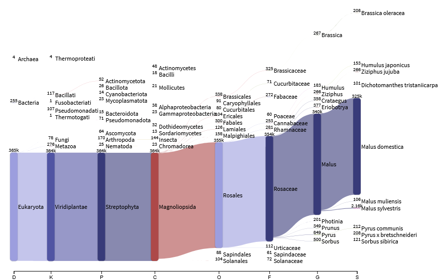

# Sequencing and Assembly of Phytoplasma mali genomes

## Nanopore adaptive sampling 

In adaptive sampling a nanopore device basecalls the first ~400bp of a DNA strand in real time as it passes through a pore, this is referenced against a database and the voltage over the pore may be reversed to eject the nucleotide strand. Therea re two versions of adaptive sampling: enrichment and depletion. In enrichment a .fasta file is provided of target sequences, when a nucleotide strand is matched to this sequencing continues, otherwise off-target nucleotides are rejected after ~400bp. In depletions a .fasta file is provided of off-target sequences (eg. a host), when a nucleotide strand is matched to this it is ejected, otherwise sequencing continues. A .bed file can be provided along with the .fasta file which specifies particular regions within the .fasta as on-target (enrichment) or off-target (depletion). It is recommended to provide a .bed file and .fasta with both on- and off-target seqeunces to prevent 'forced' matches. Nanopore recommends <125Mb for the .fasta file.

We will prepare these files for sequencing of Phytoplasma mali - and not the host apple genome. We plan to use depletion mode primarily but will also test enrichment. 
```bash
#Collect existing phytoplasma mali genomes (on-target)
cat AT1-13_ET.fasta AT2-62B.fasta AT1-AO-11_ET.fasta AT2_Cmel17.fasta GCF_000026205.1_Phytoplasma_mali.fasta >> Existing_phyto.fna

#Check that there are not shared regions between the host apple and phytoplasma that may be erroneously rejected in depletion mode:
module load anaconda3
conda activate minimap2
minimap2 -x asm5 -t 1 \
  GCA_042453785.1_GDT2T_hap1_genomic.fna \
  Existing_phyto.fna > pathogen_vs_host.paf
#No matches at all, No regions ≥ ~100 bp similar

minimap2 -x asm20 -t 1 \
  GCA_042453785.1_GDT2T_hap1_genomic.fna \
  Existing_phyto.fna > test_sensitive.paf

minimap2 -k15 -w5 -t 1 \
  GCA_042453785.1_GDT2T_hap1_genomic.fna \
  Existing_phyto.fna > ultra_sensitive.paf
#Alignments are short in matching bases and low identity (~65–85% at best, often worse)
```
The apple genome is ~630Mb, so a reduced sequence set may be required as this is far larger than the recommended 125Mb .fasta size. We also know from experience that the sequencing will fail if there are too many sequences (~25,000) in the .fasta even if it is <125Mb

CP168782.1 Malus domestica cultivar Golden Delicious chromosome 01      32,452,868
CP168783.1 Malus domestica cultivar Golden Delicious chromosome 02      37,717,778
CP168784.1 Malus domestica cultivar Golden Delicious chromosome 03      37,919,568
CP168785.1 Malus domestica cultivar Golden Delicious chromosome 04      31,738,030
CP168786.1 Malus domestica cultivar Golden Delicious chromosome 05      46,786,874
CP168787.1 Malus domestica cultivar Golden Delicious chromosome 06      35,382,598
CP168788.1 Malus domestica cultivar Golden Delicious chromosome 07      36,939,614
CP168789.1 Malus domestica cultivar Golden Delicious chromosome 08      31,204,305
CP168790.1 Malus domestica cultivar Golden Delicious chromosome 09      35,893,544
CP168791.1 Malus domestica cultivar Golden Delicious chromosome 10      43,556,527
CP168792.1 Malus domestica cultivar Golden Delicious chromosome 11      41,353,263
CP168793.1 Malus domestica cultivar Golden Delicious chromosome 12      31,835,694
CP168794.1 Malus domestica cultivar Golden Delicious chromosome 13      44,611,933
CP168795.1 Malus domestica cultivar Golden Delicious chromosome 14      31,639,640
CP168796.1 Malus domestica cultivar Golden Delicious chromosome 15      56,249,447
CP168797.1 Malus domestica cultivar Golden Delicious chromosome 16      40,837,467
CP168798.1 Malus domestica cultivar Golden Delicious chromosome 17      34,656,096

```bash
#get gene coding regions of the apple genome only
awk '$3=="gene" {OFS="\t"; split($9,a,";"); name=a[1]; gsub("ID=","",name); print $1, $4-1, $5, name, 0, $7}' GCF_042453785.1_GDT2T_hap1_genomic.gff > genes.bed
conda activate bedtools
bedtools sort -i genes.bed > genes_sorted.bed
bedtools merge -i genes_sorted.bed > genes_merged.bed

awk 'BEGIN{ while(getline < "new_headers.txt") h[++i]=$0; seqnum=0 }
     /^>/ { seqnum++; print ">"h[seqnum]; next }
     { print }' GCA_042453785.1_GDT2T_hap1_genomic.fna > genome_renamed.fna

bedtools getfasta -fi genome_renamed.fna \
  -bed genes.bed \
  -fo genes.fasta \
  -name \
  -s

bedtools getfasta -fi genome_renamed.fna \
  -bed genes_merged.bed \
  -fo genes_merged.fasta \
  -name \
  -s

#get high copy gene regions of the apple genoem only
#get all high copy rRNA genes from GFF
awk '$3=="rRNA" {OFS="\t"; print $1, $4-1, $5, $9, 0, $7}' GCF_042453785.1_GDT2T_hap1_genomic.gff > highcopy_genes.bed
awk '/^>/ {if(seqlen){print name"\t"seqlen}; name=substr($0,2); seqlen=0; next} {seqlen+=length($0)} END{print name"\t"seqlen}' genome_renamed.fna > genome_sizes.txt
bedtools slop -i highcopy_genes.bed -g genome_sizes.txt -b 10000 > highcopy_genes_extended.bed

bedtools getfasta -fi genome_renamed.fna \
  -bed highcopy_genes_extended.bed \
  -fo highcopy_genes_extended.fasta \
  -name \
  -s

srun -p bioagri  -c 32 --mem 128G --pty bash
module load anaconda3
conda activate jellyfish
jellyfish count -m 16 -s 2000M -t 32 genome_renamed.fna -o genome.jf
jellyfish dump -c genome.jf > genome_kmers.fa
apptainer exec /data/users/theaven/phytolasma/kmc_3.2.4--haf24da9_3 kmc_tools transform kmc_db dump genome_kmers.fa

awk '/^>/ {print ">gene" ++i; next} {print}' highcopy_genes.fasta > highcopy_genes_simple.fasta && mv highcopy_genes_simple.fasta highcopy_genes.fasta
awk '/^>/ {gsub(/[:()]/,"",$0); print ">gene" ++i; next} {print}' genes_merged.fasta > genes_merged_simple.fasta && mv genes_merged_simple.fasta genes_merged.fasta 
```
Prepare files:
```bash
#Full - contains the full apple genome + mitochondrial genome + chloroplast genome + high copy gene regions + all existant phytoplasma mali genomes = 633Mb total
cat genome_renamed.fna apple-chloroplast-NC_061549.1.fna apple-mitochondria-NC_018554.1.fna Existing_phyto.fna highcopy_genes.fasta > FULL.fna 
awk '/^>/ {print $1; next} {print}' FULL.fna  > FULL2.fna && mv FULL2.fna FULL.fna
awk '/^>/{if(s){print n"\t0\t"s} n=substr($0,2); s=0; next} {s+=length($0)} END{print n"\t0\t"s}' FULL.fna > FULL_depletion.bed #remove phyto headers

#Whole chrom - contains the apple nuclear genome chromosomes 1,7, and 13 + mitochondrial genome + chloroplast genome + high copy gene regions + all existant phytoplasma mali genomes = 115Mb total, 448 sequences
apptainer exec /data/users/theaven/phytolasma/python3.sif python3 ~/git_repos/Scripts/NBI/seq_get.py --id_file /data/users/theaven/phytolasma/temp_id.txt --input  /data/users/theaven/phytolasma/genome_renamed.fna --output  /data/users/theaven/phytolasma/genome_renamed_1713.fna
cat genome_renamed_1713.fna apple-chloroplast-NC_061549.1.fna apple-mitochondria-NC_018554.1.fna Existing_phyto.fna highcopy_genes.fasta > CHROM.fna
awk '/^>/ {print $1; next} {print}' CHROM.fna  > FULL2.fna && mv FULL2.fna CHROM.fna
awk '/^>/{if(s){print n"\t0\t"s} n=substr($0,2); s=0; next} {s+=length($0)} END{print n"\t0\t"s}' CHROM.fna > CHROM_depletion.bed 

#Sliced - contains 1,000,000 of every 7,000,000bp of the apple nuclear genome + mitochondrial genome + chloroplast genome + high copy gene regions + all existant phytoplasma mali genomes = 115Mb total, 561 sequences
apptainer exec /data/users/theaven/phytolasma/python3.sif python3 ~/git_repos/Scripts/unibz/slice_fasta.py -i genome_renamed.fna -o genome_renamed_sliced.fna -s 1000000 -t 6000000 -f 0
cat genome_renamed_sliced.fna apple-chloroplast-NC_061549.1.fna apple-mitochondria-NC_018554.1.fna Existing_phyto.fna highcopy_genes.fasta > SLICE.fna 
awk '/^>/ {print $1; next} {print}' SLICE.fna  > FULL2.fna && mv FULL2.fna SLICE.fna
awk '/^>/{if(s){print n"\t0\t"s} n=substr($0,2); s=0; next} {s+=length($0)} END{print n"\t0\t"s}' SLICE.fna > SLICE_depletion.bed 

#Gene - contains gene regions of the apple nuclear genome + mitochondrial genome + chloroplast genome + high copy gene regions + all existant phytoplasma mali genomes = 172Mb total, 46,111 sequences
cat genes_merged.fasta apple-chloroplast-NC_061549.1.fna apple-mitochondria-NC_018554.1.fna Existing_phyto.fna highcopy_genes.fasta > GENE_full.fna 
awk '/^>/ {print $1; next} {print}' GENE_full.fna  > FULL2.fna && mv FULL2.fna GENE_full.fna
awk '/^>/{if(s){print n"\t0\t"s} n=substr($0,2); s=0; next} {s+=length($0)} END{print n"\t0\t"s}' GENE_full.fna > GENE_full_depletion.bed 

#Gene_half - contains half of gene regions of the apple nuclear genome + mitochondrial genome + chloroplast genome + high copy gene regions + all existant phytoplasma mali genomes = 88Mb total, 23,278 sequences
awk 'BEGIN {n=0} /^>/ {n++} n%2==1 {print; getline; print}' genes_merged.fasta > genes_merged_every_other.fasta
cat genes_merged_every_other.fasta apple-chloroplast-NC_061549.1.fna apple-mitochondria-NC_018554.1.fna Existing_phyto.fna highcopy_genes.fasta > GENE_half.fna 
awk '/^>/ {print $1; next} {print}' GENE_half.fna  > FULL2.fna && mv FULL2.fna GENE_half.fna
awk '/^>/{if(s){print n"\t0\t"s} n=substr($0,2); s=0; next} {s+=length($0)} END{print n"\t0\t"s}' GENE_half.fna > GENE_half_depletion.bed

#Enrich - contains the sequences headers of the phytoplasma sequences, depletions .bed files contain all seqeunces headers except these for the different .fasta files
awk '/^>/{if(s){print n"\t0\t"s} n=substr($0,2); s=0; next} {s+=length($0)} END{print n"\t0\t"s}' Existing_phyto.fna > phyto_sequences.bed
```
In the event the sequencing ran to completion with the FULL.fna dataset and so there was no need for the reduced datasets.

## Post-sequencing analysis
## Sample 45UP

Only ~160 pores were active during the 45UP run therefore we expect few reads. - this also meant that only depletion mode adaptive sampling could be trialled

### Basecalling

Sequencing was run with fast basecalling for the purposes of adaptive sampling, raw .POD5 files were output which we will now use for bsaecalling with the highest accuracy settings with dorado. The barcode 03 was used even though we are only sequencing one sample in order to utilise the available rapid ligations adapter library kit.

```bash
mkdir -p /data/users/theaven/phytolasma/raw_data/minion/45UP/pod5

ln -s /data/users/theaven/phytolasma/20260327-TOMH-phyto_45up_1/45up/20260327_1037_MN41812_FBF81825_72f4b008/pod5/*.pod5 /data/users/theaven/phytolasma/raw_data/minion/45UP/pod5/.

screen -S dorado
for Dir in $(ls -d /data/users/theaven/phytolasma/raw_data/minion/45UP/pod5); do
  Task=Dorado
  InDir="$Dir"
  OutDir=$(dirname $Dir)/basecalls
  OutFmt=fastq
  Barcode=SQK-NBD114-24
  Modification_model=NA
  ExpectedOutput="$OutDir"/out.fastq

  Jobs=$(squeue -h -u theaven -n "$Task" | wc -l)
  while [ "$Jobs" -gt 0 ]; do
    sleep 600s
    printf "."
    Jobs=$(squeue -h -u theaven -n "$Task" | wc -l)
  done

  if [ ! -s "$ExpectedOutput" ]; then
    jobid=$(sbatch --job-name="$Task" --parsable ~/git_repos/Wrappers/unibz/run_dorado.sh "$InDir" "$OutDir" "$OutFmt" "$Barcode" "$Modification_model")
    printf "%s\t%s\t "$Task" \t%s\n" "$(date -Iseconds)" "$ID" "$jobid" >> /home/clusterusers/theaven/slurm_log.tsv
  else
    echo "For $ID found: $ExpectedOutput" 
  fi
done

ls -lh /data/users/theaven/phytolasma/raw_data/minion/45UP/basecalls/demuxed/20260327-TOMH-phyto_45up_1/45up/20260327_0937_0_FBF81825_72f4b008/fastq_pass/*/*.fastq
#-rw-r----- 1 theaven domain users 397M Apr  2 15:26 /data/users/theaven/phytolasma/raw_data/minion/45UP/basecalls/demuxed/20260327-TOMH-phyto_45up_1/45up/20260327_0937_0_FBF81825_72f4b008/fastq_pass/barcode03/FBF81825_pass_barcode03_72f4b008_00000000_0.fastq
#-rw-r----- 1 theaven domain users 2.6K Apr  2 15:26 /data/users/theaven/phytolasma/raw_data/minion/45UP/basecalls/demuxed/20260327-TOMH-phyto_45up_1/45up/20260327_0937_0_FBF81825_72f4b008/fastq_pass/barcode16/FBF81825_pass_barcode16_72f4b008_00000000_0.fastq
#-rw-r----- 1 theaven domain users  20K Apr  2 15:26 /data/users/theaven/phytolasma/raw_data/minion/45UP/basecalls/demuxed/20260327-TOMH-phyto_45up_1/45up/20260327_0937_0_FBF81825_72f4b008/fastq_pass/barcode17/FBF81825_pass_barcode17_72f4b008_00000000_0.fastq
#-rw-r----- 1 theaven domain users  32M Apr  2 15:26 /data/users/theaven/phytolasma/raw_data/minion/45UP/basecalls/demuxed/20260327-TOMH-phyto_45up_1/45up/20260327_0937_0_FBF81825_72f4b008/fastq_pass/unclassified/FBF81825_pass_unclassified_72f4b008_00000000_0.fastq

#As barcoding was for library prep purposes only reads were pooled:
cat /data/users/theaven/phytolasma/raw_data/minion/45UP/basecalls/demuxed/20260327-TOMH-phyto_45up_1/45up/20260327_0937_0_FBF81825_72f4b008/fastq_pass/*/*.fastq > /data/users/theaven/phytolasma/raw_data/minion/45UP/basecalls/all.fastq
```
Some reads are de-multiplexed to barcode 16 and 17 for some reason, hoever the majority are correctly 03.

There are 370,376 barcode03 total, however this will include many short reads that were rejected by adaptive sampling, investigate:
```bash
module load seqtk/1.4-gcc-12.3.0
seqtk seq -a /data/users/theaven/phytolasma/raw_data/minion/45UP/basecalls/all.fastq | awk '/^>/{split($0,a," "); print ">"a[1]; next}{print}' > /data/users/theaven/phytolasma/raw_data/minion/45UP/basecalls/all.fasta

awk '/^>>/{if(seq && length(seq)>=1000){print id"\t"length(seq)}; id=$0; seq=""} 
     !/^>>/{seq=seq$0} 
     END{if(seq && length(seq)>=1000){print id"\t"length(seq)}}' \
     /data/users/theaven/phytolasma/raw_data/minion/45UP/basecalls/all.fasta | sort -k2,2nr | wc -l #11927, at least 1,000bp long

awk '/^>>/{if(seq && length(seq)>=1000){print substr(id,3)}; id=$0; seq=""} 
     !/^>>/{seq=seq$0} 
     END{if(seq && length(seq)>=1000){print substr(id,3)}}' \
     /data/users/theaven/phytolasma/raw_data/minion/45UP/basecalls/all.fasta > /data/users/theaven/phytolasma/raw_data/minion/45UP/basecalls/long.fasta
```
11,927 reads were at least 1,000bp long

### Taxonomic classication of reads
#### BLAST

Reads were taxonomically classificed with BLAST to determine the proportion of on-target Phytoplasma mali reads
```bash
for reads in $(find /data/users/theaven/phytolasma/raw_data/minion/45UP/basecalls -name 'all.fasta' -type f); do
  Task=blast
  Database=/data/blobtoolkit/nt/nt
  Max_target=1
  OutPrefix=$(dirname $reads | rev | cut -d '/' -f1 | rev)
  OutDir="$(dirname $reads)"/"$Task"
  mkdir -p $OutDir
  ExpectedOutput="$OutDir"/${OutPrefix}.vs."$(basename $Database)".mts"$Max_target".hsp1.1e25.megablast.out

  Jobs=$(squeue -h -u theaven -n "$Task" | wc -l)
  while [ "$Jobs" -gt 9 ]; do
    sleep 5s
    printf "."
    Jobs=$(squeue -h -u theaven -n "$Task" | wc -l)
  done

  if [ ! -s "$ExpectedOutput" ]; then
    jobid=$(sbatch --job-name="$Task" --parsable ~/git_repos/Wrappers/unibz/run_blastn.sh "$reads" "$Database" "$OutDir" "$OutPrefix" "$Max_target")
    printf "%s\t%s\t "$Task" \t%s\n" "$(date -Iseconds)" "$ID" "$jobid" >> /home/clusterusers/theaven/slurm_log.tsv
  else
    echo "For $ID found: $ExpectedOutput" 
  fi
done

#Inspect BLAST  output in MEGAN6 - does not work giving 'too many errors error'
tail -n +2 /data/users/theaven/phytolasma/raw_data/minion/45UP/basecalls/blast/basecalls.vs.nt.mts1.hsp1.1e25.megablast.out > noheader.tsv
awk 'NR>1 {print $1"\t"$5"\t"$6"\t"$7"\t"$8"\t"$9"\t"$10"\t"$11"\t"$12"\t"$13"\t"$14"\t"$15"\t"$2}' noheader.tsv > /data/users/theaven/phytolasma/raw_data/minion/45UP/basecalls/blast/basecalls.vs.nt.mts1.hsp1.1e25.megablast.megan.out
sed 's/ \+/\t/g' /data/users/theaven/phytolasma/raw_data/minion/45UP/basecalls/blast/basecalls.vs.nt.mts1.hsp1.1e25.megablast.megan.out > /data/users/theaven/phytolasma/raw_data/minion/45UP/basecalls/blast/basecalls.vs.nt.mts1.hsp1.1e25.megablast.megan2.tab
sed -i 's/^>//' /data/users/theaven/phytolasma/raw_data/minion/45UP/basecalls/blast/basecalls.vs.nt.mts1.hsp1.1e25.megablast.megan2.tab

tail -n +2 /data/users/theaven/phytolasma/raw_data/minion/45UP/basecalls/blast/basecalls.vs.nt.mts10.hsp1.1e25.megablast.out > noheader.tsv
awk 'NR>1 {print $1"\t"$5"\t"$6"\t"$7"\t"$8"\t"$9"\t"$10"\t"$11"\t"$12"\t"$13"\t"$14"\t"$15"\t"$2}' noheader.tsv > /data/users/theaven/phytolasma/raw_data/minion/45UP/basecalls/blast/basecalls.vs.nt.mts10.hsp1.1e25.megablast.megan.out
sed 's/ \+/\t/g' /data/users/theaven/phytolasma/raw_data/minion/45UP/basecalls/blast/basecalls.vs.nt.mts10.hsp1.1e25.megablast.megan.out > /data/users/theaven/phytolasma/raw_data/minion/45UP/basecalls/blast/basecalls.vs.nt.mts10.hsp1.1e25.megablast.megan2.tab
sed -i 's/^>//' /data/users/theaven/phytolasma/raw_data/minion/45UP/basecalls/blast/basecalls.vs.nt.mts10.hsp1.1e25.megablast.megan2.tab
cut -f7 /data/users/theaven/phytolasma/raw_data/minion/45UP/basecalls/blast/basecalls.vs.nt.mts10.hsp1.1e25.megablast.megan.out | head

#Investigate BLAST output
awk 'NR>1 {print $2}' /data/users/theaven/phytolasma/raw_data/minion/45UP/basecalls/blast/basecalls.vs.nt.mts10.hsp1.1e25.megablast.out | sort -u
awk 'NR>1 && $2!="3750" && $2!="3749" {print $1}' /data/users/theaven/phytolasma/raw_data/minion/45UP/basecalls/blast/basecalls.vs.nt.mts10.hsp1.1e25.megablast.out | sort | uniq | wc -l #355,661 not apple
awk 'NR>1 && $2!="3750" && $2!="3749" {print $1}' /data/users/theaven/phytolasma/raw_data/minion/45UP/basecalls/blast/basecalls.vs.nt.mts1.hsp1.1e25.megablast.out | sort | uniq | wc -l #97,846 not apple
awk 'NR>1 && $2==37692 {print $1 "\t" $2}' /data/users/theaven/phytolasma/raw_data/minion/45UP/basecalls/blast/basecalls.vs.nt.mts10.hsp1.1e25.megablast.out | sort | uniq | wc -l #21 reads with Candidatus phytoplasma mali assignment
```
Whilst 97,846 reads had a best hit other than apple only 21 had a best hit to phytoplasma mali 

#### Kraken2

Reads were taxonomically classificed with kraken2 to determine the proportion of on-target Phytoplasma mali reads
```bash
screen -S kraken2
srun -p bioagri -J kraken2 --nodes=1 --ntasks=1 --cpus-per-task=64 --mem 320G --pty bash
module load anaconda3
conda activate kraken2

OutDir=/data/users/theaven/phytolasma/raw_data/minion/45UP/kraken2
mkdir "$OutDir"
kraken2 \
--threads 64 \
--db /data/databases/kraken2/2025-02-04/k2_core_nt_20250609 \
--output "$OutDir"/output_nt.txt \
--unclassified-out "$OutDir"/unclassified_nt.txt \
--classified-out "$OutDir"/classified_nt.txt \
--report "$OutDir"/report_nt.txt \
--use-names \
/data/users/theaven/phytolasma/raw_data/minion/45UP/basecalls/all.fasta
#   365326 sequences classified (98.64%)
#   5050 sequences unclassified (1.36%)

conda deactivate
exit
exit
echo finished

wc -l /data/users/theaven/phytolasma/raw_data/minion/45UP/kraken2/output_nt.txt #370376
sort -t$'\t' -k4,4nr /data/users/theaven/phytolasma/raw_data/minion/45UP/kraken2/output_nt.txt > /data/users/theaven/phytolasma/raw_data/minion/45UP/kraken2/output_nt_by_length.txt #long reads are Malus, longest phytoplasma read is 5,283, and there are only ~23 of them
```

Most of the long reads are classified to Malus, and the longest phytoplasma read is only 5,283bp, in line with the BLAST results, only ~23 reads are classified to phytoplasma (Mollicutes).