# Sequencing, Assembly, and analysis of Phytoplasma mali genomes

## Contents
1. [Sequencing](#1)<br>
&nbsp;&nbsp;&nbsp;&nbsp;1.1 [Nanopore adaptive sampling](#2)<br>
&nbsp;&nbsp;&nbsp;&nbsp;&nbsp;&nbsp;&nbsp;&nbsp;1.1.1 [Pant samples](#41)<br>
&nbsp;&nbsp;&nbsp;&nbsp;&nbsp;&nbsp;&nbsp;&nbsp;1.1.2 [Picta samples](#42)<br>
&nbsp;&nbsp;&nbsp;&nbsp;1.2 [Post-sequencing analysis](#4)<br>
&nbsp;&nbsp;&nbsp;&nbsp;1.3 [Sample 45UP](41)<br>
&nbsp;&nbsp;&nbsp;&nbsp;&nbsp;&nbsp;&nbsp;&nbsp;1.3.1 [Basecalling](#5)<br>
&nbsp;&nbsp;&nbsp;&nbsp;&nbsp;&nbsp;&nbsp;&nbsp;1.3.2 [Taxonomic classication of reads](#6)<br>
&nbsp;&nbsp;&nbsp;&nbsp;&nbsp;&nbsp;&nbsp;&nbsp;&nbsp;&nbsp;&nbsp;&nbsp;1.3.2.1 [BLAST](#7)<br>
&nbsp;&nbsp;&nbsp;&nbsp;&nbsp;&nbsp;&nbsp;&nbsp;&nbsp;&nbsp;&nbsp;&nbsp;1.3.2.2 [Kraken2](#8)<br>
&nbsp;&nbsp;&nbsp;&nbsp;1.4 [Sample 19A](#42)<br>
&nbsp;&nbsp;&nbsp;&nbsp;&nbsp;&nbsp;&nbsp;&nbsp;1.3.1 [Basecalling](#43)<br>
&nbsp;&nbsp;&nbsp;&nbsp;&nbsp;&nbsp;&nbsp;&nbsp;1.3.2 [Taxonomic classication of reads](#44)<br>
&nbsp;&nbsp;&nbsp;&nbsp;&nbsp;&nbsp;&nbsp;&nbsp;&nbsp;&nbsp;&nbsp;&nbsp;1.3.2.1 [BWA-mem](#49)<br>
&nbsp;&nbsp;&nbsp;&nbsp;&nbsp;&nbsp;&nbsp;&nbsp;&nbsp;&nbsp;&nbsp;&nbsp;1.3.2.2 [BLAST](#45)<br>
&nbsp;&nbsp;&nbsp;&nbsp;&nbsp;&nbsp;&nbsp;&nbsp;&nbsp;&nbsp;&nbsp;&nbsp;1.3.2.3 [Kraken2](#46)<br>
&nbsp;&nbsp;&nbsp;&nbsp;&nbsp;&nbsp;&nbsp;&nbsp;1.3.3 [Genome assemlby](#47)<br>
&nbsp;&nbsp;&nbsp;&nbsp;&nbsp;&nbsp;&nbsp;&nbsp;&nbsp;&nbsp;&nbsp;&nbsp;1.3.3.1 [EPI2ME - wf-bacterial genomes](#48)<br>
&nbsp;&nbsp;&nbsp;&nbsp;&nbsp;&nbsp;&nbsp;&nbsp;&nbsp;&nbsp;&nbsp;&nbsp;1.3.3.2 [Minimap2](#50)<br>
&nbsp;&nbsp;&nbsp;&nbsp;&nbsp;&nbsp;&nbsp;&nbsp;&nbsp;&nbsp;&nbsp;&nbsp;1.3.3.3 [Ragtag](#51)<br>
&nbsp;&nbsp;&nbsp;&nbsp;&nbsp;&nbsp;&nbsp;&nbsp;&nbsp;&nbsp;&nbsp;&nbsp;1.3.3.4 [Mosdepth](#52)<br>
&nbsp;&nbsp;&nbsp;&nbsp;&nbsp;&nbsp;&nbsp;&nbsp;&nbsp;&nbsp;&nbsp;&nbsp;1.3.3.4 [Sniffles / cutesv](#53)<br>
&nbsp;&nbsp;&nbsp;&nbsp;&nbsp;&nbsp;&nbsp;&nbsp;&nbsp;&nbsp;&nbsp;&nbsp;1.3.3.5 [Trycycler](#54)<br>
&nbsp;&nbsp;&nbsp;&nbsp;&nbsp;&nbsp;&nbsp;&nbsp;&nbsp;&nbsp;&nbsp;&nbsp;1.3.3.6 [Contaminants](#55)<br>
&nbsp;&nbsp;&nbsp;&nbsp;&nbsp;&nbsp;&nbsp;&nbsp;&nbsp;&nbsp;&nbsp;&nbsp;1.3.3.7 [Myloasm](#56)<br>
&nbsp;&nbsp;&nbsp;&nbsp;&nbsp;&nbsp;&nbsp;&nbsp;&nbsp;&nbsp;&nbsp;&nbsp;1.3.3.8 [NanoMDBG](#57)<br>
&nbsp;&nbsp;&nbsp;&nbsp;&nbsp;&nbsp;&nbsp;&nbsp;&nbsp;&nbsp;&nbsp;&nbsp;1.3.3.9 [Autocycler](#58)<br>
&nbsp;&nbsp;&nbsp;&nbsp;1.4 [Sample 25A2](#59)<br>
&nbsp;&nbsp;&nbsp;&nbsp;&nbsp;&nbsp;&nbsp;&nbsp;1.4.1 [Basecalling](#60)<br>
&nbsp;&nbsp;&nbsp;&nbsp;&nbsp;&nbsp;&nbsp;&nbsp;1.4.2 [Taxonomic classication of reads](#61)<br>
&nbsp;&nbsp;&nbsp;&nbsp;&nbsp;&nbsp;&nbsp;&nbsp;&nbsp;&nbsp;&nbsp;&nbsp;1.4.2.1 [BWA-mem](#62)<br>
&nbsp;&nbsp;&nbsp;&nbsp;&nbsp;&nbsp;&nbsp;&nbsp;&nbsp;&nbsp;&nbsp;&nbsp;1.4.2.2 [Kraken2](#63)<br>
&nbsp;&nbsp;&nbsp;&nbsp;&nbsp;&nbsp;&nbsp;&nbsp;1.4.3 [Genome assembly](#64)<br>
&nbsp;&nbsp;&nbsp;&nbsp;&nbsp;&nbsp;&nbsp;&nbsp;&nbsp;&nbsp;&nbsp;&nbsp;1.4.3.1 [EPI2ME - wf-bacterial genomes](#65)<br>
&nbsp;&nbsp;&nbsp;&nbsp;1.5 [Sample AT2-62B](#66)<br>
&nbsp;&nbsp;&nbsp;&nbsp;&nbsp;&nbsp;&nbsp;&nbsp;1.5.1 [Basecalling](#67)<br>
&nbsp;&nbsp;&nbsp;&nbsp;&nbsp;&nbsp;&nbsp;&nbsp;1.5.2 [Taxonomic classication of reads](#68)<br>
&nbsp;&nbsp;&nbsp;&nbsp;&nbsp;&nbsp;&nbsp;&nbsp;&nbsp;&nbsp;&nbsp;&nbsp;1.5.2.1 [BWA-mem](#69)<br>
&nbsp;&nbsp;&nbsp;&nbsp;&nbsp;&nbsp;&nbsp;&nbsp;&nbsp;&nbsp;&nbsp;&nbsp;1.5.2.2 [Kraken2](#70)<br>
&nbsp;&nbsp;&nbsp;&nbsp;&nbsp;&nbsp;&nbsp;&nbsp;1.5.3 [Genome assembly](#71)<br>
&nbsp;&nbsp;&nbsp;&nbsp;&nbsp;&nbsp;&nbsp;&nbsp;&nbsp;&nbsp;&nbsp;&nbsp;1.5.3.1 [EPI2ME - wf-bacterial genomes](#72)<br>
2. [Comparison of Phytoplasma mali genomes](#3)<br>
&nbsp;&nbsp;&nbsp;&nbsp;2.1 [Subtyping primers](#10)<br>
&nbsp;&nbsp;&nbsp;&nbsp;&nbsp;&nbsp;&nbsp;&nbsp;2.1.1 [rpl22 - qPCR primer](#19)<br>
&nbsp;&nbsp;&nbsp;&nbsp;&nbsp;&nbsp;&nbsp;&nbsp;2.1.2 [AP13/10 - AFLP primers](#20)<br>
&nbsp;&nbsp;&nbsp;&nbsp;&nbsp;&nbsp;&nbsp;&nbsp;2.1.3 [AP5/4 - AFLP primers](#21)<br>
&nbsp;&nbsp;&nbsp;&nbsp;&nbsp;&nbsp;&nbsp;&nbsp;2.1.4 [AP8/10 - AFLP primers](#22)<br>
&nbsp;&nbsp;&nbsp;&nbsp;2.2 [k-mer based similarity](#23)<br>
&nbsp;&nbsp;&nbsp;&nbsp;&nbsp;&nbsp;&nbsp;&nbsp;2.2.1 [Sourmash](#11)<br>
&nbsp;&nbsp;&nbsp;&nbsp;2.3 [Whole genome alignment](#12)<br>
&nbsp;&nbsp;&nbsp;&nbsp;&nbsp;&nbsp;&nbsp;&nbsp;2.3.1 [Pairwise alignment](#24)<br>
&nbsp;&nbsp;&nbsp;&nbsp;&nbsp;&nbsp;&nbsp;&nbsp;2.3.2 [Cactus](#15)<br>
&nbsp;&nbsp;&nbsp;&nbsp;2.4 [Pangenome](#14)<br>
&nbsp;&nbsp;&nbsp;&nbsp;&nbsp;&nbsp;&nbsp;&nbsp;2.4.1 [Cactus](#16)<br>
&nbsp;&nbsp;&nbsp;&nbsp;&nbsp;&nbsp;&nbsp;&nbsp;2.4.2 [Investigate variation in the pangenome](#32)<br>
&nbsp;&nbsp;&nbsp;&nbsp;&nbsp;&nbsp;&nbsp;&nbsp;2.4.3 [Investigate acessory regions in the pangenome](#40)<br>
&nbsp;&nbsp;&nbsp;&nbsp;2.5 [Gene content](#13)<br>
&nbsp;&nbsp;&nbsp;&nbsp;&nbsp;&nbsp;&nbsp;&nbsp;2.5.1 [BUSCO](#9)<br>
&nbsp;&nbsp;&nbsp;&nbsp;&nbsp;&nbsp;&nbsp;&nbsp;2.5.2 [PGAP](#17)<br>
&nbsp;&nbsp;&nbsp;&nbsp;&nbsp;&nbsp;&nbsp;&nbsp;2.5.3 [Prokka](#18)<br>
&nbsp;&nbsp;&nbsp;&nbsp;&nbsp;&nbsp;&nbsp;&nbsp;2.5.4 [Plot synteny](#33)<br>
&nbsp;&nbsp;&nbsp;&nbsp;&nbsp;&nbsp;&nbsp;&nbsp;&nbsp;&nbsp;&nbsp;&nbsp;2.5.4.1 [Genespace](#34)<br>
&nbsp;&nbsp;&nbsp;&nbsp;&nbsp;&nbsp;&nbsp;&nbsp;&nbsp;&nbsp;&nbsp;&nbsp;2.5.4.2 [MCSCANX](#35)<br>
&nbsp;&nbsp;&nbsp;&nbsp;&nbsp;&nbsp;&nbsp;&nbsp;2.5.5 [SNPEff](#25)<br>
3. [Illumina data - from acquisition experiment samples](#26)<br>
&nbsp;&nbsp;&nbsp;&nbsp;3.1 [Subtyping primers](#36)<br>
&nbsp;&nbsp;&nbsp;&nbsp;3.2 [Assess variants](#29)<br>
&nbsp;&nbsp;&nbsp;&nbsp;&nbsp;&nbsp;&nbsp;&nbsp;3.2.1 [SNPEff](#27)<br>
&nbsp;&nbsp;&nbsp;&nbsp;&nbsp;&nbsp;&nbsp;&nbsp;3.2.2 [Splitstree](#28)<br>
&nbsp;&nbsp;&nbsp;&nbsp;3.3 [Investigate multiple strains](#30)<br>
&nbsp;&nbsp;&nbsp;&nbsp;&nbsp;&nbsp;&nbsp;&nbsp;3.3.1 [Identify fixed positions](#31)<br>
&nbsp;&nbsp;&nbsp;&nbsp;&nbsp;&nbsp;&nbsp;&nbsp;3.3.2 [Multi-peak positions](#39)<br>
&nbsp;&nbsp;&nbsp;&nbsp;3.4 [Acquisition expriment samples - raw reads](#38)<br>
&nbsp;&nbsp;&nbsp;&nbsp;&nbsp;&nbsp;&nbsp;&nbsp;3.4.1 [QC of raw reads](#37)<br>

# Sequencing  <a name="1"></a>
## Nanopore adaptive sampling <a name="2"></a>

In adaptive sampling a nanopore device basecalls the first ~400bp of a DNA strand in real time as it passes through a pore, this is referenced against a database and the voltage over the pore may be reversed to eject the nucleotide strand. Therea re two versions of adaptive sampling: enrichment and depletion. In enrichment a .fasta file is provided of target sequences, when a nucleotide strand is matched to this sequencing continues, otherwise off-target nucleotides are rejected after ~400bp. In depletions a .fasta file is provided of off-target sequences (eg. a host), when a nucleotide strand is matched to this it is ejected, otherwise sequencing continues. A .bed file can be provided along with the .fasta file which specifies particular regions within the .fasta as on-target (enrichment) or off-target (depletion). It is recommended to provide a .bed file and .fasta with both on- and off-target seqeunces to prevent 'forced' matches. Nanopore recommends <125Mb for the .fasta file.

### Plant samples <a name="41"></a>

We will prepare these files for sequencing of Phytoplasma mali - and not the host apple genome. We plan to use depletion mode primarily but will also test enrichment. 
```bash
#Collect existing phytoplasma mali genomes (on-target)
cat AT1-13_ET.fasta AT2-62B.fasta AT1-AO-11_ET.fasta AT2_Cmel17.fasta GCF_000026205.1_Phytoplasma_mali.fasta >> Existing_phyto.fna

#Check that there are not shared regions between the host apple and phytoplasma that may be erroneously rejected in depletion mode:
module load anaconda3
conda activate minimap2
minimap2 -x asm5 -t 1 \
  GCA_042453785.1_GDT2T_hap1_genomic.fna \
  Existing_phyto.fna > pathogen_vs_host.paf
#No matches at all, No regions ≥ ~100 bp are similar

minimap2 -x asm20 -t 1 \
  GCA_042453785.1_GDT2T_hap1_genomic.fna \
  Existing_phyto.fna > test_sensitive.paf

minimap2 -k15 -w5 -t 1 \
  GCA_042453785.1_GDT2T_hap1_genomic.fna \
  Existing_phyto.fna > ultra_sensitive.paf
#Alignments are short in matching bases and low identity (~65–85% at best, often worse)
```
The apple genome is ~630Mb, so a reduced sequence set may be required as this is far larger than the recommended 125Mb .fasta size. We also know from experience that the sequencing will fail if there are too many sequences (~25,000) in the .fasta even if it is <125Mb

CP168782.1 Malus domestica cultivar Golden Delicious chromosome 01      32,452,868<br>
CP168783.1 Malus domestica cultivar Golden Delicious chromosome 02      37,717,778<br>
CP168784.1 Malus domestica cultivar Golden Delicious chromosome 03      37,919,568<br>
CP168785.1 Malus domestica cultivar Golden Delicious chromosome 04      31,738,030<br>
CP168786.1 Malus domestica cultivar Golden Delicious chromosome 05      46,786,874<br>
CP168787.1 Malus domestica cultivar Golden Delicious chromosome 06      35,382,598<br>
CP168788.1 Malus domestica cultivar Golden Delicious chromosome 07      36,939,614<br>
CP168789.1 Malus domestica cultivar Golden Delicious chromosome 08      31,204,305<br>
CP168790.1 Malus domestica cultivar Golden Delicious chromosome 09      35,893,544<br>
CP168791.1 Malus domestica cultivar Golden Delicious chromosome 10      43,556,527<br>
CP168792.1 Malus domestica cultivar Golden Delicious chromosome 11      41,353,263<br>
CP168793.1 Malus domestica cultivar Golden Delicious chromosome 12      31,835,694<br>
CP168794.1 Malus domestica cultivar Golden Delicious chromosome 13      44,611,933<br>
CP168795.1 Malus domestica cultivar Golden Delicious chromosome 14      31,639,640<br>
CP168796.1 Malus domestica cultivar Golden Delicious chromosome 15      56,249,447<br>
CP168797.1 Malus domestica cultivar Golden Delicious chromosome 16      40,837,467<br>
CP168798.1 Malus domestica cultivar Golden Delicious chromosome 17      34,656,096<br>

```bash
#get gene coding regions of the apple genome only
awk '$3=="gene" {OFS="\t"; split($9,a,";"); name=a[1]; gsub("ID=","",name); print $1, $4-1, $5, name, 0, $7}' GCF_042453785.1_GDT2T_hap1_genomic.gff > genes.bed
conda activate bedtools
bedtools sort -i genes.bed > genes_sorted.bed
bedtools merge -i genes_sorted.bed > genes_merged.bed

awk 'BEGIN{ while(getline < "new_headers.txt") h[++i]=$0; seqnum=0 }
     /^>/ { seqnum++; print ">"h[seqnum]; next }
     { print }' GCA_042453785.1_GDT2T_hap1_genomic.fna > genome_renamed.fna

bedtools getfasta -fi genome_renamed.fna \
  -bed genes.bed \
  -fo genes.fasta \
  -name \
  -s

bedtools getfasta -fi genome_renamed.fna \
  -bed genes_merged.bed \
  -fo genes_merged.fasta \
  -name \
  -s

#get high copy gene regions of the apple genome only
#get all high copy rRNA genes from GFF
awk '$3=="rRNA" {OFS="\t"; print $1, $4-1, $5, $9, 0, $7}' GCF_042453785.1_GDT2T_hap1_genomic.gff > highcopy_genes.bed
awk '/^>/ {if(seqlen){print name"\t"seqlen}; name=substr($0,2); seqlen=0; next} {seqlen+=length($0)} END{print name"\t"seqlen}' genome_renamed.fna > genome_sizes.txt
bedtools slop -i highcopy_genes.bed -g genome_sizes.txt -b 10000 > highcopy_genes_extended.bed

bedtools getfasta -fi genome_renamed.fna \
  -bed highcopy_genes_extended.bed \
  -fo highcopy_genes_extended.fasta \
  -name \
  -s

srun -p bioagri  -c 32 --mem 128G --pty bash
module load anaconda3
conda activate jellyfish
jellyfish count -m 16 -s 2000M -t 32 genome_renamed.fna -o genome.jf
jellyfish dump -c genome.jf > genome_kmers.fa
apptainer exec /data/users/theaven/phytolasma/kmc_3.2.4--haf24da9_3 kmc_tools transform kmc_db dump genome_kmers.fa

awk '/^>/ {print ">gene" ++i; next} {print}' highcopy_genes.fasta > highcopy_genes_simple.fasta && mv highcopy_genes_simple.fasta highcopy_genes.fasta
awk '/^>/ {gsub(/[:()]/,"",$0); print ">gene" ++i; next} {print}' genes_merged.fasta > genes_merged_simple.fasta && mv genes_merged_simple.fasta genes_merged.fasta 
```
Prepare files:
```bash
#Full - contains the full apple genome + mitochondrial genome + chloroplast genome + high copy gene regions + all existant phytoplasma mali genomes = 633Mb total
cat genome_renamed.fna apple-chloroplast-NC_061549.1.fna apple-mitochondria-NC_018554.1.fna Existing_phyto.fna highcopy_genes.fasta > FULL.fna 
awk '/^>/ {print $1; next} {print}' FULL.fna  > FULL2.fna && mv FULL2.fna FULL.fna
awk '/^>/{if(s){print n"\t0\t"s} n=substr($0,2); s=0; next} {s+=length($0)} END{print n"\t0\t"s}' FULL.fna > FULL_depletion.bed #remove phyto headers

#Whole chrom - contains the apple nuclear genome chromosomes 1,7, and 13 + mitochondrial genome + chloroplast genome + high copy gene regions + all existant phytoplasma mali genomes = 115Mb total, 448 sequences
apptainer exec /data/users/theaven/phytolasma/python3.sif python3 ~/git_repos/Scripts/NBI/seq_get.py --id_file /data/users/theaven/phytolasma/temp_id.txt --input  /data/users/theaven/phytolasma/genome_renamed.fna --output  /data/users/theaven/phytolasma/genome_renamed_1713.fna
cat genome_renamed_1713.fna apple-chloroplast-NC_061549.1.fna apple-mitochondria-NC_018554.1.fna Existing_phyto.fna highcopy_genes.fasta > CHROM.fna
awk '/^>/ {print $1; next} {print}' CHROM.fna  > FULL2.fna && mv FULL2.fna CHROM.fna
awk '/^>/{if(s){print n"\t0\t"s} n=substr($0,2); s=0; next} {s+=length($0)} END{print n"\t0\t"s}' CHROM.fna > CHROM_depletion.bed 

#Sliced - contains 1,000,000 of every 7,000,000bp of the apple nuclear genome + mitochondrial genome + chloroplast genome + high copy gene regions + all existant phytoplasma mali genomes = 115Mb total, 561 sequences
apptainer exec /data/users/theaven/phytolasma/python3.sif python3 ~/git_repos/Scripts/unibz/slice_fasta.py -i genome_renamed.fna -o genome_renamed_sliced.fna -s 1000000 -t 6000000 -f 0
cat genome_renamed_sliced.fna apple-chloroplast-NC_061549.1.fna apple-mitochondria-NC_018554.1.fna Existing_phyto.fna highcopy_genes.fasta > SLICE.fna 
awk '/^>/ {print $1; next} {print}' SLICE.fna  > FULL2.fna && mv FULL2.fna SLICE.fna
awk '/^>/{if(s){print n"\t0\t"s} n=substr($0,2); s=0; next} {s+=length($0)} END{print n"\t0\t"s}' SLICE.fna > SLICE_depletion.bed 

#Gene - contains gene regions of the apple nuclear genome + mitochondrial genome + chloroplast genome + high copy gene regions + all existant phytoplasma mali genomes = 172Mb total, 46,111 sequences
cat genes_merged.fasta apple-chloroplast-NC_061549.1.fna apple-mitochondria-NC_018554.1.fna Existing_phyto.fna highcopy_genes.fasta > GENE_full.fna 
awk '/^>/ {print $1; next} {print}' GENE_full.fna  > FULL2.fna && mv FULL2.fna GENE_full.fna
awk '/^>/{if(s){print n"\t0\t"s} n=substr($0,2); s=0; next} {s+=length($0)} END{print n"\t0\t"s}' GENE_full.fna > GENE_full_depletion.bed 

#Gene_half - contains half of gene regions of the apple nuclear genome + mitochondrial genome + chloroplast genome + high copy gene regions + all existant phytoplasma mali genomes = 88Mb total, 23,278 sequences
awk 'BEGIN {n=0} /^>/ {n++} n%2==1 {print; getline; print}' genes_merged.fasta > genes_merged_every_other.fasta
cat genes_merged_every_other.fasta apple-chloroplast-NC_061549.1.fna apple-mitochondria-NC_018554.1.fna Existing_phyto.fna highcopy_genes.fasta > GENE_half.fna 
awk '/^>/ {print $1; next} {print}' GENE_half.fna  > FULL2.fna && mv FULL2.fna GENE_half.fna
awk '/^>/{if(s){print n"\t0\t"s} n=substr($0,2); s=0; next} {s+=length($0)} END{print n"\t0\t"s}' GENE_half.fna > GENE_half_depletion.bed

#Enrich - contains the sequences headers of the phytoplasma sequences, depletions .bed files contain all seqeunces headers except these for the different .fasta files
awk '/^>/{if(s){print n"\t0\t"s} n=substr($0,2); s=0; next} {s+=length($0)} END{print n"\t0\t"s}' Existing_phyto.fna > phyto_sequences.bed
```
In the event the sequencing ran to completion with the FULL.fna dataset and so there was no need for the reduced datasets. In future we will exclude the high copy gene regions as these are already covered by the full apple genome.

```bash
```bash
#Final_plant - contains the full apple genome + mitochondrial genome + chloroplast genome + all existant phytoplasma mali genomes = 633Mb total
cat genome_renamed.fna apple-chloroplast-NC_061549.1.fna apple-mitochondria-NC_018554.1.fna Existing_phyto.fna > FINAL_plant.fna 
awk '/^>/ {print $1; next} {print}' FINAL_plant.fna   > FULL2.fna && mv FULL2.fna FINAL_plant.fna 
awk '/^>/{if(s){print n"\t0\t"s} n=substr($0,2); s=0; next} {s+=length($0)} END{print n"\t0\t"s}' FINAL_plant.fna  > FINAL_plant_depletion.bed #remove phyto headers:
#>Phytoplasma_AT1-13-ET_Medaka
#>scaffold4xsize87123
#>scaffold1xsize248195
#>scaffold2xsize196817
#>scaffold3xsize93548
#>scaffold2xsize173667
#>scaffold1xsize287023
#>scaffold5xsize11861
#>scaffold3xsize106235
#>Phytoplasma_mali_Cmel17_Final
#>NC_011047.1 Candidatus Phytoplasma mali, complete sequence

awk '/^>/{if(s){print n"\t0\t"s} n=substr($0,2); s=0; next} {s+=length($0)} END{print n"\t0\t"s}' FINAL_plant.fna  > FINAL_plant_enrichment.bed #remove non-phyto headers

cat genome_renamed.fna apple-chloroplast-NC_061549.1.fna apple-mitochondria-NC_018554.1.fna > Apple_only.fna
cat genome_renamed.fna > Apple_nuclear_only.fna
```
Add newly assembled genomes for susequent runs

```bash
cat /data/users/theaven/phytolasma/raw_data/minion/19A/assembly/EPI2ME/phyto-noref/ragtag/ragtag_scaffold/ragtag.scaffold.fasta >> FINAL_plant.fna 

#add also the top 10 longest apple reads that made it through the previous adaptive sampling
echo ">0ef13231-fecf-4b6a-8bf7-af5c161f3201" > temp.txt
echo ">5afbb1dc-b18c-41c1-bfce-8e25215b7ca3" >> temp.txt
echo ">0f539152-f28a-4fa5-ae71-d2a968d9bffb" >> temp.txt
echo ">513a6926-de9f-4646-82f0-8a5acca04ab4" >> temp.txt
echo ">94b5c1c4-16ce-4614-8ae6-e9e705e797d9" >> temp.txt
echo ">d66396b2-6cbf-4166-a935-68920c61eb87" >> temp.txt
echo ">78da1efb-fd13-4d1d-ae8a-d61796dde3cb" >> temp.txt
echo ">aa92913c-b643-4b57-ab1f-73ae8b8cfa68" >> temp.txt
echo ">4ca8a27f-ae46-4599-9e5d-1f1cee9c1504" >> temp.txt
echo ">e6b6ef75-180c-4792-af52-8eca76d68481" >> temp.txt

for reads in $(find /data/users/theaven/phytolasma/raw_data/minion/19A/pod5/*/basecalls -name 'SAMPLE.pass.fasta' -type f); do 
apptainer exec --bind /data:/data --bind /home/clusterusers/theaven:/home/clusterusers/theaven ~/git_repos/Containers/python3.sif python ~/git_repos/Scripts/NBI/seq_get.py --id_file temp.txt --input "$reads" --output ./temp.fasta
cat ./temp.fasta >> FINAL_plant.fna 
done

awk '/^>/{if(s){print n"\t0\t"s} n=substr($0,2); s=0; next} {s+=length($0)} END{print n"\t0\t"s}' /data/users/theaven/phytolasma/raw_data/minion/19A/assembly/EPI2ME/phyto-noref/ragtag/ragtag_scaffold/ragtag.scaffold.fasta  >>FINAL_plant_enrichment.bed 

awk '/^>/{if(s){print n"\t0\t"s} n=substr($0,2); s=0; next} {s+=length($0)} END{print n"\t0\t"s}' FINAL_plant.fna | tail -n 10  >> FINAL_plant_depletion.bed 
```
### Picta samples <a name="42"></a>

We will prepare these files for sequencing of Phytoplasma mali - and not the host Cacopsylla picta. We plan to use depletion mode primarily but will also test enrichment. Previous experience with plant samples suggests that reference files can be large.

Prepare files:
```bash

```

## Post-sequencing analysis  <a name="4"></a>

We have received DNA sampels extracted by collaborators in Luxumbourg from phytoplasma infected Plants:

Round 1:
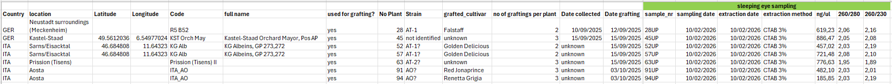
Round 2:
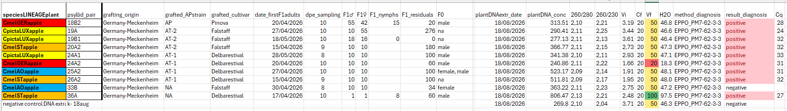

As well as from phytoplasma infected Psyllids:
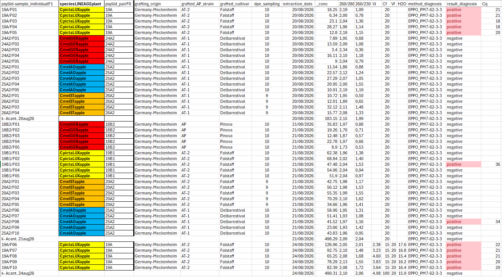

## Sample 45UP  <a name="41"></a>

Sample 45UP was selected as the first sample to test adaptive sampling sequencing approach, this sample originates from Germany, which is as yet unrepresented in our dataset, and has the highest concentration of DNA (both phytoplasma and host).


Only ~160 pores were active during the 45UP run therefore we expect few reads. - this also meant that only depletion mode adaptive sampling could be trialled

### Basecalling  <a name="5"></a>

Sequencing was run with fast basecalling for the purposes of adaptive sampling, raw .POD5 files were output which we will now use for bsaecalling with the highest accuracy settings with dorado. The barcode 03 was used even though we are only sequencing one sample in order to utilise the available rapid ligations adapter library kit.

```bash
mkdir -p /data/users/theaven/phytolasma/raw_data/minion/45UP/pod5

ln -s /data/users/theaven/phytolasma/20260327-TOMH-phyto_45up_1/45up/20260327_1037_MN41812_FBF81825_72f4b008/pod5/*.pod5 /data/users/theaven/phytolasma/raw_data/minion/45UP/pod5/.

screen -S dorado
for Dir in $(ls -d /data/users/theaven/phytolasma/raw_data/minion/45UP/pod5); do
  Task=Dorado
  InDir="$Dir"
  OutDir=$(dirname $Dir)/basecalls
  OutFmt=fastq
  Barcode=SQK-NBD114-24
  Modification_model=NA
  ExpectedOutput="$OutDir"/out.fastq

  Jobs=$(squeue -h -u theaven -n "$Task" | wc -l)
  while [ "$Jobs" -gt 0 ]; do
    sleep 600s
    printf "."
    Jobs=$(squeue -h -u theaven -n "$Task" | wc -l)
  done

  if [ ! -s "$ExpectedOutput" ]; then
    jobid=$(sbatch --job-name="$Task" --parsable ~/git_repos/Wrappers/unibz/run_dorado.sh "$InDir" "$OutDir" "$OutFmt" "$Barcode" "$Modification_model")
    printf "%s\t%s\t "$Task" \t%s\n" "$(date -Iseconds)" "$ID" "$jobid" >> /home/clusterusers/theaven/slurm_log.tsv
  else
    echo "For $ID found: $ExpectedOutput" 
  fi
done

ls -lh /data/users/theaven/phytolasma/raw_data/minion/45UP/basecalls/demuxed/20260327-TOMH-phyto_45up_1/45up/20260327_0937_0_FBF81825_72f4b008/fastq_pass/*/*.fastq
#-rw-r----- 1 theaven domain users 397M Apr  2 15:26 /data/users/theaven/phytolasma/raw_data/minion/45UP/basecalls/demuxed/20260327-TOMH-phyto_45up_1/45up/20260327_0937_0_FBF81825_72f4b008/fastq_pass/barcode03/FBF81825_pass_barcode03_72f4b008_00000000_0.fastq
#-rw-r----- 1 theaven domain users 2.6K Apr  2 15:26 /data/users/theaven/phytolasma/raw_data/minion/45UP/basecalls/demuxed/20260327-TOMH-phyto_45up_1/45up/20260327_0937_0_FBF81825_72f4b008/fastq_pass/barcode16/FBF81825_pass_barcode16_72f4b008_00000000_0.fastq
#-rw-r----- 1 theaven domain users  20K Apr  2 15:26 /data/users/theaven/phytolasma/raw_data/minion/45UP/basecalls/demuxed/20260327-TOMH-phyto_45up_1/45up/20260327_0937_0_FBF81825_72f4b008/fastq_pass/barcode17/FBF81825_pass_barcode17_72f4b008_00000000_0.fastq
#-rw-r----- 1 theaven domain users  32M Apr  2 15:26 /data/users/theaven/phytolasma/raw_data/minion/45UP/basecalls/demuxed/20260327-TOMH-phyto_45up_1/45up/20260327_0937_0_FBF81825_72f4b008/fastq_pass/unclassified/FBF81825_pass_unclassified_72f4b008_00000000_0.fastq

#As barcoding was for library prep purposes only reads were pooled:
cat /data/users/theaven/phytolasma/raw_data/minion/45UP/basecalls/demuxed/20260327-TOMH-phyto_45up_1/45up/20260327_0937_0_FBF81825_72f4b008/fastq_pass/*/*.fastq > /data/users/theaven/phytolasma/raw_data/minion/45UP/basecalls/all.fastq
```
Some reads are de-multiplexed to barcode 16 and 17 for some reason, hoever the majority are correctly 03.

There are 370,376 barcode03 total, however this will include many short reads that were rejected by adaptive sampling, investigate:
```bash
module load seqtk/1.4-gcc-12.3.0
seqtk seq -a /data/users/theaven/phytolasma/raw_data/minion/45UP/basecalls/all.fastq | awk '/^>/{split($0,a," "); print ">"a[1]; next}{print}' > /data/users/theaven/phytolasma/raw_data/minion/45UP/basecalls/all.fasta

awk '/^>>/{if(seq && length(seq)>=1000){print id"\t"length(seq)}; id=$0; seq=""} 
     !/^>>/{seq=seq$0} 
     END{if(seq && length(seq)>=1000){print id"\t"length(seq)}}' \
     /data/users/theaven/phytolasma/raw_data/minion/45UP/basecalls/all.fasta | sort -k2,2nr | wc -l #11927, at least 1,000bp long

awk '/^>>/{if(seq && length(seq)>=1000){print substr(id,3)}; id=$0; seq=""} 
     !/^>>/{seq=seq$0} 
     END{if(seq && length(seq)>=1000){print substr(id,3)}}' \
     /data/users/theaven/phytolasma/raw_data/minion/45UP/basecalls/all.fasta > /data/users/theaven/phytolasma/raw_data/minion/45UP/basecalls/long.fasta
```
11,927 reads were at least 1,000bp long

### Taxonomic classication of reads  <a name="6"></a>
#### BLAST  <a name="7"></a>

Reads were taxonomically classificed with BLAST to determine the proportion of on-target Phytoplasma mali reads
```bash
for reads in $(find /data/users/theaven/phytolasma/raw_data/minion/45UP/basecalls -name 'all.fasta' -type f); do
  Task=blast
  Database=/data/blobtoolkit/nt/nt
  Max_target=1
  OutPrefix=$(dirname $reads | rev | cut -d '/' -f1 | rev)
  OutDir="$(dirname $reads)"/"$Task"
  mkdir -p $OutDir
  ExpectedOutput="$OutDir"/${OutPrefix}.vs."$(basename $Database)".mts"$Max_target".hsp1.1e25.megablast.out

  Jobs=$(squeue -h -u theaven -n "$Task" | wc -l)
  while [ "$Jobs" -gt 9 ]; do
    sleep 5s
    printf "."
    Jobs=$(squeue -h -u theaven -n "$Task" | wc -l)
  done

  if [ ! -s "$ExpectedOutput" ]; then
    jobid=$(sbatch --job-name="$Task" --parsable ~/git_repos/Wrappers/unibz/run_blastn.sh "$reads" "$Database" "$OutDir" "$OutPrefix" "$Max_target")
    printf "%s\t%s\t "$Task" \t%s\n" "$(date -Iseconds)" "$ID" "$jobid" >> /home/clusterusers/theaven/slurm_log.tsv
  else
    echo "For $ID found: $ExpectedOutput" 
  fi
done

#Inspect BLAST  output in MEGAN6 - does not work giving 'too many errors error'
tail -n +2 /data/users/theaven/phytolasma/raw_data/minion/45UP/basecalls/blast/basecalls.vs.nt.mts1.hsp1.1e25.megablast.out > noheader.tsv
awk 'NR>1 {print $1"\t"$5"\t"$6"\t"$7"\t"$8"\t"$9"\t"$10"\t"$11"\t"$12"\t"$13"\t"$14"\t"$15"\t"$2}' noheader.tsv > /data/users/theaven/phytolasma/raw_data/minion/45UP/basecalls/blast/basecalls.vs.nt.mts1.hsp1.1e25.megablast.megan.out
sed 's/ \+/\t/g' /data/users/theaven/phytolasma/raw_data/minion/45UP/basecalls/blast/basecalls.vs.nt.mts1.hsp1.1e25.megablast.megan.out > /data/users/theaven/phytolasma/raw_data/minion/45UP/basecalls/blast/basecalls.vs.nt.mts1.hsp1.1e25.megablast.megan2.tab
sed -i 's/^>//' /data/users/theaven/phytolasma/raw_data/minion/45UP/basecalls/blast/basecalls.vs.nt.mts1.hsp1.1e25.megablast.megan2.tab

tail -n +2 /data/users/theaven/phytolasma/raw_data/minion/45UP/basecalls/blast/basecalls.vs.nt.mts10.hsp1.1e25.megablast.out > noheader.tsv
awk 'NR>1 {print $1"\t"$5"\t"$6"\t"$7"\t"$8"\t"$9"\t"$10"\t"$11"\t"$12"\t"$13"\t"$14"\t"$15"\t"$2}' noheader.tsv > /data/users/theaven/phytolasma/raw_data/minion/45UP/basecalls/blast/basecalls.vs.nt.mts10.hsp1.1e25.megablast.megan.out
sed 's/ \+/\t/g' /data/users/theaven/phytolasma/raw_data/minion/45UP/basecalls/blast/basecalls.vs.nt.mts10.hsp1.1e25.megablast.megan.out > /data/users/theaven/phytolasma/raw_data/minion/45UP/basecalls/blast/basecalls.vs.nt.mts10.hsp1.1e25.megablast.megan2.tab
sed -i 's/^>//' /data/users/theaven/phytolasma/raw_data/minion/45UP/basecalls/blast/basecalls.vs.nt.mts10.hsp1.1e25.megablast.megan2.tab
cut -f7 /data/users/theaven/phytolasma/raw_data/minion/45UP/basecalls/blast/basecalls.vs.nt.mts10.hsp1.1e25.megablast.megan.out | head

#Investigate BLAST output
awk 'NR>1 {print $2}' /data/users/theaven/phytolasma/raw_data/minion/45UP/basecalls/blast/basecalls.vs.nt.mts10.hsp1.1e25.megablast.out | sort -u
awk 'NR>1 && $2!="3750" && $2!="3749" {print $1}' /data/users/theaven/phytolasma/raw_data/minion/45UP/basecalls/blast/basecalls.vs.nt.mts10.hsp1.1e25.megablast.out | sort | uniq | wc -l #355,661 not apple
awk 'NR>1 && $2!="3750" && $2!="3749" {print $1}' /data/users/theaven/phytolasma/raw_data/minion/45UP/basecalls/blast/basecalls.vs.nt.mts1.hsp1.1e25.megablast.out | sort | uniq | wc -l #97,846 not apple
awk 'NR>1 && $2==37692 {print $1 "\t" $2}' /data/users/theaven/phytolasma/raw_data/minion/45UP/basecalls/blast/basecalls.vs.nt.mts10.hsp1.1e25.megablast.out | sort | uniq | wc -l #21 reads with Candidatus phytoplasma mali assignment
```
Whilst 97,846 reads had a best hit other than apple only 21 had a best hit to phytoplasma mali 

#### Kraken2  <a name="8"></a>

Reads were taxonomically classificed with kraken2 to determine the proportion of on-target Phytoplasma mali reads
```bash
screen -S kraken2
srun -p bioagri -J kraken2 --nodes=1 --ntasks=1 --cpus-per-task=64 --mem 320G --pty bash
module load anaconda3
conda activate kraken2

OutDir=/data/users/theaven/phytolasma/raw_data/minion/45UP/kraken2
mkdir "$OutDir"
kraken2 \
--threads 64 \
--db /data/databases/kraken2/2025-02-04/k2_core_nt_20250609 \
--output "$OutDir"/output_nt.txt \
--unclassified-out "$OutDir"/unclassified_nt.txt \
--classified-out "$OutDir"/classified_nt.txt \
--report "$OutDir"/report_nt.txt \
--use-names \
/data/users/theaven/phytolasma/raw_data/minion/45UP/basecalls/all.fasta
#   365326 sequences classified (98.64%)
#   5050 sequences unclassified (1.36%)

conda deactivate
exit
exit
echo finished

wc -l /data/users/theaven/phytolasma/raw_data/minion/45UP/kraken2/output_nt.txt #370376
sort -t$'\t' -k4,4nr /data/users/theaven/phytolasma/raw_data/minion/45UP/kraken2/output_nt.txt > /data/users/theaven/phytolasma/raw_data/minion/45UP/kraken2/output_nt_by_length.txt #long reads are Malus, longest phytoplasma read is 5,283, and there are only ~23 of them
```
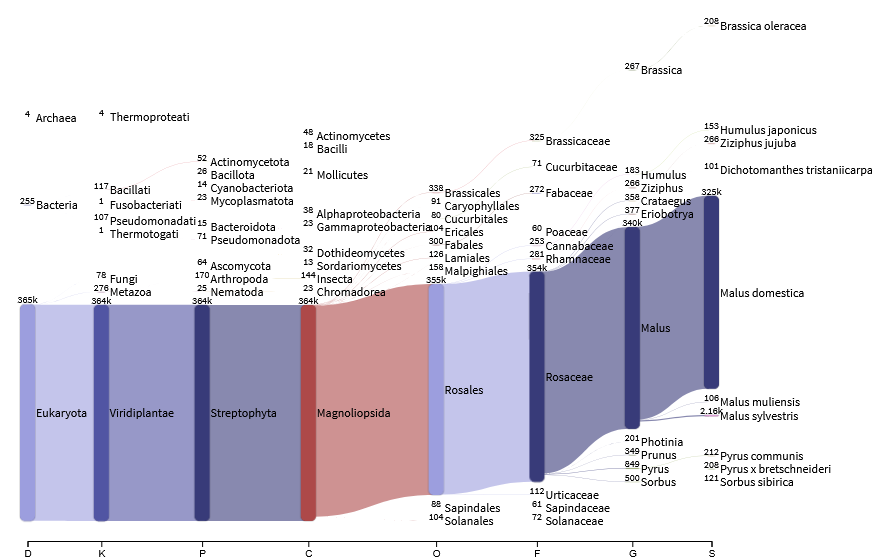

Most of the long reads are classified to Malus, and the longest phytoplasma read is only 5,283bp, in line with the BLAST results, only ~23 reads are classified to phytoplasma (Mollicutes).

## Sample 19A  <a name="42"></a>

Sample 19A was selected for the second attempt at adaptive sampling sequencing. This is the only accesion/strain for which we have both the plant and psyllid samples. The plant sample also has the lowest threshold cycle for dection in qPCR - performed in Luxumbourg - and is therefore beleived to have high Phytoplasma DNA concentration. 10ul of the DNA extraction were used for the library prep and subsequent sequencing. The Ligation sequencing DNA V14 (SQK-LSK114) protocol from ONT was followed.

### Basecalling  <a name="43"></a>

Sequencing was run with fast basecalling for the purposes of adaptive sampling, raw .POD5 files were output which we will now use for bsaecalling with the highest accuracy settings with dorado. The barcode 03 was used even though we are only sequencing one sample in order to utilise the available rapid ligations adapter library kit.

The library was run first in depletion mode including a .BED file, then secondly in enrichment mode including a .BED file, then in enrichment mode with .FASTA reference only, then in depletion mode with .FASTA only. Shortly after starting sequencing with the final settings (depletion mode with .FASTA only) the run was paused and the library recovered from the flow cell which was then washed, following which the library was reloaded and the sequencing run restarted.

```bash
mkdir -p /data/users/theaven/phytolasma/raw_data/minion/19A/pod5/1 #(depletion with .BED)
mkdir -p /data/users/theaven/phytolasma/raw_data/minion/19A/pod5/2 #(enrichment with .BED)
mkdir -p /data/users/theaven/phytolasma/raw_data/minion/19A/pod5/3 #(enrichment w/o .BED, .FASTA only)
mkdir -p /data/users/theaven/phytolasma/raw_data/minion/19A/pod5/4 #(depletion w/o .BED, .FASTA only)
mkdir -p /data/users/theaven/phytolasma/raw_data/minion/19A/pod5/all

ln -s /data/users/theaven/phytolasma/raw_data/minion/19A/20260902-TOMH-CaPMali-19a-1/19a/*/pod5/*.pod5 /data/users/theaven/phytolasma/raw_data/minion/19A/pod5/1/.
ln -s /data/users/theaven/phytolasma/raw_data/minion/19A/20260902-TOMH-CaPMali-19a-2/19a/*/pod5/*.pod5 /data/users/theaven/phytolasma/raw_data/minion/19A/pod5/2/.
ln -s /data/users/theaven/phytolasma/raw_data/minion/19A/20260902-TOMH-CaPMali-19a-3/19a/*/pod5/*.pod5 /data/users/theaven/phytolasma/raw_data/minion/19A/pod5/3/.
ln -s /data/users/theaven/phytolasma/raw_data/minion/19A/20260902-TOMH-CaPMali-19a-4/19a/*/pod5/*.pod5 /data/users/theaven/phytolasma/raw_data/minion/19A/pod5/4/.
ln -s /data/users/theaven/phytolasma/raw_data/minion/19A/20260902-TOMH-CaPMali-19a-1/19a/*/pod5/*.pod5 /data/users/theaven/phytolasma/raw_data/minion/19A/pod5/all/.
ln -s /data/users/theaven/phytolasma/raw_data/minion/19A/20260902-TOMH-CaPMali-19a-2/19a/*/pod5/*.pod5 /data/users/theaven/phytolasma/raw_data/minion/19A/pod5/all/.
ln -s /data/users/theaven/phytolasma/raw_data/minion/19A/20260902-TOMH-CaPMali-19a-3/19a/*/pod5/*.pod5 /data/users/theaven/phytolasma/raw_data/minion/19A/pod5/all/.
ln -s /data/users/theaven/phytolasma/raw_data/minion/19A/20260902-TOMH-CaPMali-19a-4/19a/*/pod5/*.pod5 /data/users/theaven/phytolasma/raw_data/minion/19A/pod5/all/.

screen -S dorado
for Dir in $(ls -d /data/users/theaven/phytolasma/raw_data/minion/19A/pod5/*); do
  Task=Dorado
  InDir="$Dir"
  OutDir=$Dir/basecalls
  OutFmt=fastq
  Barcode=NA
  Modification_model=NA
  ExpectedOutput="$OutDir"/out.fastq

  Jobs=$(squeue -h -u theaven -n "$Task" | wc -l)
  while [ "$Jobs" -gt 1 ]; do
    sleep 600s
    printf "."
    Jobs=$(squeue -h -u theaven -n "$Task" | wc -l)
  done

  if [ ! -s "$ExpectedOutput" ]; then
    jobid=$(sbatch --job-name="$Task" --parsable ~/git_repos/Wrappers/unibz/run_dorado.sh "$InDir" "$OutDir" "$OutFmt" "$Barcode" "$Modification_model")
    printf "%s\t%s\t "$Task" \t%s\n" "$(date -Iseconds)" "$ID" "$jobid" >> /home/clusterusers/theaven/slurm_log.tsv
  else
    echo "For $ID found: $ExpectedOutput" 
  fi
done

#Save space:
rm -r /data/users/theaven/phytolasma/raw_data/minion/19A/20260902-TOMH-CaPMali-19a-1
rm -r /data/users/theaven/phytolasma/raw_data/minion/19A/20260902-TOMH-CaPMali-19a-2
rm -r /data/users/theaven/phytolasma/raw_data/minion/19A/20260902-TOMH-CaPMali-19a-3
rm -r /data/users/theaven/phytolasma/raw_data/minion/19A/20260902-TOMH-CaPMali-19a-4
```
```bash
module load seqtk/1.4-gcc-12.3.0
conda activate seqkit

for file in /data/users/theaven/phytolasma/raw_data/minion/19A/pod5/*/basecalls/SAMPLE.pass.fq.gz; do
seqtk seq -a "$file" | awk '/^>/{split($0,a," "); print ">"a[1]; next}{print}' > "${file%.fq.gz}.fasta"

seqkit seq -m 1000 "${file%.fq.gz}.fasta" > "${file%.fq.gz}_long.fasta"

seqkit seq -m 500 "${file%.fq.gz}.fasta" > "${file%.fq.gz}_med.fasta"

echo "${file%.fq.gz}_long.fasta"
grep '>' "${file%.fq.gz}_long.fasta" | wc -l
done
```
depletion with .BED = 1,335,032 reads >1,000bp<br>
enrichment with .BED = 414 reads >1,000bp<br>
enrichment w/o .BED, .FASTA only = 18,572 reads >1,000bp<br>
depletion w/o .BED, .FASTA only = 92,847  reads >1,000bp<br>

Depletion mode produces many reads >1,000bp, however these are clustered around 3.5kb in length. The DNA Control Sample (DCS) is a 3.6 kb standard amplicon mapping the 3' end of the Lambda genome. It therefore appears that library prep and sequencing has worked but that the sample only contains the DCS.

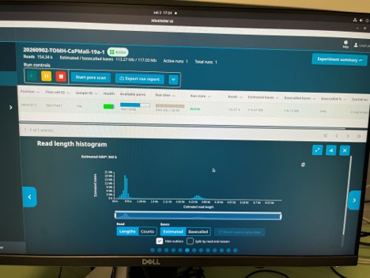

### Taxonomic classication of reads  <a name="44"></a>
#### BWA-mem  <a name="49"></a>

```bash
module load anaconda3
conda activate minimap2
module load samtools/1.16.1

cat /data/users/theaven/phytolasma/raw_data/minion/19A/pod5/*/basecalls/SAMPLE.pass.fq.gz > /data/users/theaven/phytolasma/raw_data/minion/19A/all_SAMPLE.pass.fq.gz
minimap2 -t 8 -ax map-ont \
    /data/users/theaven/phytolasma/GCF_000026205.1_Phytoplasma_mali.fasta \
    /data/users/theaven/phytolasma/raw_data/minion/19A/all_SAMPLE.pass.fq.gz \
    | samtools sort -@ 4 -o /data/users/theaven/phytolasma/raw_data/minion/19A/aln.bam
samtools index /data/users/theaven/phytolasma/raw_data/minion/19A/aln.bam
samtools view -c -F 4 /data/users/theaven/phytolasma/raw_data/minion/19A/aln.bam
#175,206
```
#### BLAST  <a name="45"></a>

Reads were taxonomically classificed with BLAST to determine the proportion of on-target Phytoplasma mali reads
```bash
for reads in $(find /data/users/theaven/phytolasma/raw_data/minion/19A/pod5/*/basecalls -name 'SAMPLE.pass.fasta' -type f); do
  Task=blast
  Database=/data/blobtoolkit/nt/nt
  Max_target=1
  OutPrefix=$(dirname $reads | rev | cut -d '/' -f1 | rev)
  OutDir="$(dirname $reads)"/"$Task"
  mkdir -p $OutDir
  ExpectedOutput="$OutDir"/${OutPrefix}.vs."$(basename $Database)".mts"$Max_target".hsp1.1e25.megablast.out

  Jobs=$(squeue -h -u theaven -n "$Task" | wc -l)
  while [ "$Jobs" -gt 9 ]; do
    sleep 5s
    printf "."
    Jobs=$(squeue -h -u theaven -n "$Task" | wc -l)
  done

  if [ ! -s "$ExpectedOutput" ]; then
    jobid=$(sbatch --job-name="$Task" --parsable ~/git_repos/Wrappers/unibz/run_blastn.sh "$reads" "$Database" "$OutDir" "$OutPrefix" "$Max_target")
    printf "%s\t%s\t "$Task" \t%s\n" "$(date -Iseconds)" "$ID" "$jobid" >> /home/clusterusers/theaven/slurm_log.tsv
  else
    echo "For $ID found: $ExpectedOutput" 
  fi
done

```
Too many reads, BLAST runs forever

#### Kraken2  <a name="46"></a>

Reads were taxonomically classificed with kraken2 to determine the proportion of on-target Phytoplasma mali reads
```bash
screen -S kraken2
srun -p bioagri -J kraken2 --nodes=1 --ntasks=1 --cpus-per-task=64 --mem 320G --pty bash
module load anaconda3
conda activate kraken2

for reads in $(find /data/users/theaven/phytolasma/raw_data/minion/19A/pod5/*/basecalls -name 'SAMPLE.pass_long.fasta' -type f); do 
Task=Kraken2
OutDir="$(dirname $reads)"/"$Task"/long
mkdir -p "$OutDir"
kraken2 \
--threads 64 \
--db /data/databases/kraken2/2025-02-04/k2_core_nt_20250609 \
--output "$OutDir"/output_nt.txt \
--unclassified-out "$OutDir"/unclassified_nt.txt \
--classified-out "$OutDir"/classified_nt.txt \
--report "$OutDir"/report_nt.txt \
--use-names \
"$reads"
done

#depletion with .BED =   1,320,163 sequences classified (98.89%), 14,869 sequences unclassified (1.11%)

#enrichment with .BED =   413 sequences classified (99.76%), 1 sequences unclassified (0.24%)

#enrichment w/o .BED, .FASTA only =   18,524 sequences classified (99.74%), 48 sequences unclassified (0.26%)

#depletion w/o .BED, .FASTA only =   91,954 sequences classified (99.04%), 893 sequences unclassified (0.96%)

for reads in $(find /data/users/theaven/phytolasma/raw_data/minion/19A/pod5/*/basecalls -name 'SAMPLE.pass_med.fasta' -type f); do 
Task=Kraken2
OutDir="$(dirname $reads)"/"$Task"/med
mkdir -p "$OutDir"
kraken2 \
--threads 64 \
--db /data/databases/kraken2/2025-02-04/k2_core_nt_20250609 \
--output "$OutDir"/output_nt.txt \
--unclassified-out "$OutDir"/unclassified_nt.txt \
--classified-out "$OutDir"/classified_nt.txt \
--report "$OutDir"/report_nt.txt \
--use-names \
"$reads"
done

#depletion with .BED =   2,682,533 sequences classified (95.33%), 131,527 sequences unclassified (4.67%)

#enrichment with .BED =   75,321 sequences classified (95.13%), 3,857 sequences unclassified (4.87%)

#enrichment w/o .BED, .FASTA only =   675,324 sequences classified (95.20%), 34,036 sequences unclassified (4.80%)

#depletion w/o .BED, .FASTA only =   219,749 sequences classified (95.94%), 9,305 sequences unclassified (4.06%)

for reads in $(find /data/users/theaven/phytolasma/raw_data/minion/19A/pod5/*/basecalls -name 'SAMPLE.pass.fasta' -type f); do 
Task=Kraken2
OutDir="$(dirname $reads)"/"$Task"/all
mkdir -p "$OutDir"
kraken2 \
--threads 64 \
--db /data/databases/kraken2/2025-02-04/k2_core_nt_20250609 \
--output "$OutDir"/output_nt.txt \
--unclassified-out "$OutDir"/unclassified_nt.txt \
--classified-out "$OutDir"/classified_nt.txt \
--report "$OutDir"/report_nt.txt \
--use-names \
"$reads"
done

#depletion with .BED = 9,595,841 sequences classified (94.05%), 607,087 sequences unclassified (5.95%)

#enrichment with .BED = 498,846 sequences classified (90.92%), 49,808 sequences unclassified (9.08%)

#enrichment w/o .BED, .FASTA only =  6,099,246 sequences classified (90.71%), 624,759 sequences unclassified (9.29%)

#depletion w/o .BED, .FASTA only = 1,029,593 sequences classified (87.59%), 145,878 sequences unclassified (12.41%)


sort -t$'\t' -k4,4nr /data/users/theaven/phytolasma/raw_data/minion/19A/pod5/1/basecalls/Kraken2/long/output_nt.txt > /data/users/theaven/phytolasma/raw_data/minion/19A/pod5/1/basecalls/Kraken2/long/output_nt_by_length.txt 
sort -t$'\t' -k4,4nr /data/users/theaven/phytolasma/raw_data/minion/19A/pod5/2/basecalls/Kraken2/long/output_nt.txt > /data/users/theaven/phytolasma/raw_data/minion/19A/pod5/2/basecalls/Kraken2/long/output_nt_by_length.txt 
sort -t$'\t' -k4,4nr /data/users/theaven/phytolasma/raw_data/minion/19A/pod5/3/basecalls/Kraken2/long/output_nt.txt > /data/users/theaven/phytolasma/raw_data/minion/19A/pod5/3/basecalls/Kraken2/long/output_nt_by_length.txt 
sort -t$'\t' -k4,4nr /data/users/theaven/phytolasma/raw_data/minion/19A/pod5/4/basecalls/Kraken2/long/output_nt.txt > /data/users/theaven/phytolasma/raw_data/minion/19A/pod5/4/basecalls/Kraken2/long/output_nt_by_length.txt 

wc -l /data/users/theaven/phytolasma/raw_data/minion/19A/pod5/*/basecalls/Kraken2/long/output_nt.txt #1,446,865
sort -t$'\t' -k4,4nr /data/users/theaven/phytolasma/raw_data/minion/19A/pod5/*/basecalls/Kraken2/long/output_nt.txt >> /data/users/theaven/phytolasma/raw_data/minion/19A/pod5/1/basecalls/Kraken2/output_nt_by_length.txt 
```
Looking at the longer reads, >1,000bp in length, accounting for the number of active pores, similar numbers of phytoplasma reads are produced when enrichment settings are used and when depletion mode is used. In both enrichment and depletion mode some apple reads are retained. There are also psyllid reads retained in the sample. 

Depletion mode with .BED file, reads >1,000bp:
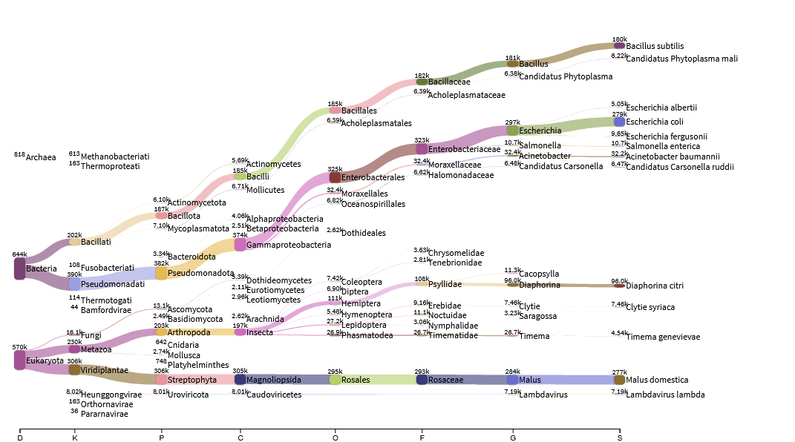

In depletion mode Phytoplasma drops out of the top ten species classified, despite only apple and phytoplasma genomes being included in the reference files.

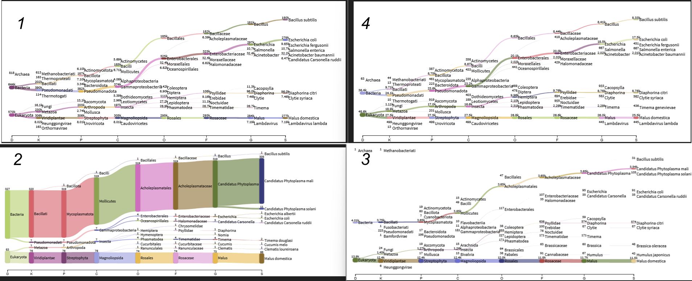

Looking at all reads, including those shorter than 1,000bp that were rejected during adaptive sequencing, there are phytoplasma reads lost with all settings. Phytoplasma reads are a fraction of the number of apple reads (there are ~ 300x apple reads vs phytoplasma reads), there are also fewer phytoplasma reads than reads for other bacterial taxa. 

For depletion mode with a .BED only 4.14% of apple reads were retained, and 27.05% of phytoplasma reads were retained and >1,000bp. For depetion mode with no .BED only 3.5% of apple reads were retained, but only 12% of phytoplasma reads were retained and >1,000bp.

For enrichment mode with a .BED file only 0.02% of apple reads were retained. 25.6% of phytoplasma reads were >1,000bp and retained. Without a .BED file in enrichment mode 0.27% of apple reads were retained and 23.3% of phytoplasma reads were >1,000bp and retained.

Depletion mode with .BED file, all reads:
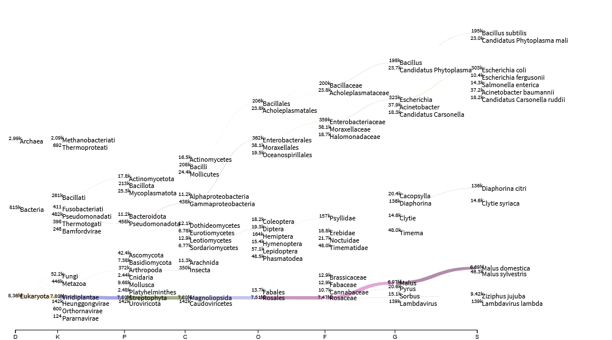

Enrichment or depletion mode with a .BED file therefore appears to perform the best; however even with these setting ~75% of reads classified as phytoplasma by Kraken2 are rejected from sequencing (~1/3 of 'rejected' reads are 500-1,000 bp). 

We checked for similarity between phytoplasma and apple, I do not understand how this pattern is occurring.

```bash
grep 'Candidatus Phytoplasma mali' /data/users/theaven/phytolasma/raw_data/minion/19A/pod5/1/basecalls/Kraken2/long/output_nt.txt > /data/users/theaven/phytolasma/raw_data/minion/19A/pod5/1/basecalls/Kraken2/long/phyto_output_nt.txt #6,222

grep 'Candidatus Phytoplasma mali' /data/users/theaven/phytolasma/raw_data/minion/19A/pod5/2/basecalls/Kraken2/long/output_nt.txt > /data/users/theaven/phytolasma/raw_data/minion/19A/pod5/2/basecalls/Kraken2/long/phyto_output_nt.txt #308

grep 'Candidatus Phytoplasma mali' /data/users/theaven/phytolasma/raw_data/minion/19A/pod5/3/basecalls/Kraken2/long/output_nt.txt > /data/users/theaven/phytolasma/raw_data/minion/19A/pod5/3/basecalls/Kraken2/long/phyto_output_nt.txt #3,539

grep 'Candidatus Phytoplasma mali' /data/users/theaven/phytolasma/raw_data/minion/19A/pod5/4/basecalls/Kraken2/long/output_nt.txt > /data/users/theaven/phytolasma/raw_data/minion/19A/pod5/4/basecalls/Kraken2/long/phyto_output_nt.txt #395

cat /data/users/theaven/phytolasma/raw_data/minion/19A/pod5/*/basecalls/Kraken2/long/phyto_output_nt.txt > /data/users/theaven/phytolasma/raw_data/minion/19A/long_phyto_output_nt.txt

awk -F'\t' '{sum += $4; n++} END {print sum/n}' /data/users/theaven/phytolasma/raw_data/minion/19A/long_phyto_output_nt.txt #4,296

awk -F'\t' 'NR==1 {max=$4} $4>max {max=$4} END {print max}' /data/users/theaven/phytolasma/raw_data/minion/19A/long_phyto_output_nt.txt #63,998

awk -F'\t' '{sum += $4; n++} END {print sum/n}' /data/users/theaven/phytolasma/raw_data/minion/19A/pod5/1/basecalls/Kraken2/long/output_nt.txt #4,262
awk -F'\t' '{sum += $4; n++} END {print sum/n}' /data/users/theaven/phytolasma/raw_data/minion/19A/pod5/2/basecalls/Kraken2/long/output_nt.txt #4,443
awk -F'\t' '{sum += $4; n++} END {print sum/n}' /data/users/theaven/phytolasma/raw_data/minion/19A/pod5/3/basecalls/Kraken2/long/output_nt.txt #4,111
awk -F'\t' '{sum += $4; n++} END {print sum/n}' /data/users/theaven/phytolasma/raw_data/minion/19A/pod5/4/basecalls/Kraken2/long/output_nt.txt #5,784

awk -F'\t' 'NR==1 {max=$4} $4>max {max=$4} END {print max}' /data/users/theaven/phytolasma/raw_data/minion/19A/pod5/1/basecalls/Kraken2/long/output_nt.txt #107,137
awk -F'\t' 'NR==1 {max=$4} $4>max {max=$4} END {print max}' /data/users/theaven/phytolasma/raw_data/minion/19A/pod5/2/basecalls/Kraken2/long/output_nt.txt #41,069
awk -F'\t' 'NR==1 {max=$4} $4>max {max=$4} END {print max}' /data/users/theaven/phytolasma/raw_data/minion/19A/pod5/3/basecalls/Kraken2/long/output_nt.txt #46,456
awk -F'\t' 'NR==1 {max=$4} $4>max {max=$4} END {print max}' /data/users/theaven/phytolasma/raw_data/minion/19A/pod5/4/basecalls/Kraken2/long/output_nt.txt #151,832

grep 'Diaphorina citri\|Clytie syriaca' /data/users/theaven/phytolasma/raw_data/minion/19A/pod5/*/basecalls/Kraken2/long/output_nt.txt > /data/users/theaven/phytolasma/raw_data/minion/19A/psyllid_output_nt.txt

cat /data/users/theaven/phytolasma/raw_data/minion/19A/pod5/*/basecalls/Kraken2/long/output_nt.txt > /data/users/theaven/phytolasma/raw_data/minion/19A/long_output_nt.txt
sort -t$'\t' -k4,4nr /data/users/theaven/phytolasma/raw_data/minion/19A/long_output_nt.txt > /data/users/theaven/phytolasma/raw_data/minion/19A/long_output_nt_sorted.txt

cat /data/users/theaven/phytolasma/raw_data/minion/19A/pod5/*/basecalls/Kraken2/all/output_nt.txt > /data/users/theaven/phytolasma/raw_data/minion/19A/all_output_nt.txt

apptainer exec --bind /data:/data --bind /home/clusterusers/theaven:/home/clusterusers/theaven ~/git_repos/Containers/python3.sif python
```
There are 10,464 phytoplasma reads >1,000bp in total, average length 4,296, with the longest 63,998bp.

```python
import pandas as pd
import matplotlib.pyplot as plt

# Input file
file = "/data/users/theaven/phytolasma/raw_data/minion/19A/all_output_nt.txt"
#file = "/data/users/theaven/phytolasma/raw_data/minion/19A/pod5/1/basecalls/Kraken2/all/output_nt.txt"
#file = "/data/users/theaven/phytolasma/raw_data/minion/19A/pod5/2/basecalls/Kraken2/all/output_nt.txt"
#file = "/data/users/theaven/phytolasma/raw_data/minion/19A/pod5/3/basecalls/Kraken2/all/output_nt.txt"
#file = "/data/users/theaven/phytolasma/raw_data/minion/19A/pod5/4/basecalls/Kraken2/all/output_nt.txt"

# Read TSV; no header assumed
df = pd.read_csv(file, sep="\t", header=None)

# Filter for Candidatus Phytoplasma mali
target = "Candidatus Phytoplasma mali (taxid 37692)"
#target = "Malus domestica (taxid 3750)"
values = pd.to_numeric(
    df.loc[df[2] == target, 3],
    errors="coerce"
).dropna()

# Define bins: 0-1000 in steps of 10, then 10000-50000 in steps of 1000
bins = list(range(0, 1001, 10)) + list(range(10000, 50001, 1000))

# Count values in each bin
counts, edges = pd.cut(
    values,
    bins=bins,
    right=False,
    include_lowest=True
).value_counts().sort_index().values, pd.cut(
    values,
    bins=bins,
    right=False,
    include_lowest=True
).value_counts().sort_index().index

# Plot
plt.figure(figsize=(16, 6))
plt.bar(range(len(counts)), counts, width=1)

plt.xticks(
    range(len(counts)),
    [str(int(interval.left)) for interval in edges],
    rotation=90
)

plt.xlabel("Column 4 value")
plt.ylabel("Number of reads")
plt.title("Candidatus Phytoplasma mali (taxid 37692)")
#plt.title("Malus domestica (taxid 3750)")
plt.tight_layout()

plt.savefig("phytoplasma_mali_distribution_all.png", dpi=300, bbox_inches="tight")
#plt.savefig("Malus_domestica_distribution_all.png", dpi=300, bbox_inches="tight")
#plt.savefig("phytoplasma_mali_distribution1.png", dpi=300, bbox_inches="tight")
#plt.savefig("phytoplasma_mali_distribution2.png", dpi=300, bbox_inches="tight")
#plt.savefig("phytoplasma_mali_distribution3.png", dpi=300, bbox_inches="tight")
#plt.savefig("phytoplasma_mali_distribution4.png", dpi=300, bbox_inches="tight")
```

Looking at the distribution of read lengths for phytoplasma and apple - which we know is being removed by adaptive sampling - the peak in read length for apple is aorund 400bp, as expected. The peak read length for phytoplasma is shorter than this, it is therefore possible that phytoplasma DNA is just very fragmented and short.

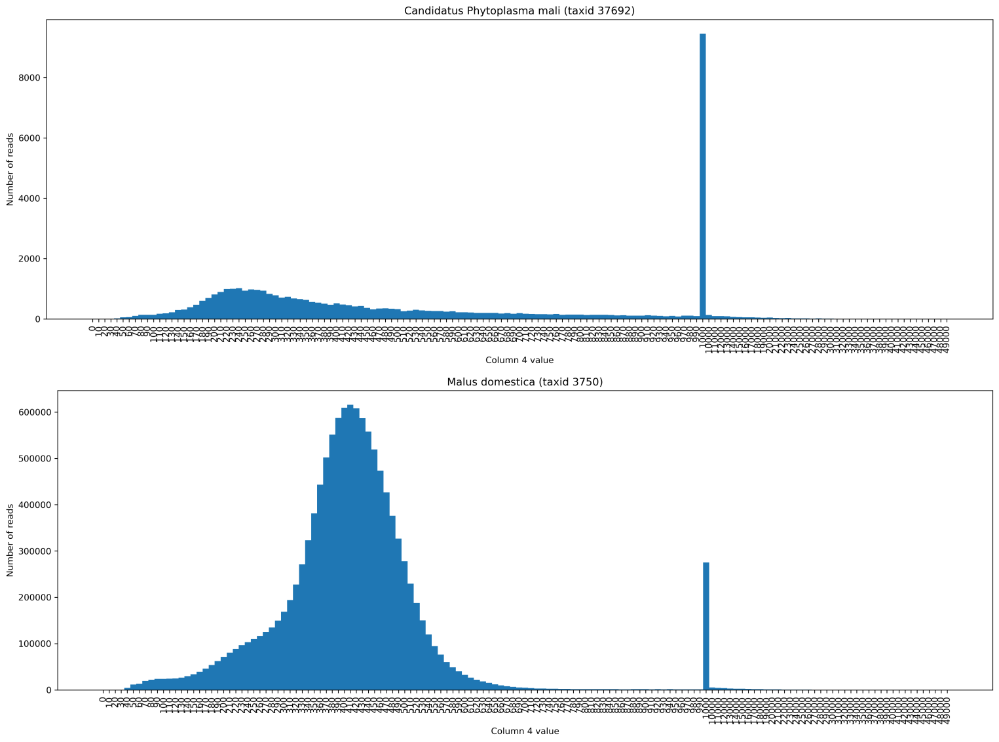

Cross check kraken assigned phytoplasma reads to adaptive sampling decisions.
```bash
grep -h 'Candidatus Phytoplasma mali' /data/users/theaven/phytolasma/raw_data/minion/19A/pod5/*/basecalls/Kraken2/all/output_nt.txt > /data/users/theaven/phytolasma/raw_data/minion/19A/kraken_phyto_output_nt.txt #42,679

for file in /data/users/theaven/phytolasma/raw_data/minion/19A/20260902-TOMH-CaPMali-19a-*/19a/*/adaptive_sampling/AS_decisions_*.csv; do
~/git_repos/Scripts/unibz/count_adaptive_decisions.sh \
    /data/users/theaven/phytolasma/raw_data/minion/19A/kraken_phyto_output_nt.txt \
    "$file"
done

#Depletion with .BED:
#unblock: 17
#sequence: 16898

#Enrichment with .BED:
#unblock: 18
#sequence: 885

#Enrichment w/o .BED:
#unblock: 207
#sequence: 11046

#Depletion w/o .BED:
#unblock: 30
#sequence: 1560
```

Cross check confirms that adaptive sampling is not ejecting phytoplasma sequences. Phytoplasma reads are few and are typically short, but this is the same across all adaptive sampling settings, minknow truncates to plot in enrichment as there is no DCS peak.

### Genome assembly <a name="47"></a>

With a genome length of ~600kbp, and ~10k reads longer than 1,000bp, average length ~4kbp in theory we could have ~70x coverage of the phytoplasma genome, depsite the low proportion of phytoplasma reads in the sequencing data. Genome assembly will be attempted.

#### EPI2ME - wf-bacterial-genomes <a name="48"></a>

***All reads***

```bash
srun -p bioagri -J epi2me --nodes=1 --ntasks=1 --cpus-per-task=16 --mem 64G --pty bash
module load nextflow/23.10.1-gcc-12.1.0
module load apptainer/1.4.1-gcc-13.3.0-3coysxn

mkdir -p /data/users/theaven/singularity/cache 
mkdir -p /data/users/theaven/singularity/tmp
mkdir -p /data/users/theaven/singularity/APPTAINERENV_TMPDIR
mkdir -p /data/users/theaven/singularity/APPTAINERENV_NXF_TASK_WORKDIR
mkdir -p /data/users/theaven/singularity/APPTAINERENV_NXF_DEBUG
mkdir -p /data/users/theaven/singularity/tmp
export TMPDIR=/data/users/theaven/singularity/tmp
export TMP=/data/users/theaven/singularity/tmp
export TEMP=/data/users/theaven/singularity/tmp
export SINGULARITY_CACHEDIR=/data/users/theaven/singularity/cache 
export SINGULARITY_TMPDIR=/data/users/theaven/singularity/tmp
export APPTAINERENV_TMPDIR=/data/users/theaven/singularity/tmp
export APPTAINERENV_TMP=/data/users/theaven/singularity/tmp
export APPTAINERENV_TEMP=/data/users/theaven/singularity/tmp
export APPTAINER_CACHEDIR=/data/users/theaven/singularity/cache
export APPTAINER_TMPDIR=/data/users/theaven/singularity/tmp
export APPTAINERENV_NXF_TASK_WORKDIR=/data/users/theaven/singularity/APPTAINERENV_NXF_TASK_WORKDIR
export APPTAINERENV_NXF_DEBUG=/data/users/theaven/singularity/APPTAINERENV_NXF_DEBUG

nano /data/users/theaven/phytolasma/nextflow_tmp.config
#singularity {
#    enabled = true
#    autoMounts = true
#    cacheDir = '/data/users/theaven/singularity/cache'

#    runOptions = '--bind /data/users/theaven/singularity/tmp:/data/users/theaven/singularity/tmp'
#}

mkdir -p /data/users/theaven/singularity/tmp

nextflow run epi2me-labs/wf-bacterial-genomes \
  -c /data/users/theaven/phytolasma/nextflow_tmp2.config \
  --fastq '/data/users/theaven/phytolasma/raw_data/minion/19A/pod5/all/basecalls/SAMPLE.pass.fq.gz' \
  --sample 19A \
  --min_read_length 0 \
  --max_coverage_plots 20 \
  --override_basecaller_cfg 'dna_r10.4.1_e8.2_400bps_sup@v5.2.0' \
  --out_dir /data/users/theaven/phytolasma/raw_data/minion/19A/assembly/EPI2ME/all-noref \
  --threads 4 \
  -profile singularity -resume

sbatch --job-name=epi2me --parsable /data/users/theaven/phytolasma/temp.sh
#247839

nextflow run epi2me-labs/wf-bacterial-genomes \
  -c /data/users/theaven/phytolasma/nextflow_tmp.config \
  --fastq '/data/users/theaven/phytolasma/raw_data/minion/19A/pod5/all/basecalls/SAMPLE.pass.fq.gz' \
  --sample 19A \
  --min_read_length 0 \
  --max_coverage_plots 20 \
  --reference_based_assembly --reference /data/users/theaven/phytolasma/GCF_000026205.1_Phytoplasma_mali.fasta \
  --out_dir /data/users/theaven/phytolasma/raw_data/minion/19A/assembly/EPI2ME/all-ref \
  --threads 16 \
  -profile singularity

nextflow run epi2me-labs/wf-bacterial-genomes \
  -c /data/users/theaven/phytolasma/nextflow_tmp2.config \
  --fastq '/data/users/theaven/phytolasma/raw_data/minion/19A/pod5/all/basecalls/SAMPLE.pass.fq.gz' \
  --sample 19A \
  --min_read_length 700 \
  --max_coverage_plots 20 \
  --override_basecaller_cfg 'dna_r10.4.1_e8.2_400bps_sup@v5.2.0' \
  --out_dir /data/users/theaven/phytolasma/raw_data/minion/19A/assembly/EPI2ME/all-noref-700 \
  --threads 4 \
  -profile singularity -resume

#fastcat requires a minimum of 4 cpus, medaka crashes with OMP errors if it is allowed to run with more than 2, /data/users/theaven/phytolasma/nextflow_tmp2.config sets medaka to run with 2, medaka is the majority of the runtime.
#process {
#    withName: 'calling_pipeline:medakaInference_consensus' {
#        maxForks = 1
#        cpus = 2
#    }
#}

sbatch --job-name=epi2me --parsable /data/users/theaven/phytolasma/temp.sh
#245708

nextflow run epi2me-labs/wf-bacterial-genomes \
  -c /data/users/theaven/phytolasma/nextflow_tmp.config \
  --fastq '/data/users/theaven/phytolasma/raw_data/minion/19A/pod5/all/basecalls/SAMPLE.pass.fq.gz' \
  --sample 19A \
  --min_read_length 700 \
  --max_coverage_plots 20 \
  --reference_based_assembly --reference /data/users/theaven/phytolasma/GCF_000026205.1_Phytoplasma_mali.fasta \
  --out_dir /data/users/theaven/phytolasma/raw_data/minion/19A/assembly/EPI2ME/all-ref-700 \
  --threads 16 \
  -profile singularity
```

***Non Apple reads***

```bash
module load anaconda3
conda activate seqkit

awk -F'\t' '$3 == "Malus domestica (taxid 3750)" {
    id=$2
    sub(/^>/, "", id)
    print id
}' /data/users/theaven/phytolasma/raw_data/minion/19A/all_output_nt.txt \
> /data/users/theaven/phytolasma/raw_data/minion/19A/malus_read_ids.txt

seqkit grep -v -f /data/users/theaven/phytolasma/raw_data/minion/19A/malus_read_ids.txt \
    /data/users/theaven/phytolasma/raw_data/minion/19A/pod5/all/basecalls/SAMPLE.pass.fq.gz \
    -o /data/users/theaven/phytolasma/raw_data/minion/19A/non_malus.fq.gz

seqkit stats \
/data/users/theaven/phytolasma/raw_data/minion/19A/non_malus.fq.gz \
/data/users/theaven/phytolasma/raw_data/minion/19A/pod5/all/basecalls/SAMPLE.pass.fq.gz
```

```bash
module load openjdk/17.0.11_9-none-none-2c62zhf
~/nextflow run epi2me-labs/wf-bacterial-genomes \
  -c /data/users/theaven/phytolasma/nextflow_tmp.config \
  --fastq '/data/users/theaven/phytolasma/raw_data/minion/19A/non_malus.fq.gz' \
  --sample 19A \
  --min_read_length 0 \
  --max_coverage_plots 20 \
  --override_basecaller_cfg 'dna_r10.4.1_e8.2_400bps_sup@v5.2.0' \
  --out_dir /data/users/theaven/phytolasma/raw_data/minion/19A/assembly/EPI2ME/nonapple-noref2 \
  --threads 2 \
  -profile singularity \
  -resume

sbatch --job-name=epi2me --parsable /data/users/theaven/phytolasma/temp.sh
#243669, 243671

nextflow run epi2me-labs/wf-bacterial-genomes \
  -c /data/users/theaven/phytolasma/nextflow_tmp.config \
  --fastq '/data/users/theaven/phytolasma/raw_data/minion/19A/non_malus.fq.gz' \
  --sample 19A \
  --min_read_length 0 \
  --max_coverage_plots 20 \
  --reference_based_assembly --reference /data/users/theaven/phytolasma/GCF_000026205.1_Phytoplasma_mali.fasta \
  --out_dir /data/users/theaven/phytolasma/raw_data/minion/19A/assembly/EPI2ME/nonapple-ref \
  --threads 16 \
  -profile singularity

nextflow run epi2me-labs/wf-bacterial-genomes \
  -c /data/users/theaven/phytolasma/nextflow_tmp2.config \
  --fastq '/data/users/theaven/phytolasma/raw_data/minion/19A/non_malus.fq.gz' \
  --sample 19A \
  --min_read_length 700 \
  --max_coverage_plots 20 \
  --out_dir /data/users/theaven/phytolasma/raw_data/minion/19A/assembly/EPI2ME/nonapple-noref-700 \
  --threads 2 \
  -profile singularity

sbatch --job-name=epi2me --parsable /data/users/theaven/phytolasma/temp.sh
#243742, 243780

nextflow run epi2me-labs/wf-bacterial-genomes \
  -c /data/users/theaven/phytolasma/nextflow_tmp.config \
  --fastq '/data/users/theaven/phytolasma/raw_data/minion/19A/non_malus.fq.gz' \
  --sample 19A \
  --min_read_length 700 \
  --max_coverage_plots 20 \
  --reference_based_assembly --reference /data/users/theaven/phytolasma/GCF_000026205.1_Phytoplasma_mali.fasta \
  --out_dir /data/users/theaven/phytolasma/raw_data/minion/19A/assembly/EPI2ME/nonapple-ref-700 \
  --threads 16 \
  -profile singularity
```

***Phytoplasma taxonomy and unclassified reads only***

```bash
grep 'Bacteria' /data/users/theaven/phytolasma/raw_data/minion/19A/all_output_nt.txt | awk -F'\t' '{print $3}' | sort | uniq
grep 'Bacteria' /data/users/theaven/phytolasma/raw_data/minion/19A/all_output_nt.txt | awk -F'\t' '{print $3}' | sort | uniq
grep 'Bacteria' /data/users/theaven/phytolasma/raw_data/minion/19A/all_output_nt.txt | awk -F'\t' '{print $3}' | sort | uniq
grep 'Bacteria' /data/users/theaven/phytolasma/raw_data/minion/19A/all_output_nt.txt | awk -F'\t' '{print $3}' | sort | uniq
grep 'Bacteria' /data/users/theaven/phytolasma/raw_data/minion/19A/all_output_nt.txt | awk -F'\t' '{print $3}' | sort | uniq
grep 'phytoplasma' /data/users/theaven/phytolasma/raw_data/minion/19A/all_output_nt.txt | awk -F'\t' '{print $3}' | sort | uniq
grep 'Phytoplasma' /data/users/theaven/phytolasma/raw_data/minion/19A/all_output_nt.txt | awk -F'\t' '{print $3}' | sort | uniq

#unclassified (taxid 0)
#Candidatus Phytoplasma asiaticum (taxid 2763338)
#Candidatus Phytoplasma asteris (taxid 85620)
#Candidatus Phytoplasma australiense (taxid 59748)
#Candidatus Phytoplasma cynodontis (taxid 72990)
#Candidatus Phytoplasma fraxini (taxid 35780)
#Candidatus Phytoplasma luffae (taxid 35773)
#Candidatus Phytoplasma mali (taxid 37692)
#Candidatus Phytoplasma oryzae (taxid 203274)
#Candidatus Phytoplasma pruni (taxid 479893)
#Candidatus Phytoplasma prunorum (taxid 47565)
#Candidatus Phytoplasma pyri (taxid 47566)
#Candidatus Phytoplasma rubi (taxid 399025)
#Candidatus Phytoplasma sacchari (taxid 2609813)
#Candidatus Phytoplasma solani (taxid 69896)
#Candidatus Phytoplasma (taxid 33926)
#Candidatus Phytoplasma trifolii (taxid 35776)
#Candidatus Phytoplasma ulmi (taxid 35774)
#Candidatus Phytoplasma vitis (taxid 131152)
#Candidatus Phytoplasma ziziphi (taxid 135727)
#Phytoplasma sp. 'ECA G32' (taxid 110813)
#Phytoplasma sp. (taxid 2155)
#'Areca catechu' phytoplasma (taxid 2726361)
#Areca yellow leaf disease phytoplasma (taxid 927614)
#Balsamine virescence phytoplasma (taxid 1202132)
#'Callistemon citrinus' little leaf phytoplasma (taxid 1857002)
#Canadian peach X phytoplasma (taxid 35778)
#Lethal wilt oil palm phytoplasma (taxid 294637)
#Paulownia witches'-broom phytoplasma (taxid 39647)
#Peach yellow leafroll phytoplasma (taxid 39648)
#Petunia flat stem phytoplasma (taxid 230330)
#'Phoenix dactylifera' phytoplasma (Sudan) (taxid 2080768)
#Rapeseed phyllody phytoplasma (taxid 2490543)
#Sesame phyllody phytoplasma (taxid 420408)
#Spiraea stunt phytoplasma (taxid 138648)
#Strawberry lethal yellows phytoplasma (CPA) str. NZSb11 (taxid 980422)
#Sugarcane whiteleaf phytoplasma (taxid 1163765)
#Acholeplasmataceae bacterium (taxid 1898209)
#Acholeplasmatales (taxid 186329)
#Mollicutes bacterium (taxid 37628)
#Mollicutes (taxid 31969)
#unclassified Mollicutes (taxid 1609545)
#uncultured Mollicutes bacterium (taxid 220137)
#Bacillota bacterium (taxid 1879010)
#Bacillota (taxid 1239)
#uncultured Bacillota bacterium (taxid 344338)
#Bacillota bacterium Lsc_1132 (taxid 3373930)
#Bacteria candidate phyla (taxid 1783234)
#Bacteria (taxid 2)
#Mycoplasmatota bacterium (taxid 2231116)
#Mycoplasmatota bacterium WC30 (taxid 3075149)
#Mycoplasmatota bacterium WC44 (taxid 3076018)
#Mycoplasmatota bacterium zrk1 (taxid 3074432)
#Mycoplasmatota (taxid 544448)
#unclassified Mycoplasmatota (taxid 713063)
#uncultured Mycoplasmatota bacterium (taxid 658143)

awk -F'\t' '
$3 ~ /\(taxid (0|2763338|85620|59748|72990|35780|35773|37692|203274|479893|47565|47566|399025|2609813|69896|33926|35776|35774|131152|135727|110813|2155|2726361|927614|1202132|1857002|35778|294637|39647|39648|230330|2080768|2490543|420408|138648|980422|1163765|1898209|186329|37628|31969|1609545|220137|1879010|1239|344338|3373930|1783234|2|2231116|3075149|3076018|3074432|544448|713063|658143)\)/ {
    id=$2
    sub(/^>/, "", id)
    print id
}' /data/users/theaven/phytolasma/raw_data/minion/19A/all_output_nt.txt \
> /data/users/theaven/phytolasma/raw_data/minion/19A/phytoplasma_mollicutes_read_ids.txt

seqkit grep -f /data/users/theaven/phytolasma/raw_data/minion/19A/phytoplasma_mollicutes_read_ids.txt \
    /data/users/theaven/phytolasma/raw_data/minion/19A/pod5/all/basecalls/SAMPLE.pass.fq.gz \
    -o /data/users/theaven/phytolasma/raw_data/minion/19A/phytoplasma_mollicutes.fq.gz

seqkit stats \
/data/users/theaven/phytolasma/raw_data/minion/19A/phytoplasma_mollicutes.fq.gz \
/data/users/theaven/phytolasma/raw_data/minion/19A/pod5/all/basecalls/SAMPLE.pass.fq.gz

#file                                                                                     format  type    num_seqs         sum_len  min_len  avg_len  max_len
#/data/users/theaven/phytolasma/raw_data/minion/19A/phytoplasma_mollicutes.fq.gz          FASTQ   DNA    1,603,218     760,078,886        5    474.1   63,998
#/data/users/theaven/phytolasma/raw_data/minion/19A/pod5/all/basecalls/SAMPLE.pass.fq.gz  FASTQ   DNA   18,651,058  13,190,416,629        5    707.2  151,832
```
```bash
nextflow run epi2me-labs/wf-bacterial-genomes \
  -c /data/users/theaven/phytolasma/nextflow_tmp.config \
  --fastq '/data/users/theaven/phytolasma/raw_data/minion/19A/phytoplasma_mollicutes.fq.gz' \
  --sample 19A \
  --min_read_length 0 \
  --max_coverage_plots 20 \
  --out_dir /data/users/theaven/phytolasma/raw_data/minion/19A/assembly/EPI2ME/phyto-noref \
  --threads 16 \
  -profile singularity \
  -resume

nextflow run epi2me-labs/wf-bacterial-genomes \
    -c /data/users/theaven/phytolasma/nextflow_tmp.config \
    --fastq '/data/users/theaven/phytolasma/raw_data/minion/19A/phytoplasma_mollicutes.fq.gz' \
    --sample 19A \
    --min_read_length 0 \
    --max_coverage_plots 20 \
    --reference_based_assembly \
    --reference /data/users/theaven/phytolasma/GCF_000026205.1_Phytoplasma_mali.fasta \
    --out_dir /data/users/theaven/phytolasma/raw_data/minion/19A/assembly/EPI2ME/phyto-ref \
    --threads 16 \
    -profile singularity \
    -resume

module load gnuplot/6.0.0-gcc-12.3.0-637ora5
cd /data/users/theaven/phytolasma/raw_data/minion/19A/assembly/EPI2ME
gunzip -c phyto-ref/19A.medaka.fasta.gz > phyto-ref/19A.medaka.fasta
gunzip -c phyto-noref/19A.medaka.fasta.gz > phyto-noref/19A.medaka.fasta
apptainer exec --bind /data:/data --bind /home/clusterusers/theaven:/home/clusterusers/theaven /data/users/theaven/mummer4_4.0.1--pl5321h9948957_0 nucmer -p phyto-ref_v_phyto-noref  phyto-ref/19A.medaka.fasta phyto-noref/19A.medaka.fasta

apptainer exec --bind /data:/data --bind /home/clusterusers/theaven:/home/clusterusers/theaven /data/users/theaven/mummer4_4.0.1--pl5321h9948957_0 mummerplot -l -c -t svg phyto-ref_v_phyto-noref.delta -p phyto-ref_v_phyto-noref
gnuplot phyto-ref_v_phyto-noref.gp

apptainer exec --bind /data:/data --bind /home/clusterusers/theaven:/home/clusterusers/theaven /data/users/theaven/mummer4_4.0.1--pl5321h9948957_0 mummerplot -color phyto-ref_v_phyto-noref.delta -t svg -p phyto-ref_v_phyto-noref_x
gnuplot phyto-ref_v_phyto-noref_x.gp

###

apptainer exec --bind /data:/data --bind /home/clusterusers/theaven:/home/clusterusers/theaven /data/users/theaven/mummer4_4.0.1--pl5321h9948957_0 nucmer -p GCF_000026205_v_phyto-noref /data/users/theaven/phytolasma/GCF_000026205.1_Phytoplasma_mali/GCF_000026205.1_Phytoplasma_mali.fna phyto-noref/19A.medaka.fasta 

apptainer exec --bind /data:/data --bind /home/clusterusers/theaven:/home/clusterusers/theaven /data/users/theaven/mummer4_4.0.1--pl5321h9948957_0 mummerplot -l -c -t svg GCF_000026205_v_phyto-noref.delta -p GCF_000026205_v_phyto-noref
gnuplot GCF_000026205_v_phyto-noref.gp

apptainer exec --bind /data:/data --bind /home/clusterusers/theaven:/home/clusterusers/theaven /data/users/theaven/mummer4_4.0.1--pl5321h9948957_0 mummerplot -color GCF_000026205_v_phyto-noref.delta -t svg -p GCF_000026205_v_phyto-noref_x
gnuplot GCF_000026205_v_phyto-noref_x.gp

###

apptainer exec --bind /data:/data --bind /home/clusterusers/theaven:/home/clusterusers/theaven /data/users/theaven/mummer4_4.0.1--pl5321h9948957_0 nucmer -p phyto-noref_v_phyto-noref phyto-noref/19A.medaka.fasta  phyto-noref/19A.medaka.fasta 

apptainer exec --bind /data:/data --bind /home/clusterusers/theaven:/home/clusterusers/theaven /data/users/theaven/mummer4_4.0.1--pl5321h9948957_0 mummerplot -l -c -t svg phyto-noref_v_phyto-noref.delta -p phyto-noref_v_phyto-noref
gnuplot phyto-noref_v_phyto-noref.gp

apptainer exec --bind /data:/data --bind /home/clusterusers/theaven:/home/clusterusers/theaven /data/users/theaven/mummer4_4.0.1--pl5321h9948957_0 mummerplot -color phyto-noref_v_phyto-noref.delta -t svg -p phyto-noref_v_phyto-noref_x
gnuplot phyto-noref_v_phyto-noref_x.gp

###

nextflow run epi2me-labs/wf-bacterial-genomes \
  -c /data/users/theaven/phytolasma/nextflow_tmp.config \
  --fastq '/data/users/theaven/phytolasma/raw_data/minion/19A/phytoplasma_mollicutes.fq.gz' \
  --sample 19A \
  --min_read_length 700 \
  --max_coverage_plots 20 \
  --out_dir /data/users/theaven/phytolasma/raw_data/minion/19A/assembly/EPI2ME/phyto-noref-700 \
  --threads 16 \
  -profile singularity \
  -resume

nextflow run epi2me-labs/wf-bacterial-genomes \
    -c /data/users/theaven/phytolasma/nextflow_tmp.config \
    --fastq '/data/users/theaven/phytolasma/raw_data/minion/19A/phytoplasma_mollicutes.fq.gz' \
    --sample 19A \
    --min_read_length 700 \
    --max_coverage_plots 20 \
    --reference_based_assembly \
    --reference /data/users/theaven/phytolasma/GCF_000026205.1_Phytoplasma_mali.fasta \
    --out_dir /data/users/theaven/phytolasma/raw_data/minion/19A/assembly/EPI2ME/phyto-ref-700 \
    --threads 16 \
    -profile singularity \
    -resume
```

#### Minimap2 <a name="50"></a>

```bash
cat /data/users/theaven/phytolasma/raw_data/minion/19A/assembly/EPI2ME/phyto-noref/19A.flye_stats.tsv
#seq_name       length  cov.    circ.   repeat  mult.   alt_group       graph_path
#contig_1        594636  99      N       N       1       *       -2,1,-3,-3,-3,-3,-3,*
#contig_7        2690    133     Y       Y       1       *       7
#contig_18       2088    47721   N       Y       109     *       *,18,*
#contig_14       1530    149     N       Y       24      *       14
#contig_4        1396    47266   Y       Y       108     *       4
#contig_5        1214    193     N       Y       4       *       5
#contig_16       1015    89      N       Y       1       *       16


conda activate minimap2
module load samtools/1.19.2-gcc-13.3.0-a2yhwkt

samtools depth \
  -a \
  /data/users/theaven/phytolasma/raw_data/minion/19A/assembly/EPI2ME/phyto-noref/19A.bam \
  > /data/users/theaven/phytolasma/raw_data/minion/19A/assembly/EPI2ME/phyto-noref/19A.depth.tsv

minimap2 \
  -ax map-ont \
  -t 16 \
  /data/users/theaven/phytolasma/raw_data/minion/19A/assembly/EPI2ME/phyto-noref/19A.medaka.fasta \
  /data/users/theaven/phytolasma/raw_data/minion/19A/phytoplasma_mollicutes.fq.gz \
  | samtools sort -@ 8 -o /data/users/theaven/phytolasma/raw_data/minion/19A/assembly/EPI2ME/phyto-noref/19A.allalignments.bam

samtools index /data/users/theaven/phytolasma/raw_data/minion/19A/assembly/EPI2ME/phyto-noref/19A.allalignments.bam

samtools view 19A.allalignments.bam \
    'contig_1:1-10000' \
    > contig1_start.sam

samtools view 19A.allalignments.bam \
    'contig_1:584637-594636' \
    > contig1_end.sam

samtools view 19A.allalignments.bam contig_1:1-10000 \
    | cut -f1,2,3,4,6,12- \
    > contig1_start.alignments.tsv

samtools view 19A.allalignments.bam contig_1:584637-594636 \
    | cut -f1,2,3,4,6,12- \
    > contig1_end.alignments.tsv

cut -f1 contig1_start.alignments.tsv | sort -u > start.reads
cut -f1 contig1_end.alignments.tsv   | sort -u > end.reads

comm -12 start.reads end.reads | wc -l #74

comm -12 start.reads end.reads > end_to_start.reads

samtools view 19A.allalignments.bam \
    | awk 'NR==FNR {ids[$1]=1; next} ($1 in ids)' end_to_start.reads - \
    > end_to_start.sam

wc -l end_to_start.reads #74
wc -l end_to_start.sam #154

head end_to_start.summary.tsv
tail end_to_start.summary.tsv
#output shows that many individual ONT reads have two separate alignments to contig_1, one at the beginning and one at the end, with substantial portions of the same read assigned to each end.
```
#### Ragtag <a name="51"></a>

```bash
module load anaconda3 
conda activate ragtag

OutDir=/data/users/theaven/phytolasma/raw_data/minion/19A/assembly/EPI2ME/phyto-noref/ragtag
mkdir $OutDir
cd $OutDir
ragtag.py correct /data/users/theaven/phytolasma/GCF_000026205.1_Phytoplasma_mali.fasta /data/users/theaven/phytolasma/raw_data/minion/19A/assembly/EPI2ME/phyto-noref/19A.medaka.fasta -q 10 -f 500 -d 500 -b 1000 -o $OutDir -t 1 --aligner minimap2 #-R /data/users/theaven/phytolasma/raw_data/minion/19A/phytoplasma_mollicutes.fq.gz -T ont -v 5000 --min-cov 5

rm -f assembly.ordered.fasta

for id in $(cat order.txt); do
    awk -v id="$id" '
        $0 == ">"id {found=1; print; next}
        /^>/ {found=0}
        found {print}
    ' ragtag.correct.fasta >> assembly.ordered.fasta
done

grep '>' assembly.ordered.fasta

Query=/data/users/theaven/phytolasma/raw_data/minion/19A/assembly/EPI2ME/phyto-noref/ragtag/assembly.ordered.fasta
reference=/data/users/theaven/phytolasma/GCF_000026205.1_Phytoplasma_mali/GCF_000026205.1_Phytoplasma_mali.fna
name=GCF_000026205_v_phyto-noref-rag
apptainer exec --bind /data:/data --bind /home/clusterusers/theaven:/home/clusterusers/theaven /data/users/theaven/mummer4_4.0.1--pl5321h9948957_0 nucmer -p "$name" "$reference" "$Query"

apptainer exec --bind /data:/data --bind /home/clusterusers/theaven:/home/clusterusers/theaven /data/users/theaven/mummer4_4.0.1--pl5321h9948957_0 mummerplot -l -c -t svg "$name".delta -p "$name"
gnuplot "$name".gp

apptainer exec --bind /data:/data --bind /home/clusterusers/theaven:/home/clusterusers/theaven /data/users/theaven/mummer4_4.0.1--pl5321h9948957_0 mummerplot -color "$name".delta -t svg -p "$name"_x
gnuplot "$name"_x.gp

ragtag.py scaffold /data/users/theaven/phytolasma/GCF_000026205.1_Phytoplasma_mali.fasta /data/users/theaven/phytolasma/raw_data/minion/19A/assembly/EPI2ME/phyto-noref/ragtag/ragtag.correct.fasta -o /data/users/theaven/phytolasma/raw_data/minion/19A/assembly/EPI2ME/phyto-noref/ragtag/ragtag_scaffold 

Query=/data/users/theaven/phytolasma/raw_data/minion/19A/assembly/EPI2ME/phyto-noref/ragtag/ragtag_scaffold/ragtag.scaffold.fasta
reference=/data/users/theaven/phytolasma/GCF_000026205.1_Phytoplasma_mali/GCF_000026205.1_Phytoplasma_mali.fna
name=GCF_000026205_v_phyto-noref-rag-scaf
apptainer exec --bind /data:/data --bind /home/clusterusers/theaven:/home/clusterusers/theaven /data/users/theaven/mummer4_4.0.1--pl5321h9948957_0 nucmer -p "$name" "$reference" "$Query"

apptainer exec --bind /data:/data --bind /home/clusterusers/theaven:/home/clusterusers/theaven /data/users/theaven/mummer4_4.0.1--pl5321h9948957_0 mummerplot -l -c -t svg "$name".delta -p "$name"
gnuplot "$name".gp

apptainer exec --bind /data:/data --bind /home/clusterusers/theaven:/home/clusterusers/theaven /data/users/theaven/mummer4_4.0.1--pl5321h9948957_0 mummerplot -color "$name".delta -t svg -p "$name"_x
gnuplot "$name"_x.gp

apptainer exec \
  --bind /data:/data \
  --bind /home/clusterusers/theaven:/home/clusterusers/theaven \
  /data/users/theaven/mummer4_4.0.1--pl5321h9948957_0 \
  show-coords -THr "$name".delta > "$name".coords
```
```bash
conda activate seqkit
seqkit fq2fa \
    /data/users/theaven/phytolasma/raw_data/minion/19A/phytoplasma_mollicutes.fq.gz \
    -o /data/users/theaven/phytolasma/raw_data/minion/19A/phytoplasma_mollicutes.fasta

conda activate tgsgapcloser
tgsgapcloser \
    --scaff /data/users/theaven/phytolasma/raw_data/minion/19A/assembly/EPI2ME/phyto-noref/ragtag/ragtag_scaffold/ragtag.scaffold.fasta \
    --reads /data/users/theaven/phytolasma/raw_data/minion/19A/phytoplasma_mollicutes.fasta \
    --output /data/users/theaven/phytolasma/raw_data/minion/19A/assembly/EPI2ME/phyto-noref/ragtag/ragtag_scaffold/tgsgapcloser \
    --ne \
    --tgstype ont \
    --min_nread 10 \
    --thread 1
```

#### Mosdepth <a name="52"></a>

```bash
conda activate minimap2
module load samtools/1.19.2-gcc-13.3.0-a2yhwkt
module load apptainer/1.4.1-gcc-13.3.0-3coysxn

minimap2 \
  -ax map-ont \
  -t 16 \
  /data/users/theaven/phytolasma/raw_data/minion/19A/assembly/EPI2ME/phyto-noref/ragtag/ragtag_scaffold/ragtag.scaffold.fasta \
  /data/users/theaven/phytolasma/raw_data/minion/19A/phytoplasma_mollicutes.fq.gz \
  | samtools sort -@ 8 -o /data/users/theaven/phytolasma/raw_data/minion/19A/assembly/EPI2ME/phyto-noref/ragtag/ragtag_scaffold/19A.ragtag.allalignments.bam

samtools index /data/users/theaven/phytolasma/raw_data/minion/19A/assembly/EPI2ME/phyto-noref/ragtag/ragtag_scaffold/19A.ragtag.allalignments.bam

apptainer exec --bind /data:/data --bind /home/clusterusers/theaven:/home/clusterusers/theaven /data/users/theaven/mosdepth_0.3.14--h87be163_2 \
mosdepth --by 1000 /data/users/theaven/phytolasma/raw_data/minion/19A/assembly/EPI2ME/phyto-noref/ragtag/ragtag_scaffold/depth_check /data/users/theaven/phytolasma/raw_data/minion/19A/assembly/EPI2ME/phyto-noref/ragtag/ragtag_scaffold/19A.ragtag.allalignments.bam -t 1
```

#### Sniffles / cutesv <a name="53"></a>

```bash
Dir=/data/users/theaven/phytolasma/raw_data/minion/19A/assembly/EPI2ME/phyto-noref/ragtag/ragtag_scaffold
Assembly="$Dir"/ragtag.scaffold.fasta
Alignment="$Dir"/19A.ragtag.allalignments.bam

apptainer exec --bind /data:/data --bind /home/clusterusers/theaven:/home/clusterusers/theaven /data/users/theaven/sniffles_2.8.0--pyhdfd78af_1 \
sniffles --input "$Alignment" \
--vcf "$Dir"/19A.svs.vcf \
--reference "$Assembly" \
--minsupport 10 --minsvlen 50 --mapq 10 --threads 1 --allow-overwrite
#finds nothing


apptainer exec --bind /data:/data --bind /home/clusterusers/theaven:/home/clusterusers/theaven /data/users/theaven/cutesv_2.1.4--pyhdfd78af_1 \
cuteSV "$Alignment" "$Assembly" "$Dir"/cutesv_out.vcf "$Dir"/  \
  --max_cluster_bias_INS 100 --diff_ratio_merging_INS 0.3 \
  --max_cluster_bias_DEL 100 --diff_ratio_merging_DEL 0.3 \
  --min_support 5 -t 1
#finds 2 inversions - not those visible in the dotplot. Contig 4 and 18 should be merged?

# join per the BND orientation, trim overlap, then self-align to confirm true circularity
samtools faidx "$Assembly" contig_18 contig_4 > "$Dir"/merged_candidate.fa
# concatenate/orient per BND coords, then:
nucmer --maxmatch -p circle_check "$Dir"/merged_candidate.fa "$Dir"/merged_candidate.fa
show-coords -r circle_check.delta

#    [S1]     [E1]  |     [S2]     [E2]  |  [LEN 1]  [LEN 2]  |  [% IDY]  | [TAGS]
#=====================================================================================
#       1     2088  |        1     2088  |     2088     2088  |   100.00  | contig_18    contig_18
#       1     1396  |        1     1396  |     1396     1396  |   100.00  | contig_4     contig_4

samtools faidx "$Assembly" contig_18 > "$Dir"/contig_18.fa
samtools faidx "$Assembly" contig_4 > "$Dir"/contig_4.fa
(echo ">circular_element_1"; grep -v ">" "$Dir"/contig_18.fa; grep -v ">" "$Dir"/contig_4.fa) > "$Dir"/circular_element_1.fa

minimap2 -ax map-ont -t1 "$Dir"/circular_element_1.fa /data/users/theaven/phytolasma/raw_data/minion/19A/phytoplasma_mollicutes.fq.gz | samtools sort -o "$Dir"/circ1_check.bam
samtools index "$Dir"/circ1_check.bam
samtools view "$Dir"/circ1_check.bam circular_element_1:2050-2138 | cut -f1,6 > temp.txt
#contig_18 (~2,088 bp) is very likely its own independent circular element, confirmed directly by reads wrapping around it. contig_4 (~1,396 bp) is likely a separate circular element, and the BND calls linking them may have been an artifact of both being short, high-copy, and possibly sharing some minor sequence feature (e.g. a shared inverted repeat motif) that confused split-read clustering — not a true physical join.

prokka "$Dir"/circular_element_1.fa --outdir "$Dir"/circ1_annot --prefix circ1
#5 CDS - BLASTP to:
#serum resistance lipoprotein Bor
#DUF1398 domain-containing protein
#protein YbcW
#glycoside hydrolase
#prophage endopeptidase RzpD

#contig_4 - 100% to various plasmids, eg. Levilactobacillus brevis strain VUB-H042
#contig_5 - no hits
#contig_7 - no hits
#contig_14 - no hits
#contig_16 - no hits
#contig_18 - 100% to various plasmids, eg. Enterobacter cloacae subsp. cloacae strain CG2
```
```bash
samtools faidx "$Assembly" \
  GCF_000026205_1_Phytoplasma_mali_fasta_RagTag:239700-240050

samtools view -b \
  "$Alignment" \
  GCF_000026205_1_Phytoplasma_mali_fasta_RagTag:238000-242000 \
  -F 2304 > "$Dir"/gapregion_reads.bam

samtools index "$Dir"/gapregion_reads.bam

samtools view -b "$Alignment" \
    GCF_000026205_1_Phytoplasma_mali_fasta_RagTag:238000-242000 \
    -F 2304 |
samtools fastq - \
    > "$Dir"/gapregion_reads.fastq

samtools faidx "$Assembly" \
    GCF_000026205_1_Phytoplasma_mali_fasta_RagTag:238000-242000 \
    > "$Dir"/local_reference.fa

apptainer exec --bind /data:/data --bind /home/clusterusers/theaven:/home/clusterusers/theaven /data/users/theaven/flye_2.9.6--py313h7fbb527_1 flye \
    --nano-hq "$Dir"/gapregion_reads.fastq \
    --out-dir "$Dir"/flye \
    --genome-size 1k \
    --threads 1

minimap2 \
    -x asm5 \
    "$Dir"/local_reference.fa \
    "$Dir"/flye/assembly.fasta \
    > "$Dir"/local_assembly.paf
#cg:Z:1845M100D2056M
#NM:i:100
#nn:i:100

cat "$Dir"/local_assembly.paf
```

```bash
apptainer exec --bind /data:/data --bind /home/clusterusers/theaven:/home/clusterusers/theaven ~/git_repos/Containers/python3.sif python  ~/git_repos/Scripts/unibz/plot_low_coverage_points.py \
    --bam "$Alignment" \
    --contig GCF_000026205_1_Phytoplasma_mali_fasta_RagTag \
    --threshold 5 \
    --output "$Dir"/19A_contig1_coverage.png \
    --intervals "$Dir"/19A_contig1_lowcov.tsv


#Coverage with multimappers included
module load bwa-mem2/2.2.1 
module load samtools/1.16.1

bwa-mem2 index ragtag.scaffold.fasta
bwa-mem2 mem ragtag.scaffold.fasta /data/users/theaven/phytolasma/raw_data/minion/19A/phytoplasma_mollicutes.fq.gz | samtools view -bS - | samtools sort -o aln.bam
samtools view -c -F 256 aln.bam   # primary only
samtools view -c aln.bam          # includes secondary/multi
```
#### Trycycler <a name="54"></a>

Filter reads for length and quality
```bash
module load anaconda3
conda activate filtlong

filtlong --min_length 700 --keep_percent 95 /data/users/theaven/phytolasma/raw_data/minion/19A/phytoplasma_mollicutes.fq.gz > /data/users/theaven/phytolasma/raw_data/minion/19A/phytoplasma_mollicutes_95.fq
#length filter already goes <95%
```
Split reads into subsamples

Trycycler subsample is a tool for subsampling a long-read set into subsets that are maximally independent from each
other.
```bash
module load apptainer/1.4.1-gcc-13.3.0-3coysxn

Subsets=/data/users/theaven/phytolasma/raw_data/minion/19A/trycycler/read_subsets
mkdir -p "$Subsets"

apptainer exec --bind /data:/data --bind /home/clusterusers/theaven:/home/clusterusers/theaven /data/users/theaven/trycycler_0.5.6--pyhdfd78af_0 trycycler subsample --reads /data/users/theaven/phytolasma/raw_data/minion/19A/phytoplasma_mollicutes_95.fq --out_dir "$Subsets" --count 12 --genome_size 600000 --min_read_depth 70 --threads 1
```
Assemblies from subsets
```bash
screen -S trycycler
srun -p bioagri -J trycycler --nodes=1 --ntasks=1 --cpus-per-task=16 --mem 64G --pty bash
module load apptainer/1.4.1-gcc-13.3.0-3coysxn
module load anaconda3
conda activate minimap2

threads=16
Subsets=/data/users/theaven/phytolasma/raw_data/minion/19A/trycycler/read_subsets
Assemblies=/data/users/theaven/phytolasma/raw_data/minion/19A/trycycler/assemblies
mkdir "$Assemblies"

apptainer exec --bind /data:/data --bind /home/clusterusers/theaven:/home/clusterusers/theaven /data/users/theaven/flye_2.9.6--py313h7fbb527_1 flye --nano-hq "$Subsets"/sample_01.fastq --threads "$threads" --out-dir assembly_01 && cp assembly_01/assembly.fasta "$Assemblies"/assembly_01.fasta && cp assembly_01/assembly_graph.gfa "$Assemblies"/assembly_01.gfa && rm -r assembly_01
~/git_repos/Scripts/unibz/miniasm_and_minipolish.sh "$Subsets"/sample_02.fastq "$threads" > "$Assemblies"/assembly_02.gfa && apptainer exec --bind /data:/data --bind /home/clusterusers/theaven:/home/clusterusers/theaven /data/users/theaven/any2fasta_0.8.1--hdfd78af_0 any2fasta "$Assemblies"/assembly_02.gfa > "$Assemblies"/assembly_02.fasta
apptainer exec --bind /data:/data --bind /home/clusterusers/theaven:/home/clusterusers/theaven /data/users/theaven/raven-assembler_1.8.3--h5ca1c30_3 raven --threads "$threads" --disable-checkpoints --graphical-fragment-assembly "$Assemblies"/assembly_03.gfa "$Subsets"/sample_03.fastq > "$Assemblies"/assembly_03.fasta

apptainer exec --bind /data:/data --bind /home/clusterusers/theaven:/home/clusterusers/theaven /data/users/theaven/flye_2.9.6--py313h7fbb527_1 flye --nano-hq "$Subsets"/sample_04.fastq --threads "$threads" --out-dir assembly_04 && cp assembly_04/assembly.fasta "$Assemblies"/assembly_04.fasta && cp assembly_04/assembly_graph.gfa "$Assemblies"/assembly_04.gfa && rm -r assembly_04
~/git_repos/Scripts/unibz/miniasm_and_minipolish.sh "$Subsets"/sample_05.fastq "$threads" > "$Assemblies"/assembly_05.gfa && apptainer exec --bind /data:/data --bind /home/clusterusers/theaven:/home/clusterusers/theaven /data/users/theaven/any2fasta_0.8.1--hdfd78af_0 any2fasta "$Assemblies"/assembly_05.gfa > "$Assemblies"/assembly_05.fasta
apptainer exec --bind /data:/data --bind /home/clusterusers/theaven:/home/clusterusers/theaven /data/users/theaven/raven-assembler_1.8.3--h5ca1c30_3 raven --threads "$threads" --disable-checkpoints --graphical-fragment-assembly "$Assemblies"/assembly_06.gfa "$Subsets"/sample_06.fastq > "$Assemblies"/assembly_06.fasta

apptainer exec --bind /data:/data --bind /home/clusterusers/theaven:/home/clusterusers/theaven /data/users/theaven/flye_2.9.6--py313h7fbb527_1 flye --nano-hq "$Subsets"/sample_07.fastq --threads "$threads" --out-dir assembly_07 && cp assembly_07/assembly.fasta "$Assemblies"/assembly_07.fasta && cp assembly_07/assembly_graph.gfa "$Assemblies"/assembly_07.gfa && rm -r assembly_07
~/git_repos/Scripts/unibz/miniasm_and_minipolish.sh "$Subsets"/sample_08.fastq "$threads" > "$Assemblies"/assembly_08.gfa && apptainer exec --bind /data:/data --bind /home/clusterusers/theaven:/home/clusterusers/theaven /data/users/theaven/any2fasta_0.8.1--hdfd78af_0 any2fasta "$Assemblies"/assembly_08.gfa > "$Assemblies"/assembly_08.fasta
apptainer exec --bind /data:/data --bind /home/clusterusers/theaven:/home/clusterusers/theaven /data/users/theaven/raven-assembler_1.8.3--h5ca1c30_3 raven --threads "$threads" --disable-checkpoints --graphical-fragment-assembly "$Assemblies"/assembly_09.gfa "$Subsets"/sample_09.fastq > "$Assemblies"/assembly_09.fasta

apptainer exec --bind /data:/data --bind /home/clusterusers/theaven:/home/clusterusers/theaven /data/users/theaven/flye_2.9.6--py313h7fbb527_1 flye --nano-hq "$Subsets"/sample_10.fastq --threads "$threads" --out-dir assembly_10 && cp assembly_10/assembly.fasta "$Assemblies"/assembly_10.fasta && cp assembly_10/assembly_graph.gfa "$Assemblies"/assembly_10.gfa && rm -r assembly_10
~/git_repos/Scripts/unibz/miniasm_and_minipolish.sh "$Subsets"/sample_11.fastq "$threads" > "$Assemblies"/assembly_11.gfa && apptainer exec --bind /data:/data --bind /home/clusterusers/theaven:/home/clusterusers/theaven /data/users/theaven/any2fasta_0.8.1--hdfd78af_0 any2fasta "$Assemblies"/assembly_11.gfa > "$Assemblies"/assembly_11.fasta
apptainer exec --bind /data:/data --bind /home/clusterusers/theaven:/home/clusterusers/theaven /data/users/theaven/raven-assembler_1.8.3--h5ca1c30_3 raven --threads "$threads" --disable-checkpoints --graphical-fragment-assembly "$Assemblies"/assembly_12.gfa "$Subsets"/sample_12.fastq > "$Assemblies"/assembly_12.fasta

rm -r "$Subsets"
grep '>' /data/users/theaven/phytolasma/raw_data/minion/19A/trycycler/assemblies/*.fasta
```
cluster
```bash
conda activate basic

Assemblies=/data/users/theaven/phytolasma/raw_data/minion/19A/trycycler/assemblies
apptainer exec --bind /data:/data --bind /home/clusterusers/theaven:/home/clusterusers/theaven /data/users/theaven/trycycler_0.5.6--pyhdfd78af_0 trycycler cluster --assemblies "$Assemblies"/*.fasta --reads /data/users/theaven/phytolasma/raw_data/minion/19A/phytoplasma_mollicutes_95.fq --out_dir /data/users/theaven/phytolasma/raw_data/minion/19A/trycycler/trycycler --min_contig_len 1000 --min_contig_depth 0.1 --distance 0.01  --threads 16

tree /data/users/theaven/phytolasma/raw_data/minion/19A/trycycler/trycycler
#20 total clusters, single contigs clusters removed:
rm -r /data/users/theaven/phytolasma/raw_data/minion/19A/trycycler/trycycler/cluster_004
rm -r /data/users/theaven/phytolasma/raw_data/minion/19A/trycycler/trycycler/cluster_005
rm -r /data/users/theaven/phytolasma/raw_data/minion/19A/trycycler/trycycler/cluster_007
rm -r /data/users/theaven/phytolasma/raw_data/minion/19A/trycycler/trycycler/cluster_008
rm -r /data/users/theaven/phytolasma/raw_data/minion/19A/trycycler/trycycler/cluster_009
rm -r /data/users/theaven/phytolasma/raw_data/minion/19A/trycycler/trycycler/cluster_011
rm -r /data/users/theaven/phytolasma/raw_data/minion/19A/trycycler/trycycler/cluster_012
rm -r /data/users/theaven/phytolasma/raw_data/minion/19A/trycycler/trycycler/cluster_013
rm -r /data/users/theaven/phytolasma/raw_data/minion/19A/trycycler/trycycler/cluster_015
rm -r /data/users/theaven/phytolasma/raw_data/minion/19A/trycycler/trycycler/cluster_017
rm -r /data/users/theaven/phytolasma/raw_data/minion/19A/trycycler/trycycler/cluster_018
rm -r /data/users/theaven/phytolasma/raw_data/minion/19A/trycycler/trycycler/cluster_019
rm -r /data/users/theaven/phytolasma/raw_data/minion/19A/trycycler/trycycler/cluster_020

apptainer exec --bind /data:/data --bind /home/clusterusers/theaven:/home/clusterusers/theaven /data/users/theaven/trycycler_0.5.6--pyhdfd78af_0 trycycler cluster --assemblies "$Assemblies"/*.fasta --reads /data/users/theaven/phytolasma/raw_data/minion/19A/phytoplasma_mollicutes_95.fq --out_dir /data/users/theaven/phytolasma/raw_data/minion/19A/trycycler/trycycler2 --min_contig_len 1000 --min_contig_depth 0.1 --distance 0.02  --threads 16

tree /data/users/theaven/phytolasma/raw_data/minion/19A/trycycler/trycycler2
#16 total clusters, single contigs clusters removed:
rm -r /data/users/theaven/phytolasma/raw_data/minion/19A/trycycler/trycycler2/cluster_004
rm -r /data/users/theaven/phytolasma/raw_data/minion/19A/trycycler/trycycler2/cluster_006
rm -r /data/users/theaven/phytolasma/raw_data/minion/19A/trycycler/trycycler2/cluster_008
rm -r /data/users/theaven/phytolasma/raw_data/minion/19A/trycycler/trycycler2/cluster_009
rm -r /data/users/theaven/phytolasma/raw_data/minion/19A/trycycler/trycycler2/cluster_010
rm -r /data/users/theaven/phytolasma/raw_data/minion/19A/trycycler/trycycler2/cluster_011
rm -r /data/users/theaven/phytolasma/raw_data/minion/19A/trycycler/trycycler2/cluster_014
rm -r /data/users/theaven/phytolasma/raw_data/minion/19A/trycycler/trycycler2/cluster_015
rm -r /data/users/theaven/phytolasma/raw_data/minion/19A/trycycler/trycycler2/cluster_016

apptainer exec --bind /data:/data --bind /home/clusterusers/theaven:/home/clusterusers/theaven /data/users/theaven/trycycler_0.5.6--pyhdfd78af_0 trycycler cluster --assemblies "$Assemblies"/*.fasta --reads /data/users/theaven/phytolasma/raw_data/minion/19A/phytoplasma_mollicutes_95.fq --out_dir /data/users/theaven/phytolasma/raw_data/minion/19A/trycycler/trycycler3 --min_contig_len 1000 --min_contig_depth 0.1 --distance 0.04  --threads 16

tree /data/users/theaven/phytolasma/raw_data/minion/19A/trycycler/trycycler3
#10 total clusters, single contigs clusters removed:
rm -r /data/users/theaven/phytolasma/raw_data/minion/19A/trycycler/trycycler3/cluster_006
rm -r /data/users/theaven/phytolasma/raw_data/minion/19A/trycycler/trycycler3/cluster_009
rm -r /data/users/theaven/phytolasma/raw_data/minion/19A/trycycler/trycycler3/cluster_010

apptainer exec --bind /data:/data --bind /home/clusterusers/theaven:/home/clusterusers/theaven /data/users/theaven/trycycler_0.5.6--pyhdfd78af_0 trycycler cluster --assemblies "$Assemblies"/*.fasta --reads /data/users/theaven/phytolasma/raw_data/minion/19A/phytoplasma_mollicutes_95.fq --out_dir /data/users/theaven/phytolasma/raw_data/minion/19A/trycycler/trycycler4 --min_contig_len 1000 --min_contig_depth 0.1 --distance 0.08  --threads 16

tree /data/users/theaven/phytolasma/raw_data/minion/19A/trycycler/trycycler4
#10 total clusters, single contigs clusters removed:
rm -r /data/users/theaven/phytolasma/raw_data/minion/19A/trycycler/trycycler4/cluster_006
rm -r /data/users/theaven/phytolasma/raw_data/minion/19A/trycycler/trycycler4/cluster_009
rm -r /data/users/theaven/phytolasma/raw_data/minion/19A/trycycler/trycycler4/cluster_010
```


reconcile + align + consensus
```bash
#do not pass even with lowered thresholds
rm /data/users/theaven/phytolasma/raw_data/minion/19A/trycycler/trycycler/cluster_001/2_all_seqs.fasta
rm /data/users/theaven/phytolasma/raw_data/minion/19A/trycycler/trycycler/cluster_014/1_contigs/B_utg000001c.fasta
rm /data/users/theaven/phytolasma/raw_data/minion/19A/trycycler/trycycler/cluster_001/1_contigs/C_Utg310.fasta
rm -r /data/users/theaven/phytolasma/raw_data/minion/19A/trycycler/trycycler/cluster_016

for cluster_dir in /data/users/theaven/phytolasma/raw_data/minion/19A/trycycler/trycycler/*; do
apptainer exec --bind /data:/data --bind /home/clusterusers/theaven:/home/clusterusers/theaven /data/users/theaven/trycycler_0.5.6--pyhdfd78af_0 trycycler reconcile --reads /data/users/theaven/phytolasma/raw_data/minion/19A/phytoplasma_mollicutes_95.fq --cluster_dir "$cluster_dir" --linear --threads 16 --max_mash_dist 0.02 --max_length_diff 2 --min_identity 65 --min_1kbp_identity 0
done


for cluster_dir in /data/users/theaven/phytolasma/raw_data/minion/19A/trycycler/trycycler/*; do
apptainer exec --bind /data:/data --bind /home/clusterusers/theaven:/home/clusterusers/theaven /data/users/theaven/trycycler_0.5.6--pyhdfd78af_0 trycycler msa --cluster_dir "$cluster_dir" --kmer 32 --step 1000 --lookahead 10000 --threads 16
done
#387 pieces for cluster 1, 1 of them does not align which fails the whole thing... remove most divergent sequence /data/users/theaven/phytolasma/raw_data/minion/19A/trycycler/trycycler/cluster_001/1_contigs/C_Utg310.fasta and rerun
#Following removal now there are 416 pieces, finishes without error

apptainer exec --bind /data:/data --bind /home/clusterusers/theaven:/home/clusterusers/theaven /data/users/theaven/trycycler_0.5.6--pyhdfd78af_0 trycycler partition --reads /data/users/theaven/phytolasma/raw_data/minion/19A/phytoplasma_mollicutes_95.fq --cluster_dirs /data/users/theaven/phytolasma/raw_data/minion/19A/trycycler/trycycler/cluster_* --min_aligned_len 650 --min_read_cov 90 --threads 16

for cluster_dir in /data/users/theaven/phytolasma/raw_data/minion/19A/trycycler/trycycler/cluster_*; do
apptainer exec --bind /data:/data --bind /home/clusterusers/theaven:/home/clusterusers/theaven /data/users/theaven/trycycler_0.5.6--pyhdfd78af_0 trycycler consensus --cluster_dir "$cluster_dir" --linear --min_aligned_len 650 --min_read_cov 90 --threads 16
done

cat /data/users/theaven/phytolasma/raw_data/minion/19A/trycycler/trycycler/cluster_*/7_final_consensus.fasta > /data/users/theaven/phytolasma/raw_data/minion/19A/trycycler/consensus.fasta

Query=/data/users/theaven/phytolasma/raw_data/minion/19A/trycycler/consensus.fasta
reference=/data/users/theaven/phytolasma/GCF_000026205.1_Phytoplasma_mali/GCF_000026205.1_Phytoplasma_mali.fna
name=GCF_000026205_v_trycycler
apptainer exec --bind /data:/data --bind /home/clusterusers/theaven:/home/clusterusers/theaven /data/users/theaven/mummer4_4.0.1--pl5321h9948957_0 nucmer -p "$name" "$reference" "$Query"

apptainer exec --bind /data:/data --bind /home/clusterusers/theaven:/home/clusterusers/theaven /data/users/theaven/mummer4_4.0.1--pl5321h9948957_0 mummerplot -l -c -t svg "$name".delta -p "$name"
gnuplot "$name".gp

apptainer exec --bind /data:/data --bind /home/clusterusers/theaven:/home/clusterusers/theaven /data/users/theaven/mummer4_4.0.1--pl5321h9948957_0 mummerplot -color "$name".delta -t svg -p "$name"_x
gnuplot "$name"_x.gp

###

for cluster_dir in /data/users/theaven/phytolasma/raw_data/minion/19A/trycycler/trycycler3/*; do
apptainer exec --bind /data:/data --bind /home/clusterusers/theaven:/home/clusterusers/theaven /data/users/theaven/trycycler_0.5.6--pyhdfd78af_0 trycycler reconcile --reads /data/users/theaven/phytolasma/raw_data/minion/19A/phytoplasma_mollicutes_95.fq --cluster_dir "$cluster_dir" --linear --threads 16 --max_mash_dist 0.04 --max_length_diff 10 --min_identity 0 --min_1kbp_identity 0
done

rm -r /data/users/theaven/phytolasma/raw_data/minion/19A/trycycler/trycycler3/cluster_008

for cluster_dir in /data/users/theaven/phytolasma/raw_data/minion/19A/trycycler/trycycler3/*; do
apptainer exec --bind /data:/data --bind /home/clusterusers/theaven:/home/clusterusers/theaven /data/users/theaven/trycycler_0.5.6--pyhdfd78af_0 trycycler msa --cluster_dir "$cluster_dir" --kmer 32 --step 1000 --lookahead 10000 --threads 16
done

```

***All reads***

We know there should be one large contig only - use all reads and combine to one cluster

Split reads into subsamples

Trycycler subsample is a tool for subsampling a long-read set into subsets that are maximally independent from each
other.
```bash
module load apptainer/1.4.1-gcc-13.3.0-3coysxn

Subsets=/data/users/theaven/phytolasma/raw_data/minion/19A/trycycler2/read_subsets
mkdir -p "$Subsets"

apptainer exec --bind /data:/data --bind /home/clusterusers/theaven:/home/clusterusers/theaven /data/users/theaven/trycycler_0.5.6--pyhdfd78af_0 trycycler subsample --reads /data/users/theaven/phytolasma/raw_data/minion/19A/phytoplasma_mollicutes_95.fq --out_dir "$Subsets" --count 12 --genome_size 600000 --min_read_depth 461.8 --threads 1
```
Assemblies from subsets
```bash
screen -S trycycler
srun -p bioagri -J trycycler --nodes=1 --ntasks=1 --cpus-per-task=16 --mem 64G --pty bash
module load apptainer/1.4.1-gcc-13.3.0-3coysxn
module load anaconda3
conda activate minimap2

threads=16
Subsets=/data/users/theaven/phytolasma/raw_data/minion/19A/trycycler2/read_subsets
Assemblies=/data/users/theaven/phytolasma/raw_data/minion/19A/trycycler2/assemblies
mkdir "$Assemblies"

apptainer exec --bind /data:/data --bind /home/clusterusers/theaven:/home/clusterusers/theaven /data/users/theaven/flye_2.9.6--py313h7fbb527_1 flye --nano-hq "$Subsets"/sample_01.fastq --threads "$threads" --out-dir assembly_01 && cp assembly_01/assembly.fasta "$Assemblies"/assembly_01.fasta && cp assembly_01/assembly_graph.gfa "$Assemblies"/assembly_01.gfa && rm -r assembly_01
~/git_repos/Scripts/unibz/miniasm_and_minipolish.sh "$Subsets"/sample_02.fastq "$threads" > "$Assemblies"/assembly_02.gfa 
apptainer exec --bind /data:/data --bind /home/clusterusers/theaven:/home/clusterusers/theaven /data/users/theaven/any2fasta_0.8.1--hdfd78af_0 any2fasta "$Assemblies"/assembly_02.gfa > "$Assemblies"/assembly_02.fasta
apptainer exec --bind /data:/data --bind /home/clusterusers/theaven:/home/clusterusers/theaven /data/users/theaven/raven-assembler_1.8.3--h5ca1c30_3 raven --threads "$threads" --disable-checkpoints --graphical-fragment-assembly "$Assemblies"/assembly_03.gfa "$Subsets"/sample_03.fastq > "$Assemblies"/assembly_03.fasta

apptainer exec --bind /data:/data --bind /home/clusterusers/theaven:/home/clusterusers/theaven /data/users/theaven/flye_2.9.6--py313h7fbb527_1 flye --nano-hq "$Subsets"/sample_04.fastq --threads "$threads" --out-dir assembly_04 && cp assembly_04/assembly.fasta "$Assemblies"/assembly_04.fasta && cp assembly_04/assembly_graph.gfa "$Assemblies"/assembly_04.gfa && rm -r assembly_04
~/git_repos/Scripts/unibz/miniasm_and_minipolish.sh "$Subsets"/sample_05.fastq "$threads" > "$Assemblies"/assembly_05.gfa 
apptainer exec --bind /data:/data --bind /home/clusterusers/theaven:/home/clusterusers/theaven /data/users/theaven/any2fasta_0.8.1--hdfd78af_0 any2fasta "$Assemblies"/assembly_05.gfa > "$Assemblies"/assembly_05.fasta
apptainer exec --bind /data:/data --bind /home/clusterusers/theaven:/home/clusterusers/theaven /data/users/theaven/raven-assembler_1.8.3--h5ca1c30_3 raven --threads "$threads" --disable-checkpoints --graphical-fragment-assembly "$Assemblies"/assembly_06.gfa "$Subsets"/sample_06.fastq > "$Assemblies"/assembly_06.fasta

apptainer exec --bind /data:/data --bind /home/clusterusers/theaven:/home/clusterusers/theaven /data/users/theaven/flye_2.9.6--py313h7fbb527_1 flye --nano-hq "$Subsets"/sample_07.fastq --threads "$threads" --out-dir assembly_07 && cp assembly_07/assembly.fasta "$Assemblies"/assembly_07.fasta && cp assembly_07/assembly_graph.gfa "$Assemblies"/assembly_07.gfa && rm -r assembly_07
~/git_repos/Scripts/unibz/miniasm_and_minipolish.sh "$Subsets"/sample_08.fastq "$threads" > "$Assemblies"/assembly_08.gfa 
apptainer exec --bind /data:/data --bind /home/clusterusers/theaven:/home/clusterusers/theaven /data/users/theaven/any2fasta_0.8.1--hdfd78af_0 any2fasta "$Assemblies"/assembly_08.gfa > "$Assemblies"/assembly_08.fasta
apptainer exec --bind /data:/data --bind /home/clusterusers/theaven:/home/clusterusers/theaven /data/users/theaven/raven-assembler_1.8.3--h5ca1c30_3 raven --threads "$threads" --disable-checkpoints --graphical-fragment-assembly "$Assemblies"/assembly_09.gfa "$Subsets"/sample_09.fastq > "$Assemblies"/assembly_09.fasta

apptainer exec --bind /data:/data --bind /home/clusterusers/theaven:/home/clusterusers/theaven /data/users/theaven/flye_2.9.6--py313h7fbb527_1 flye --nano-hq "$Subsets"/sample_10.fastq --threads "$threads" --out-dir assembly_10 && cp assembly_10/assembly.fasta "$Assemblies"/assembly_10.fasta && cp assembly_10/assembly_graph.gfa "$Assemblies"/assembly_10.gfa && rm -r assembly_10
~/git_repos/Scripts/unibz/miniasm_and_minipolish.sh "$Subsets"/sample_11.fastq "$threads" > "$Assemblies"/assembly_11.gfa 
apptainer exec --bind /data:/data --bind /home/clusterusers/theaven:/home/clusterusers/theaven /data/users/theaven/any2fasta_0.8.1--hdfd78af_0 any2fasta "$Assemblies"/assembly_11.gfa > "$Assemblies"/assembly_11.fasta
apptainer exec --bind /data:/data --bind /home/clusterusers/theaven:/home/clusterusers/theaven /data/users/theaven/raven-assembler_1.8.3--h5ca1c30_3 raven --threads "$threads" --disable-checkpoints --graphical-fragment-assembly "$Assemblies"/assembly_12.gfa "$Subsets"/sample_12.fastq > "$Assemblies"/assembly_12.fasta

rm -r "$Subsets"
conda activate basic
tree "$Assemblies"
grep '>' "$Assemblies"/*.fasta
```
cluster
```bash
conda activate basic

Assemblies=/data/users/theaven/phytolasma/raw_data/minion/19A/trycycler2/assemblies
apptainer exec --bind /data:/data --bind /home/clusterusers/theaven:/home/clusterusers/theaven /data/users/theaven/trycycler_0.5.6--pyhdfd78af_0 trycycler cluster --assemblies "$Assemblies"/*.fasta --reads /data/users/theaven/phytolasma/raw_data/minion/19A/phytoplasma_mollicutes_95.fq --out_dir /data/users/theaven/phytolasma/raw_data/minion/19A/trycycler2/trycycler --min_contig_len 1000 --min_contig_depth 0.1 --distance 0.01  --threads 16

Dir=/data/users/theaven/phytolasma/raw_data/minion/19A/trycycler2/1/cluster_001/1_contigs
mkdir -p "$Dir"
cp /data/users/theaven/phytolasma/raw_data/minion/19A/trycycler2/trycycler/cluster_001/1_contigs/A_contig_3.fasta "$Dir"/.
cp /data/users/theaven/phytolasma/raw_data/minion/19A/trycycler2/trycycler/cluster_001/1_contigs/B_utg000001l.fasta "$Dir"/.
cp /data/users/theaven/phytolasma/raw_data/minion/19A/trycycler2/trycycler/cluster_001/1_contigs/J_contig_1.fasta "$Dir"/.
cp /data/users/theaven/phytolasma/raw_data/minion/19A/trycycler2/trycycler/cluster_002/1_contigs/C_Utg618.fasta "$Dir"/.
cp /data/users/theaven/phytolasma/raw_data/minion/19A/trycycler2/trycycler/cluster_003/1_contigs/C_Utg598.fasta "$Dir"/.
cp /data/users/theaven/phytolasma/raw_data/minion/19A/trycycler2/trycycler/cluster_004/1_contigs/C_Utg606.fasta "$Dir"/.
cp /data/users/theaven/phytolasma/raw_data/minion/19A/trycycler2/trycycler/cluster_005/1_contigs/C_Utg600.fasta "$Dir"/.
echo contig_1 > temp.txt
apptainer exec --bind /data:/data --bind /home/clusterusers/theaven:/home/clusterusers/theaven ~/git_repos/Containers/python3.sif python ~/git_repos/Scripts/NBI/seq_get.py --id_file temp.txt --input /data/users/theaven/phytolasma/raw_data/minion/19A/assembly/EPI2ME/phyto-noref/19A.medaka.fasta --output "$Dir"/19A.medaka.fasta
#echo contig_1_354805_594648_+ > temp.txt
#apptainer exec --bind /data:/data --bind /home/clusterusers/theaven:/home/clusterusers/theaven ~/git_repos/Containers/python3.sif python ~/git_repos/Scripts/NBI/seq_get.py --id_file temp.txt --input /data/users/theaven/phytolasma/raw_data/minion/19A/assembly/EPI2ME/phyto-noref/ragtag/assembly.ordered.fasta --output "$Dir"/assembly.ordered_1.fasta
#echo contig_1_1_354804_+ > temp.txt
#apptainer exec --bind /data:/data --bind /home/clusterusers/theaven:/home/clusterusers/theaven ~/git_repos/Containers/python3.sif python ~/git_repos/Scripts/NBI/seq_get.py --id_file temp.txt --input /data/users/theaven/phytolasma/raw_data/minion/19A/assembly/EPI2ME/phyto-noref/ragtag/assembly.ordered.fasta --output "$Dir"/assembly.ordered_2.fasta

#Mash distances:
#  contig_1:                 0.000  0.000  0.002  0.077  0.086  0.062  0.052  0.000  0.028  0.013
#  A_contig_3:               0.000  0.000  0.001  0.077  0.086  0.062  0.051  0.000  0.028  0.013
#  B_utg000001l:             0.002  0.001  0.000  0.073  0.085  0.060  0.048  0.002  0.028  0.015
#  C_Utg598:                 0.077  0.077  0.073  0.000  0.250  0.250  0.250  0.078  0.071  0.059
#  C_Utg600:                 0.086  0.086  0.083  0.250  0.000  0.144  0.230  0.086  0.066  0.115
#  C_Utg606:                 0.062  0.062  0.060  0.250  0.139  0.000  0.116  0.062  0.178  0.042
#  C_Utg618:                 0.052  0.051  0.048  0.250  0.211  0.116  0.000  0.052  0.230  0.033
#  J_contig_1:               0.000  0.000  0.001  0.080  0.086  0.066  0.053  0.000  0.025  0.015
#  contig_1_354805_594648_+: 0.028  0.028  0.028  0.070  0.066  0.204  0.230  0.028  0.000  0.122
#  contig_1_1_354804_+:      0.013  0.013  0.015  0.059  0.108  0.042  0.033  0.013  0.102  0.000

rm /data/users/theaven/phytolasma/raw_data/minion/19A/trycycler2/1/cluster_001/1_contigs/C_Utg598.fasta
rm /data/users/theaven/phytolasma/raw_data/minion/19A/trycycler2/1/cluster_001/1_contigs/C_Utg618.fasta
rm /data/users/theaven/phytolasma/raw_data/minion/19A/trycycler2/1/cluster_001/1_contigs/C_Utg600.fasta
rm /data/users/theaven/phytolasma/raw_data/minion/19A/trycycler2/1/cluster_001/1_contigs/C_Utg606.fasta

apptainer exec --bind /data:/data --bind /home/clusterusers/theaven:/home/clusterusers/theaven /data/users/theaven/trycycler_0.5.6--pyhdfd78af_0 trycycler reconcile --reads /data/users/theaven/phytolasma/raw_data/minion/19A/phytoplasma_mollicutes_95.fq --cluster_dir /data/users/theaven/phytolasma/raw_data/minion/19A/trycycler2/1/cluster_001 --linear --threads 16 --max_mash_dist 0.3 --max_length_diff 20 --min_identity 0 --min_1kbp_identity 0

#cat /data/users/theaven/phytolasma/raw_data/minion/19A/trycycler2/1/cluster_001/1_contigs/*.fasta > /data/users/theaven/phytolasma/raw_data/minion/19A/trycycler2/1/cluster_001/2_all_seqs.fasta

apptainer exec --bind /data:/data --bind /home/clusterusers/theaven:/home/clusterusers/theaven /data/users/theaven/trycycler_0.5.6--pyhdfd78af_0 trycycler msa --cluster_dir /data/users/theaven/phytolasma/raw_data/minion/19A/trycycler2/1/cluster_001 --kmer 32 --step 1000 --lookahead 10000 --threads 16
#even with only 4 best seqeunces. Error: MUSCLE failed to complete on 1 of the 323 pieces. Please remove the most divergent sequences from this cluster and then try again.
```
#### Contaminants <a name="55"></a>
***Malus***
```bash
grep 'Malus' /data/users/theaven/phytolasma/raw_data/minion/19A/all_output_nt.txt | awk -F'\t' '{print $3}' | sort | uniq

awk -F'\t' '
$3 ~ /\(taxid (106547|106548|106549|3044382|141206|106550|3095559|3750|2980405|138912|106553|106554|106555|106556|550789|604297|3095560|106557|106558|1008924|106559|1603816|147045|3090200|106560|2760075|106562|2760073|106563|106564|1781214|283210|470517|106565|106566|106567|1400199|1143241|1720384|709982|3752|3749|106568|106569|106570|2654653|3090533|3108479|1479480|343465|1184610|1400190|106572|1143243)\)/ {
    id=$2
    sub(/^>/, "", id)
    print id
}' /data/users/theaven/phytolasma/raw_data/minion/19A/all_output_nt.txt \
> /data/users/theaven/phytolasma/raw_data/minion/19A/malus_read_ids.txt

seqkit grep -f /data/users/theaven/phytolasma/raw_data/minion/19A/malus_read_ids.txt \
    /data/users/theaven/phytolasma/raw_data/minion/19A/pod5/all/basecalls/SAMPLE.pass.fq.gz \
    -o /data/users/theaven/phytolasma/raw_data/minion/19A/malus.fq.gz

seqkit stats \
/data/users/theaven/phytolasma/raw_data/minion/19A/malus.fq.gz \
/data/users/theaven/phytolasma/raw_data/minion/19A/pod5/all/basecalls/SAMPLE.pass.fq.gz

#file                                                                                     format  type    num_seqs         sum_len  min_len  avg_len  max_len
#/data/users/theaven/phytolasma/raw_data/minion/19A/malus.fq.gz                           FASTQ   DNA   12,618,087   6,617,778,785       36    524.5  151,832
#/data/users/theaven/phytolasma/raw_data/minion/19A/pod5/all/basecalls/SAMPLE.pass.fq.gz  FASTQ   DNA   18,651,058  13,190,416,629        5    707.2  151,832

nextflow run epi2me-labs/wf-bacterial-genomes \
  -c /data/users/theaven/phytolasma/nextflow_tmp2.config \
  --fastq '/data/users/theaven/phytolasma/raw_data/minion/19A/malus.fq.gz' \
  --sample 19A \
  --min_read_length 0 \
  --max_coverage_plots 20 \
  --override_basecaller_cfg 'dna_r10.4.1_e8.2_400bps_sup@v5.2.0' \
  --out_dir /data/users/theaven/phytolasma/raw_data/minion/19A/assembly/EPI2ME/malus \
  --threads 4 \
  -profile singularity -resume

sbatch --job-name=epi2me --parsable /data/users/theaven/phytolasma/temp2.sh
#256258
```
***Diaphorina citri***
```bash
grep 'Cacopsylla' /data/users/theaven/phytolasma/raw_data/minion/19A/all_output_nt.txt | awk -F'\t' '{print $3}' | sort | uniq
grep 'Diaphorina' /data/users/theaven/phytolasma/raw_data/minion/19A/all_output_nt.txt | awk -F'\t' '{print $3}' | sort | uniq

awk -F'\t' '
$3 ~ /\(taxid (121845|2855485|1639338|1639339|121836|2593410|471117|1535368|1646117|1639340|3050168|2593406|428564|121837|121838|1522058|394530|121839|478195|2707986|2218021|2707987|2916461|121835)\)/ {
    id=$2
    sub(/^>/, "", id)
    print id
}' /data/users/theaven/phytolasma/raw_data/minion/19A/all_output_nt.txt \
> /data/users/theaven/phytolasma/raw_data/minion/19A/psyllid_read_ids.txt

seqkit grep -f /data/users/theaven/phytolasma/raw_data/minion/19A/psyllid_read_ids.txt \
    /data/users/theaven/phytolasma/raw_data/minion/19A/pod5/all/basecalls/SAMPLE.pass.fq.gz \
    -o /data/users/theaven/phytolasma/raw_data/minion/19A/psyllid.fq.gz

seqkit stats \
/data/users/theaven/phytolasma/raw_data/minion/19A/psyllid.fq.gz \
/data/users/theaven/phytolasma/raw_data/minion/19A/pod5/all/basecalls/SAMPLE.pass.fq.gz

#file                                                                                     format  type    num_seqs         sum_len  min_len  avg_len  max_len
#/data/users/theaven/phytolasma/raw_data/minion/19A/psyllid.fq.gz                         FASTQ   DNA      218,175   1,096,834,724       38  5,027.3   86,119
#/data/users/theaven/phytolasma/raw_data/minion/19A/pod5/all/basecalls/SAMPLE.pass.fq.gz  FASTQ   DNA   18,651,058  13,190,416,629        5    707.2  151,832

nextflow run epi2me-labs/wf-bacterial-genomes \
  -c /data/users/theaven/phytolasma/nextflow_tmp2.config \
  --fastq '/data/users/theaven/phytolasma/raw_data/minion/19A/psyllid.fq.gz' \
  --sample 19A \
  --min_read_length 0 \
  --max_coverage_plots 20 \
  --override_basecaller_cfg 'dna_r10.4.1_e8.2_400bps_sup@v5.2.0' \
  --out_dir /data/users/theaven/phytolasma/raw_data/minion/19A/assembly/EPI2ME/psyllid \
  --threads 4 \
  -profile singularity -resume

sbatch --job-name=epi2me --parsable /data/users/theaven/phytolasma/temp.sh
#253008
```
#### Myloasm <a name="56"></a>

```bash
srun -p bioagri -J myloasm --nodes=1 --ntasks=1 --cpus-per-task=16 --mem 64G --pty bash
module load anaconda3
conda activate myloasm

Reads=/data/users/theaven/phytolasma/raw_data/minion/19A/phytoplasma_mollicutes.fq.gz
OutDir=/data/users/theaven/phytolasma/raw_data/minion/19A/myloasm
mkdir "$OutDir"
myloasm -o "$OutDir" -t 16 --kmc --kmc-ram 64 --clean-dir -c 11 --quality-value-cutoff 90 --min-ol 500 --high-freq-kmer-threshold 100000 --min-reads-contig 2 --singleton-coverage-threshold 3 --secondary-coverage-threshold 1 --dereplication-ani 99 --dereplication-length 600000 --new-polish-trimming --min-qual-polishing 75 --kmer-size 21 "$Reads"

cd "$OutDir"
mylotools report --output report_and_plots
ls report_and_plots/contig_summary_report.html


Reads=/data/users/theaven/phytolasma/raw_data/minion/19A/pod5/all/basecalls/SAMPLE.pass.fq.gz
OutDir=/data/users/theaven/phytolasma/raw_data/minion/19A/myloasm-all
mkdir "$OutDir"
myloasm -o "$OutDir" -t 16 --kmc --kmc-ram 64 --clean-dir -c 11 --quality-value-cutoff 90 --min-ol 500 --high-freq-kmer-threshold 100000 --min-reads-contig 2 --singleton-coverage-threshold 3 --secondary-coverage-threshold 1 --dereplication-ani 99 --dereplication-length 600000 --new-polish-trimming --min-qual-polishing 75 --kmer-size 21 "$Reads"

cd "$OutDir"
mylotools report --output report_and_plots
ls report_and_plots/contig_summary_report.html
```
#### NanoMDBG <a name="57"></a>

```bash
srun -p bioagri -J nanoMDBG --nodes=1 --ntasks=1 --cpus-per-task=16 --mem 64G --pty bash
module load anaconda3
conda activate MDGB

Reads=/data/users/theaven/phytolasma/raw_data/minion/19A/phytoplasma_mollicutes.fq.gz
OutDir=/data/users/theaven/phytolasma/raw_data/minion/19A/nanoMDBG
metaMDBG asm --out-dir "$OutDir" --in-ont "$Reads" --threads 16 --min-contig-length 500 --min-contig-coverage 2 --min-read-quality 10

Reads=/data/users/theaven/phytolasma/raw_data/minion/19A/pod5/all/basecalls/SAMPLE.pass.fq.gz
OutDir=/data/users/theaven/phytolasma/raw_data/minion/19A/nanoMDBG-all
metaMDBG asm --out-dir "$OutDir" --in-ont "$Reads" --threads 16 --min-contig-length 500 --min-contig-coverage 2 --min-read-quality 10
```
#### Autocycler <a name="58"></a>

```bash
screen -S autocycler
srun -p bioagri -J autocycler --nodes=1 --ntasks=1 --cpus-per-task=16 --mem 64G --pty bash
module load anaconda3
conda activate /data/users/theaven/conda/envs/autocycler

Subsets=/data/users/theaven/phytolasma/raw_data/minion/19A/autocycler/read_subsets
mkdir -p "$Subsets"
cd /data/users/theaven/phytolasma/raw_data/minion/19A/autocycler

autocycler subsample --reads /data/users/theaven/phytolasma/raw_data/minion/19A/phytoplasma_mollicutes_95.fq --out_dir "$Subsets" --count 4 --genome_size 600000 --min_read_depth 70 

mkdir assemblies
for assembler in canu flye metamdbg miniasm necat nextdenovo plassembler raven myloasm; do
    for i in 01 02 03 04; do
        autocycler helper "$assembler" --reads /data/users/theaven/phytolasma/raw_data/minion/19A/autocycler/read_subsets/sample_"$i".fastq --out_prefix assemblies/"$assembler"_"$i" --threads 16 --genome_size 600000 --read_type ont_r10
    done
done

autocycler compress -i assemblies -a autocycler_out -t 1

autocycler cluster -a autocycler_out --cutoff 0.2 --max_contigs 25 --min_assemblies 1

for c in autocycler_out/clustering/qc_pass/cluster_*; do
    autocycler trim -c "$c" --min_identity 0.75 --max_unitigs 5000 --mad 5.0 -t 1
done

for c in autocycler_out/clustering/qc_pass/cluster_*; do
    autocycler resolve -c "$c"
done

autocycler combine -a autocycler_out -i autocycler_out/clustering/qc_pass/cluster_*/5_final.gfa --reads /data/users/theaven/phytolasma/raw_data/minion/19A/phytoplasma_mollicutes_95.fq --depth_kmer 19 -t 1

autocycler table > metrics.tsv  # create the TSV header
for sample in .; do
    autocycler table -a "$sample" -n "$sample" >> metrics.tsv  # append a TSV row
done

Query=/data/users/theaven/phytolasma/raw_data/minion/19A/autocycler/autocycler_out/consensus_assembly.fasta
reference=/data/users/theaven/phytolasma/raw_data/minion/19A/autocycler/autocycler_out/consensus_assembly.fasta
name=autocycler_v_autocycler
apptainer exec --bind /data:/data --bind /home/clusterusers/theaven:/home/clusterusers/theaven /data/users/theaven/mummer4_4.0.1--pl5321h9948957_0 nucmer -p "$name" "$reference" "$Query"

apptainer exec --bind /data:/data --bind /home/clusterusers/theaven:/home/clusterusers/theaven /data/users/theaven/mummer4_4.0.1--pl5321h9948957_0 mummerplot -l -c -t svg "$name".delta -p "$name"
gnuplot "$name".gp

apptainer exec --bind /data:/data --bind /home/clusterusers/theaven:/home/clusterusers/theaven /data/users/theaven/mummer4_4.0.1--pl5321h9948957_0 mummerplot -color "$name".delta -t svg -p "$name"_x
gnuplot "$name"_x.gp

Query=/data/users/theaven/phytolasma/raw_data/minion/19A/autocycler/autocycler_out/consensus_assembly.fasta
reference=/data/users/theaven/phytolasma/GCF_000026205.1_Phytoplasma_mali/GCF_000026205.1_Phytoplasma_mali.fna
name=GCF_000026205_v_autocycler
apptainer exec --bind /data:/data --bind /home/clusterusers/theaven:/home/clusterusers/theaven /data/users/theaven/mummer4_4.0.1--pl5321h9948957_0 nucmer -p "$name" "$reference" "$Query"

apptainer exec --bind /data:/data --bind /home/clusterusers/theaven:/home/clusterusers/theaven /data/users/theaven/mummer4_4.0.1--pl5321h9948957_0 mummerplot -l -c -t svg "$name".delta -p "$name"
gnuplot "$name".gp

apptainer exec --bind /data:/data --bind /home/clusterusers/theaven:/home/clusterusers/theaven /data/users/theaven/mummer4_4.0.1--pl5321h9948957_0 mummerplot -color "$name".delta -t svg -p "$name"_x
gnuplot "$name"_x.gp

Query=/data/users/theaven/phytolasma/raw_data/minion/19A/autocycler/autocycler_out/consensus_assembly.fasta
reference=/data/users/theaven/phytolasma/raw_data/minion/19A/myloasm/assembly_primary.fa
name=myloasm_v_autocycler
apptainer exec --bind /data:/data --bind /home/clusterusers/theaven:/home/clusterusers/theaven /data/users/theaven/mummer4_4.0.1--pl5321h9948957_0 nucmer -p "$name" "$reference" "$Query"

apptainer exec --bind /data:/data --bind /home/clusterusers/theaven:/home/clusterusers/theaven /data/users/theaven/mummer4_4.0.1--pl5321h9948957_0 mummerplot -l -c -t svg "$name".delta -p "$name"
gnuplot "$name".gp

apptainer exec --bind /data:/data --bind /home/clusterusers/theaven:/home/clusterusers/theaven /data/users/theaven/mummer4_4.0.1--pl5321h9948957_0 mummerplot -color "$name".delta -t svg -p "$name"_x
gnuplot "$name"_x.gp

Query=/data/users/theaven/phytolasma/raw_data/minion/19A/autocycler/autocycler_out/consensus_assembly.fasta
reference=/data/users/theaven/phytolasma/raw_data/minion/19A/nanoMDBG/contigs.fasta
name=nanoMDBG_v_autocycler
apptainer exec --bind /data:/data --bind /home/clusterusers/theaven:/home/clusterusers/theaven /data/users/theaven/mummer4_4.0.1--pl5321h9948957_0 nucmer -p "$name" "$reference" "$Query"

apptainer exec --bind /data:/data --bind /home/clusterusers/theaven:/home/clusterusers/theaven /data/users/theaven/mummer4_4.0.1--pl5321h9948957_0 mummerplot -l -c -t svg "$name".delta -p "$name"
gnuplot "$name".gp

apptainer exec --bind /data:/data --bind /home/clusterusers/theaven:/home/clusterusers/theaven /data/users/theaven/mummer4_4.0.1--pl5321h9948957_0 mummerplot -color "$name".delta -t svg -p "$name"_x
gnuplot "$name"_x.gp

Query=/data/users/theaven/phytolasma/raw_data/minion/19A/autocycler/autocycler_out/consensus_assembly.fasta
reference=/data/users/theaven/phytolasma/raw_data/minion/19A/assembly/EPI2ME/phyto-noref/ragtag/ragtag_scaffold/ragtag.scaffold.fasta
name=ragtagflye_v_autocycler
apptainer exec --bind /data:/data --bind /home/clusterusers/theaven:/home/clusterusers/theaven /data/users/theaven/mummer4_4.0.1--pl5321h9948957_0 nucmer -p "$name" "$reference" "$Query"

apptainer exec --bind /data:/data --bind /home/clusterusers/theaven:/home/clusterusers/theaven /data/users/theaven/mummer4_4.0.1--pl5321h9948957_0 mummerplot -l -c -t svg "$name".delta -p "$name"
gnuplot "$name".gp

apptainer exec --bind /data:/data --bind /home/clusterusers/theaven:/home/clusterusers/theaven /data/users/theaven/mummer4_4.0.1--pl5321h9948957_0 mummerplot -color "$name".delta -t svg -p "$name"_x
gnuplot "$name"_x.gp

conda activate minimap2
module load samtools/1.19.2-gcc-13.3.0-a2yhwkt
module load apptainer/1.4.1-gcc-13.3.0-3coysxn

minimap2 \
  -ax map-ont \
  -t 16 \
  /data/users/theaven/phytolasma/raw_data/minion/19A/autocycler/autocycler_out/consensus_assembly.fasta \
  /data/users/theaven/phytolasma/raw_data/minion/19A/phytoplasma_mollicutes.fq.gz \
  | samtools sort -@ 8 -o  /data/users/theaven/phytolasma/raw_data/minion/19A/autocycler/autocycler_out/19A.alignment.bam

samtools index /data/users/theaven/phytolasma/raw_data/minion/19A/autocycler/autocycler_out/19A.alignment.bam

export JAVA_TOOL_OPTIONS="-Djava.awt.headless=true"
apptainer exec --bind /data:/data --bind /home/clusterusers/theaven:/home/clusterusers/theaven /data/users/theaven/qualimap_2.3--hdfd78af_0 qualimap bamqc -bam /data/users/theaven/phytolasma/raw_data/minion/19A/autocycler/autocycler_out/19A.alignment.bam -c -outdir /data/users/theaven/phytolasma/raw_data/minion/19A/autocycler/qualimap_19A -outfile coverage.pdf -outformat PDF --java-mem-size=64G

####

mkdir -p /data/users/theaven/phytolasma/raw_data/minion/19A/autocycler2/assemblies
cd /data/users/theaven/phytolasma/raw_data/minion/19A/autocycler2
ln -s /data/users/theaven/phytolasma/raw_data/minion/19A/autocycler/assemblies/* /data/users/theaven/phytolasma/raw_data/minion/19A/autocycler2/assemblies/.
ln -s /data/users/theaven/phytolasma/raw_data/minion/19A/myloasm/final_contig_graph.gfa /data/users/theaven/phytolasma/raw_data/minion/19A/autocycler2/assemblies/.
ln -s /data/users/theaven/phytolasma/raw_data/minion/19A/myloasm/assembly_primary.fa /data/users/theaven/phytolasma/raw_data/minion/19A/autocycler2/assemblies/final_contig_graph.fasta
ln -s /data/users/theaven/phytolasma/raw_data/minion/19A/nanoMDBG/contigs.fasta /data/users/theaven/phytolasma/raw_data/minion/19A/autocycler2/assemblies/.
ln -s /data/users/theaven/phytolasma/raw_data/minion/19A/assembly/EPI2ME/phyto-noref/ragtag/ragtag_scaffold/ragtag.scaffold.fasta /data/users/theaven/phytolasma/raw_data/minion/19A/autocycler2/assemblies/.

autocycler compress -i assemblies -a autocycler_out -t 16

autocycler cluster -a autocycler_out --cutoff 0.2 --max_contigs 25 --min_assemblies 1

for c in autocycler_out/clustering/qc_pass/cluster_*; do
    autocycler trim -c "$c" --min_identity 0.75 --max_unitigs 5000 --mad 5.0 -t 16
done

for c in autocycler_out/clustering/qc_pass/cluster_*; do
    autocycler resolve -c "$c"
done

autocycler combine -a autocycler_out -i autocycler_out/clustering/qc_pass/cluster_*/5_final.gfa --reads /data/users/theaven/phytolasma/raw_data/minion/19A/phytoplasma_mollicutes_95.fq --depth_kmer 19 -t 1

autocycler table > metrics.tsv  # create the TSV header
for sample in .; do
    autocycler table -a "$sample" -n "$sample" >> metrics.tsv  # append a TSV row
done

Query=/data/users/theaven/phytolasma/raw_data/minion/19A/autocycler2/autocycler_out/consensus_assembly.fasta
reference=/data/users/theaven/phytolasma/raw_data/minion/19A/autocycler2/autocycler_out/consensus_assembly.fasta
name=autocycler_v_autocycler
apptainer exec --bind /data:/data --bind /home/clusterusers/theaven:/home/clusterusers/theaven /data/users/theaven/mummer4_4.0.1--pl5321h9948957_0 nucmer -p "$name" "$reference" "$Query"

apptainer exec --bind /data:/data --bind /home/clusterusers/theaven:/home/clusterusers/theaven /data/users/theaven/mummer4_4.0.1--pl5321h9948957_0 mummerplot -l -c -t svg "$name".delta -p "$name"
gnuplot "$name".gp

apptainer exec --bind /data:/data --bind /home/clusterusers/theaven:/home/clusterusers/theaven /data/users/theaven/mummer4_4.0.1--pl5321h9948957_0 mummerplot -color "$name".delta -t svg -p "$name"_x
gnuplot "$name"_x.gp

Query=/data/users/theaven/phytolasma/raw_data/minion/19A/autocycler2/autocycler_out/consensus_assembly.fasta
reference=/data/users/theaven/phytolasma/GCF_000026205.1_Phytoplasma_mali/GCF_000026205.1_Phytoplasma_mali.fna
name=GCF_000026205_v_autocycler
apptainer exec --bind /data:/data --bind /home/clusterusers/theaven:/home/clusterusers/theaven /data/users/theaven/mummer4_4.0.1--pl5321h9948957_0 nucmer -p "$name" "$reference" "$Query"

apptainer exec --bind /data:/data --bind /home/clusterusers/theaven:/home/clusterusers/theaven /data/users/theaven/mummer4_4.0.1--pl5321h9948957_0 mummerplot -l -c -t svg "$name".delta -p "$name"
gnuplot "$name".gp

apptainer exec --bind /data:/data --bind /home/clusterusers/theaven:/home/clusterusers/theaven /data/users/theaven/mummer4_4.0.1--pl5321h9948957_0 mummerplot -color "$name".delta -t svg -p "$name"_x
gnuplot "$name"_x.gp
```
#### Dorado polish

```bash
for Assembly in /data/users/theaven/phytolasma/raw_data/minion/19A/autocycler/autocycler_out/consensus_assembly.fasta; do
  Task=Dorado-pol
  Reads=/data/users/theaven/phytolasma/raw_data/minion/19A/phytoplasma_mollicutes.fq.gz
  OutDir=$(dirname $Assembly)/dorado_polish
  ExpectedOutput="$OutDir"/consensus.fasta

  if [ ! -s "$ExpectedOutput" ]; then
    jobid=$(sbatch --job-name="$Task" --parsable ~/git_repos/Wrappers/unibz/run_dorado_polish.sh "$Assembly" "$Reads" "$OutDir" --bacteria)
    printf "%s\t%s\t "$Task" \t%s\n" "$(date -Iseconds)" "$ID" "$jobid" >> /home/clusterusers/theaven/slurm_log.tsv
  else
    echo "For $ID found: $ExpectedOutput" 
  fi
done

seqkit fq2fa \
    "$OutDir/consensus.fastq" \
    -o "$OutDir/consensus.fasta"
```
## Sample 25A2  <a name="59"></a>
### Basecalling  <a name="60"></a>

```bash
mkdir -p /data/users/theaven/phytolasma/raw_data/minion/25A2/pod5/1 
mkdir -p /data/users/theaven/phytolasma/raw_data/minion/25A2/pod5/2 

ln -s /data/users/theaven/phytolasma/raw_data/minion/25A2/20260923-TOMH-CaMali-25a2-1/25a2/*/pod5/*.pod5 /data/users/theaven/phytolasma/raw_data/minion/25A2/pod5/1/.
ln -s /data/users/theaven/phytolasma/raw_data/minion/25A2/20260923_TOMH_CaMali_25a2_2/25a2/*/pod5/*.pod5 /data/users/theaven/phytolasma/raw_data/minion/25A2/pod5/2/.

for Dir in $(ls -d /data/users/theaven/phytolasma/raw_data/minion/25A2/pod5/*); do
  Task=Dorado
  InDir="$Dir"
  OutDir=$Dir/basecalls
  OutFmt=fastq
  Barcode=NA
  Modification_model=NA
  ExpectedOutput="$OutDir"/out.fastq

  if [ ! -s "$ExpectedOutput" ]; then
    jobid=$(sbatch --job-name="$Task" --parsable ~/git_repos/Wrappers/unibz/run_dorado.sh "$InDir" "$OutDir" "$OutFmt" "$Barcode" "$Modification_model")
    printf "%s\t%s\t "$Task" \t%s\n" "$(date -Iseconds)" "$ID" "$jobid" >> /home/clusterusers/theaven/slurm_log.tsv
  else
    echo "For $ID found: $ExpectedOutput" 
  fi
done

#Save space:
rm -r /data/users/theaven/phytolasma/raw_data/minion/25A2/20260923-TOMH-CaMali-25a2-1
rm -r /data/users/theaven/phytolasma/raw_data/minion/25A2/20260923_TOMH_CaMali_25a2_2
```
```bash
module load seqtk/1.4-gcc-12.3.0
conda activate seqkit

for file in /data/users/theaven/phytolasma/raw_data/minion/25A2/pod5/*/basecalls/SAMPLE.pass.fq.gz; do
seqtk seq -a "$file" | awk '/^>/{split($0,a," "); print ">"a[1]; next}{print}' > "${file%.fq.gz}.fasta"

seqkit seq -m 1000 "${file%.fq.gz}.fasta" > "${file%.fq.gz}_long.fasta"

seqkit seq -m 500 "${file%.fq.gz}.fasta" > "${file%.fq.gz}_med.fasta"

echo "${file%.fq.gz}_long.fasta"
grep '>' "${file%.fq.gz}_long.fasta" | wc -l
done

#172,403 reads >1,000bp for round 1
#3,561 reads >1,000bp for round 2
```

### Taxonomic classication of reads   <a name="61"></a>

#### BWA-mem  <a name="62"></a>

```bash
module load anaconda3
conda activate minimap2
module load samtools/1.16.1

minimap2 -t 8 -ax map-ont \
    /data/users/theaven/phytolasma/GCF_000026205.1_Phytoplasma_mali.fasta \
    /data/users/theaven/phytolasma/raw_data/minion/25A2/pod5/*/basecalls/SAMPLE.pass.fq.gz \
    | samtools sort -@ 4 -o /data/users/theaven/phytolasma/raw_data/minion/25A2/aln.bam
samtools index /data/users/theaven/phytolasma/raw_data/minion/25A2/aln.bam
samtools view -c -F 4 /data/users/theaven/phytolasma/raw_data/minion/25A2/aln.bam
#6,355
```
#### Kraken2  <a name="63"></a>

Reads were taxonomically classificed with kraken2 to determine the proportion of on-target Phytoplasma mali reads
```bash
cat /data/users/theaven/phytolasma/raw_data/minion/25A2/pod5/1/basecalls/SAMPLE.pass.fq.gz /data/users/theaven/phytolasma/raw_data/minion/25A2/pod5/2/basecalls/SAMPLE.pass.fq.gz > /data/users/theaven/phytolasma/raw_data/minion/25A2/pod5/combined.fq.gz

for reads in $(find /data/users/theaven/phytolasma/raw_data/minion/25A2/pod5/ -name 'combined.fq.gz' -type f); do
  Task=kraken
  ID=$(echo $reads | cut -d '/' -f8,9 | sed 's@/@_@g')
  Database=/data/databases/kraken2/2025-02-04/k2_core_nt_20250609
  OutDir="$(dirname $reads)"/"$Task"
  ExpectedOutput="$OutDir"/report_nt.txt

  if [ ! -s "$ExpectedOutput" ]; then
    jobid=$(sbatch --job-name="$Task" --parsable ~/git_repos/Wrappers/unibz/run_kraken.sh "$reads" "$OutDir" "$Database")
    printf "%s\t%s\t "$Task" \t%s\n" "$(date -Iseconds)" "$ID" "$jobid" >> /home/clusterusers/theaven/slurm_log.tsv
  else
    echo "For $ID found: $ExpectedOutput" 
  fi
done

sort -t$'\t' -k4,4nr /data/users/theaven/phytolasma/raw_data/minion/25A2/pod5/kraken/output_nt.txt > /data/users/theaven/phytolasma/raw_data/minion/25A2/pod5/kraken/output_nt_by_length.txt 
wc -l /data/users/theaven/phytolasma/raw_data/minion/25A2/pod5/kraken/output_nt_by_length.txt  #2,170,443
```
Only ~1,240 reads are from Ca. P. mali:

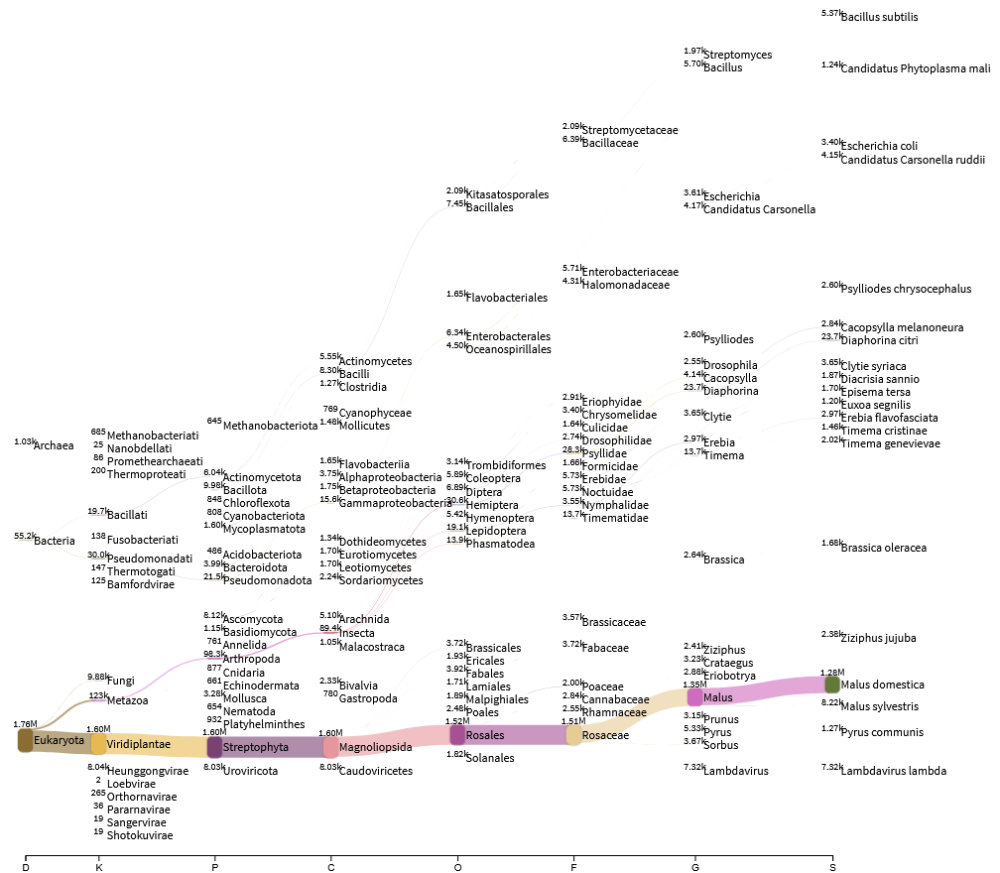

### Genome assembly  <a name="64"></a>

#### EPI2ME - wf-bacterial-genomes  <a name="65"></a>

***Phytoplasma taxonomy and unclassified reads only***

```bash
grep 'unclassified' /data/users/theaven/phytolasma/raw_data/minion/25A2/pod5/kraken/output_nt.txt | awk -F'\t' '{print $3}' | sort | uniq
grep 'Bacteria' /data/users/theaven/phytolasma/raw_data/minion/25A2/pod5/kraken/output_nt.txt | awk -F'\t' '{print $3}' | sort | uniq
grep 'Bacillati' /data/users/theaven/phytolasma/raw_data/minion/25A2/pod5/kraken/output_nt.txt | awk -F'\t' '{print $3}' | sort | uniq
grep 'Bacillota' /data/users/theaven/phytolasma/raw_data/minion/25A2/pod5/kraken/output_nt.txt | awk -F'\t' '{print $3}' | sort | uniq
grep 'Mycoplasmatota' /data/users/theaven/phytolasma/raw_data/minion/25A2/pod5/kraken/output_nt.txt | awk -F'\t' '{print $3}' | sort | uniq
grep 'Mollicutes' /data/users/theaven/phytolasma/raw_data/minion/25A2/pod5/kraken/output_nt.txt | awk -F'\t' '{print $3}' | sort | uniq
grep 'Acholeplasmatales' /data/users/theaven/phytolasma/raw_data/minion/25A2/pod5/kraken/output_nt.txt | awk -F'\t' '{print $3}' | sort | uniq
grep 'Acholeplasmataceae' /data/users/theaven/phytolasma/raw_data/minion/25A2/pod5/kraken/output_nt.txt | awk -F'\t' '{print $3}' | sort | uniq
grep 'Candidatus' /data/users/theaven/phytolasma/raw_data/minion/25A2/pod5/kraken/output_nt.txt | awk -F'\t' '{print $3}' | sort | uniq
grep '16SrX' /data/users/theaven/phytolasma/raw_data/minion/25A2/pod5/kraken/output_nt.txt | awk -F'\t' '{print $3}' | sort | uniq
grep 'phytoplasma' /data/users/theaven/phytolasma/raw_data/minion/25A2/pod5/kraken/output_nt.txt | awk -F'\t' '{print $3}' | sort | uniq
grep 'Phytoplasma' /data/users/theaven/phytolasma/raw_data/minion/25A2/pod5/kraken/output_nt.txt | awk -F'\t' '{print $3}' | sort | uniq

awk -F'\t' '
$3 ~ /\(taxid (0|279890|2626865|196816|2609248|2626549|2623706|257493|2608915|2638842|33807|2614992|2618356|2647192|2639704|2627091|235627|2685287|2609269|2630922|185979|12333|2645622|2633795|2788091|33809|2608897|2623841|2631580|2622653|2632610|2613784|2646786|2638829|711328|2641185|2847305|2996318|2763321|2687300|241193|257487|2788787|329961|2620175|2634405|2624466|2624793|2619133|2565278|2593645|2642555|2635829|2614128|2609414|2638500|2624378|2640874|257496|1983111|2629879|1748548|2593640|196773|2617939|2615033|209473|2852324|2630389|2644528|36866|2608891|2622719|386847|2608889|39779|2644629|2646395|494603|196869|2627005|33811|2624949|2625037|2626815|2852375|2625242|2622732|2609666|2621901|2618217|2610897|2615202|2619925|2620239|2649294|2610881|2837824|2633591|2644121|2620435|2619493|2663824|641407|2650499|2633022|2642006|2626258|2636778|2619255|2615042|2794999|83889|2629616|2609279|325217|2703679|2629569|2644672|2615210|2608980|119067|2609290|2619833|2617518|338099|1609545|2637987|3080824|2617802|2636767|713063|2648731|1077831|2623750|2629175|2628724|2630693|889872|2614752|3143075|2641084|2624044|2637762|2615069|2615035|2593658|2644732|2632301|2615019|503183|185978|2618429|2624094|2630326|2628915|1500946|3079910|2626614|2631981|2624265|196858|2638319|2640945|880158|2638335|2627481|2632826|2593292|2647000|194690|2848178|2661612|2637179|196821|2619320|2645906|2636677|2613769|2621553|192944|114295|2626894|2614913|2624628|2643747|2762017|2593367|2637378|2647522|2630038|2837530|2613772|2636512|2637870|2627926|2609468|2611147|122612|196159|2614943|2637901|857474|91994|2961925|196198|2608887|2593676|2632669|2626047|2631404|0|2635139|2631705|2614952|2648997|2676525|2622553|2625466|2649714|2638727|2630295|2638520|2762021|663243|2614977|2620237|2640676|2643310|3048685|2|1783272|3373930|1879010|1239|344338|2231116|544448|658143|220137|1898209|2735562|2954383|327160|2954388|1446466|2952895|1389454|1705730|2807605|3107022|3101274|2044595|2052149|452471|1855377|1326980|1247023|1041504|1485666|3126526|1453429|2840689|2840693|511995|511435|2660703|3100546|3107047|2803731|2570586|3101022|1664265|3045160|2026714|928852|3042151|1921001|1618372|2838779|2785441|2026885|251538|3118169|251540|108080|1240471|203804|1964448|3042497|2608983|2172549|1454753|1618633|2561898|247481|1912860|273135|2856961|1202536|1202537|1202538|1202539|1202540|387662|114186|114185|3043617|1806891|3003348|3060593|2030808|459349|2250272|3121368|338645|2840736|2054173|1191162|2066024|1895663|3401927|2163644|2608985|1621989|3121372|2099670|2052315|2212470|2005002|3036122|1859133|3036123|3126740|3100608|393765|1834193|1834192|2230877|420336|1922217|3141250|2053554|2840815|1798018|3101301|1761012|3126528|2994492|3077957|2840833|1540872|1070130|3034016|1345115|2026747|2876573|2876572|2802285|295596|573658|3107137|3120109|2030809|1561003|3033792|1541959|3054210|2170669|360731|2030810|3121367|2447898|336810|2053565|1208919|1576550|1208920|2984322|204669|174633|699240|3066224|2053570|74015|2005262|3241576|2052151|1261131|658172|2952930|2951803|3038979|3069335|1318617|2932367|2927580|3107164|3101293|3100987|2866314|988779|3100917|1899017|2052166|3077948|2759911|1577789|1406512|2032688|2759912|2759913|3238636|3018274|591154|511746|1581557|2588535|1679002|2588536|1808979|2250274|3121366|2045217|3107178|3107179|3101292|3027808|1116213|346879|2594798|2565781|2978047|2518609|2162846|3388566|2933970|1160784|2093793|3064277|2975601|553981|1826872|1353260|1630141|1229908|1459636|1237085|1903276|1846278|1353246|1603555|2259672|3020900|2652173|453162|2052152|2364082|2035772|2840886|2497989|3107206|3101298|2818468|2053589|3101350|186490|1235990|3098669|244581|3033793|2518994|2762014|2982025|3121371|2563896|1388755|1002672|2024849|3230984|3230985|3230988|3230989|3230991|335992|2684113|2030811|2053688|2115978|2763338|85620|180978|35780|37692|47566|399025|2609813|69896|33926|1884913|573600|1884907|3416329|2026781|265317|3107218|3101276|3101277|91844|3400422|669502|1381133|3085104|1806508|264201|389348|3121375|1302376|3230995|472834|3107225|3101265|2738883|2720720|225148|535712|676208|2282149|2838777|2763515|2763517|386487|713059|2026720|2980174|95818|2726954|3048880|2943807|2601646|3043284|3121369|3121370|3101308|3107240|3101273|2608262|371608|2875962|1249480|2740404|2750080|946483|1410383|1748243|3414687|3100113|3065865|2847306|2792791|1166950|2738886|2508687|3080811|2799669|2951083|2053491|3066262|3066255|3077926|3139336|3113639|1346319|2596890|3095367|1133592|1177213|3107276|3101291|1759059|881286|2687299|3066219|2026803|2026804|2782163|1704307|2053527|3036252|355926|312019|2093355|517606|2109283|2501586|1985115|179883|200297|85630|2726361|419492|39647|2155)\)/ {
    id=$2
    sub(/^>/, "", id)
    print id
}' /data/users/theaven/phytolasma/raw_data/minion/25A2/pod5/kraken/output_nt.txt \
> /data/users/theaven/phytolasma/raw_data/minion/25A2/phytoplasma_mollicutes_read_ids.txt #274,806

seqkit grep -f /data/users/theaven/phytolasma/raw_data/minion/25A2/phytoplasma_mollicutes_read_ids.txt \
    /data/users/theaven/phytolasma/raw_data/minion/25A2/pod5/combined.fq.gz \
    -o /data/users/theaven/phytolasma/raw_data/minion/25A2/phytoplasma_mollicutes.fq.gz

seqkit stats \
/data/users/theaven/phytolasma/raw_data/minion/25A2/phytoplasma_mollicutes.fq.gz \
/data/users/theaven/phytolasma/raw_data/minion/25A2/pod5/combined.fq.gz

#file                                                                              format  type   num_seqs        sum_len  min_len  avg_len  max_len
#/data/users/theaven/phytolasma/raw_data/minion/25A2/phytoplasma_mollicutes.fq.gz  FASTQ   DNA     274,806    108,486,798        5    394.8   38,817
#/data/users/theaven/phytolasma/raw_data/minion/25A2/pod5/combined.fq.gz           FASTQ   DNA   2,170,443  1,650,814,576        5    760.6   52,949

srun -p bioagri -J epi2me --nodes=1 --ntasks=1 --cpus-per-task=16 --mem 64G --pty bash
module load nextflow/23.10.1-gcc-12.1.0
module load apptainer/1.4.1-gcc-13.3.0-3coysxn

mkdir -p /data/users/theaven/singularity/cache 
mkdir -p /data/users/theaven/singularity/tmp
mkdir -p /data/users/theaven/singularity/APPTAINERENV_TMPDIR
mkdir -p /data/users/theaven/singularity/APPTAINERENV_NXF_TASK_WORKDIR
mkdir -p /data/users/theaven/singularity/APPTAINERENV_NXF_DEBUG
mkdir -p /data/users/theaven/singularity/tmp
export TMPDIR=/data/users/theaven/singularity/tmp
export TMP=/data/users/theaven/singularity/tmp
export TEMP=/data/users/theaven/singularity/tmp
export SINGULARITY_CACHEDIR=/data/users/theaven/singularity/cache 
export SINGULARITY_TMPDIR=/data/users/theaven/singularity/tmp
export APPTAINERENV_TMPDIR=/data/users/theaven/singularity/tmp
export APPTAINERENV_TMP=/data/users/theaven/singularity/tmp
export APPTAINERENV_TEMP=/data/users/theaven/singularity/tmp
export APPTAINER_CACHEDIR=/data/users/theaven/singularity/cache
export APPTAINER_TMPDIR=/data/users/theaven/singularity/tmp
export APPTAINERENV_NXF_TASK_WORKDIR=/data/users/theaven/singularity/APPTAINERENV_NXF_TASK_WORKDIR
export APPTAINERENV_NXF_DEBUG=/data/users/theaven/singularity/APPTAINERENV_NXF_DEBUG

nextflow run epi2me-labs/wf-bacterial-genomes \
  -c /data/users/theaven/phytolasma/nextflow_tmp2.config \
  --fastq '/data/users/theaven/phytolasma/raw_data/minion/25A2/phytoplasma_mollicutes.fq.gz' \
  --sample 25A2 \
  --min_read_length 0 \
  --max_coverage_plots 20 \
  --out_dir /data/users/theaven/phytolasma/raw_data/minion/25A2/assembly/EPI2ME/phyto-noref \
  --threads 16 \
  -profile singularity \
  -resume

nextflow run epi2me-labs/wf-bacterial-genomes \
    -c /data/users/theaven/phytolasma/nextflow_tmp2.config \
    --fastq '/data/users/theaven/phytolasma/raw_data/minion/25A2/phytoplasma_mollicutes.fq.gz' \
    --sample 25A2 \
    --min_read_length 0 \
    --max_coverage_plots 20 \
    --reference_based_assembly \
    --reference /data/users/theaven/phytolasma/GCF_000026205.1_Phytoplasma_mali.fasta \
    --out_dir /data/users/theaven/phytolasma/raw_data/minion/25A2/assembly/EPI2ME/phyto-ref \
    --threads 16 \
    -profile singularity \
    -resume
```
Based on the reference guided assembly the coverage of the phytoplasma genome with the ONT data very is low:

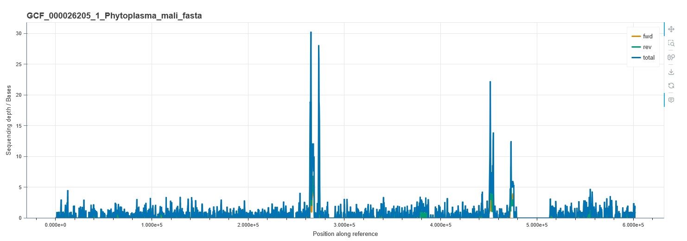

```bash
samtools view -F 4 \
    /data/users/theaven/phytolasma/raw_data/minion/25A2/aln.bam \
    | cut -f1 \
    | sort -u \
    > /data/users/theaven/phytolasma/raw_data/minion/25A2/phytoplasma_mapped_read_ids.txt

seqkit seq -n -i \
    /data/users/theaven/phytolasma/raw_data/minion/25A2/phytoplasma_mollicutes.fq.gz \
    | sort -u \
    > /data/users/theaven/phytolasma/raw_data/minion/25A2/phytoplasma_existing_read_ids.txt

comm -23 \
    <(sort /data/users/theaven/phytolasma/raw_data/minion/25A2/phytoplasma_mapped_read_ids.txt) \
    /data/users/theaven/phytolasma/raw_data/minion/25A2/phytoplasma_existing_read_ids.txt \
    > /data/users/theaven/phytolasma/raw_data/minion/25A2/phytoplasma_missing_read_ids.txt

seqkit grep \
    -f /data/users/theaven/phytolasma/raw_data/minion/25A2/phytoplasma_missing_read_ids.txt \
    /data/users/theaven/phytolasma/raw_data/minion/25A2/pod5/combined.fq.gz \
    -o /data/users/theaven/phytolasma/raw_data/minion/25A2/phytoplasma_missing.fq.gz

cat \
    /data/users/theaven/phytolasma/raw_data/minion/25A2/phytoplasma_mollicutes.fq.gz /data/users/theaven/phytolasma/raw_data/minion/25A2/phytoplasma_missing.fq.gz \
    >> /data/users/theaven/phytolasma/raw_data/minion/25A2/phytoplasma_mollicutes+.fq.gz

seqkit stats \
/data/users/theaven/phytolasma/raw_data/minion/25A2/phytoplasma_mollicutes+.fq.gz
#file                                                                               format  type  num_seqs      sum_len  min_len  avg_len  max_len
#/data/users/theaven/phytolasma/raw_data/minion/25A2/phytoplasma_mollicutes+.fq.gz  FASTQ   DNA    277,133  111,849,277        5    403.6   45,523

nextflow run epi2me-labs/wf-bacterial-genomes \
  -c /data/users/theaven/phytolasma/nextflow_tmp2.config \
  --fastq '/data/users/theaven/phytolasma/raw_data/minion/25A2/phytoplasma_mollicutes+.fq.gz' \
  --sample 25A2 \
  --min_read_length 0 \
  --max_coverage_plots 20 \
  --out_dir /data/users/theaven/phytolasma/raw_data/minion/25A2/assembly/EPI2ME/phyto+-noref \
  --threads 16 \
  -profile singularity \
  -resume
```
## Sample AT2-62B <a name="66"></a>

Rerun assembly with the same workflow as for the new samples for consistency.

### Basecalling <a name="67"></a>

Sequencing was done with an older flow cell and need older dorado version and model.

```bash
srun -p bioagri -J pod5 --nodes=1 --ntasks=1 --cpus-per-task=4 --mem 16G --pty bash
module load apptainer/1.4.1-gcc-13.3.0-3coysxn

mkdir -p /data/users/theaven/phytolasma/raw_data/minion/AT2-62B/pod5

apptainer exec \
  --bind /data:/data \
  --bind /home/clusterusers/theaven:/home/clusterusers/theaven \
  /data/users/theaven/pod5_0.3.44--pyhdfd78af_0 \
  pod5 convert fast5 \
  /data/users/theaven/phytolasma/raw_data/minion/AT2-62B/Fast5_Pic-AT2-62B/ \
  --output /data/users/theaven/phytolasma/raw_data/minion/AT2-62B/pod5/ \
  --recursive --threads 4 \
  --one-to-one /data/users/theaven/phytolasma/raw_data/minion/AT2-62B/Fast5_Pic-AT2-62B/

for Dir in $(ls -d /data/users/theaven/phytolasma/raw_data/minion/AT2-62B/pod5/); do
  Task=Dorado
  InDir="$Dir"
  OutDir=$Dir/basecalls
  OutFmt=fastq
  Barcode=NA
  Modification_model=NA
  Base_model=dna_r10.4.1_e8.2_400bps_sup@v4.1.0
  ExpectedOutput="$OutDir"/out.fastq

  Jobs=$(squeue -h -u theaven -n "$Task" | wc -l)
  while [ "$Jobs" -gt 1 ]; do
    sleep 600s
    printf "."
    Jobs=$(squeue -h -u theaven -n "$Task" | wc -l)
  done

  if [ ! -s "$ExpectedOutput" ]; then
    jobid=$(sbatch --job-name="$Task" --parsable ~/git_repos/Wrappers/unibz/run_dorado_0.8.3.sh "$InDir" "$OutDir" "$OutFmt" "$Barcode" "$Modification_model" "$Base_model")
    printf "%s\t%s\t "$Task" \t%s\n" "$(date -Iseconds)" "$ID" "$jobid" >> /home/clusterusers/theaven/slurm_log.tsv
  else
    echo "For $ID found: $ExpectedOutput" 
  fi
done

#Save space:
rm /data/users/theaven/phytolasma/raw_data/minion/AT2-62B/pod5/*.pod5
```

```bash
module load seqtk/1.4-gcc-12.3.0
conda activate seqkit

for file in /data/users/theaven/phytolasma/raw_data/minion/AT2-62B/pod5/basecalls/out.fastq; do
    fasta="${file%.fastq}.fasta"

    seqtk seq -a "$file" | awk '/^>/{split($0,a," "); print a[1]; next}{print}' > "$fasta"

    seqkit seq -m 1000 "$fasta" > "${file%.fastq}_long.fasta"

    seqkit seq -m 500 "$fasta" > "${file%.fastq}_med.fasta"

    echo "Long reads: ${file%.fastq}_long.fasta"
    echo "Number of reads >=1000 bp:"
    grep -c '^>' "${file%.fastq}_long.fasta" #999,615
    echo "Medium reads (>=500 bp):"
    grep -c '^>' "${file%.fastq}_med.fasta" #1,838,282
done
```

### Taxonomic classication of reads  <a name="68"></a>
#### BWA-mem <a name="69"></a>

```bash
module load anaconda3
conda activate minimap2
module load samtools/1.16.1

minimap2 -t 8 -ax map-ont \
    /data/users/theaven/phytolasma/GCF_000026205.1_Phytoplasma_mali.fasta \
    /data/users/theaven/phytolasma/raw_data/minion/AT2-62B/pod5/basecalls/out.fastq \
    | samtools sort -@ 4 -o /data/users/theaven/phytolasma/raw_data/minion/AT2-62B/aln.bam
samtools index /data/users/theaven/phytolasma/raw_data/minion/AT2-62B/aln.bam
samtools view -c -F 4 /data/users/theaven/phytolasma/raw_data/minion/AT2-62B/aln.bam
#89,670
```
#### Kraken2   <a name="70"></a>

Reads were taxonomically classificed with kraken2 to determine the proportion of on-target Phytoplasma mali reads
```bash
for reads in $(find /data/users/theaven/phytolasma/raw_data/minion/AT2-62B/pod5/basecalls/ -name 'out.fastq' -type f); do
  Task=kraken
  ID=$(echo $reads | cut -d '/' -f8,9 | sed 's@/@_@g')
  Database=/data/databases/kraken2/2025-02-04/k2_core_nt_20250609
  OutDir="$(dirname $reads)"/"$Task"
  ExpectedOutput="$OutDir"/report_nt.txt

  if [ ! -s "$ExpectedOutput" ]; then
    jobid=$(sbatch --job-name="$Task" --parsable ~/git_repos/Wrappers/unibz/run_kraken.sh "$reads" "$OutDir" "$Database")
    printf "%s\t%s\t "$Task" \t%s\n" "$(date -Iseconds)" "$ID" "$jobid" >> /home/clusterusers/theaven/slurm_log.tsv
  else
    echo "For $ID found: $ExpectedOutput" 
  fi
done

sort -t$'\t' -k4,4nr /data/users/theaven/phytolasma/raw_data/minion/AT2-62B/pod5/basecalls/kraken/output_nt.txt > /data/users/theaven/phytolasma/raw_data/minion/AT2-62B/pod5/basecalls/kraken/output_nt_by_length.txt 
wc -l /data/users/theaven/phytolasma/raw_data/minion/AT2-62B/pod5/basecalls/kraken/output_nt_by_length.txt  #2,738,019
```

Only ~7,470 reads are from Ca. P. mali:

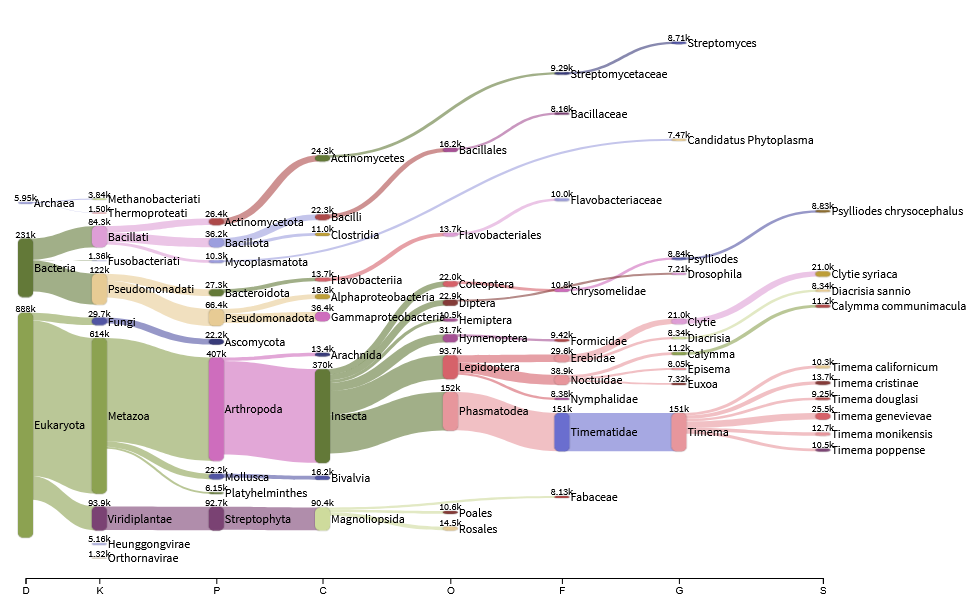

It is also odd that reads are mostly classified to Timema, presumably Cacopsylla picta is not in the reference database, but Cacopsylla melanoneura clearly is in other samples and should be more closely related to picta.

### Genome assembly  <a name="71"></a>

#### EPI2ME - wf-bacterial-genomes  <a name="72"></a>

***Phytoplasma taxonomy and unclassified reads only***

```bash
Report=/data/users/theaven/phytolasma/raw_data/minion/AT2-62B/pod5/basecalls/kraken/output_nt.txt
grep 'Bacteria' "$Report" | awk -F'\t' '{print $3}' | sort | uniq
grep 'Bacillati' "$Report" | awk -F'\t' '{print $3}' | sort | uniq
grep 'Bacillota' "$Report" | awk -F'\t' '{print $3}' | sort | uniq
grep 'Mycoplasmatota' "$Report" | awk -F'\t' '{print $3}' | sort | uniq
grep 'Mollicutes' "$Report" | awk -F'\t' '{print $3}' | sort | uniq
grep 'Acholeplasmatales' "$Report" | awk -F'\t' '{print $3}' | sort | uniq
grep 'Acholeplasmataceae' "$Report" | awk -F'\t' '{print $3}' | sort | uniq
grep '16SrX' "$Report" | awk -F'\t' '{print $3}' | sort | uniq
grep 'phytoplasma' "$Report" | awk -F'\t' '{print $3}' | sort | uniq
grep 'Phytoplasma' "$Report" | awk -F'\t' '{print $3}' | sort | uniq

awk -F'\t' '
$3 ~ /\(taxid (0|2666008|2629698|2626865|2614800|2684926|196816|2175602|2626254|2609248|2626549|2640495|257493|2636026|2639383|2632611|2608915|2638842|2562656|2788002|2615009|745176|35247|33807|2614992|2649744|2644704|2635317|2618356|2619674|2614126|2626613|363628|2639704|2607491|2618482|2630820|2627091|2645828|2627083|235627|1251100|45426|328613|871250|2602585|2731990|336962|2685287|336487|323723|2750818|185979|12333|2646097|2645622|2633795|2627862|2647129|2788091|33809|1123963|2788065|2608897|2562339|2570880|2649934|2645912|2653178|2587553|2623841|2959943|2631580|2795601|2622653|2632610|2613784|2646786|2641029|2593542|2638829|711328|2633577|2632605|2013823|2725944|2647897|3098986|3072908|2847305|2996318|2763321|2687300|2640652|257487|2960002|2788787|2648921|329961|2620175|2634405|2643091|2624793|2936715|2618882|2619133|346674|2635144|2615027|2641838|2593645|2644389|2635829|2614128|2609414|372443|196834|83494|2638500|2624378|2949298|2629967|2569970|2649013|356653|386841|2640874|257496|2685271|1983111|2629879|2627006|2621467|2635733|2623546|1232736|2593640|196773|2649760|1244186|2622466|2617939|1251539|2630162|2615033|2622029|2753733|1252480|2707582|2649562|2630389|2562337|2562720|2699296|2635518|2644528|2757714|36866|2608935|2608891|2242028|2641489|2622719|2624170|2633097|39779|3044604|2644629|2646395|494603|2644544|61432|196869|2627005|33811|2746228|2628112|2624949|2642459|2626815|2647902|2642240|2749940|2685620|2625242|2634807|988775|2622732|2625095|2610901|2609666|2621901|2642239|2621953|2618217|2614931|2622382|2610897|2615202|2619925|2603293|2631144|1111709|2960490|2649294|2610881|2960516|2646193|2852473|2268983|2633591|2608929|2632876|2644121|2788790|2644826|2960609|2648686|2719232|2620435|224789|2880864|2268405|2627398|2615029|2622702|2663824|2614906|641407|2643253|2650499|2633022|257649|2626134|2642006|2626258|2624546|2636778|2619255|2624746|2617991|2615042|2794999|83889|196814|1813598|2629616|2609279|415309|2626666|2630131|325217|2703679|2641196|2629569|2684913|2644672|2631116|2633235|2615210|2618889|2608980|119067|2822412|2609290|2614687|2619833|2617518|117574|338099|1609545|2685852|2609239|2637987|2617802|2649241|2642494|2636767|2683645|713063|2648731|2746362|2623750|2675272|2629175|2647665|2630693|2837522|2133791|2614752|2624044|2620411|1660158|2637762|2615069|2615035|2593658|2763650|2644732|1110703|2267235|2628660|2630292|2562460|2632301|2615019|1394414|503183|1474400|2730119|119059|2634190|185978|2618429|2684985|2624094|2630326|2804714|2688777|2813036|535600|2779158|2628915|2623280|2749216|2675266|2621772|2738374|1500946|2638441|2621251|2627249|675074|3079910|2640899|2631981|2624265|196858|2638319|2640945|2624350|2683265|40069|880158|2638335|2638028|2627481|2635580|2642972|2632826|2633465|2593292|2647000|2827312|194690|2848178|2661612|2637179|196821|2619320|2645906|2636677|196806|2614957|365660|2642473|1972481|228096|2645039|2647150|2609250|1654822|35303|2627538|2613769|2621553|192944|2631432|114295|2637345|2676603|2626894|2626991|2639302|1234428|2614913|2837526|2640460|2625375|2608920|2752797|2624628|2562647|2643747|2570880|2649362|2570617|2172093|2853013|2762017|2752798|2635961|2637378|2303178|2647522|2268047|196818|2630038|2643062|2837530|2815155|2613772|2630187|2636512|2777823|2637870|2627926|2609468|2611147|122612|196159|2614943|2676235|2637901|2647733|857474|91994|2629676|2961925|196198|2961251|2643834|42112|2608887|2593676|2632669|2613582|196795|2637784|2623549|2618290|2626047|2640012|2635449|2639852|2631975|2631404|0|2627645|2635139|2631705|2562645|352888|2614952|2634893|2632499|2648997|2622527|2676525|2622553|2621713|2625466|2649714|39756|2638727|1474196|473556|2233873|355245|2562297|2618452|2624802|2630295|350888|2638520|2762021|663243|2614977|2620237|12429|2570881|2615021|2640676|2175867|2643310|2630262|2632541|3048685|1783234|2|1783272|3373930|1879010|1239|344338|2231116|3075149|3076018|3074432|544448|658143|3081162|3081165|37628|31969|220137|1898209|2146|2735562|2954383|327160|2954388|1446466|2952895|379546|1389454|1705730|3121606|2807605|3107022|3101274|2044595|2052149|452471|3101087|3121345|1302411|1345117|1855377|2820661|2953871|634113|1247023|1508644|49118|1041504|1485666|3126526|1453429|2840687|2840689|2840693|511995|511435|2660703|3100546|3401925|3107047|3101300|673862|2803731|2570586|3101022|2716172|1664265|251538|251537|3118169|251540|108080|1240471|203907|203804|859654|2741701|2838508|2518322|1964448|3042497|3121376|3121365|3414509|2608983|2172549|311458|1454753|1618633|2026716|2561898|247481|1912860|2856961|1202536|2661587|1202538|1202539|1202540|387662|114186|114185|3043617|46770|46769|1806891|3003348|2066483|3121364|3060593|2030808|456828|459349|2250272|3121368|2919598|2053538|338645|2840736|2840752|2054173|1191162|2601575|2066024|2080303|1895663|2053542|3401927|3127115|2163644|2044594|2891165|2608985|1621989|471827|3121372|2099670|1778262|2052315|1076629|2899221|2212470|2005002|3036122|3062594|1859133|2202844|3036123|3082418|3126740|1859128|3344825|62101|3100608|1193729|1401328|2760055|1408204|393765|3077946|1778263|1834193|1834192|1834167|2230877|2230878|1834189|2840790|1927128|3277344|3277338|1652106|420336|1922217|3141250|2838581|2053554|2044591|2795018|3085328|1448929|1608628|2840815|1798018|1920990|1802984|3101301|1925548|1761012|2107591|653937|3126528|2994492|3077957|1878942|1927833|2840833|2137880|2838610|1177218|2053557|2282145|1862133|1540872|2806609|1070130|3034016|1345115|2026747|2876573|2876572|3053649|2802285|1427984|295596|3132033|3132032|1778263|573658|3107137|3120109|2030809|2707344|2558174|1561003|3033792|476281|3242468|1541959|247490|3054210|2170669|360731|1495769|2030810|2820270|3121367|2447898|1189303|336810|2053565|233181|33056|1208919|1208921|1576550|1208920|2984322|374847|204669|174633|1562256|699240|3066224|3077949|2053570|74015|2005262|3241576|2052151|34020|1261131|34021|658172|2840848|2952930|2951803|3038979|3069335|2759911|2848114|2874846|1406512|2517205|2691037|2032688|2759912|2759913|1577791|2977098|1867261|3238636|591154|511746|3108543|671143|1581557|2588535|1679002|1581680|2588536|1808979|2250274|2282148|3121366|3121374|2862749|234827|2213196|1778264|2841263|3118470|2841264|2200854|2045217|3107178|3107179|3101292|3096687|2943498|3027808|1116213|3004105|2665156|2725942|2594798|2565781|2978047|2978046|2518609|2162846|1884916|1884915|1884634|1577684|3388566|2572088|2093824|2933970|2899133|2093823|1971485|1160784|3043262|2093793|3064277|3004500|2601668|2975601|2705534|2705533|2942908|2796146|553981|3076529|498374|498375|1798806|1826872|1353260|1630141|1898749|1410606|1229908|39647|39648|619518|1232621|303537|138648|107727|35770|305606|2155)\)/ {
    id=$2
    sub(/^>/, "", id)
    print id
}' /data/users/theaven/phytolasma/raw_data/minion/AT2-62B/pod5/basecalls/kraken/output_nt.txt \
> /data/users/theaven/phytolasma/raw_data/minion/AT2-62B/pod5/basecalls/kraken/phytoplasma_mollicutes_read_ids.txt #922,671

seqkit grep -f /data/users/theaven/phytolasma/raw_data/minion/AT2-62B/pod5/basecalls/kraken/phytoplasma_mollicutes_read_ids.txt \
    /data/users/theaven/phytolasma/raw_data/minion/AT2-62B/pod5/basecalls/out.fastq \
    -o /data/users/theaven/phytolasma/raw_data/minion/AT2-62B/phytoplasma_mollicutes.fq.gz

seqkit stats \
/data/users/theaven/phytolasma/raw_data/minion/AT2-62B/phytoplasma_mollicutes.fq.gz \
/data/users/theaven/phytolasma/raw_data/minion/AT2-62B/pod5/basecalls/out.fastq

#file                                                                                 format  type   num_seqs        sum_len  min_len  avg_len  max_len
#/data/users/theaven/phytolasma/raw_data/minion/AT2-62B/phytoplasma_mollicutes.fq.gz  FASTQ   DNA     922,671    456,679,264        4      495   31,719
#/data/users/theaven/phytolasma/raw_data/minion/AT2-62B/pod5/basecalls/out.fastq      FASTQ   DNA   2,738,019  4,204,295,024        4  1,535.5  339,979


srun -p bioagri -J epi2me --nodes=1 --ntasks=1 --cpus-per-task=16 --mem 64G --pty bash
module load nextflow/23.10.1-gcc-12.1.0
module load apptainer/1.4.1-gcc-13.3.0-3coysxn

mkdir -p /data/users/theaven/singularity/cache 
mkdir -p /data/users/theaven/singularity/tmp
mkdir -p /data/users/theaven/singularity/APPTAINERENV_TMPDIR
mkdir -p /data/users/theaven/singularity/APPTAINERENV_NXF_TASK_WORKDIR
mkdir -p /data/users/theaven/singularity/APPTAINERENV_NXF_DEBUG
mkdir -p /data/users/theaven/singularity/tmp
export TMPDIR=/data/users/theaven/singularity/tmp
export TMP=/data/users/theaven/singularity/tmp
export TEMP=/data/users/theaven/singularity/tmp
export SINGULARITY_CACHEDIR=/data/users/theaven/singularity/cache 
export SINGULARITY_TMPDIR=/data/users/theaven/singularity/tmp
export APPTAINERENV_TMPDIR=/data/users/theaven/singularity/tmp
export APPTAINERENV_TMP=/data/users/theaven/singularity/tmp
export APPTAINERENV_TEMP=/data/users/theaven/singularity/tmp
export APPTAINER_CACHEDIR=/data/users/theaven/singularity/cache
export APPTAINER_TMPDIR=/data/users/theaven/singularity/tmp
export APPTAINERENV_NXF_TASK_WORKDIR=/data/users/theaven/singularity/APPTAINERENV_NXF_TASK_WORKDIR
export APPTAINERENV_NXF_DEBUG=/data/users/theaven/singularity/APPTAINERENV_NXF_DEBUG

nextflow run epi2me-labs/wf-bacterial-genomes \
  -c /data/users/theaven/phytolasma/nextflow_tmp2.config \
  --fastq '/data/users/theaven/phytolasma/raw_data/minion/AT2-62B/phytoplasma_mollicutes.fq.gz' \
  --sample AT2-62B \
  --min_read_length 0 \
  --max_coverage_plots 20 \
  --override_basecaller_cfg dna_r10.4.1_e8.2_400bps_sup@v4.1.0 \
  --out_dir /data/users/theaven/phytolasma/raw_data/minion/AT2-62B/assembly/EPI2ME/phyto-noref \
  --threads 16 \
  -profile singularity \
  -resume
#Flye failed for sample 'AT2-62B' due to low coverage

nextflow run epi2me-labs/wf-bacterial-genomes \
    -c /data/users/theaven/phytolasma/nextflow_tmp2.config \
    --fastq '/data/users/theaven/phytolasma/raw_data/minion/AT2-62B/phytoplasma_mollicutes.fq.gz' \
    --sample AT2-62B \
    --min_read_length 0 \
    --max_coverage_plots 20 \
    --reference_based_assembly \
    --override_basecaller_cfg dna_r10.4.1_e8.2_400bps_sup@v4.1.0 \
    --reference /data/users/theaven/phytolasma/GCF_000026205.1_Phytoplasma_mali.fasta \
    --out_dir /data/users/theaven/phytolasma/raw_data/minion/AT2-62B/assembly/EPI2ME/phyto-ref \
    --threads 16 \
    -profile singularity \
    -resume


awk -F'\t' '
$3 ~ /\(taxid (0|2|1783272|3373930|1879010|1239|344338|2231116|3075149|3076018|3074432|544448|713063|658143|3081162|3081165|37628|31969|1609545|220137|1898209|2146|85630|85632|590438|2306029|927614|35779|322098|37694|2358428|1707806|419492|202462|39647|39648|619518|1232621|303537|138648|107727|35770|305606|2763338|85620|2754999|59748|102261|180978|72990|35780|35773|37692|203274|198422|267362|479893|47565|47566|399025|2609813|69896|33926|35776|131152|135727|2155|3098986)\)/ {
    id=$2
    sub(/^>/, "", id)
    print id
}' /data/users/theaven/phytolasma/raw_data/minion/AT2-62B/pod5/basecalls/kraken/output_nt.txt \
> /data/users/theaven/phytolasma/raw_data/minion/AT2-62B/pod5/basecalls/kraken/phytoplasma_mollicutes_read_ids2.txt #922,671


seqkit grep -f /data/users/theaven/phytolasma/raw_data/minion/AT2-62B/pod5/basecalls/kraken/phytoplasma_mollicutes_read_ids2.txt \
    /data/users/theaven/phytolasma/raw_data/minion/AT2-62B/pod5/basecalls/out.fastq \
    -o /data/users/theaven/phytolasma/raw_data/minion/AT2-62B/phytoplasma_mollicutes2.fq.gz

seqkit stats \
/data/users/theaven/phytolasma/raw_data/minion/AT2-62B/phytoplasma_mollicutes2.fq.gz \
/data/users/theaven/phytolasma/raw_data/minion/AT2-62B/pod5/basecalls/out.fastq

#file                                                                                  format  type   num_seqs        sum_len  min_len  avg_len  max_len
#/data/users/theaven/phytolasma/raw_data/minion/AT2-62B/phytoplasma_mollicutes2.fq.gz  FASTQ   DNA     919,110    460,656,116        4    501.2   45,457
#/data/users/theaven/phytolasma/raw_data/minion/AT2-62B/pod5/basecalls/out.fastq       FASTQ   DNA   2,738,019  4,204,295,024        4  1,535.5  339,979

nextflow run epi2me-labs/wf-bacterial-genomes \
  -c /data/users/theaven/phytolasma/nextflow_tmp2.config \
  --fastq '/data/users/theaven/phytolasma/raw_data/minion/AT2-62B/phytoplasma_mollicutes2.fq.gz' \
  --sample AT2-62B \
  --min_read_length 0 \
  --max_coverage_plots 20 \
  --override_basecaller_cfg dna_r10.4.1_e8.2_400bps_sup@v4.1.0 \
  --out_dir /data/users/theaven/phytolasma/raw_data/minion/AT2-62B/assembly/EPI2ME/phyto-noref2 \
  --threads 16 \
  -profile singularity \
  -resume
#WARN: Flye failed for sample 'AT2-62B' due to low coverage.
```
Based on the reference guided assembly the coverage of the phytoplasma genome with the ONT data is low:

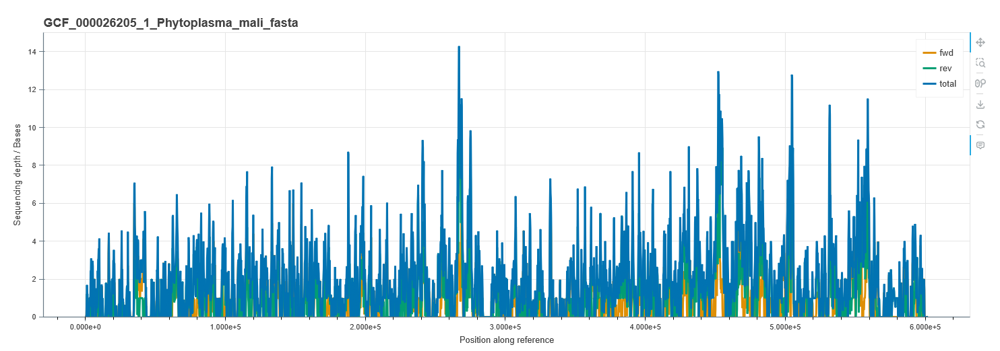


```bash
samtools view -F 4 \
    /data/users/theaven/phytolasma/raw_data/minion/AT2-62B/aln.bam \
    | cut -f1 \
    | sort -u \
    > /data/users/theaven/phytolasma/raw_data/minion/AT2-62B/phytoplasma_mapped_read_ids.txt

seqkit seq -n -i \
    /data/users/theaven/phytolasma/raw_data/minion/AT2-62B/phytoplasma_mollicutes.fq.gz \
    | sort -u \
    > /data/users/theaven/phytolasma/raw_data/minion/AT2-62B/phytoplasma_existing_read_ids.txt

comm -23 \
    <(sort /data/users/theaven/phytolasma/raw_data/minion/AT2-62B/phytoplasma_mapped_read_ids.txt) \
    /data/users/theaven/phytolasma/raw_data/minion/AT2-62B/phytoplasma_existing_read_ids.txt \
    > /data/users/theaven/phytolasma/raw_data/minion/AT2-62B/phytoplasma_missing_read_ids.txt

seqkit grep \
    -f /data/users/theaven/phytolasma/raw_data/minion/AT2-62B/phytoplasma_missing_read_ids.txt \
    /data/users/theaven/phytolasma/raw_data/minion/AT2-62B/pod5/basecalls/out.fastq \
    -o /data/users/theaven/phytolasma/raw_data/minion/AT2-62B/phytoplasma_missing.fq.gz

cat \
    /data/users/theaven/phytolasma/raw_data/minion/AT2-62B/phytoplasma_mollicutes.fq.gz /data/users/theaven/phytolasma/raw_data/minion/AT2-62B/phytoplasma_missing.fq.gz \
    >> /data/users/theaven/phytolasma/raw_data/minion/AT2-62B/phytoplasma_mollicutes+.fq.gz

seqkit stats \
/data/users/theaven/phytolasma/raw_data/minion/AT2-62B/phytoplasma_mollicutes+.fq.gz
#file                                                                                  format  type  num_seqs      sum_len  min_len  avg_len  max_len
#/data/users/theaven/phytolasma/raw_data/minion/AT2-62B/phytoplasma_mollicutes+.fq.gz  FASTQ   DNA    983,244  653,047,016        4    664.2  194,683

nextflow run epi2me-labs/wf-bacterial-genomes \
  -c /data/users/theaven/phytolasma/nextflow_tmp2.config \
  --fastq '/data/users/theaven/phytolasma/raw_data/minion/AT2-62B/phytoplasma_mollicutes+.fq.gz' \
  --sample AT2-62B \
  --min_read_length 0 \
  --max_coverage_plots 20 \
  --override_basecaller_cfg dna_r10.4.1_e8.2_400bps_sup@v4.1.0 \
  --out_dir /data/users/theaven/phytolasma/raw_data/minion/AT2-62B/assembly/EPI2ME/phyto+-noref \
  --threads 16 \
  -profile singularity \
  -resume
```
No contig longer than 10kb.

## Sample AT1-13-ET

NO SPACE

```bash
srun -p bioagri -J pod5 --nodes=1 --ntasks=1 --cpus-per-task=4 --mem 16G --pty bash
module load apptainer/1.4.1-gcc-13.3.0-3coysxn

mkdir -p /data/users/theaven/phytolasma/raw_data/minion/AT1_13_ET

apptainer exec \
  --bind /data:/data \
  --bind /home/clusterusers/theaven:/home/clusterusers/theaven \
  /data/users/theaven/pod5_0.3.44--pyhdfd78af_0 \
  pod5 convert fast5 \
  /data/users/theaven/phytolasma/raw_data/minion/AT1_13_ET/Fast5_Pic-AT2-62B/ \
  --output /data/users/theaven/phytolasma/raw_data/minion/AT2-62B/pod5/ \
  --recursive --threads 4 \
  --one-to-one /data/users/theaven/phytolasma/raw_data/minion/AT2-62B/Fast5_Pic-AT2-62B/

for Dir in $(ls -d /data/users/theaven/phytolasma/raw_data/minion/AT2-62B/pod5/); do
  Task=Dorado
  InDir="$Dir"
  OutDir=$Dir/basecalls
  OutFmt=fastq
  Barcode=NA
  Modification_model=NA
  Base_model=dna_r10.4.1_e8.2_400bps_sup@v4.1.0
  ExpectedOutput="$OutDir"/out.fastq

  Jobs=$(squeue -h -u theaven -n "$Task" | wc -l)
  while [ "$Jobs" -gt 1 ]; do
    sleep 600s
    printf "."
    Jobs=$(squeue -h -u theaven -n "$Task" | wc -l)
  done

  if [ ! -s "$ExpectedOutput" ]; then
    jobid=$(sbatch --job-name="$Task" --parsable ~/git_repos/Wrappers/unibz/run_dorado_0.8.3.sh "$InDir" "$OutDir" "$OutFmt" "$Barcode" "$Modification_model" "$Base_model")
    printf "%s\t%s\t "$Task" \t%s\n" "$(date -Iseconds)" "$ID" "$jobid" >> /home/clusterusers/theaven/slurm_log.tsv
  else
    echo "For $ID found: $ExpectedOutput" 
  fi
done

#Save space:
rm /data/users/theaven/phytolasma/raw_data/minion/AT2-62B/pod5/*.pod5
```

# Comparison of Phytoplasma mali genomes  <a name="3"></a>

Four Phytoplasma mali genomes have already been assembled from nanopore data by Erika Corretto, there is an additional published genome (Kube et al. 2008). The Giulia (2024) thesis also describes the assembly of a further 7 phytoplasma mali genomes; however, these are not publically available and Hannes is reluctant to collaborate with the authors.


### Subtyping primers <a name="10"></a>

RFLP and qPCR primers have been used to define different subtypes of Ca. P. mali: AT, AT1, AT2, AP15 (Jarausch et al. 1994; Jarausch et al. 2000). In silico PCR was performed with each of the primer pairs and products aligned in Jalview to inspect patterns.

#### rpl22 - qPCR primer  <a name="19"></a>

```bash
echo rpAP15f-mod-rpAP15r3 TGCTGAAGCTAATTTGGC CCCATGAATATTAACCTCCT >> /data/users/theaven/phytolasma/pop/rpl22_primers.txt
for genome in AT1-13_ET.fasta AT2-62B.fasta AT1-AO-11_ET.fasta AT2_Cmel17.fasta GCF_000026205.1_Phytoplasma_mali.fasta; do 
	Out=$(echo $genome | sed 's@.fasta@@g')_rpl22.txt 
	primersearch \
	-seqall "$genome" \
	-infile /data/users/theaven/phytolasma/pop/rpl22_primers.txt \
	-mismatchpercent 10 \
	-outfile "$Out" 
done

for genome in AT1-13_ET.fasta AT2-62B.fasta AT1-AO-11_ET.fasta AT2_Cmel17.fasta GCF_000026205.1_Phytoplasma_mali.fasta; do 
	Out=$(echo $genome | sed 's@.fasta@@g')_rpl22_amplicon.fasta  
seqkit amplicon \
      -F TGCTGAAGCTAATTTGGC \
      -R CCCATGAATATTAACCTCCT \
      -m 1 \
      "$genome" \
      > /data/users/theaven/phytolasma/pop/"$Out"
done
```

#### AP13/10 - AFLP primers  <a name="20"></a>

```bash
echo AP13-AP10 CTACAGATTTCACACATTGG TTTTCACAACGTATTCCGCC >> /data/users/theaven/phytolasma/pop/AP13-10_primers.txt
for genome in AT1-13_ET.fasta AT2-62B.fasta AT1-AO-11_ET.fasta AT2_Cmel17.fasta GCF_000026205.1_Phytoplasma_mali.fasta; do 
	Out=$(echo $genome | sed 's@.fasta@@g')_1310.txt 
	primersearch \
	-seqall "$genome" \
	-infile /data/users/theaven/phytolasma/pop/AP13-10_primers.txt \
	-mismatchpercent 10 \
	-outfile "$Out" 
done

for genome in AT1-13_ET.fasta AT2-62B.fasta AT1-AO-11_ET.fasta AT2_Cmel17.fasta GCF_000026205.1_Phytoplasma_mali.fasta; do 
  Out=$(echo $genome | sed 's@.fasta@@g')_1310_amplicon.fasta 
seqkit amplicon \
      -F CTACAGATTTCACACATTGG \
      -R TTTTCACAACGTATTCCGCC \
      -m 1 \
      "$genome" \
      > /data/users/theaven/phytolasma/pop/"$Out"
done
```

#### AP5/4 - AFLP primers  <a name="21"></a>
```bash
echo AP5-AP4 TCTTTTAATCTTCAACCATGGC CCAATGTGTGAAATCTGTAG >> /data/users/theaven/phytolasma/pop/AP5-4_primers.txt
for genome in AT1-13_ET.fasta AT2-62B.fasta AT1-AO-11_ET.fasta AT2_Cmel17.fasta GCF_000026205.1_Phytoplasma_mali.fasta; do 
	Out=$(echo $genome | sed 's@.fasta@@g')_54.txt 
	primersearch \
	-seqall "$genome" \
	-infile /data/users/theaven/phytolasma/pop/AP5-4_primers.txt \
	-mismatchpercent 10 \
	-outfile "$Out" 
done

for genome in AT1-13_ET.fasta AT2-62B.fasta AT1-AO-11_ET.fasta AT2_Cmel17.fasta GCF_000026205.1_Phytoplasma_mali.fasta; do 
  Out=$(echo $genome | sed 's@.fasta@@g')_54_amplicon.fasta 
seqkit amplicon \
      -F TCTTTTAATCTTCAACCATGGC \
      -R CCAATGTGTGAAATCTGTAG \
      -m 1 \
      "$genome" \
      > /data/users/theaven/phytolasma/pop/"$Out"
done
```

#### AP8/10 - AFLP primers  <a name="22"></a>
```bash
echo AP8-AP10 CAAACAACAATTTTAAAACC TTTTCACAACGTATTCCGCC >> /data/users/theaven/phytolasma/pop/AP8-10_primers.txt
for genome in AT1-13_ET.fasta AT2-62B.fasta AT1-AO-11_ET.fasta AT2_Cmel17.fasta GCF_000026205.1_Phytoplasma_mali.fasta; do 
	Out=$(echo $genome | sed 's@.fasta@@g')_810.txt 
	primersearch \
	-seqall "$genome" \
	-infile /data/users/theaven/phytolasma/pop/AP8-10_primers.txt \
	-mismatchpercent 10 \
	-outfile "$Out" 
done

for genome in AT1-13_ET.fasta AT2-62B.fasta AT1-AO-11_ET.fasta AT2_Cmel17.fasta GCF_000026205.1_Phytoplasma_mali.fasta; do 
	Out=$(echo $genome | sed 's@.fasta@@g')_810_amplicon.fasta 
seqkit amplicon \
      -F CAAACAACAATTTTAAAACC \
      -R TTTTCACAACGTATTCCGCC \
      -m 1 \
      "$genome" \
      > /data/users/theaven/phytolasma/pop/"$Out"
done
```

The differences between the product regions do not appear to align to the labelled subtypes of the different samples

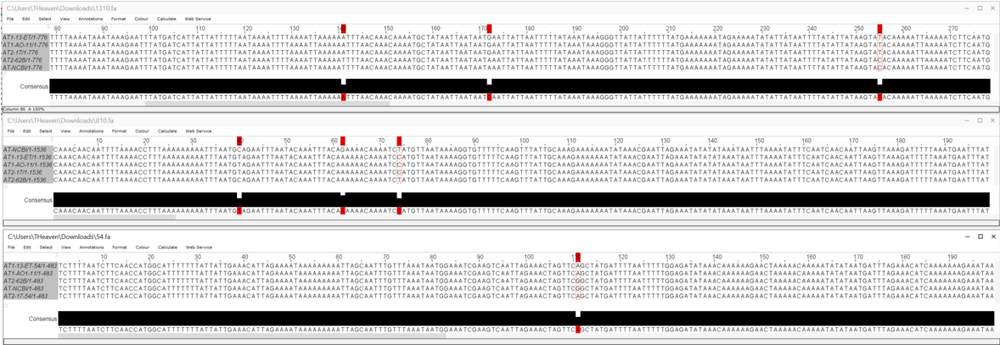

### k-mer based similarity <a name="23"></a>

#### Sourmash <a name="11"></a>

As the genome sequences to do appear to match with their labelled sub-type, sketch-based k-mer–comparisons of the genomes were performed using sourmash.

```bash
#sketch kmers
apptainer exec --bind /data:/data --bind /home/clusterusers/theaven:/home/clusterusers/theaven /data/users/theaven/sourmash_4.9.4--hdfd78af_0 sourmash sketch dna \
	-p k=21,k=31,k=51 \
	-o phytoplasma_genomes.sig \
	AT1-13_ET.fasta AT2-62B.fasta AT1-AO-11_ET.fasta AT2_Cmel17.fasta GCF_000026205.1_Phytoplasma_mali.fasta 

#pairwise comparison (sketch similarity estimate)
apptainer exec --bind /data:/data --bind /home/clusterusers/theaven:/home/clusterusers/theaven /data/users/theaven/sourmash_4.9.4--hdfd78af_0 sourmash compare \
	phytoplasma_genomes.sig \
	-k 51 --dna \
	-o phytoplasma_compare 

#0-AT1-13_ET.fasta       [1.    0.468 0.72  0.968 0.478]
#1-AT2-62B.fasta         [0.468 1.    0.482 0.462 0.592]
#2-AT1-AO-11_ET.fasta    [0.72  0.482 1.    0.714 0.466]
#3-AT2_Cmel17.fasta      [0.968 0.462 0.714 1.    0.471]
#4-GCF_000026205.1...    [0.478 0.592 0.466 0.471 1.   ]
#min similarity in matrix: 0.462

apptainer exec --bind /data:/data --bind /home/clusterusers/theaven:/home/clusterusers/theaven /data/users/theaven/sourmash_4.9.4--hdfd78af_0 sourmash plot \
	phytoplasma_compare \
    --csv phytoplasma_compare.csv 

apptainer exec --bind /data:/data --bind /home/clusterusers/theaven:/home/clusterusers/theaven ~/git_repos/Containers/python3.sif python /data/users/theaven/sourmash_csv_to_newick.py \
    -i phytoplasma_compare.csv \
    -o guide_tree.nwk \
    --clean-labels


#pairwise comparison (ANI)
apptainer exec --bind /data:/data --bind /home/clusterusers/theaven:/home/clusterusers/theaven /data/users/theaven/sourmash_4.9.4--hdfd78af_0 sourmash compare \
	phytoplasma_genomes.sig \
	--ani -k 51 --dna \
	-o phytoplasma_compare2

#0-AT1-13_ET.fasta       [1.    0.991 0.997 1.    0.991]
#1-AT2-62B.fasta         [0.991 1.    0.992 0.991 0.994]
#2-AT1-AO-11_ET.fasta    [0.997 0.992 1.    0.996 0.991]
#3-AT2_Cmel17.fasta      [1.    0.991 0.996 1.    0.991]
#4-GCF_000026205.1...    [0.991 0.994 0.991 0.991 1.   ]

apptainer exec --bind /data:/data --bind /home/clusterusers/theaven:/home/clusterusers/theaven /data/users/theaven/sourmash_4.9.4--hdfd78af_0 sourmash plot \
	phytoplasma_compare2 \
    --csv phytoplasma_compare2.csv 

apptainer exec --bind /data:/data --bind /home/clusterusers/theaven:/home/clusterusers/theaven ~/git_repos/Containers/python3.sif python /data/users/theaven/sourmash_csv_to_newick.py \
    -i phytoplasma_compare2.csv \
    -o guide_tree2.nwk \
    --clean-labels
```
The kmer comparison agrees with the inspection of primer products. AT1-13_ET and AT2_Cmel17, which are labelled as different subtypes are the most similar genomes. AT2-62B groups with the published genome, GCF_000026205.1. AT2-62B is the Ca. P. mali sampled from Cacosphylla picta. The published Ca. P. mali genome was sampled from an apple tree; however, as the tree was in Germany it is assumed that the phytoplasma was vectored by C. picta. It therefore appears that the two C. picta samples are grouped together - more sampels will be needed to confirm this pattern.

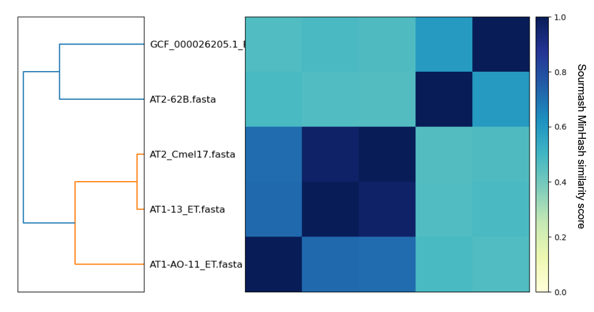

##  Whole genome alignment <a name="12"></a>

#### Pairwise alignment  <a name="24"></a> 

Pairwise alignment of the genomes was performed, genome sequences were also aligned against themselves.
```bash
cd /data/users/theaven/phytolasma
module load gnuplot/6.0.0-gcc-12.3.0-637ora5
for file in AT1-13_ET.fasta AT2-62B.fasta AT1-AO-11_ET.fasta AT2_Cmel17.fasta GCF_000026205.1_Phytoplasma_mali.fasta; do
	ID=$(basename "$file" .fasta)
apptainer exec --bind /data:/data --bind /home/clusterusers/theaven:/home/clusterusers/theaven /data/users/theaven/mummer4_4.0.1--pl5321h9948957_0 nucmer -p GCF_000026205_v_"$ID"  GCF_000026205.1_Phytoplasma_mali.fasta "$file"
apptainer exec --bind /data:/data --bind /home/clusterusers/theaven:/home/clusterusers/theaven /data/users/theaven/mummer4_4.0.1--pl5321h9948957_0 mummerplot -l -c -t svg GCF_000026205_v_"$ID".delta -p GCF_000026205_v_"$ID"
gnuplot GCF_000026205_v_"$ID".gp
apptainer exec --bind /data:/data --bind /home/clusterusers/theaven:/home/clusterusers/theaven /data/users/theaven/mummer4_4.0.1--pl5321h9948957_0 mummerplot -color GCF_000026205_v_"$ID".delta -t svg -p GCF_000026205_v_"$ID"_x
gnuplot GCF_000026205_v_"$ID"_x.gp
done
```
These alignments suggest that the genomes are quite similar, with only small regions of non-alignment and some inversions in the assemblies. Self alignment showed few repetative regions outside of the TIR regions described by Kube et al. 2008

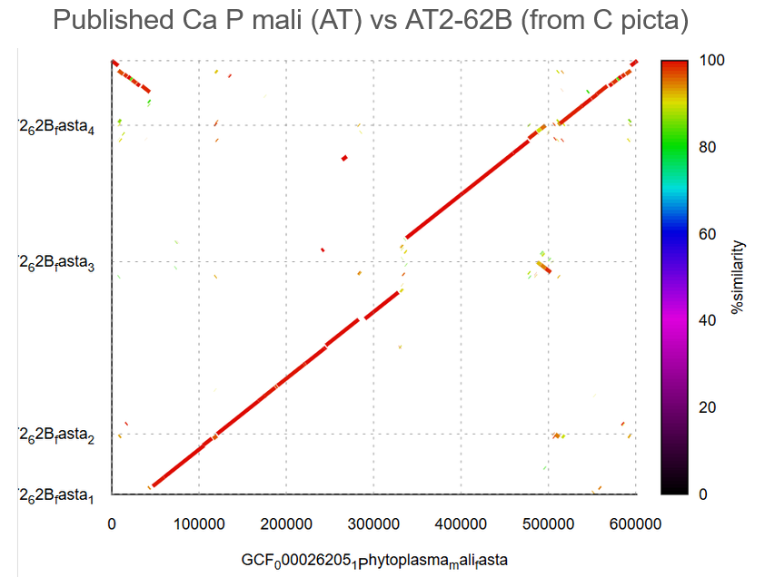

#### Cactus  <a name="15"></a> 
A phylogeny was provided from the earlier kmer comparison of the genomes.

A simultaneous multiple whole-genomes alignment was created with cactus.

```bash
sed -i 's/-/_/g' guide_tree2.nwk

#((AT2_62B_fasta,GCF_000026205_1_Phytoplasma_mali_fasta),((AT2_Cmel17_fasta,AT1_13_ET_fasta),AT1_AO_11_ET_fasta));

salloc --cpus-per-task=4 --mem=200G --time=02:00:00 -p bioagri
module load apptainer/1.4.1-gcc-13.3.0-3coysxn
cat guide_tree2.nwk > seqFile.txt
cat >> seqFile.txt <<EOF
GCF_000026205_1_Phytoplasma_mali_fasta /data/users/theaven/phytolasma/GCF_000026205.1_Phytoplasma_mali.fasta
AT2_62B_fasta /data/users/theaven/phytolasma/AT2-62B.fasta
AT2_Cmel17_fasta /data/users/theaven/phytolasma/AT2_Cmel17.fasta
AT1_13_ET_fasta /data/users/theaven/phytolasma/AT1-13_ET.fasta
AT1_AO_11_ET_fasta /data/users/theaven/phytolasma/AT1-AO-11_ET.fasta
EOF

rm -rf /tmp/phytoplasma_jobstore

cd /data/users/theaven/phytolasma/cactus
apptainer exec \
  --bind /data:/data \
  --bind /home/clusterusers/theaven:/home/clusterusers/theaven \
  --bind /tmp:/tmp \
  /data/users/theaven/cactus_3.1.4--py313h449c32d_0 \
  cactus \
  /tmp/phytoplasma_jobstore \
  ../seqFile.txt \
  phytoplasma.hal \
  --maskMode none \
  --maxCores 4 \
  --batchSystem single_machine \
  --binariesMode local \
  --branchScale 1.0 \
  --defaultDisk 200G

# --root GCF_000026205_1_Phytoplasma_mali_fasta \
# --maskMode none prevents Cactus preprocessing masking repeats/low complexity regions - preserving unique insertions, population-specific regions, diagnostic sequences - slightly slower, more spurious alignments possible - For tiny phytoplasma genomes, the cost is negligible. Sourmash dissimilarities are not extreme enough to justify higher branch scaling. --fastaga is useful for very large genome collections where speed matters. For marker discovery, standard Cactus alignment is preferable. --root at the published reference genome

#Confirm the presence of all genomes in the alignment.
apptainer exec \
  --bind /data:/data \
  --bind /home/clusterusers/theaven:/home/clusterusers/theaven \
  --bind /tmp:/tmp \
  /data/users/theaven/cactus_3.1.4--py313h449c32d_0 \
  halStats  \
  --genomes phytoplasma.hal 
#Anc0 Anc1 GCF_000026205_1_Phytoplasma_mali_fasta AT2_62B_fasta Anc2 Anc3 AT2_Cmel17_fasta AT1_13_ET_fasta AT1_AO_11_ET_fasta
#Anc0 etc. are ancestral nodes from the guide tree.

#Retrieve the tree
apptainer exec \
  --bind /data:/data \
  --bind /home/clusterusers/theaven:/home/clusterusers/theaven \
  --bind /tmp:/tmp \
  /data/users/theaven/cactus_3.1.4--py313h449c32d_0 \
  halStats  \
  --tree phytoplasma.hal
#((GCF_000026205_1_Phytoplasma_mali_fasta:0.005798,AT2_62B_fasta:0.005798)Anc1:0.0029,((AT2_Cmel17_fasta:0.000323,AT1_13_ET_fasta:0.000323)Anc3:0.003207,AT1_AO_11_ET_fasta:0.00353)Anc2:0.005169)Anc0;

#Convert HAL format (Hierarchical Alignment - stores large multiple genome alignments and the relationships between the genomes) to MAF (Multiple Alignment Format - represents aligned blocks among genomes).
apptainer exec \
  --bind /data:/data \
  --bind /home/clusterusers/theaven:/home/clusterusers/theaven \
  --bind /tmp:/tmp \
  /data/users/theaven/cactus_3.1.4--py313h449c32d_0 \
  hal2maf phytoplasma.hal phytoplasma.maf

#Retreive the genome sequences represented in this Cactus alignment as FASTA.
apptainer exec \
  --bind /data:/data \
  --bind /tmp:/tmp \
  /data/users/theaven/cactus_3.1.4--py313h449c32d_0 \
  hal2fasta \
  phytoplasma.hal \
  GCF_000026205_1_Phytoplasma_mali_fasta \
  --subtree \
  --outFaPath all_genomes.fa

#Convert differences in the multiple alignment to VCF format
apptainer exec \
  --bind /data:/data \
  --bind /home/clusterusers/theaven:/home/clusterusers/theaven \
  --bind /tmp:/tmp \
  /data/users/theaven/cactus_3.1.4--py313h449c32d_0 \
  hal2vcf \
  --refGenome GCF_000026205_1_Phytoplasma_mali_fasta \
  phytoplasma.hal > variants.vcf

#Retreive SNPs from the multiple alignment
apptainer exec \
  --bind /data:/data \
  --bind /home/clusterusers/theaven:/home/clusterusers/theaven \
  --bind /tmp:/tmp \
  /data/users/theaven/cactus_3.1.4--py313h449c32d_0 \
  halSnps phytoplasma.hal > snps.txt
```

### Pangenome  <a name="14"></a>

#### Cactus  <a name="16"></a> 

A pangenome graph for the 5 assemblies was built with cactus - representing the sequence shared and variable across all the genomes.
```bash
cd /data/users/theaven/phytolasma/cactus

salloc --cpus-per-task=4 --mem=32G --time=02:00:00 -p bioagri
module load apptainer/1.4.1-gcc-13.3.0-3coysxn
tail -n +2 /data/users/theaven/phytolasma/seqFile.txt > genomes.txt
rm -r /tmp/jobstore
rm -r /tmp/coordinationDir
mkdir /tmp/coordinationDir
apptainer exec \
  --bind /data:/data \
  --bind /home/clusterusers/theaven:/home/clusterusers/theaven \
  --bind /tmp:/tmp \
  /data/users/theaven/cactus_v3.1.4.sif \
  cactus-pangenome \
  /tmp/jobstore \
  --coordinationDir /tmp/coordinationDir \
  genomes.txt \
  --outDir pangenome \
  --outName phytoplasma_mali_20260721 \
  --reference GCF_000026205_1_Phytoplasma_mali_fasta \
  --vcf full  \
  --gfa full \
  --gbz full \
  --xg full \
  --odgi full \
  --clip 0 \
  --filter 0 \
  --mgCores 4 \
  --consCores 4 \
  --indexCores 4 \
  --mgMemory 16G \
  --consMemory 16G

#set --clip low as bacterial genomes are small and accessory regions can be biologically important. --filter 0 to capture Accessory genome / plasmids / mobile elements / rare genes + do not use --collapse
#--vcf full, generate the VCF against the unfiltered, unclipped pangenome graph. --vcf clip, Generate variants from the graph after clipping long unaligned regions (default behavior). --vcf filter, Generate variants after frequency filtering (removing rare graph sequences according to --filter). 

#Report stats from the alignment
apptainer exec \
  --bind /data:/data \
  --bind /home/clusterusers/theaven:/home/clusterusers/theaven \
  --bind /tmp:/tmp \
  /data/users/theaven/cactus_3.1.4--py313h449c32d_0 \
  halStats pangenome/phytoplasma_mali_20260721.full.hal

#(AT1_13_ET_fasta:1,AT2_Cmel17_fasta:1,AT2_62B_fasta:1,AT1_AO_11_ET_fasta:1,GCF_000026205_1_Phytoplasma_mali_fasta:1)Anc0;

#GenomeName, NumChildren, Length, NumSequences, NumTopSegments, NumBottomSegments
#Anc0, 5, 961448, 109, 0, 4358
#AT1_13_ET_fasta, 0, 564370, 1, 2481, 0
#AT2_Cmel17_fasta, 0, 601757, 1, 2157, 0
#AT2_62B_fasta, 0, 625685, 4, 3370, 0
#AT1_AO_11_ET_fasta, 0, 566926, 3, 3131, 0
#GCF_000026205_1_Phytoplasma_mali_fasta, 0, 601943, 1, 3113, 0

#Plot the pangenome
apptainer exec --bind /data:/data --bind /home/clusterusers/theaven:/home/clusterusers/theaven /data/users/theaven/odgi_0.9.4--h077b44d_0 odgi viz \
-i pangenome/phytoplasma_mali_20260721.full.og \
-o phytoplasma_pangenome.png \
-x 2000 \
-y 100

#Report stats from the pangenome
apptainer exec --bind /data:/data --bind /home/clusterusers/theaven:/home/clusterusers/theaven /data/users/theaven/odgi_0.9.4--h077b44d_0 odgi stats \
-i pangenome/phytoplasma_mali_20260721.full.og
#length nodes   edges   paths   steps
#937279  35701   48488   10      97022

#retrieve the names of the genomes contained within the pangenome
apptainer exec --bind /data:/data --bind /home/clusterusers/theaven:/home/clusterusers/theaven /data/users/theaven/odgi_0.9.4--h077b44d_0 odgi paths \
-i pangenome/phytoplasma_mali_20260721.full.og \
-L

#plot the reference only
echo "GCF_000026205_1_Phytoplasma_mali_fasta#0#GCF_000026205_1_Phytoplasma_mali_fasta" \
> reference.path.txt
apptainer exec --bind /data:/data --bind /home/clusterusers/theaven:/home/clusterusers/theaven /data/users/theaven/odgi_0.9.4--h077b44d_0 odgi viz \
-i pangenome/phytoplasma_mali_20260721.full.og \
-p reference.path.txt \
-o GCF_000026205_reference.png \
-x 1000 \
-y 50
```

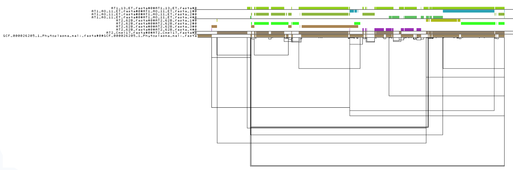


Repeat pangenome assembly with clipping enabled - is the complexity in the original graph caused by highly duplicated/repetitive graph structures? The --clip threshold determines how much duplication is tolerated before sequence is clipped from the graph representation.
```bash
salloc --cpus-per-task=4 --mem=32G --time=02:00:00 -p bioagri
module load apptainer/1.4.1-gcc-13.3.0-3coysxn
tail -n +2 /data/users/theaven/phytolasma/seqFile.txt > genomes.txt
rm -r /tmp/jobstore
rm -r /tmp/coordinationDir
mkdir /tmp/coordinationDir
apptainer exec \
  --bind /data:/data \
  --bind /home/clusterusers/theaven:/home/clusterusers/theaven \
  --bind /tmp:/tmp \
  /data/users/theaven/cactus_v3.1.4.sif \
  cactus-pangenome \
  /tmp/jobstore \
  --coordinationDir /tmp/coordinationDir \
  genomes.txt \
  --outDir pangenome_clip \
  --outName phytoplasma_mali_20260721 \
  --reference GCF_000026205_1_Phytoplasma_mali_fasta \
  --vcf clip  \
  --gfa clip \
  --gbz clip \
  --xg clip \
  --odgi clip \
  --clip 10000 \
  --filter 0 \
  --mgCores 4 \
  --consCores 4 \
  --indexCores 4 \
  --mgMemory 16G \
  --consMemory 16G

apptainer exec --bind /data:/data --bind /home/clusterusers/theaven:/home/clusterusers/theaven /data/users/theaven/odgi_0.9.4--h077b44d_0 odgi stats \
-i pangenome_clip/phytoplasma_mali_20260721.og
##length nodes   edges   paths   steps
#729695  35200   47640   13      95409

apptainer exec --bind /data:/data --bind /home/clusterusers/theaven:/home/clusterusers/theaven /data/users/theaven/odgi_0.9.4--h077b44d_0 odgi sort \
-i pangenome_clip/phytoplasma_mali_20260721.og \
-o pangenome_clip/phytoplasma_mali_20260721.sorted.og \
-O

#Visualise
apptainer exec --bind /data:/data --bind /home/clusterusers/theaven:/home/clusterusers/theaven /data/users/theaven/odgi_0.9.4--h077b44d_0 odgi viz \
-i pangenome_clip/phytoplasma_mali_20260721.sorted.og \
-o pangenome_clip/phytoplasma_pangenome.png \
-x 2000 \
-y 100
```
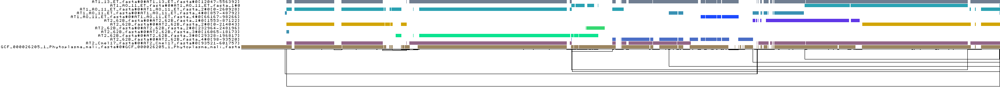

Repeat pangenome assembly with clipping and filtering enabled

```bash
salloc --cpus-per-task=4 --mem=32G --time=02:00:00 -p bioagri
module load apptainer/1.4.1-gcc-13.3.0-3coysxn
tail -n +2 /data/users/theaven/phytolasma/seqFile.txt > genomes.txt
rm -r /tmp/jobstore
rm -r /tmp/coordinationDir
mkdir /tmp/coordinationDir
apptainer exec \
  --bind /data:/data \
  --bind /home/clusterusers/theaven:/home/clusterusers/theaven \
  --bind /tmp:/tmp \
  /data/users/theaven/cactus_v3.1.4.sif \
  cactus-pangenome \
  /tmp/jobstore \
  --coordinationDir /tmp/coordinationDir \
  genomes.txt \
  --outDir pangenome_filter \
  --outName phytoplasma_mali_20260721 \
  --reference GCF_000026205_1_Phytoplasma_mali_fasta \
  --vcf filter  \
  --gfa filter \
  --gbz filter \
  --xg filter \
  --odgi filter \
  --clip 1000 \
  --filter 2 \
  --mgCores 4 \
  --consCores 4 \
  --indexCores 4 \
  --mgMemory 16G \
  --consMemory 16G

apptainer exec --bind /data:/data --bind /home/clusterusers/theaven:/home/clusterusers/theaven /data/users/theaven/odgi_0.9.4--h077b44d_0 odgi stats \
-i pangenome_filter/phytoplasma_mali_20260721.d2.og
##length nodes   edges   paths   steps
#625244  27122   32656   4476    77707

apptainer exec --bind /data:/data --bind /home/clusterusers/theaven:/home/clusterusers/theaven /data/users/theaven/odgi_0.9.4--h077b44d_0 odgi sort \
-i pangenome_filter/phytoplasma_mali_20260721.d2.og \
-o pangenome_filter/phytoplasma_mali_20260721.sorted.og \
-O

#Visualise
apptainer exec --bind /data:/data --bind /home/clusterusers/theaven:/home/clusterusers/theaven /data/users/theaven/odgi_0.9.4--h077b44d_0 odgi viz \
-i pangenome_filter/phytoplasma_mali_20260721.sorted.og \
-o pangenome_filter/phytoplasma_pangenome.png \
-x 2000 \
-y 100
```

#### Investigate variation in the pangenome <a name="32"></a>

As part of the pangenome construction cactus outputs variation between the genomes:
```bash
#report stats on variation between the genomes
module load bcftools/1.19-gcc-12.3.0
bcftools stats \
pangenome/phytoplasma_mali_20260721.full.vcf.gz > vcf.stats.txt
#6015 SNPs
#1033 MNPs (multi-nucleotide substitutions)
#782 indels
#222 "other" variants (complex alleles, symbolic alleles, etc.)

grep "^SN" vcf.stats.txt

#Extract SNPs from cactus whole genome alignment
apptainer exec \
--bind /data:/data \
--bind /home/clusterusers/theaven:/home/clusterusers/theaven \
--bind /tmp:/tmp \
/data/users/theaven/cactus_v3.1.4.sif \
halSnps \
pangenome/phytoplasma_mali_20260721.full.hal \
GCF_000026205_1_Phytoplasma_mali_fasta \
AT1_13_ET_fasta,AT1_AO_11_ET_fasta,AT2_62B_fasta,AT2_Cmel17_fasta \
--tsv pangenome/snps.tsv

awk -F'\t' 'NR==1{next}{n=0;delete allele;for(i=3;i<=NF;i++){if($i!=""){n++;allele[$i]=1}};alleles=0;for(a in allele)alleles++;count[n]++;if(alleles==2)biallelic[n]++}END{print "Samples_with_genotype\tAll_SNPs\tBiallelic_SNPs";for(i=1;i<=10;i++){if(count[i])print i "\t" count[i] "\t" biallelic[i]+0}}' pangenome/snps.tsv

#Samples_with_genotype   All_SNPs        Biallelic_SNPs
#2       1301    1301
#3       992     941
#4       1859    1818
#5       5548    5402

#Note one MNP in the vcf can become multiple SNPs in snps.tsv
```

Plot PCA of pangenome SNPs:
```bash
apptainer exec \
--bind /data:/data \
--bind /home/clusterusers/theaven:/home/clusterusers/theaven \
--bind /tmp:/tmp \
/data/users/theaven/python3.sif python ~/git_repos/Scripts/unibz/cactus_snps_to_pca.py \
    --snps pangenome/snps.tsv \
    --out pangenome/pca_matrix.tsv \
    --max-missing 1
```
PCA of SNPs:
```R
library(ggplot2)
library(ggrepel)
library(stringr)

setwd("C:/Users/THeaven/OneDrive - Scientific Network South Tyrol/R")
set.seed(1)

# Read matrix (correct)
mat <- read.table(
  "pca_matrix.tsv",
  header = TRUE,
  row.names = 1,
  sep = "\t",
  na.strings = "NA",
  comment.char = ""
)

geno <- mat[complete.cases(mat), ]

# Check
dim(geno)
head(geno)

# Transpose (samples as rows)
geno_t <- t(geno)

# Run PCA
pca <- prcomp(
  geno_t,
  center = TRUE,
  scale. = TRUE
)

# Variance explained
summary(pca)

# PCA scores
scores <- as.data.frame(pca$x)

scores$sample <- rownames(scores)

# Define groups
scores$group <- c(
  "Reference",
  "AT1",
  "AT1",
  "AT2",
  "AT2"
)

# Variance explained
var_explained <- summary(pca)$importance[2,] * 100


# Plot
ggplot(scores, aes(
  x = PC1,
  y = PC2,
  colour = group,
  label = sample
)) +
  
  geom_point(size = 4) +
  
  geom_text_repel(
    size = 3.5,
    box.padding = 0.5,
    point.padding = 0.5,
    max.overlaps = Inf,
    force = 2
  ) +
  
  labs(
    title = "PCA of cactus SNP matrix",
    x = paste0("PC1 (", round(var_explained[1],1), "%)"),
    y = paste0("PC2 (", round(var_explained[2],1), "%)"),
    colour = "Group"
  ) +
  
  theme_classic()

#Retreive SNPs contributing most strongly to PC1:

loadings <- pca$rotation

# SNPs contributing most to PC1
top_snps <- sort(abs(loadings[,1]), decreasing=TRUE)[1:20]

top_snps
```
PCA of thinned SNPs - reduce the effect of clusters of nearby variants - keep only one SNP approximately every 10 bases.
```R
# Read SNP matrix
snps <- read.table(
    "pca_matrix.tsv",
    header = TRUE,
    sep = "\t",
    stringsAsFactors = FALSE,
    check.names = FALSE
)

# Extract positions from SNP names
pos <- as.numeric(sub(".*_", "", snps$SNP))

# Sort positions
pos <- sort(pos)

# Find breaks between non-adjacent SNPs
breaks <- c(TRUE, diff(pos) != 1)

# Assign consecutive runs
run_id <- cumsum(breaks)

# Summarise runs
runs <- data.frame(
    start = tapply(pos, run_id, min),
    end = tapply(pos, run_id, max),
    length = tapply(pos, run_id, length)
)

# Sort longest stretches first
runs <- runs[order(runs$length, decreasing = TRUE), ]

# Show longest continuous SNP stretches
head(runs, 20)

#      start    end length
#3742 329664 329673     10
#2525 187512 187519      8
#3704 329444 329451      8
#910   75097  75103      7
#2619 189467 189473      7
#2660 189683 189689      7

###############################################################


# SNP names
snps <- rownames(geno)

# extract coordinate
pos <- as.numeric(str_extract(snps, "[0-9]+$"))

# order
ord <- order(pos)

geno <- geno[ord,]
pos <- pos[ord]


# keep one SNP every 10 bp
window <- 10

keep <- c(TRUE, diff(pos) > window)

geno_thinned <- geno[keep,]


cat("Original SNPs:", nrow(geno), "\n")
cat("After thinning:", nrow(geno_thinned), "\n")

# impute missing
for(i in 1:ncol(geno_thinned)){
  geno_thinned[is.na(geno_thinned[,i]),i] <- mean(geno_thinned[,i], na.rm=TRUE)
}


pca2 <- prcomp(
  t(geno_thinned),
  center=TRUE,
  scale.=TRUE
)

# Variance explained
summary(pca2)

# PCA scores
scores <- as.data.frame(pca2$x)

scores$sample <- rownames(scores)

# Define groups
scores$group <- c(
  "Reference",
  "AT1",
  "AT1",
  "AT2",
  "AT2"
)

# Variance explained
var_explained <- summary(pca2)$importance[2,] * 100


# Plot
ggplot(scores, aes(
  x = PC1,
  y = PC2,
  colour = group,
  label = sample
)) +
  
  geom_point(size = 4) +
  
  geom_text_repel(
    size = 3.5,
    box.padding = 0.5,
    point.padding = 0.5,
    max.overlaps = Inf,
    force = 2
  ) +
  
  labs(
    title = "PCA of cactus SNP matrix",
    x = paste0("PC1 (", round(var_explained[1],1), "%)"),
    y = paste0("PC2 (", round(var_explained[2],1), "%)"),
    colour = "Group"
  ) +
  
  theme_classic()

#Retreive SNPs contributing most strongly to PC1:

loadings <- pca2$rotation

# SNPs contributing most to PC1
top_snps <- sort(abs(loadings[,1]), decreasing=TRUE)[1:20]

top_snps
```
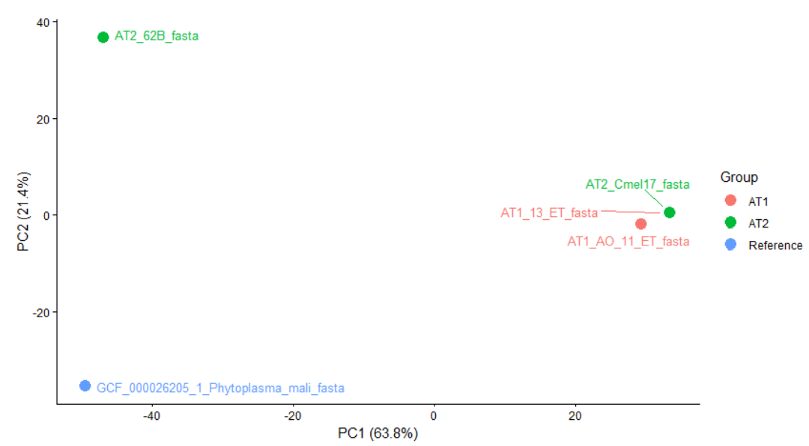

#### Investigate acessory regions in the pangenome <a name="40"></a>

As well as SNPs, indels etc. in the shared regions of the different genomes, the pangenome also contains regions that only appear in one or a subset of the genomes.


```bash
#Generate a multiple-alignment representation of the pangenome relative to the inferred ancestral genome
apptainer exec \
--bind /data:/data \
--bind /home/clusterusers/theaven:/home/clusterusers/theaven \
--bind /tmp:/tmp \
/data/users/theaven/cactus_3.1.4--py313h449c32d_0 \
hal2maf \
pangenome/phytoplasma_mali_20260721.full.hal \
pangenome/pangenome_vs_anc.maf \
--refGenome Anc0 \
--targetGenomes AT1_13_ET_fasta,AT1_AO_11_ET_fasta,AT2_62B_fasta,AT2_Cmel17_fasta,GCF_000026205_1_Phytoplasma_mali_fasta

#Calculate accessory sequence in 1-kb windows
apptainer exec --bind /data:/data --bind /home/clusterusers/theaven:/home/clusterusers/theaven ~/git_repos/Containers/python3.sif python ~/git_repos/Scripts/unibz/maf_accessory_matrix.py \
--maf pangenome/pangenome_vs_anc.maf \
--reference Anc0 \
--window 1000 \
--output pangenome/accessory_1kb.tsv
#The MAF coordinate system and ODGI graph layout are different
```
Get stats on the pangenome:

```bash
#list the paths/haplotypes represented in the pangenome graph
apptainer exec \
--bind /data:/data \
/data/users/theaven/odgi_0.9.4--h077b44d_0 \
odgi paths \
-i pangenome/phytoplasma_mali_20260721.full.og \
-H \
> path_haplotypes.tsv

#Gets stats
apptainer exec \
--bind /data:/data \
--bind /home/clusterusers/theaven:/home/clusterusers/theaven \
/data/users/theaven/python3.sif \
python ~/git_repos/Scripts/unibz/collapse_odgi_haplotypes.py \
--input path_haplotypes.tsv \
--output sample_node_presence.tsv

#Total nodes per sample:
#sample
#AT1_13_ET_fasta                           15815
#AT1_AO_11_ET_fasta                        20661
#AT2_62B_fasta                             21981
#AT2_Cmel17_fasta                          13809
#GCF_000026205_1_Phytoplasma_mali_fasta    21233
#dtype: int64

#Samples containing duplicated nodes:
#sample
#AT1_13_ET_fasta                              0
#AT1_AO_11_ET_fasta                        2380
#AT2_62B_fasta                             1143
#AT2_Cmel17_fasta                             0
#GCF_000026205_1_Phytoplasma_mali_fasta       0
#dtype: int64

apptainer exec \
--bind /data:/data \
/data/users/theaven/odgi_0.9.4--h077b44d_0 \
odgi view \
-i pangenome/phytoplasma_mali_20260721.full.og \
-g \
> graph.gfa

grep "^S" graph.gfa | \
awk '{print $2,length($3)}' \
> node_lengths.tsv

#Number of nodes: 35701
#Total sequence length: 937279
#Mean node length: 26.2536
#Minimum node length: 1
#Maximum node length: 1024
#length_bin      count
#50      32884
#100     924
#150     468
#200     302
#250     196
#300     136
#350     103
#400     82
#450     61
#500     49
#550     31
#600     28
#650     19
#700     21
#750     17
#800     13
#850     12
#900     7
#950     6
#1000    5
#1050    336
```
Find Cactus/ODGI graph nodes that are not present in every phytoplasma genome:
```bash
apptainer exec \
--bind /data:/data \
--bind /home/clusterusers/theaven:/home/clusterusers/theaven \
/data/users/theaven/python3.sif \
python <<'EOF'
import pandas as pd

df=pd.read_csv(
    "sample_node_presence.tsv",
    sep="\t",
    index_col=0
)

# nodes present in < all samples
accessory=df.columns[df.sum(axis=0)<len(df)]

with open("accessory_nodes.txt","w") as f:
    for n in accessory:
        f.write(n.replace("node.","")+"\n")

print("Accessory nodes:",len(accessory))
EOF

#Accessory nodes: 30497

#Merge consecutive accessory nodes
apptainer exec \
--bind /data:/data \
--bind /home/clusterusers/theaven:/home/clusterusers/theaven \
/data/users/theaven/python3.sif \
python3 ~/git_repos/Scripts/unibz/merge_accessory_regions.py \
--haplotypes path_haplotypes.tsv \
--accessory accessory_nodes.txt \
--output accessory_regions.tsv
#Merged accessory regions: 44836
```

## Gene content <a name="13"></a>

#### BUSCO <a name="9"></a>

The completeness of the available genomes was compared.

```bash
apptainer exec --bind /data:/data --bind /home/clusterusers/theaven:/home/clusterusers/theaven /data/users/theaven/busco_6.1.0--pyhdfd78af_1 busco --list-datasets
for genome in AT1-13_ET.fasta AT2-62B.fasta AT1-AO-11_ET.fasta AT2_Cmel17.fasta GCF_000026205.1_Phytoplasma_mali.fasta; do
  Task=busco
  Database=mycoplasmatota
  OutDir=$(basename "$genome" .fasta)/busco
  ID=$(basename "$genome" .fasta)
  mkdir -p $OutDir
  ExpectedOutput="$OutDir"/1/${OutPrefix}

  if [ ! -s "$ExpectedOutput" ]; then
    jobid=$(sbatch --job-name="$Task" --parsable ~/git_repos/Scripts/unibz/run_busco.sh "$genome" "$Database" "$OutDir" "$ID")
    printf "%s\t%s\t "$Task" \t%s\n" "$(date -Iseconds)" "$ID" "$jobid" >> /home/clusterusers/theaven/slurm_log.tsv
  else
    echo "For $ID found: $ExpectedOutput" 
  fi
done
```

#### PGAP  <a name="17"></a>
I would prefer to annotate the genomes via pgap - this is the gold standard as it is the tool expected by NCBI, I assume that at some point the genomes will need to be uploaded to NCBI for publication.

ERROR: I cannot get pgap to work despite multiple attempts, Yuanjie reports that she submitted a ticket to the HPC team requesting pgap be installed/fixed (there is a module installed but it does not function) over a year ago. I have tried performing fresh installs myself as well as directing the pre-installed module to various databases I always eventually end up getting permissions errors.

```bash
#AT2-62B.fasta AT1-AO-11_ET.fasta AT2_Cmel17.fasta GCF_000026205.1_Phytoplasma_mali.fasta AT1-13_ET.fasta

srun -p bioagri  -c 4 --mem 64G --pty bash
module load pgap/2024-07-18.buid7555

export PGAP_INPUT_DIR=/data/databases/pgap

mkdir -p /data/users/theaven/apptainer/cache 
mkdir -p /data/users/theaven/apptainer/tmp
export APPTAINER_CACHEDIR=/data/users/theaven/apptainer/cache 
export APPTAINER_TMPDIR=/data/users/theaven/apptainer/tmp

mkdir -p /data/users/theaven/singularity/cache 
mkdir -p /data/users/theaven/singularity/tmp
export SINGULARITY_CACHEDIR=/data/users/theaven/singularity/cache 
export SINGULARITY_TMPDIR=/data/users/theaven/singularity/tmp

rm -r /data/users/theaven/phytolasma/AT1-13_ET/pgap
for genome in AT1-13_ET.fasta ; do 
  Out=$(echo $genome | sed 's@.fasta@@g')
  pgap.py -r -o /data/users/theaven/phytolasma/"$Out"/pgap -g "$genome" -s 'Candidatus phytolasma mali' --taxcheck --auto-correct-tax --prefix "$Out" -c 4 --no-self-update --use-version 2024-07-18.build7555
done
#PGAP does not work due to permissions

apptainer pull docker://ncbi/pgap:2026-06-18.build8602
apptainer exec \
  --bind /data:/data \
  --bind /home/clusterusers/theaven:/home/clusterusers/theaven \
  --bind /tmp:/tmp \
  /data/users/theaven/pgap_2026-06-18.build8602.sif /pgap/pgap/scripts/pgap.py --version 
mkdir -p /data/users/theaven/pgap_data
cd /data/users/theaven/pgap_data
wget https://s3.amazonaws.com/ncbi-pgap/input-data/input-2026-06-18.build8602.tgz

srun -p bioagri  -c 4 --mem 64G --pty bash
wget -O pgap.py

mkdir -p /data/users/theaven/apptainer/cache 
mkdir -p /data/users/theaven/apptainer/tmp
export APPTAINER_CACHEDIR=/data/users/theaven/apptainer/cache 
export APPTAINER_TMPDIR=/data/users/theaven/apptainer/tmp

mkdir -p /data/users/theaven/singularity/cache 
mkdir -p /data/users/theaven/singularity/tmp
export SINGULARITY_CACHEDIR=/data/users/theaven/singularity/cache 
export SINGULARITY_TMPDIR=/data/users/theaven/singularity/tmp

export PGAP_INPUT_DIR=/data/users/theaven/pgap_data
./pgap.py --update

pgap.py -r -o mg37_results -g $HOME/.pgap/test_genomes/MG37/ASM2732v1.annotation.nucleotide.1.fasta -s "Mycoplasmoides genitalium"

for genome in AT1-13_ET.fasta ; do 
  Out=$(echo $genome | sed 's@.fasta@@g')
  /data/users/theaven/pgap_data/pgap.py -r -o /data/users/theaven/phytolasma/"$Out"/pgap -g "$genome" -s 'Candidatus phytolasma mali' --taxcheck --auto-correct-tax --prefix "$Out" -c 4  
done

apptainer exec \
  --bind /data:/data \
  --bind /home/clusterusers/theaven:/home/clusterusers/theaven \
  --bind /tmp:/tmp \
  --env PGAP_INPUT_DIR=/data/users/theaven/pgap_data \
  /data/users/theaven/pgap_2026-06-18.build8602.sif \
  /pgap/pgap/scripts/pgap.py \
  --update -D /opt/share/spack/spack-1.0.2/opt/spack/linux-zen2/apptainer-1.4.1-3coysxnrq446irq2yjlkcm5s4l62jv3t/bin/apptainer
```
#### Prokka   <a name="18"></a>
As pgap is not functional prokka was used for gene annotation instead.
```bash
srun -p bioagri  -c 4 --mem 16G --pty bash
module load prokka/1.14.6
for genome in AT1-13_ET.fasta AT2-62B.fasta AT1-AO-11_ET.fasta AT2_Cmel17.fasta GCF_000026205.1_Phytoplasma_mali.fasta; do
    Out=$(basename "$genome" .fasta)
    prokka \
        --outdir "/data/users/theaven/phytolasma/$Out" \
        --prefix "$Out" \
        --cpus 4 \
        --kingdom Bacteria \
        --genus Candidatus \
        --species phytoplasma \
        --strain mali \
        --gcode 4 \
        --compliant \
        --rfam \
        --force \
        "$genome"

done
```

### Plot synteny   <a name="33"></a>

The gene annotations from prokka were used to plot gene synteny between the genomes.


#### Genespace   <a name="34"></a>

Genespace runs orthofinder, diamond, and mcscanx internally, unfortunately it does not provide intermediate files and the plotting options are limited.

```bash
mkdir -p /data/users/theaven/phytolasma/synteny/genespace2/AT1_13_ET
ln -s /data/users/theaven/phytolasma/AT1-13_ET/AT1-13_ET.faa /data/users/theaven/phytolasma/synteny/genespace2/AT1_13_ET/AT1_13_ET.faa
ln -s /data/users/theaven/phytolasma/AT1-13_ET/AT1-13_ET.gff /data/users/theaven/phytolasma/synteny/genespace2/AT1_13_ET/AT1_13_ET.gff

mkdir -p /data/users/theaven/phytolasma/synteny/genespace2/AT1_AO_11_ET
ln -s /data/users/theaven/phytolasma/AT1-AO-11_ET/AT1-AO-11_ET.faa /data/users/theaven/phytolasma/synteny/genespace2/AT1_AO_11_ET/AT1_AO_11_ET.faa
ln -s /data/users/theaven/phytolasma/AT1-AO-11_ET/AT1-AO-11_ET.gff /data/users/theaven/phytolasma/synteny/genespace2/AT1_AO_11_ET/AT1_AO_11_ET.gff

mkdir -p /data/users/theaven/phytolasma/synteny/genespace2/AT2_62B
ln -s /data/users/theaven/phytolasma/AT2-62B/AT2-62B.faa /data/users/theaven/phytolasma/synteny/genespace2/AT2_62B/AT2_62B.faa
ln -s /data/users/theaven/phytolasma/AT2-62B/AT2-62B.gff /data/users/theaven/phytolasma/synteny/genespace2/AT2_62B/AT2_62B.gff

mkdir -p /data/users/theaven/phytolasma/synteny/genespace2/AT2_Cmel17
ln -s /data/users/theaven/phytolasma/AT2_Cmel17/AT2_Cmel17.faa /data/users/theaven/phytolasma/synteny/genespace2/AT2_Cmel17/.
ln -s /data/users/theaven/phytolasma/AT2_Cmel17/AT2_Cmel17.gff /data/users/theaven/phytolasma/synteny/genespace2/AT2_Cmel17/.

mkdir -p /data/users/theaven/phytolasma/synteny/genespace2/GCF_000026205
ln -s /data/users/theaven/phytolasma/GCF_000026205.1_Phytoplasma_mali/GCF_000026205.1_Phytoplasma_mali.faa /data/users/theaven/phytolasma/synteny/genespace2/GCF_000026205/GCF_000026205.faa
ln -s /data/users/theaven/phytolasma/GCF_000026205.1_Phytoplasma_mali/GCF_000026205.1_Phytoplasma_mali.gff /data/users/theaven/phytolasma/synteny/genespace2/GCF_000026205/GCF_000026205.gff

mkdir /data/users/theaven/phytolasma/synteny/genespace2/peptide
for file in $(ls /data/users/theaven/phytolasma/synteny/genespace2/*/*.faa); do
Out=/data/users/theaven/phytolasma/synteny/genespace2/peptide/$(basename $file | sed 's@.faa@.fa@g')
cat $file | cut -d ' ' -f1 > $Out
done

mkdir /data/users/theaven/phytolasma/synteny/genespace2/bed
for file in $(ls /data/users/theaven/phytolasma/synteny/genespace2/*/*.gff); do
Out=/data/users/theaven/phytolasma/synteny/genespace2/bed/$(basename $file | sed 's@.gff@.bed@g')
#cat "$file" | awk '$3 == "gene"' | cut -f1,4,5,9 | awk -F'\t' -v OFS='\t' '{ $4 = $4 ".1"; gsub("ID=", "", $4); print }' > $Out
awk -F'\t' 'BEGIN{OFS="\t"}
$3=="CDS" {
    match($9,/locus_tag=([^;]+)/,a);
    if(a[1]!="")
        print $1,$4-1,$5,a[1]
}' "$file" > "$Out"
done

salloc --cpus-per-task=1 --mem=32G --time=02:00:00 -p bioagri
module load anaconda3
module load r/4.5.1-gcc-13.3.0-tcxe6pe
module load gcc
module load R
module load cairo
module load freetype
module load harfbuzz
module load apptainer/1.4.1-gcc-13.3.0-3coysxn
conda activate orthofinder25
orthofinder -h

R
```
Install packages in personal library when prompted. The HPC will not play with devtools package - use remotes instead. Conda evironment must be loaded last or scipy is not findable for orthofinder. Needs older python version 3.10.x and older numpy version 1.26 for orthofinder to work properly.

MCScanX is a singularity image, therefore executables running this image must be provided in a directory as expected by genespace.
```R
install.packages("BiocManager")
BiocManager::install(c("Biostrings"))
install.packages("remotes")
remotes::install_github("jtlovell/GENESPACE")

if (!requireNamespace("BiocManager", quietly = TRUE))
    install.packages("BiocManager")
BiocManager::install(c("Biostrings", "rtracklayer"))

library(Biostrings)
library(GENESPACE)

gpar <- init_genespace(
  wd = "/data/users/theaven/phytolasma/synteny/genespace2",
  path2mcscanx = "/data/users/theaven/"
)

gpar$nCores <- 1
gpar$minBlockSize <- 3
gpar$blkRadius <- 10

gpar <- run_genespace(gsParam = gpar)

# download for plotting in RStudio /data/users/theaven/phytolasma/synteny/genespace/results/gsParams.rda

plot_riparian(
    gsParam=gpar,
    genomeIDs=c("AT1_13_ET","AT2_62B"),
    useOrder=TRUE
)

png(
  "riparian_highres.png",
  width=6000,
  height=4000,
  res=300
)

plot_riparian(
    gsParam=gpar,
    genomeIDs=c("AT1_13_ET","AT2_62B", "AT1_AO_11_ET", "AT2_Cmel17", "GCF_000026205"),
  minChrLen2plot = 0
)

pdf("/data/users/theaven/phytolasma/synteny/genespace2/riparian/riparian_GCF_000026205.pdf", width = 10, height = 6)

plot_riparian(
  gsParam = gpar,
  refGenome = "GCF_000026205",
  genomeIDs = c("AT1_13_ET","AT2_62B","AT1_AO_11_ET","AT2_Cmel17","GCF_000026205"),
  forceRecalcBlocks = FALSE,
  useOrder = FALSE,
  useRegions = FALSE,
  minChrLen2plot = 0,
  braidAlpha = .75,
  chrFill = "lightgrey"
)

dev.off()

pdf("/data/users/theaven/phytolasma/synteny/genespace2/riparian/riparian_AT1_AO_11_ET.pdf", width = 10, height = 6)

plot_riparian(
  gsParam = gpar,
  refGenome = "AT1_AO_11_ET",
  genomeIDs = c("AT1_13_ET","AT2_62B","AT1_AO_11_ET","AT2_Cmel17","GCF_000026205"),
  forceRecalcBlocks = FALSE,
  useOrder = FALSE,
  useRegions = FALSE,
  minChrLen2plot = 1, 
  braidAlpha = .75,
  chrFill = "lightgrey"
)

dev.off()

pdf("/data/users/theaven/phytolasma/synteny/genespace2/riparian/riparian_AT2_62B.pdf", width = 10, height = 6)

plot_riparian(
  gsParam = gpar,
  refGenome = "AT2_62B",
  genomeIDs = c("AT1_13_ET","AT2_62B","AT1_AO_11_ET","AT2_Cmel17","GCF_000026205"),
  forceRecalcBlocks = FALSE,
  useOrder = FALSE,
  useRegions = FALSE,
  minChrLen2plot = 0, 
  braidAlpha = .75,
  chrFill = "lightgrey"
)

dev.off()

pdf("/data/users/theaven/phytolasma/synteny/genespace2/riparian/riparian_AT1_13_ET.pdf", width = 10, height = 6)

plot_riparian(
  gsParam = gpar,
  refGenome = "AT1_13_ET",
  genomeIDs = c("AT1_13_ET","AT2_62B","AT1_AO_11_ET","AT2_Cmel17","GCF_000026205"),
  forceRecalcBlocks = FALSE,
  useOrder = FALSE,
  useRegions = FALSE,
  minChrLen2plot = 0, 
  braidAlpha = .75,
  chrFill = "lightgrey"
)

dev.off()

pdf("/data/users/theaven/phytolasma/synteny/genespace2/riparian/riparian_AT2_Cmel17.pdf", width = 10, height = 6)

plot_riparian(
  gsParam = gpar,
  refGenome = "AT2_Cmel17",
  genomeIDs = c("AT1_13_ET","AT2_62B","AT1_AO_11_ET","AT2_Cmel17","GCF_000026205"),
  forceRecalcBlocks = FALSE,
  useOrder = FALSE,
  useRegions = FALSE,
  minChrLen2plot = 0, 
  braidAlpha = .75,
  chrFill = "lightgrey"
)

dev.off()
```
Retreive the results of orthofinder and plot:
```bash
# /data/users/theaven/phytolasma/synteny/genespace/orthofinder/Results_Jul20/

module load apptainer/1.4.1-gcc-13.3.0-3coysxn
apptainer exec --bind /data:/data --bind /home/clusterusers/theaven:/home/clusterusers/theaven ~/git_repos/Containers/python3.sif python  ~/git_repos/Scripts/unibz/orthofinder_presence.py \
 --orthogroups /data/users/theaven/phytolasma/synteny/genespace/orthofinder/Results_Jul20/Orthogroups/Orthogroups.tsv \
 --out /data/users/theaven/phytolasma/synteny/genespace/orthofinder/Results_Jul20/Orthogroups/orthogroup_presence.tsv


apptainer exec --bind /data:/data --bind /home/clusterusers/theaven:/home/clusterusers/theaven ~/git_repos/Containers/python3.sif python  ~/git_repos/Scripts/unibz/orthogroup_upset.py \
    --input /data/users/theaven/phytolasma/synteny/genespace/orthofinder/Results_Jul20/Orthogroups/orthogroup_presence.tsv \
    --output /data/users/theaven/phytolasma/synteny/genespace/orthofinder/Results_Jul20/Orthogroups/phytoplasma_orthogroups_upset.png
```
434 to 459 orthogroups were annotated in the genomes, 393 of these were shared between all five assemblies. The next highest group was the two picta assemblies which shared 25 genes not found in the melanoneura associated assemblies.

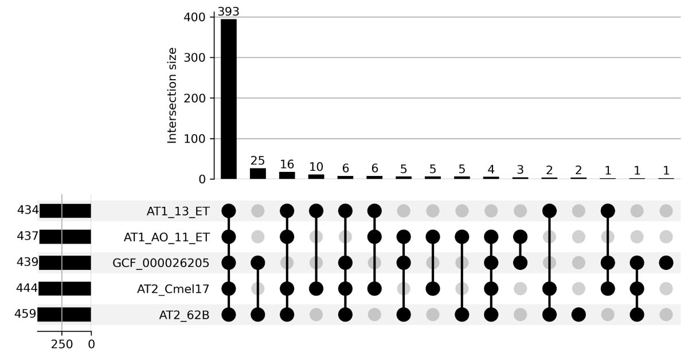


#### MCSCANX   <a name="35"></a>

As genespace does not retain intermediate files MCSCAN must be repeated for alternative plotting tools to be used

```bash
salloc --cpus-per-task=8 --mem=32G --time=02:00:00 -p bioagri
module load blasta-plus/2.14.1

mkdir -p /data/users/theaven/phytolasma/synteny/mcscanx/DB
for file in /data/users/theaven/phytolasma/synteny/genespace/peptide/*.fa; do 
ID=$(basename "$file"  .fa)
makeblastdb -in "$file" -out /data/users/theaven/phytolasma/synteny/mcscanx/DB/"$ID" -dbtype prot
done

mkdir /data/users/theaven/phytolasma/synteny/mcscanx/intermediateData
for file in /data/users/theaven/phytolasma/synteny/genespace/peptide/*.fa; do 
  ID=$(basename "$file"  .fa)
  for db in /data/users/theaven/phytolasma/synteny/mcscanx/DB/*.pdb; do
    ID2=$(basename "$db"  .pdb)
    blastp -db $(echo "$db" | sed 's@.pdb@@g') -query "$file" -num_threads 8 -evalue 1e-10 -num_alignments 5 -outfmt 6 -out /data/users/theaven/phytolasma/synteny/mcscanx/intermediateData/"$ID"_v_"$ID2".blast
  done
done

for file in /data/users/theaven/phytolasma/synteny/genespace/bed/*.bed; do
  awk 'BEGIN{OFS="\t"} {print $1,$4,$2,$3}' "$file" > /data/users/theaven/phytolasma/synteny/mcscanx/intermediateData/$(basename "$file" .bed).gff
done

mkdir /data/users/theaven/phytolasma/synteny/mcscanx/master
cat /data/users/theaven/phytolasma/synteny/mcscanx/intermediateData/*.blast > /data/users/theaven/phytolasma/synteny/mcscanx/master/master.blast

cat /data/users/theaven/phytolasma/synteny/mcscanx/intermediateData/*.gff > /data/users/theaven/phytolasma/synteny/mcscanx/master/master.gff
sed 's/gnl|Prokka|//' master.gff >  temp.gff && mv temp.gff /data/users/theaven/phytolasma/synteny/mcscanx/master/master.gff


< /data/users/theaven/phytolasma/synteny/mcscanx/master/master.blast tr ' ' '\t' > temp.blast && mv temp.blast /data/users/theaven/phytolasma/synteny/mcscanx/master/master.blast
< /data/users/theaven/phytolasma/synteny/mcscanx/master/master.gff tr ' ' '\t' > temp.gff && mv temp.gff /data/users/theaven/phytolasma/synteny/mcscanx/master/master.gff

module load apptainer/1.4.1-gcc-13.3.0-3coysxn
apptainer exec \
  --bind /data:/data \
  --bind /home/clusterusers/theaven:/home/clusterusers/theaven \
  /data/users/theaven/mcscanx_1.0.0--h9948957_0 \
  MCScanX /data/users/theaven/phytolasma/synteny/mcscanx/master/master

#Generating BLAST list
#9428 matches imported (8695 discarded)
#64 pairwise comparisons
#87 alignments generated
#Pairwise collinear blocks written to /data/users/theaven/phytolasma/synteny/mcscanx/master/master.collinearity [0.131 seconds elapsed]
```
Collinearity files was subsequently uploaded to https://synvisio.github.io/#/ for plotting.

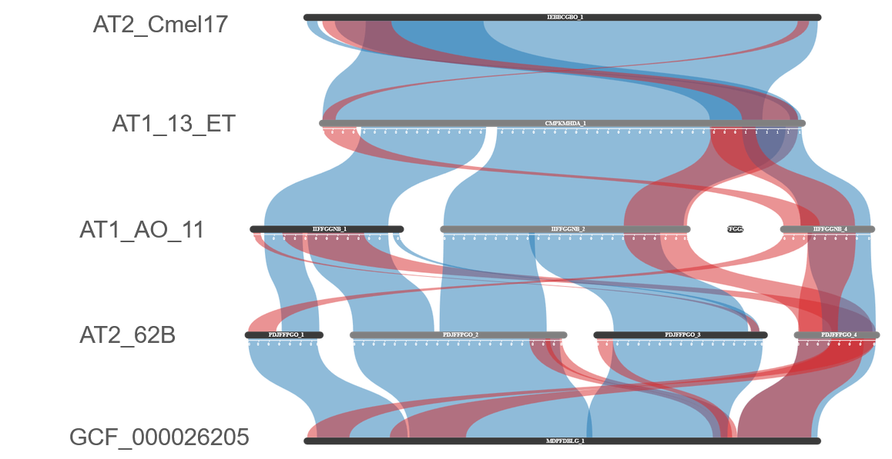

***AT1-AO-11-ET***

AT1-AO-11-ET_contig3 is abscent from the synteny plots. This is a very small contig - investigate as a potential contaminant.

```bash
#Extract the contig;
module load apptainer/1.4.1-gcc-13.3.0-3coysxn
echo AT1_AO_11_ET_fasta_3 > temp.txt
apptainer exec --bind /data:/data --bind /home/clusterusers/theaven:/home/clusterusers/theaven ~/git_repos/Containers/python3.sif python ~/git_repos/Scripts/NBI/seq_get.py --id_file temp.txt --input AT1-AO-11_ET.fasta --output AT1_AO_11_ET_fasta_3.fasta
```
The contigs was BLASTN searched against the NCBI core_nt database, the top hits were to Ca. P. mali.

#### SNPEff  <a name="25"></a>

SNPEff was used with the (prokka) gene annotations for the published Ca. P. mali genome to annotate variants identified by cactus.

```bash
mkdir -p /data/users/theaven/phytolasma/snpeff/data/phytoplasma/
cp /data/users/theaven/phytolasma/GCF_000026205.1_Phytoplasma_mali/GCF_000026205.1_Phytoplasma_mali.gff /data/users/theaven/phytolasma/snpeff/data/phytoplasma/genes.gff
cp /data/users/theaven/phytolasma/GCF_000026205.1_Phytoplasma_mali/GCF_000026205.1_Phytoplasma_mali.faa /data/users/theaven/phytolasma/snpeff/data/phytoplasma/protein.fa
cp /data/users/theaven/phytolasma/GCF_000026205.1_Phytoplasma_mali/GCF_000026205.1_Phytoplasma_mali.ffn /data/users/theaven/phytolasma/snpeff/data/phytoplasma/cds.fa
cp /data/users/theaven/phytolasma/GCF_000026205.1_Phytoplasma_mali.fasta /data/users/theaven/phytolasma/snpeff/data/phytoplasma/sequences.fa
echo "# Phytoplasma mali custom genome" > /data/users/theaven/phytolasma/snpeff/snpEff.config
echo "data.dir = ./data" >> /data/users/theaven/phytolasma/snpeff/snpEff.config
echo "phytoplasma.genome : Phytoplasma_mali" >>  /data/users/theaven/phytolasma/snpeff/snpEff.config
cd /data/users/theaven/phytolasma/snpeff
sed -i 's/gnl|Prokka|MDPFDBLG_1/GCF_000026205_1_Phytoplasma_mali_fasta/g' data/phytoplasma/genes.gff
apptainer exec \
--bind /data:/data \
--bind /home/clusterusers/theaven:/home/clusterusers/theaven \
/data/users/theaven/snpeff_5.4.0c--hdfd78af_0 \
snpEff \
build \
-c /data/users/theaven/phytolasma/snpeff/snpEff.config \
-gff3 \
-noCheckCds \
-noCheckProtein \
phytoplasma

apptainer exec --bind /data:/data --bind /home/clusterusers/theaven:/home/clusterusers/theaven /data/users/theaven/snpeff_5.4.0c--hdfd78af_0 snpEff \
-c /data/users/theaven/phytolasma/snpeff/snpEff.config \
phytoplasma \
/data/users/theaven/phytolasma/cactus/pangenome/phytoplasma_mali_20260721.full.vcf.gz \
> annotated.vcf

grep -m5 "ANN=" annotated.vcf
grep -v "^#" annotated.vcf | \
grep -o "ANN=[^;]*" | \
cut -d',' -f1 | \
cut -d'|' -f2 | \
sort | uniq -c
#     25 conservative_inframe_deletion
#     50 conservative_inframe_insertion
#      1 conservative_inframe_insertion&synonymous_variant
#     27 disruptive_inframe_deletion
#     29 disruptive_inframe_insertion
#     26 downstream_gene_variant
#      2 feature_ablation
#    116 frameshift_variant
#     55 frameshift_variant&missense_variant
#      2 frameshift_variant&splice_region_variant
#      6 frameshift_variant&start_lost
#      1 frameshift_variant&start_lost&stop_retained_variant&splice_region_variant
#     15 frameshift_variant&stop_gained
#      6 frameshift_variant&stop_gained&missense_variant
#      1 frameshift_variant&stop_gained&start_lost
#      2 frameshift_variant&stop_gained&synonymous_variant
#      1 frameshift_variant&stop_lost
#      1 frameshift_variant&stop_lost&missense_variant&splice_region_variant
#      2 frameshift_variant&stop_lost&splice_region_variant
#      1 frameshift_variant&stop_lost&splice_region_variant&synonymous_variant
#      1 frameshift_variant&stop_lost&stop_retained_variant&splice_region_variant
#      6 frameshift_variant&synonymous_variant
#      1 gene_fusion
#   3385 missense_variant
#      9 missense_variant&conservative_inframe_deletion
#     16 missense_variant&conservative_inframe_insertion
#      9 missense_variant&disruptive_inframe_deletion
#      8 missense_variant&disruptive_inframe_insertion
#     10 start_lost
#      2 start_lost&conservative_inframe_deletion
#      1 start_lost&disruptive_inframe_insertion
#      1 start_lost&missense_variant&conservative_inframe_deletion
#     63 stop_gained
#      1 stop_gained&conservative_inframe_deletion
#      6 stop_gained&conservative_inframe_insertion
#      3 stop_gained&disruptive_inframe_deletion
#      5 stop_gained&disruptive_inframe_insertion
#      1 stop_gained&missense_variant&conservative_inframe_insertion
#      2 stop_gained&missense_variant&disruptive_inframe_deletion
#      2 stop_lost
#      2 stop_lost&conservative_inframe_deletion&splice_region_variant
#     10 stop_lost&splice_region_variant
#      2 stop_lost&stop_retained_variant&splice_region_variant&intron_variant
#      1 stop_retained_variant
#   1736 synonymous_variant
#      1 transcript_ablation
#      2 transcript_ablation&start_lost&splice_region_variant&synonymous_variant
#   2027 upstream_gene_variant

grep -v "^#" annotated.vcf | wc -l
#7682
```

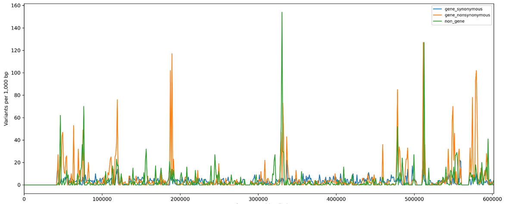

## Illumina data - from acquisition experiment samples  <a name="26"></a>

A subset (77) of samples used in the acquisition experiment of Corretto et al. 2024 were resequenced, primarily in order to investigate differences in the Ca. P. mali hosts and determine if these can explain the differences in aquisition ecfficiency. However, as the insects were infected with phytoplasma the data contain reads from these as well. The previous analysis has called into question whether the assignment of the assembled genomes to different previously defines subtypes is accurate. As we only have five assembled genomes it is not possible to define groups from the assembled-genome-SNPs. With 77 samples it may be possible to define groups successfully.

Lapo performed competative alignment of all reads with the published Ca. P. mali genome, C. melanoneura genome, and symbiont genomes. Variants were called against the Ca. P. mali genome and the resulting VCF file shared with me, as well as consensus sequences reconstructed from said variants.

### Subtyping primers <a name="36"></a>

RFLP and qPCR primers have been used to define different subtypes of Ca. P. mali: AT, AT1, AT2, AP15 (Jarausch et al. 1994; Jarausch et al. 2000). In silico PCR was performed with each of the primer pairs and the consensus sequence supplied by Lapo, products were aligned in Jalview to inspect patterns.

```bash
#Consensus sequence = /data/users/theaven/phytolasma/Erika/Ca_mali.fasta

module load apptainer/1.4.1-gcc-13.3.0-3coysxn
module load anaconda3

cd /data/users/theaven/phytolasma/Erika
apptainer exec --bind /data:/data --bind /home/clusterusers/theaven:/home/clusterusers/theaven ~/git_repos/Containers/python3.sif python ~/git_repos/Scripts/unibz/split_multifasta.py Ca_mali.fasta Ca_mali_split
cd Ca_mali_split

conda activate emboss

for genome in *.fasta; do 
  Out=$(echo $genome | sed 's@.fasta@@g')_rpl22.txt 
  primersearch \
  -seqall "$genome" \
  -infile /data/users/theaven/phytolasma/pop/rpl22_primers.txt \
  -mismatchpercent 10 \
  -outfile "$Out" 
done

for genome in *.fasta; do 
  Out=$(echo $genome | sed 's@.fasta@@g')_1310.txt 
  primersearch \
  -seqall "$genome" \
  -infile /data/users/theaven/phytolasma/pop/AP13-10_primers.txt \
  -mismatchpercent 10 \
  -outfile "$Out" 
done

for genome in *.fasta; do 
  Out=$(echo $genome | sed 's@.fasta@@g')_54.txt 
  primersearch \
  -seqall "$genome" \
  -infile /data/users/theaven/phytolasma/pop/AP5-4_primers.txt \
  -mismatchpercent 10 \
  -outfile "$Out" 
done

for genome in *.fasta; do 
  Out=$(echo $genome | sed 's@.fasta@@g')_810.txt 
  primersearch \
  -seqall "$genome" \
  -infile /data/users/theaven/phytolasma/pop/AP8-10_primers.txt \
  -mismatchpercent 10 \
  -outfile "$Out" 
done

####

conda activate seqkit

mkdir /data/users/theaven/phytolasma/Erika/Ca_mali_split/rpl22
for genome in *.fasta; do 
  Out=$(echo $genome | sed 's@.fasta@@g')_rpl22_amplicon.fasta  
seqkit amplicon \
      -F TGCTGAAGCTAATTTGGC \
      -R CCCATGAATATTAACCTCCT \
      -m 1 \
      "$genome" \
      > /data/users/theaven/phytolasma/Erika/Ca_mali_split/rpl22/"$Out"
done

mkdir /data/users/theaven/phytolasma/Erika/Ca_mali_split/1310
for genome in *.fasta; do 
  Out=$(echo $genome | sed 's@.fasta@@g')_1310_amplicon.fasta 
seqkit amplicon \
      -F CTACAGATTTCACACATTGG \
      -R TTTTCACAACGTATTCCGCC \
      -m 1 \
      "$genome" \
      > /data/users/theaven/phytolasma/Erika/Ca_mali_split/1310/"$Out"
done

mkdir /data/users/theaven/phytolasma/Erika/Ca_mali_split/54
for genome in *.fasta; do 
  Out=$(echo $genome | sed 's@.fasta@@g')_54_amplicon.fasta 
seqkit amplicon \
      -F TCTTTTAATCTTCAACCATGGC \
      -R CCAATGTGTGAAATCTGTAG \
      -m 1 \
      "$genome" \
      > /data/users/theaven/phytolasma/Erika/Ca_mali_split/54/"$Out"
done

mkdir /data/users/theaven/phytolasma/Erika/Ca_mali_split/810
for genome in *.fasta; do 
  Out=$(echo $genome | sed 's@.fasta@@g')_810_amplicon.fasta 
seqkit amplicon \
      -F CAAACAACAATTTTAAAACC \
      -R TTTTCACAACGTATTCCGCC \
      -m 1 \
      "$genome" \
      > /data/users/theaven/phytolasma/Erika/Ca_mali_split/810/"$Out"
done
```

### Assess variants <a name="29"></a>

#### SNPEff   <a name="27"></a>

SNPEff was used with the (prokka) gene annotations for the published Ca. P. mali genome to annotate variants in the acquisition experiment VCF.

```bash
#With acquisition vcf:
cd /data/users/theaven/phytolasma/snpeff
apptainer exec --bind /data:/data --bind /home/clusterusers/theaven:/home/clusterusers/theaven /data/users/theaven/snpeff_5.4.0c--hdfd78af_0 snpEff \
-c /data/users/theaven/phytolasma/snpeff/snpEff.config \
phytoplasma \
/data/users/theaven/phytolasma/Erika/Cmel_V1_Ca_mali_GPU.q30Q30_bcfNorm_SNPsIndel_SNPs_Filtered.vcf.gz.recode.vcf.gz \
> Erika_annotated.vcf

bcftools view -i 'COUNT(GT="alt") > 0' Erika_annotated.vcf -o Erika_annotated_variants.vcf

grep -m5 "ANN=" Erika_annotated_variants.vcf
grep -v "^#" Erika_annotated_variants.vcf | \
grep -o "ANN=[^;]*" | \
cut -d',' -f1 | \
cut -d'|' -f2 | \
sort | uniq -c
#     15 downstream_gene_variant
#   2802 missense_variant
#      1 splice_region_variant&stop_retained_variant
#      1 start_lost
#     39 stop_gained
#      3 stop_lost
#      6 stop_lost&splice_region_variant
#      1 stop_retained_variant
#   1988 synonymous_variant
#   1248 upstream_gene_variant
```
Many of the samples have very few reads that align to Ca. P. mali, only those samples with >10,000 Ca. P. mali were retained:

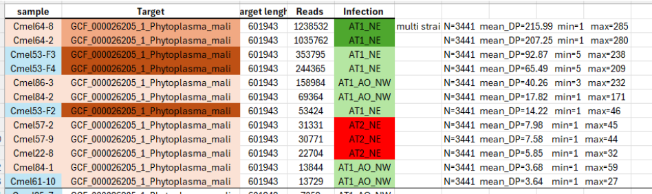

```bash
cat > samples.txt <<'EOF'
Cmel64-8
Cmel64-2
Cmel53-F3
Cmel53-F4
Cmel86-3
Cmel84-2
Cmel53-F2
Cmel57-2
Cmel57-9
Cmel22-8
Cmel84-1
Cmel61-10
EOF

bcftools view -S samples.txt Erika_annotated_variants.vcf -Oz -o Erika_annotated_variants_subset.vcf #retain only high read samples
bcftools view -i 'COUNT(GT="mis")==0' Erika_annotated_variants_subset.vcf -Oz -o Erika_annotated_variants_subset_complete.vcf #retain only positions with coverage in all samples
bcftools view -i 'COUNT(GT="alt") > 0' Erika_annotated_variants_subset_complete.vcf -o Erika_annotated_variants_subset_complete_variants.vcf #retain only positions  where there is variance
bcftools view -v snps Erika_annotated_variants_subset_complete_variants.vcf -Oz -o Erika_annotated_variants_subset_complete_variants_snps.vcf #retain only SNPs
```
Coverage in some samples/positions remains low:
```bash
bcftools query \
    -f '[%SAMPLE\t%DP\n]' \
    Erika_annotated_variants_subset_complete_variants_snps.vcf > sample_depths.txt

awk '
{
    if ($2 != ".") {
        n[$1]++
        sum[$1] += $2
        if ($2 > max[$1]) max[$1] = $2
        if ($2 < min[$1] || min[$1] == "") min[$1] = $2
    }
}
END {
    for (s in n)
        printf "%s\tN=%d\tmean_DP=%.2f\tmin=%d\tmax=%d\n",
               s,n[s],sum[s]/n[s],min[s],max[s]
}' sample_depths.txt | sort

#Cmel22-8        N=3441  mean_DP=5.85    min=1   max=32
#Cmel53-F2       N=3441  mean_DP=14.22   min=1   max=46
#Cmel53-F3       N=3441  mean_DP=92.87   min=5   max=238
#Cmel53-F4       N=3441  mean_DP=65.49   min=5   max=209
#Cmel57-2        N=3441  mean_DP=7.98    min=1   max=45
#Cmel57-9        N=3441  mean_DP=7.58    min=1   max=44
#Cmel61-10       N=3441  mean_DP=3.64    min=1   max=27
#Cmel64-2        N=3441  mean_DP=207.25  min=1   max=280
#Cmel64-8        N=3441  mean_DP=215.99  min=1   max=285
#Cmel84-1        N=3441  mean_DP=3.68    min=1   max=59
#Cmel84-2        N=3441  mean_DP=17.82   min=1   max=171
#Cmel86-3        N=3441  mean_DP=40.26   min=3   max=232
```
#### Splitstree <a name="28"></a> 
A network was plotted from the retained positions/samples
```bash
apptainer exec \
--bind /data:/data \
--bind /home/clusterusers/theaven:/home/clusterusers/theaven \
--bind /tmp:/tmp \
/data/users/theaven/vcf2dis_1.53e.sif VCF2Dis \
-i /data/users/theaven/phytolasma/snpeff/Erika_annotated_variants_subset_complete_variants_snps.vcf \
-o /data/users/theaven/phytolasma/snpeff/Erika_annotated_variants_subset_complete_variants_snps.mat

apptainer exec \
--bind /data:/data \
--bind /home/clusterusers/theaven:/home/clusterusers/theaven \
--bind /tmp:/tmp \
~/git_repos/Containers/python3.sif python ~/git_repos/Scripts/NBI/mat2csv.py \
/data/users/theaven/phytolasma/snpeff/Erika_annotated_variants_subset_complete_variants_snps.mat

apptainer exec \
--bind /data:/data \
--bind /home/clusterusers/theaven:/home/clusterusers/theaven \
--bind /tmp:/tmp \
~/git_repos/Containers/python3.sif python ~/git_repos/Scripts/NBI/csv2dist.py \
/data/users/theaven/phytolasma/snpeff/Erika_annotated_variants_subset_complete_variants_snps.csv

#Download and input to splitstree
```
The samples appear to form three groups, one representing the assumes AT2 subtype samples, as well as two assumed AT1 groups - one of the two AT1 groups consists of the samples with by far the highest coverage.

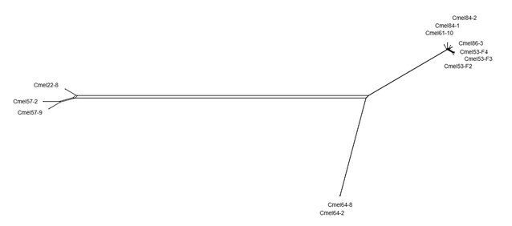

### Investigate multiple strains <a name="30"></a>

There is concern that the samples, which have previously been assumed to represent single strains, might in fact contain data from multiple strains co-infecting an insect.

The VCF file is in a diploid format; however, Ca. P. mali is haploid, positions where a heterozygous genotype is reported may represent multiple strains in the sample. NOTE: however, where coverage is low the SNP calling algorithm may call a position as heterozygous when all reads support either the REF of ALT genotype.
```bash
bcftools query \
    -f '[%SAMPLE\t%GT\t%DP\t%AD\n]' \
    Erika_annotated_variants_subset_complete_variants_snps.vcf > sample_genotypes.txt

awk '
BEGIN {OFS="\t"}
{
    sample=$1
    gt=$2

    if (gt != "./.") {
        total[sample]++
        if (gt == "0/1" || gt == "1/0")
            het[sample]++
    }
}
END {
    print "Sample","Called_sites","Heterozygous","Het_fraction","Het_percent"
    for (s in total)
        printf "%s\t%d\t%d\t%.5f\t%.2f%%\n",
               s,total[s],het[s],het[s]/total[s],100*het[s]/total[s]
}' sample_genotypes.txt | sort

#Sample  Called_sites    Heterozygous    Het_fraction    Het_percent
#Cmel22-8        3441    496     0.14414 14.41%
#Cmel53-F2       3441    137     0.03981 3.98%
#Cmel53-F3       3441    124     0.03604 3.60%
#Cmel53-F4       3441    131     0.03807 3.81%
#Cmel57-2        3441    280     0.08137 8.14%
#Cmel57-9        3441    332     0.09648 9.65%
#Cmel61-10       3441    122     0.03545 3.55%
#Cmel64-2        3441    132     0.03836 3.84%
#Cmel64-8        3441    132     0.03836 3.84%
#Cmel84-1        3441    93      0.02703 2.70%
#Cmel84-2        3441    139     0.04040 4.04%
#Cmel86-3        3441    170     0.04940 4.94%

bcftools query \
    -f '[%SAMPLE\t%GT\t%DP\t%AD\n]' \
    Erika_annotated_variants_subset_complete_variants_snps.vcf \
    > mixture_screen_raw.txt

apptainer exec \
--bind /data:/data \
--bind /home/clusterusers/theaven:/home/clusterusers/theaven \
--bind /tmp:/tmp \
~/git_repos/Containers/python3.sif python ~/git_repos/Scripts/unibz/screen_mixtures.py

column -t mixture_screen_summary.tsv

#Sample     Called_sites  Mean_DP  Median_DP  DP>=5  Het_calls  Het_fraction  MAF>=5%  MAF>=10%  MAF>=20%  MAF>=30%  #MAF>=40%
#Cmel22-8   3441          5.85     5.00       1973   496        0.14414       56       54        49        36        22
#Cmel53-F2  3441          14.22    13.00      3380   137        0.03981       146      124       93        70        33
#Cmel53-F3  3441          92.87    86.00      3441   124        0.03604       158      135       108       66        28
#Cmel53-F4  3441          65.49    62.00      3441   131        0.03807       157      133       94        65        40
#Cmel57-2   3441          7.98     7.00       2657   280        0.08137       80       76        61        48        36
#Cmel57-9   3441          7.58     7.00       2537   332        0.09648       84       82        77        59        38
#Cmel61-10  3441          3.64     3.00       991    122        0.03545       70       67        61        37        22
#Cmel64-2   3441          207.25   216.00     3429   132        0.03836       172      151       108       64        29
#Cmel64-8   3441          215.99   224.00     3431   132        0.03836       167      147       110       58        30
#Cmel84-1   3441          3.68     3.00       943    93         0.02703       32       31        24        12        4
#Cmel84-2   3441          17.82    14.00      3277   139        0.04040       162      133       97        70        38
#Cmel86-3   3441          40.26    33.00      3436   170        0.04940       184      166       111       67        35

bcftools query \
    -s Cmel53-F3 \
    -f '%CHROM\t%POS\t%REF\t%ALT[\t%GT\t%DP\t%AD]\n' \
    Erika_annotated_variants.vcf |
    awk '$5=="0/1" || $5=="1/0"' |
    head -30
```
The samples that are thought to represent subtype AT2 (Cmel22-8, Cmel57-2, Cmel57-9) appear to have higher "heterozygosity" that the other samples.

####  Identify fixed positions <a name="31"></a>

SNPs were identified that distinguish the three predefined groups seen in the Splitstree network.
```bash
#Retain biallelic SNPs only for plink
bcftools view \
    -m2 -M2 \
    -v snps \
    Erika_annotated_variants_subset_complete_variants_snps.vcf \
    -Oz \
    -o Erika_biallelic_snps.vcf.gz

#convert VCF to plink format
bcftools index Erika_biallelic_snps.vcf.gz
plink2 \
    --vcf Erika_biallelic_snps.vcf.gz \
    --make-bed \
    --out three_groups

#Assign groups
cat > groups.txt << 'EOF'
0 Cmel22-8 1
0 Cmel57-2 1
0 Cmel57-9 1
0 Cmel64-2 2
0 Cmel64-8 2
0 Cmel53-F2 3
0 Cmel53-F3 3
0 Cmel53-F4 3
0 Cmel86-3 3
0 Cmel84-1 3
0 Cmel84-2 3
0 Cmel61-10 3
EOF

plink2 \
    --bfile three_groups \
    --pheno groups.txt \
    --make-bed \
    --out three_groups_labeled

#perform GWAS test
plink2 \
    --bfile three_groups_labeled \
    --pheno groups.txt \
    --glm allow-no-covars \
    --out glm_results

#Find highly significant associations
awk '$12 < 0.001 {print $0}' glm_results.group.glm.linear | sort -k12,12g

plink2 \
    --bfile three_groups_labeled \
    --set-all-var-ids @:#:\$r:\$a \
    --make-bed \
    --out three_groups_named

#Create cluster assignments
cat > clusters.txt << 'EOF'
#IID CLUSTER
Cmel22-8 Group1
Cmel57-2 Group1
Cmel57-9 Group1
Cmel64-2 Group2
Cmel64-8 Group2
Cmel53-F2 Group3
Cmel53-F3 Group3
Cmel53-F4 Group3
Cmel86-3 Group3
Cmel84-1 Group3
Cmel84-2 Group3
Cmel61-10 Group3
EOF

#Calculate FST
plink2 \
    --bfile three_groups_named \
    --pheno clusters.txt \
    --fst CLUSTER report-variants \
    --out fst_analysis_named

#get fixed SNPs by group
awk '$5 == 1.0 {print $3}' fst_analysis_named.*.fst.var | sort -u | grep -v "^ID" > fixed_snps.list

#Check total count of fixed markers
wc -l fixed_snps.list
#2,083
```
Get the sequencing depth and "heterozygosity" for the fixed SNPs.
```bash
#extract the SNPs
plink2 \
    --bfile three_groups_named \
    --extract fixed_snps.list \
    --export A \
    --out group_separating_snps

#convert to genomic positions
awk -F':' '{print $1"\t"$2}' fixed_snps.list | sort -u -k1,1 -k2,2n > fixed_positions.tsv

#retreive the positions from the VCF
bcftools view -T fixed_positions.tsv Erika_annotated_variants_subset_complete_variants_snps.vcf > group_separating_Erika_annotated_variants_subset_complete_variants_snps.vcf

#extract stats
bcftools query \
    -f '[%SAMPLE\t%GT\t%DP\t%AD\n]' \
    group_separating_Erika_annotated_variants_subset_complete_variants_snps.vcf \
    > mixture_screen_raw2.txt

apptainer exec \
--bind /data:/data \
--bind /home/clusterusers/theaven:/home/clusterusers/theaven \
--bind /tmp:/tmp \
~/git_repos/Containers/python3.sif python ~/git_repos/Scripts/unibz/screen_mixtures2.py --input mixture_screen_raw2.txt --output mixture_screen_summary2.tsv

column -t mixture_screen_summary2.tsv

#Sample     Called_sites  Mean_DP  Median_DP  DP>=5  Het_calls  Het_fraction  MAF>=5%  MAF>=10%  MAF>=20%  MAF>=30%  MAF>=40%
#Cmel22-8   2083          6.79     6.00       1482   57         0.02736       3        3         2         1         1
#Cmel53-F2  2083          13.75    13.00      2053   9          0.00432       12       7         5         3         2
#Cmel53-F3  2083          90.35    86.00      2083   6          0.00288       10       8         4         3         2
#Cmel53-F4  2083          66.00    63.00      2083   5          0.00240       7        5         3         2         2
#Cmel57-2   2083          8.94     8.00       1758   25         0.01200       6        4         2         1         0
#Cmel57-9   2083          8.50     8.00       1742   27         0.01296       2        2         1         1         1
#Cmel61-10  2083          3.53     3.00       558    8          0.00384       4        4         4         1         1
#Cmel64-2   2083          212.12   219.00     2075   5          0.00240       15       10        4         3         2
#Cmel64-8   2083          219.38   225.00     2078   4          0.00192       14       6         4         3         2
#Cmel84-1   2083          3.94     3.00       673    7          0.00336       5        4         2         0         0
#Cmel84-2   2083          19.77    16.00      1997   12         0.00576       13       11        7         5         3
#Cmel86-3   2083          43.69    36.00      2081   11         0.00528       14       11        7         4         3

grep -m5 "ANN=" group_separating_Erika_annotated_variants_subset_complete_variants_snps.vcf
grep -v "^#" group_separating_Erika_annotated_variants_subset_complete_variants_snps.vcf | \
grep -o "ANN=[^;]*" | \
cut -d',' -f1 | \
cut -d'|' -f2 | \
sort | uniq -c


#     4 downstream_gene_variant
#    836 missense_variant
#      1 start_lost
#      8 stop_gained
#      1 stop_lost&splice_region_variant
#      1 stop_retained_variant
#    660 synonymous_variant
#    572 upstream_gene_variant
```
The portion of "heterozygous" positions across all samples has dropped markedly following the removal of non-fixed positions.

####  Multi-peak positions <a name="39"></a>

Inspection of the VCF file / BAM alignment files reveal that certain positions have mixed REF / ALT genotype assignment. This includes some positions in the higher coverage samples where there may be 70 reads matching the REF and 70 matching the ALT genotype in one position. In some cases the presence / abscence of multiple peaks appears to correlate with the Splitstree network group - although this is often obscured by low coverage in some samples. Unclear if this is due to multiple strains in a sample or duplications of regions in one strains genome.

Extract mulit-peak regions and BLAST versus the whole genome to look for multiple hits:

```bash
ls AT2-62B.fasta AT1-AO-11_ET.fasta AT2_Cmel17.fasta GCF_000026205.1_Phytoplasma_mali.fasta AT1-13_ET.fasta

>GCF_000026205_1_Phytoplasma_mali_fasta/551363-551551
GATTTTATCGTTTCATCAATTTGATAAAAATGATTCGTCGCTCCGATAATAAAAATCGGTTTTTCAGGATTA
TTATGCATCGAAGTCAGTTCCGTTTTAAATTGATTCACCACATTAGCAATATCTGTATCATTAGCTGACAAT
GATAAATTAGTAAAGATGGTTTCGCATTCATCTAAAAAGATAATA

for genome in AT2-62B.fasta AT1-AO-11_ET.fasta AT2_Cmel17.fasta GCF_000026205.1_Phytoplasma_mali.fasta AT1-13_ET.fasta; do
blastn -query query.fa -subject "$genome"  \
  -outfmt "6 qseqid sseqid pident length mismatch gapopen qstart qend sstart send evalue bitscore"
done

>GCF_000026205_1_Phytoplasma_mali_fasta/551223-551411
AACGATCATTAATATCCTTTAATAAAAATGTTTCAGCGTCATTTTCATAAGGATTCTGACGTTTTTTAATCA
TAAATTTTAAAAATGCTTCTCTGTCTTGTTTGGTGCCGGGTTTAATTTCGATGTGATAGTTAAAACGTGATT
TTATCGTTTCATCAATTTGATAAAAATGATTCGTCGCTCCGATAA

for genome in AT2-62B.fasta AT1-AO-11_ET.fasta AT2_Cmel17.fasta GCF_000026205.1_Phytoplasma_mali.fasta AT1-13_ET.fasta; do
blastn -query query2.fa -subject "$genome"  \
  -outfmt "6 qseqid sseqid pident length mismatch gapopen qstart qend sstart send evalue bitscore"
done

>GCF_000026205_1_Phytoplasma_mali_fasta/517640-517828
TGTTTTTGGTGTTTTTATGTAAAATTATTTCAATTATTAGGGATTTTCCGTTTTTTAGAAAAAGATTTTAAT
AAAACTATTAATTCCCATAATTATTTTCCAATTAGTAAATTTTATTATGAAAAATTAAAAGCGAAAACGCCA
AAACCAAAATCAAACCCAAAAGATTAATTAATAAAAAAATATTTA

for genome in AT2-62B.fasta AT1-AO-11_ET.fasta AT2_Cmel17.fasta GCF_000026205.1_Phytoplasma_mali.fasta AT1-13_ET.fasta; do
blastn -query query3.fa -subject "$genome"  \
  -outfmt "6 qseqid sseqid pident length mismatch gapopen qstart qend sstart send evalue bitscore"
done

>GCF_000026205_1_Phytoplasma_mali_fasta/119504-119692
TTTTTATAATTATCTTGATTAAAAAGGTTTTTACCTACCTCATTAAAAACGTTAACGGGATAACTTTTTGCT
TTATTTATAGTTTCCCAACCTTCCCAAATTCCTCTTAATAAATCACGAGCTACTGGAACATCGTCCATTACA
GCGGTCACATTCATTGCAAAATCTTCAAAATTGCTAATATATGAA


for genome in AT2-62B.fasta AT1-AO-11_ET.fasta AT2_Cmel17.fasta GCF_000026205.1_Phytoplasma_mali.fasta AT1-13_ET.fasta; do
blastn -query query4.fa -subject "$genome"  \
  -outfmt "6 qseqid sseqid pident length mismatch gapopen qstart qend sstart send evalue bitscore"
done
```

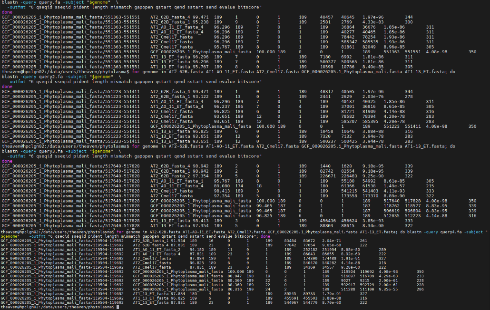

***Clusters of multi-peak positions***

```bash
gnl|Prokka|MDPFDBLG_1   prokka  gene    42209   44011   .       -       .       ID=MDPFDBLG_00034_gene;Name=ftsH_2;gene=ftsH_2;locus_tag=MDPFDBLG_00034
gnl|Prokka|MDPFDBLG_1   Prodigal:002006 CDS     42209   44011   .       -       0       ID=MDPFDBLG_00034;Parent=MDPFDBLG_00034_gene;eC_number=3.4.24.-;Name=ftsH_2;gene=ftsH_2;inference=ab initio prediction:Prodigal:002006,protein motif:HAMAP:MF_01458;locus_tag=MDPFDBLG_00034;product=ATP-dependent zinc metalloprotease FtsH;protein_id=gnl|Prokka|MDPFDBLG_00034


gnl|Prokka|MDPFDBLG_1   prokka  gene    114090  117662  .       +       .       ID=MDPFDBLG_00087_gene;locus_tag=MDPFDBLG_00087
gnl|Prokka|MDPFDBLG_1   Prodigal:002006 CDS     114090  117662  .       +       0       ID=MDPFDBLG_00087;Parent=MDPFDBLG_00087_gene;inference=ab initio prediction:Prodigal:002006;locus_tag=MDPFDBLG_00087;product=hypothetical protein;protein_id=gnl|Prokka|MDPFDBLG_00087


apptainer exec  --bind /data:/data --bind /home/clusterusers/theaven:/home/clusterusers/theaven ~/git_repos/Containers/python3.sif python3 ~/git_repos/Scripts/NBI/seq_get.py --id_file /data/users/theaven/phytolasma/temp_id.txt --input  /data/users/theaven/phytolasma/GCF_000026205.1_Phytoplasma_mali/GCF_000026205.1_Phytoplasma_mali.ffn --output  /data/users/theaven/phytolasma/GCF_000026205.1_Phytoplasma_mali/query_seqs.fa
apptainer exec  --bind /data:/data --bind /home/clusterusers/theaven:/home/clusterusers/theaven ~/git_repos/Containers/python3.sif python3 ~/git_repos/Scripts/NBI/seq_get.py --id_file /data/users/theaven/phytolasma/temp_id.txt --input  /data/users/theaven/phytolasma/GCF_000026205.1_Phytoplasma_mali/GCF_000026205.1_Phytoplasma_mali.faa --output  /data/users/theaven/phytolasma/GCF_000026205.1_Phytoplasma_mali/query_seqs.faa

for genome in AT2-62B.fasta AT1-AO-11_ET.fasta AT2_Cmel17.fasta GCF_000026205.1_Phytoplasma_mali.fasta AT1-13_ET.fasta; do
blastn -query /data/users/theaven/phytolasma/GCF_000026205.1_Phytoplasma_mali/query_seqs.fa -subject "$genome"  \
  -outfmt "6 qseqid sseqid pident length mismatch gapopen qstart qend sstart send evalue bitscore" >> blast.out
done

#From orthofinder
grep 'Orthogroup\|MDPFDBLG_00087\|MDPFDBLG_00034' /data/users/theaven/phytolasma/synteny/genespace/orthofinder/Results_Jul20/Orthogroups/Orthogroups.tsv
#Orthogroup      AT1_13_ET       AT1_AO_11_ET    AT2_62B AT2_Cmel17      GCF_000026205
#OG0000001       CMPKMHDA_00013, CMPKMHDA_00268, CMPKMHDA_00438, CMPKMHDA_00445, CMPKMHDA_00455  IIFFGGNB_00257, IIFFGGNB_00400, IIFFGGNB_00431, IIFFGGNB_00434, IIFFGGNB_00458, IIFFGGNB_00468      PDJFFPGO_00007, PDJFFPGO_00327, PDJFFPGO_00531, PDJFFPGO_00541  IEBBCGBO_00065, IEBBCGBO_00090, IEBBCGBO_00347, IEBBCGBO_00517, IEBBCGBO_00524, IEBBCGBO_00534      MDPFDBLG_00034, MDPFDBLG_00293, MDPFDBLG_00500, MDPFDBLG_00508
#OG0000098       CMPKMHDA_00061  IIFFGGNB_00042  PDJFFPGO_00058  IEBBCGBO_00138  MDPFDBLG_00087

for file in /data/users/theaven/phytolasma/*/*.ffn; do
apptainer exec  --bind /data:/data --bind /home/clusterusers/theaven:/home/clusterusers/theaven ~/git_repos/Containers/python3.sif python3 ~/git_repos/Scripts/NBI/seq_get.py --id_file /data/users/theaven/phytolasma/OG0000001_id.txt --input "$file" --output temp.fa && cat temp.fa >> /data/users/theaven/phytolasma/OG0000001_seqs.fa
done

for file in /data/users/theaven/phytolasma/*/*.ffn; do
apptainer exec  --bind /data:/data --bind /home/clusterusers/theaven:/home/clusterusers/theaven ~/git_repos/Containers/python3.sif python3 ~/git_repos/Scripts/NBI/seq_get.py --id_file /data/users/theaven/phytolasma/OG0000098_id.txt --input "$file" --output temp.fa && cat temp.fa >> /data/users/theaven/phytolasma/OG0000098_seqs.fa
done
```
Orthogroup sequences were investigated in Jalview

###  Acquisition expriment samples - raw reads <a name="38"></a>

####  QC of raw reads <a name="37"></a>

Collect data:
```bash
for file in $(ls EN00011601_hdd1/Cmel*_2.fastq.gz); do
  ID=$(echo $file | cut -d '/' -f2 | sed 's@_2.fastq.gz@@g')
  echo $ID
  mkdir "$ID"
  mv EN00011601_hdd1/"$ID"_1.fastq.gz $ID/.
  mv EN00011601_hdd1/"$ID"_2.fastq.gz $ID/.
done
```

Trim the raw reads:

```bash
for ReadDir in $(ls -d /data/users/theaven/phytolasma/Erika/raw_data/*); do
  Task=FastQC
  ID=$(echo "$ReadDir" | cut -d '/' -f8 | sed 's@/@_@g')
  Reads=("$ReadDir"/*.fastq.gz)
  OutDir="$ReadDir"/"$Task"
  ExpectedOutput="$OutDir"/$(basename "${Reads[0]}" | sed 's@.fastq.gz@@g')_fastqc.html
  Jobs=$(squeue -h -u theaven -n "$Task" | wc -l)

  while [ "$Jobs" -gt 9 ]; do
    sleep 5s
    printf "."
    Jobs=$(squeue -h -u theaven -n "$Task" | wc -l)
  done

  if [ ! -s "$ExpectedOutput" ]; then
    jobid=$(sbatch --job-name="$Task" --parsable ~/git_repos/Wrappers/unibz/run_fastqc.sh "$OutDir" "${Reads[@]}")
    printf "%s\t%s\t "$Task" \t%s\n" "$(date -Iseconds)" "$ID" "$jobid" >> /home/clusterusers/theaven/slurm_log.tsv
  else
    echo "For $ID found: $ExpectedOutput" 
  fi
done

for ReadDir in $(ls -d /data/users/theaven/phytolasma/Erika/raw_data/*); do
  Task=TrimGalore
  ID=$(echo "$ReadDir" | cut -d '/' -f8 | sed 's@/@_@g')
  Reads=("$ReadDir"/*.fastq.gz)
  OutDir="$(echo "$ReadDir" | sed 's@raw_data@qc_data@g')/"$Task""
  OutFile="$ID"_trimmed
  Quality=20
  Length=50
  ExpectedOutput=${OutDir}/${OutFile}_2_report.txt
  Jobs=$(squeue -h -u theaven -n "$Task" | wc -l)

  while [ "$Jobs" -gt 9 ]; do
    sleep 5s
    printf "."
    Jobs=$(squeue -h -u theaven -n "$Task" | wc -l)
  done

  if [ ! -s "$ExpectedOutput" ]; then
    jobid=$(sbatch --job-name="$Task" --parsable ~/git_repos/Wrappers/unibz/run_trim_galore.sh --delete-input "$OutDir" "$OutFile" "$Quality" "$Length" "${Reads[@]}")
    printf "%s\t%s\t "$Task" \t%s\n" "$(date -Iseconds)" "$ID" "$jobid" >> /home/clusterusers/theaven/slurm_log.tsv
  else
    echo "For $ID found: $ExpectedOutput" 
  fi
done

for ReadDir in $(ls -d /data/users/theaven/phytolasma/Erika/qc_data/*); do
  Task=FastQC
  ID=$(echo "$ReadDir" | cut -d '/' -f8 | sed 's@/@_@g')
  Reads=("$ReadDir"/*.fastq.gz)
  OutDir="$ReadDir"/"$Task"
  ExpectedOutput="$OutDir"/$(basename "${Reads[0]}" | sed 's@.fastq.gz@@g')_fastqc.html
  Jobs=$(squeue -h -u theaven -n "$Task" | wc -l)

  while [ "$Jobs" -gt 9 ]; do
    sleep 5s
    printf "."
    Jobs=$(squeue -h -u theaven -n "$Task" | wc -l)
  done

  if [ ! -s "$ExpectedOutput" ]; then
    jobid=$(sbatch --job-name="$Task" --parsable ~/git_repos/Wrappers/unibz/run_fastqc.sh "$OutDir" "${Reads[@]}")
    printf "%s\t%s\t "$Task" \t%s\n" "$(date -Iseconds)" "$ID" "$jobid" >> /home/clusterusers/theaven/slurm_log.tsv
  else
    echo "For $ID found: $ExpectedOutput" 
  fi
done
```


```bash
srun -p bioagri  -c 16 --mem 64G --pty bash
module load anaconda3
conda activate repeatmodeler

cd /data/users/theaven/phytolasma/GCF_000026205.1_Phytoplasma_mali/repeatmodeler
BuildDatabase \
  -name GCF_000026205 \
  /data/users/theaven/phytolasma/GCF_000026205.1_Phytoplasma_mali.fasta

RepeatModeler \
  -database GCF_000026205 \
  -threads 16 \
  2>&1 | tee 19A_repeatmodeler.log

RepeatMasker \
    -pa 16 \
    -gff \
    -famdb_dir "" \
    -lib "$PWD/RM_2331607.FriSep111600482026/consensi.fa" \
    /data/users/theaven/phytolasma/GCF_000026205.1_Phytoplasma_mali.fasta

#==================================================
#file name: GCF_000026205.1_Phytoplasma_mali.fasta
#sequences:             1
#total length:     601943 bp  (601943 bp excl N/X-runs)
#GC level:         21.39 %
#bases masked:      38796 bp ( 6.45 %)
#==================================================
#               number of      length   percentage
#               elements*    occupied  of sequence
#--------------------------------------------------
#Retroelements            0            0 bp    0.00 %
#   SINEs:                0            0 bp    0.00 %
#   Penelope:             0            0 bp    0.00 %
#   LINEs:                0            0 bp    0.00 %
#    CRE/SLACS            0            0 bp    0.00 %
#     L2/CR1/Rex          0            0 bp    0.00 %
#     R1/LOA/Jockey       0            0 bp    0.00 %
#     R2/R4/NeSL          0            0 bp    0.00 %
#     RTE/Bov-B           0            0 bp    0.00 %
#     L1/CIN4             0            0 bp    0.00 %
#   LTR elements:         0            0 bp    0.00 %
#     BEL/Pao             0            0 bp    0.00 %
#     Ty1/Copia           0            0 bp    0.00 %
#     Gypsy/DIRS1         0            0 bp    0.00 %
#       Retroviral        0            0 bp    0.00 %

#DNA transposons          0            0 bp    0.00 %
#   hobo-Activator        0            0 bp    0.00 %
#   Tc1-IS630-Pogo        0            0 bp    0.00 %
#   En-Spm                0            0 bp    0.00 %
#   MULE-MuDR             0            0 bp    0.00 %
#   PiggyBac              0            0 bp    0.00 %
#   Tourist/Harbinger     0            0 bp    0.00 %
#   Other (Mirage,        0            0 bp    0.00 %
#    P-element, Transib)

#Rolling-circles          0            0 bp    0.00 %

#Unclassified:           36        16169 bp    2.69 %

#Total interspersed repeats:       16169 bp    2.69 %


#Small RNA:               0            0 bp    0.00 %

#Satellites:              0            0 bp    0.00 %
#Simple repeats:        479        22627 bp    3.76 %
#Low complexity:          0            0 bp    0.00 %
#==================================================

apptainer exec --bind /data:/data --bind /home/clusterusers/theaven:/home/clusterusers/theaven ~/git_repos/Containers/python3.sif python ~/git_repos/Scripts/unibz/repeat_density.py \
    -gff GCF_000026205.1_Phytoplasma_mali.fasta.out.gff \
    -o P_mali_repeat_density \
    --window 1000 
```

```bash
srun -p bioagri  -c 16 --mem 64G --pty bash
module load anaconda3
conda activate repeatmodeler

mkdir /data/users/theaven/phytolasma/raw_data/minion/19A/assembly/EPI2ME/phyto-noref/repeatmodeler
cd /data/users/theaven/phytolasma/raw_data/minion/19A/assembly/EPI2ME/phyto-noref/repeatmodeler
BuildDatabase \
  -name 19A_phyto-noref \
  /data/users/theaven/phytolasma/raw_data/minion/19A/assembly/EPI2ME/phyto-noref/19A.medaka.fasta

RepeatModeler \
  -database 19A_phyto-noref \
  -threads 16 \
  2>&1 | tee 19A_repeatmodeler.log

RepeatMasker \
    -pa 16 \
    -gff \
    -famdb_dir "" \
    -lib "$PWD/RM_2792154.FriSep111657552026/consensi.fa" \
    /data/users/theaven/phytolasma/raw_data/minion/19A/assembly/EPI2ME/phyto-noref/19A.medaka.fasta

apptainer exec --bind /data:/data --bind /home/clusterusers/theaven:/home/clusterusers/theaven ~/git_repos/Containers/python3.sif python ~/git_repos/Scripts/unibz/repeat_density.py \
    -gff /data/users/theaven/phytolasma/raw_data/minion/19A/assembly/EPI2ME/phyto-noref/19A.medaka.fasta.out.gff \
    -o P_mali_repeat_density \
    --window 1000 

####

mkdir /data/users/theaven/phytolasma/raw_data/minion/19A/assembly/EPI2ME/phyto-noref/ragtag/ragtag_scaffold/repeatmodeler
cd /data/users/theaven/phytolasma/raw_data/minion/19A/assembly/EPI2ME/phyto-noref/ragtag/ragtag_scaffold/repeatmodeler
BuildDatabase \
  -name 19A_phyto-noref \
  /data/users/theaven/phytolasma/raw_data/minion/19A/assembly/EPI2ME/phyto-noref/ragtag/ragtag_scaffold/ragtag.scaffold.fasta

RepeatModeler \
  -database 19A_phyto-noref \
  -threads 16 \
  2>&1 | tee 19A_repeatmodeler.log

RepeatMasker \
    -pa 16 \
    -gff \
    -famdb_dir "" \
    -lib "/data/users/theaven/phytolasma/raw_data/minion/19A/assembly/EPI2ME/phyto-noref/ragtag/ragtag_scaffold/repeatmodeler/RM_4035223.TueSep221350552026/consensi.fa" \
    /data/users/theaven/phytolasma/raw_data/minion/19A/assembly/EPI2ME/phyto-noref/ragtag/ragtag_scaffold/ragtag.scaffold.fasta

apptainer exec --bind /data:/data --bind /home/clusterusers/theaven:/home/clusterusers/theaven ~/git_repos/Containers/python3.sif python ~/git_repos/Scripts/unibz/repeat_density.py \
    -gff /data/users/theaven/phytolasma/raw_data/minion/19A/assembly/EPI2ME/phyto-noref/ragtag/ragtag_scaffold/ragtag.scaffold.fasta.out.gff \
    -o P_mali_repeat_density \
    --window 1000 
```
```bash
cd /data/users/theaven/phytolasma/raw_data/minion/19A/assembly/EPI2ME/phyto-noref/ragtag/ragtag_scaffold
apptainer exec --bind /data:/data --bind /home/clusterusers/theaven:/home/clusterusers/theaven /data/users/theaven/edta_2.3.0--hdfd78af_0 perl /usr/local/bin/EDTA.pl --genome /data/users/theaven/phytolasma/raw_data/minion/19A/assembly/EPI2ME/phyto-noref/ragtag/ragtag_scaffold/ragtag.scaffold.fasta --species others --step all --sensitive 1 --anno 1 -- --maxdiv 40 --evaluate 1 --repeatmodeler /home/clusterusers/theaven/.conda/envs/repeatmodeler/bin/RepeatModeler --repeatmasker /home/clusterusers/theaven/.conda/envs/repeatmodeler/bin/RepeatMasker --annosine --ltrretriever /usr/local/bin/LTR_retriever -t 1 --overwrite

apptainer exec \
  --bind /data:/data \
  --bind /home/clusterusers/theaven:/home/clusterusers/theaven \
  /data/users/theaven/edta_2.3.0--hdfd78af_0 \
  find / -name AnnoSINE.py 2>/dev/null

srun -p bioagri  -c 1 --mem 256G --pty bash
module load anaconda3
  conda activate emboss
  einverted \
  -sequence /data/users/theaven/phytolasma/raw_data/minion/19A/assembly/EPI2ME/phyto-noref/ragtag/ragtag_scaffold/ragtag.scaffold.fasta \
  -gap 12 \
  -threshold 50 \
  -match 3 \
  -mismatch -4 \
  -maxrepeat 600000 \
  -outfile /data/users/theaven/phytolasma/raw_data/minion/19A/assembly/EPI2ME/phyto-noref/ragtag/ragtag_scaffold/inverted_repeats.txt \
  -outseq /data/users/theaven/phytolasma/raw_data/minion/19A/assembly/EPI2ME/phyto-noref/ragtag/ragtag_scaffold/inverted_repeats.fasta
```